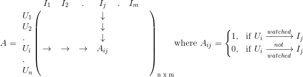

# 矩阵分解—深入探讨

> 原文：<https://medium.com/analytics-vidhya/matrix-factorization-deep-dive-9e112a241307?source=collection_archive---------26----------------------->


图片来源— [TechCrunch](https://techcrunch.com/2019/03/18/how-to-build-the-matrix/) 、[网飞](https://www.netflix.com/browse) & [Kdnuggets](https://www.google.com/url?sa=i&source=images&cd=&ved=2ahUKEwiW0fWc9qzmAhWhzDgGHb4ED8YQjRx6BAgBEAQ&url=https%3A%2F%2Fwww.kdnuggets.com%2F2018%2F06%2Fintuitive-introduction-gradient-descent.html&psig=AOvVaw2ysNe17I9GtdyUev_l0b4l&ust=1576130610769904)

本文是[矩阵分解协同过滤](/analytics-vidhya/matrix-factorization-for-collaborative-filtering-eaedd7e0bbca)的延续。

这里，我们以用户项矩阵 A 为例，试图理解分解和预测是如何发生的。这是用 python 实现的。

矩阵 A 包含以行表示的所有用户和以列表示的所有电影，如图 1 所示。



图 1


图 2

对矩阵 A 进行矩阵分解(MF ),我们得到下面的等式。


图 3


图 4


图 5

这里，B 和 C 分别是维数为(n×d)和(m×d)的矩阵。这里，n 是用户数，m 是电影数，d 是代表矩阵 B 和 c 中用户和电影向量维数的超参数。

MF 的目标函数是找到 B 和 C 的值，从而满足图 3 中的等式。如图 6 所示。


图 6

由于图 6 中的目标函数是一个凸优化问题，我们可以使用梯度下降(GD)来获得 b 和 c 的最佳值。更新 Bᵢ和 Cⱼ值的方程如图 7 所示。


图 7

让我们举一个例子来更好地理解它。假设用户数量为 3，电影数量为 4，矩阵 A 如图 8 所示。


图 8

为了重申我们的目标，基于 A 的非零值，我们必须使用 MF 来预测 A 的零值(这些值是否可以保持为 0 或者应该为 1)。

让我们通过从正态分布中随机抽取样本来初始化矩阵 B 和 C，如下所示。

```
B = np.random.normal(scale=1.0, size=(n,d)) 
C = np.random.normal(scale=1.0, size=(m,d))
```

以下代码用于执行图 7 中等式(5)和(6)中提供的更新规则。

```
**for** i **in** range(n):
    **for** j **in** range(m):
      **if**(A[i][j] > 0): *# Consider only non-zero elements of A*
        B_new[i] = B[i]
        B[i] += r * (2 * C[j]) * (A[i][j] - np.dot(B[i], C[j]))
        C[j] += r * (2 * B_new[i]) * (A[i][j] - np.dot(B_new[i], C[j]))
```

在更新了向量 Bᵢ和 Cⱼ的所有值之后，我们找到了 Aᵢⱼ的预测值以及 Aᵢⱼ的实际值和 Aᵢⱼ.的预测值之间的平方误差值以下代码对此进行了描述。

```
rmse += np.power(A[i][j] - np.dot(B[i], C[j]), 2)
```

一旦计算出所有非零 Aᵢⱼ值的平方误差，就计算出所有这些值的均方根误差(RMSE ),并将其附加到一个数组中，该数组记录每次迭代的 RMSE 值。以下代码对此进行了描述。

```
rmse_arr.append(np.round(np.sqrt(np.mean(rmse))))
```

运行上述过程，直到获得期望的 RMSE。A (Aₚ)的最终预测值如图 9 所示。


图 9


图 10

如果我们将 A [A₁₁、A₁₂、A₁₃、A₂₁、A₂₂、A₂₄、A₃₁]的非零值与 Aₚ的非零值进行比较，如图 10 所示，它们之间的差异非常小。这意味着我们的模型(矩阵 B 和 C 的值)正确地预测了非零值(用户已经观看的电影)。同样的模型也给了我们一些 a 值为零的地方的值[A₁₄，A₂₃，A₃₂，A₃₃，a₃₄].]这些是我们的预测值。

然而，预测值是分数形式的，而我们需要它们是 1 或 0。为了将这些十进制数转换成二进制形式，我们可以使用一个阈值，低于该阈值的值将被视为 0，高于该阈值的值将被视为 1。阈值可以由领域专家或通过建立交叉验证系统来确定。

如果我们将预测值的阈值保持为 0.5，我们将得到如图 11 所示的结果。


图 11

得到的预测值不是绝对的，它必然是错误的。因此，为了提高预测的准确性，必须使用更新的非零值 A 定期训练模型。此外，我们的模型过拟合矩阵 A，并且不会泛化，因为我们没有在图 6 中指定的目标函数中添加任何正则化参数。

使用正则化的相同实现可以在这里找到[。](https://github.com/suhaskv/Matrix-Factorization-Python)

# 参考

1.  [http://www . albertau yeung . com/post/python-matrix-factorization/](http://www.albertauyeung.com/post/python-matrix-factorization/)