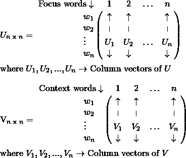

# 词向量的矩阵分解

> 原文：<https://medium.com/analytics-vidhya/matrix-factorization-for-word-vectors-61824ee9a751?source=collection_archive---------13----------------------->


来源— [42](http://whytewolf.ca/wp-content/uploads/2016/05/vlcsnap-2011-01-17-16h21m27s224-1024x422.png) ，[矩阵](https://techcrunch.com/2019/03/18/how-to-build-the-matrix/)

本文旨在简要介绍如何使用矩阵分解技术为给定文档创建单词向量。这是使用截断奇异值分解(SVD)技术实现的。

SVD 的基本公式如图 1 所示。


图 1

如图 1 所示，SVD 有三个主要组件，它们是:

1.  共生矩阵
2.  左右奇异矩阵
3.  退化阵

## 共生矩阵

对于给定的文档，必须创建共生矩阵。下面的[链接](/@suhaskvaithal/co-occurrence-matrix-9cacc5dd396e?source=friends_link&sk=f65304f5f5f265c1e00ea1cb666eabe8)提供了关于如何创建共现矩阵的更多信息。这个矩阵的创建将使我们能够在文档上使用 SVD 技术。

## 左右奇异矩阵

左奇异矩阵(U)的每一行表示焦点单词，右奇异矩阵(V)的每一行表示维度 n 的同现矩阵的上下文单词。这如图 2 所示。



图 2

## 退化阵

奇异矩阵(≘)是一个对角矩阵，包含奇异值，如图 3 所示。


图 3

如图 4 所示，共生矩阵 x 的每个奇异值(Sᵢ)与同一共生矩阵 x 的特征值有关系。


图 4

矩阵∑的奇异值之间的关系以及具有∑奇异值的左右奇异向量之间的关系如图 5 所示。


图 5


图 6

因此，丢失具有较少解释方差的值不会显著影响共生矩阵的表示。因此，我们可以承受丢失一些奇异值及其相应的奇异向量。

为了决定在不损害共生矩阵的情况下丢失多少奇异值和向量，我们需要进行超参数调整。这是通过定义 K 值来实现的，K 值告诉我们要保留的奇异值和奇异向量的数量，如图 7 所示。


图 7

下面的代码展示了 python 中超参数调优。

```
K = [2, 5, 10, 15, 20, 25, 30, 35, 40, 45, 50]var_explnd = []# Get the explained_variance for each dimension in'K'
for comps in K:
    model_svd = TruncatedSVD(n_components=comps)
    model_svd.fit_transform(co_mat) # co_mat -> co-occurrence matrix
    var_explnd.append(model_svd.explained_variance_ratio_)
```

这里，对于 K 的每个值，解释的方差被计算并存储在一个数组中。在计算每个 K 值的解释方差时，绘制 K 对解释方差的图。图中的“拐点”或“肘点”决定了 k 的最佳值

这种从 SVD 分量中去除不太重要的特征的过程称为截断 SVD。左和右奇异矩阵的维数以及去除不太重要的特征后的奇异矩阵将如图 8 和图 9 所示。


图 8


图 9

在所得的左奇异矩阵(u’)中，每一行代表在同现矩阵中的焦点词(wᵢ)的 k 维向量表示。在所得的右奇异矩阵(v’)中，每行代表同现矩阵中相应焦点词(wᵢ)的上下文词的 k 维向量表示。这样，可以使用矩阵分解获得单词的矢量表示。

# 参考

1.  [在亚马逊美食评论数据集上实现截断奇异值分解](https://github.com/suhaskv/Amazon_Food_Reviews/blob/master/Truncated_SVD/Amazon%20Fine%20Food%20Reviews%20Analysis%20Truncated%20SVD.ipynb)
2.  [https://www . analyticsvidhya . com/blog/2017/06/word-embeddings-count-word 2 veec/](https://www.analyticsvidhya.com/blog/2017/06/word-embeddings-count-word2veec/)