# 简化矩阵分解(推荐系统)

> 原文：<https://medium.com/analytics-vidhya/matrix-factorization-made-easy-recommender-systems-7e4f50504477?source=collection_archive---------2----------------------->


克里斯多夫·伯恩斯在 [Unsplash](https://unsplash.com/s/photos/machine-learning?utm_source=unsplash&utm_medium=referral&utm_content=creditCopyText) 上拍摄的照片

> 推荐系统被用于各种领域，最常见的是作为视频和音乐服务的播放列表生成器，如[网飞](https://www.netflix.com/in/)、 [YouTube](https://www.youtube.com/) 和 [Spotify](https://www.spotify.com/in/free/?utm_source=in-en_brand_contextual_text&utm_medium=paidsearch&utm_campaign=alwayson_asia_in_premiumbusiness_core_brand+contextual-desktop+text+exact+in-en+google&ds_rl=1270915&gclid=CjwKCAiA3uDwBRBFEiwA1VsajJxGFa5Lvr-pakcYcy-Wv30tqAwvOqZeqKdLsYC7gzymdlFvYUJo5xoCw9kQAvD_BwE&gclsrc=aw.ds) ，服务的产品推荐器，如[亚马逊](https://www.amazon.in/)，或社交媒体平台的内容推荐器，如[脸书](https://en.wikipedia.org/wiki/Facebook)和[推特](https://en.wikipedia.org/wiki/Twitter)。

## 推荐系统类型-

> **协同过滤** →协同过滤方法根据用户过去的行为(之前购买或选择的项目和/或对这些项目的数字评级)以及其他用户做出的类似决定建立模型。该模型然后被用于预测用户可能感兴趣的项目(或项目的评级)。[深入](https://towardsdatascience.com/various-implementations-of-collaborative-filtering-100385c6dfe0)
> 
> **基于内容的过滤→** 基于内容的过滤方法利用一个项目的一系列离散的、预先标记的特征来推荐具有相似属性的附加项目。[深入](https://towardsdatascience.com/how-we-built-a-content-based-filtering-recommender-system-for-music-with-python-c6c3b1020332)

## 现在，让我们从矩阵分解开始

矩阵分解的简单直觉可以表述为将一个矩阵分解成两个或三个矩阵的乘积。

这也被称为乘法分解，也称为矩阵分解

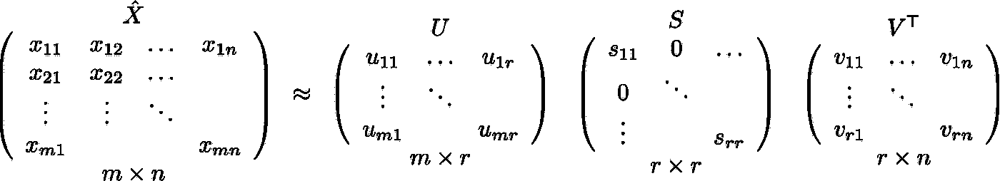

矩阵分解/分解为三个矩阵(SVD)(图 1)

上图是一种简单且使用最广泛的矩阵分解，称为 **SVD →奇异值分解**

SVD 的直觉→设存在维数为(m，n)的矩阵 **X** 这个矩阵可以看作两个或三个矩阵之间的点积，每个矩阵的维数分别为(m，r)和(r，n)。

SVD 在推荐系统中被广泛使用，稍后我会解释为什么以及如何使用。

首先，让我们理解从 X 矩阵(矩形)中得到的三个矩阵。

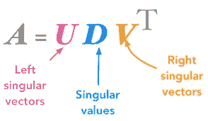

奇异值分解(图 2)

***U*** →左奇异矩阵，***V _ 转置*→右奇异矩阵，***S/D****→S*奇异值矩阵*。*注意每个矩阵的形状，我们可以看到 ***S*** 是对角矩阵而 ***U，V_Transpose*** 是矩形矩阵，它们有各自的形状。**

> **U** 矩阵中的行称为左奇异向量， **V** 矩阵中的列称为“ **X** 的右奇异向量

你可以把这三个矩阵想象成 ***X*** 矩阵的**因子**。所以，如果你把这三个矩阵相乘，你会得到预期的 ***X*** 。

> SVD 的一个缺点是，当原始矩阵稀疏(不完整)时，左右奇异向量是未定义的。

## 矩阵分解作为推荐系统中的特征工程

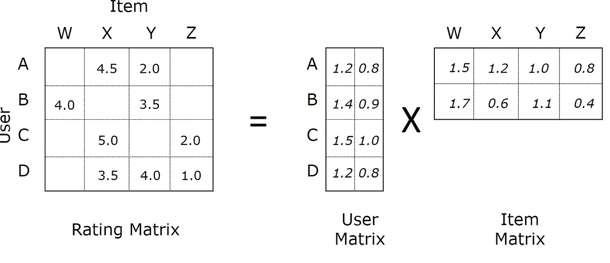

分解成用户和项目矩阵的用户项目数据集(图 3)

假设我们有一个数据集，其中包含不同用户给出的项目评级。这是一个典型的推荐系统问题，你的工作是根据 i^th 用户之前的评价向 i^th 用户推荐新的商品。

让我们取 n →用户数，m →项目数，那么我们的评级矩阵将是(nxm)的数量级。

在应用矩阵分解之后，我们得到两个矩阵，形状的用户矩阵(nxd)和形状的项目矩阵(dxm)。你可以把形状和图 1 比较一下，看看左右奇异矩阵的形状。

> 用户矩阵中的 i^th 行是 i^th 用户向量，项目矩阵中的 i^th 列是 i^th 项目向量。所有向量都是维数为“ **d** 的实数。

你为你的用户和项目得到的 d-dim 表示是通过矩阵分解得到的。

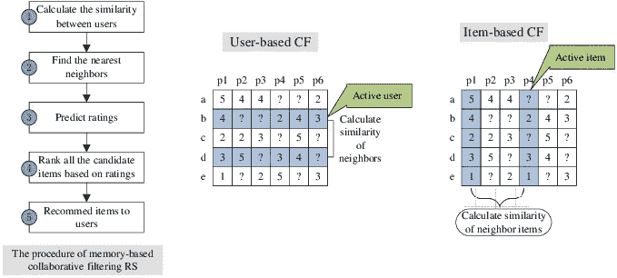

用户-用户和项目-项目相似性(图 4)

> 因此，我们不要忘记，现在您可以使用这些向量进行协作过滤，找到基于**用户-用户**和**项目-项目**的相似性。

> 矩阵分解&数学上的目标函数。


(图— 5)

这里， **p** 是用户矩阵， **q** 是项目矩阵。

现在，我们来看一下我们的**目标函数**，我们希望根据 **q (dxn)** 和 **p(nxd)** 来最小化该目标函数，与上面我针对项目和用户矩阵解释的形状相同。


目标函数(图 6)

这里， **r_ui** →用户 u 对物品 I 的评分， **q_i** →物品向量， **p_u →** 用户向量。

> 如果我们仔细观察，方程的前半部分是损失的平方，后半部分是 L2 正则化。

# 矩阵分解的代码解释

首先让我们看看我们的数据

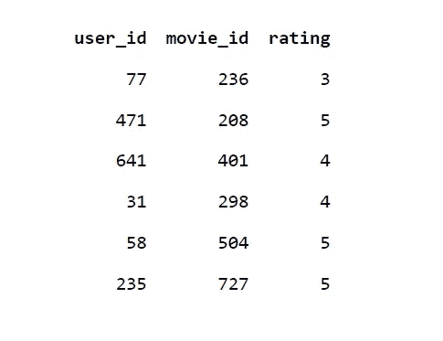

用户-项目数据(图 7)

我们将预测(用户标识，电影标识)对的收视率。

这里，我们的数据集中的列是 user_id、item_id 和 rating。让我们把电影作为我们的项目。

我们将把这个数据集转换成我们的**X/等级/邻接**矩阵。

> **X[i][j] = rij** ，这里 **i** 是用户 id， **j** 是电影 id， **rij** 是用户给出的评分
> 
> 去看电影。我们将在这个矩阵上应用 SVD 分解。

我们需要我们的用户、项目和评分数据来创建稀疏矩阵 **X** 。

```
#getting user id and appending to list
#getting item value and appending to list
#getting rating value and appending to listuser_data=[]
item_data=[]
ratings=[]
for i in range(data.shape[0]):
    user=(data['user_id'].iloc[i])                
    item=(data['item_id'].iloc[i])               
    rat=(data['rating'].iloc[i])                  
    user_data.append(user)
    item_data.append(item)
    ratings.append(rat)
```

> 它很稀疏，因为数据集中有许多电影，但 i^th 用户不会对所有电影进行评级。因此，它是一个稀疏矩阵。

现在，我们将创建一个稀疏矩阵 **X** (邻接矩阵)

```
from scipy.sparse import csr_matrixadj_matrix = csr_matrix((ratings, (user_data, item_data)))
adj_matrix.shape
```

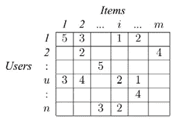

矩阵 **X/adj_matrix** (图— 8)

> 这就是 adj_matrix 的样子。

现在，因为我们有了矩阵 **X** ，我们现在需要做的就是执行 SVD 矩阵分解，如下所示。

```
from sklearn.utils.extmath import randomized_svd
import numpy as np 

U, S, VT = randomized_svd(adj_matrix, n_components=5,n_iter=5, random_state=None)
print(U.shape)
print(Sigma.shape)
print(VT.T.shape)
```

U →左奇异矩阵(用户)，VT →右奇异矩阵(项)，S →奇异值矩阵

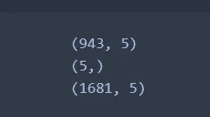

上述代码的输出(图— 9)

这是形状的样子。

现在，我们已经分别得到了用户矩阵和项目矩阵。类似于图 3

> 所以矩阵 **U** 可以表示为用户的矩阵表示，其中每一行 **u_i** 表示一个用户的 d 维向量，矩阵 **VT** 可以表示为电影的矩阵表示，其中每一行 **v_j** 表示一个电影的 d 维向量。

## 学习方法

求矩阵 q 和 p 的一个明显的方法是梯度下降法。因为我们已经定义了损失函数，所以对 q 和 p 取偏导数来优化这些值。给定如下，

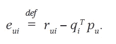

更新公式(图— 10)

**伪代码**

```
for each epoch:
    for each pair of (user, movie):
        b_i =  b_i - learning_rate * dL/db_i
        m_j =  m_j - learning_rate * dL/dm_j
    predict the ratings with formula y_pred_ij = mu + b_i + m_j + dot_product(u_i , v_j)
```

**mu →** 是所有评分的平均值， **u_i →** 用户向量， **v_j →** 项目向量， **b_i** 和 **m_j** 将通过更新公式和偏导数得到。

通过应用偏导数，更新规则将看起来像下面这样，它被应用在伪代码中

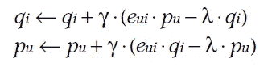

用户和项目的偏导数(图 11)

**gamma →** 梯度下降的学习率

## 添加偏差后

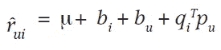

更新有偏差的公式(图— 12)

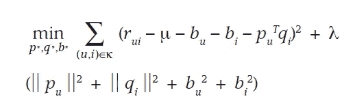

带有偏差和正则化的目标函数(图 13)

***矩阵分解是一种前沿技术，隐藏在其他方法中，如 PCA(维数约减)、聚类等。***

***它可以用在许多解决重要问题的技术中，这一事实本身就令人震惊。***

> 最后，如果没有写这篇[研究论文](https://datajobs.com/data-science-repo/Recommender-Systems-[Netflix].pdf)的聪明人，矩阵分解的使用在推荐系统中是不可能的。

## 参考

1.  [https://towards data science . com/paper-summary-matrix-factorization-techniques-for-recommender-systems-82d 1a 7 ace 74](https://towardsdatascience.com/paper-summary-matrix-factorization-techniques-for-recommender-systems-82d1a7ace74)
2.  [https://www.google.com/search?q =协同+过滤+示例&rlz = 1 C1 chbf _ enin 850 in 850&OQ = collab&aqs = chrome . 0.69 I 59j 69 I 57j 69 I 59j 69 I 60 l 3.9854j 0j 7&sourceid = chrome&ie = UTF-8](https://www.google.com/search?q=collaborative+filtering+example&rlz=1C1CHBF_enIN850IN850&oq=collab&aqs=chrome.0.69i59j69i57j69i59j69i60l3.9854j0j7&sourceid=chrome&ie=UTF-8)
3.  应用人工智能课程

> 如有任何疑问，欢迎您在推特上与我联系。

[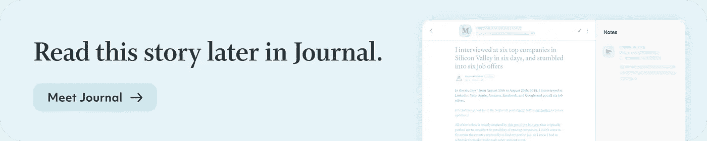](https://usejournal.com/?utm_source=medium.com&utm_medium=noteworthy_blog&utm_campaign=tech&utm_content=guest_post_image)

📝稍后在[杂志](https://usejournal.com/?utm_source=medium.com&utm_medium=noteworthy_blog&utm_campaign=tech&utm_content=guest_post_read_later_text)上阅读这个故事。

👩‍💻每周日早上醒来，你的收件箱里会有本周最值得关注的科技新闻。[阅读科技简讯](https://usejournal.com/newsletter/noteworthy-in-tech/?utm_source=medium.com&utm_medium=noteworthy_blog&utm_campaign=tech&utm_content=guest_post_text)中值得注意的内容。