# 使用 Map Reduce 的大规模矩阵乘法

> 原文：<https://medium.com/analytics-vidhya/matrix-multiplication-at-scale-using-map-reduce-d5dc16710095?source=collection_archive---------1----------------------->

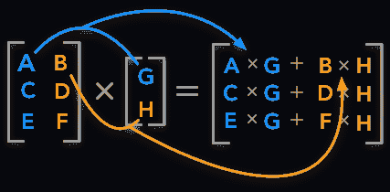

矩阵乘法是大多数机器学习算法所依赖的最基本的运算之一。了解矩阵乘法在分布式系统中的工作原理对理解我们算法的成本有重要的启示。Google 的 [PageRank](https://en.wikipedia.org/wiki/PageRank) 算法也是基于矩阵(矩阵和一个向量)的重复相乘达到收敛(大稀疏矩阵)。**在这篇文章中，我们将了解如何使用 map reduce 来乘矩阵，这些矩阵是如此之大，甚至不适合在一台机器上运行**。本文中使用的思想也扩展到在[GPU 中使用的算法，以非常高效地并行乘矩阵](https://graphics.stanford.edu/papers/gpumatrixmult/gpumatrixmult.pdf)。这是理解 map reduce 系列的第三篇文章，如果你不熟悉 map reduce 的工作原理，请查看以下两篇文章:

*   [Map Reduce 如何让你轻松应对 Pb 级规模](https://09kartikeya.medium.com/how-map-reduce-let-you-deal-with-petabyte-scale-with-ease-151fd00b8d1c?source=your_stories_page-------------------------------------)
*   [使用 MapReduce 的关系操作](/swlh/relational-operations-using-mapreduce-f49e8bd14e31)

# 内容

*   矩阵表示
*   使用两遍的矩阵乘法
*   结论
*   稀疏矩阵乘法的代码片段
*   资源

# 矩阵表示

为了表示矩阵，我们将使用[坐标格式](https://docs.scipy.org/doc/scipy/reference/generated/scipy.sparse.coo_matrix.html)。我们仅**存储具有非零值的矩阵索引**以及与该位置相关联的值。下图显示了 matrix 的原始外观。

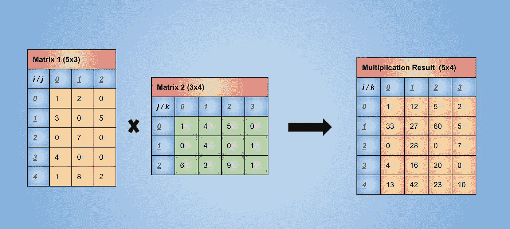

原始形式的矩阵

通过只存储非零值的索引，在矩阵稀疏的情况下(这是矩阵变得太大的情况)，我们也最终节省了大量空间。下图显示了使用上述表示法的上述两个矩阵(矩阵 1 和矩阵 2)的表示法。

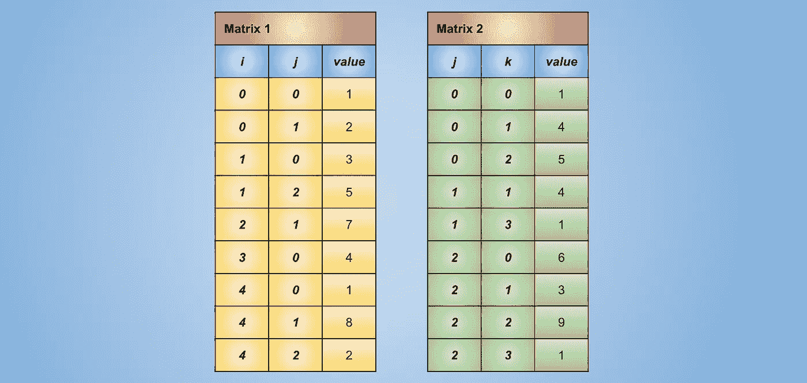

用首席运营官格式表示的矩阵

# 使用两遍的矩阵乘法

在这里，两次传递象征着我们将需要两次 map reduce 作业来计算矩阵乘法。让我们先试着理解矩阵相乘的步骤。在解释过程中的操作时将参考该解释。

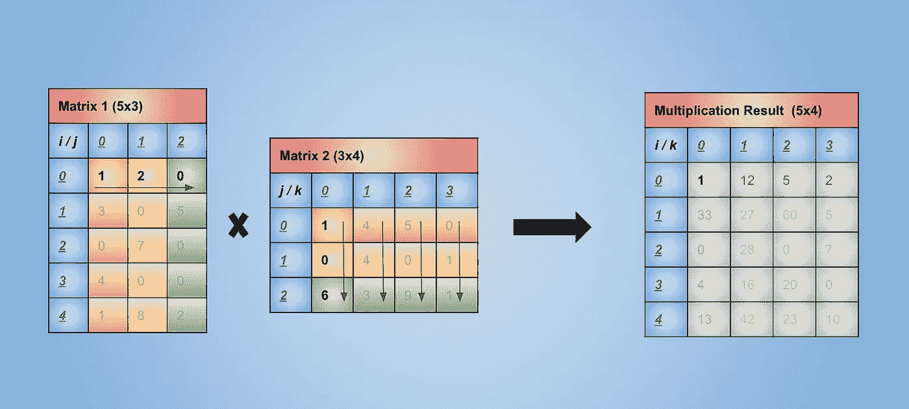

两个矩阵中涉及的元素，以获取第一个元素的结果

在上图中，我们看到，为了在位置(0，0) `(1 * 1) + (2 * 0) + (0 * 6) = 1`构造结果`1`的第一个元素，我们需要将第一行`matrix 1`的元素乘以第一列`matrix 2`的元素。颜色表示相乘的元素。橙色元素与橙色元素相乘，黄色和绿色元素也是如此。

如果我们遵循矩阵乘法的程序，我们将会看到`matrix 1`中的所有橙色元素都需要乘以`matrix 2`中的橙色元素，黄色和绿色元素也是如此。

为了获得结果矩阵中索引`i, k`处的值，我们需要对矩阵 1 中`ith`行和矩阵 2 中`kth`列的元素相乘进行求和。

基于以上理解，我们将设计我们的第一个 map reduce 作业来计算这些乘法。第二个作业将负责计算总和。

让我们首先来看看当数据存储为上一节中讨论的表示形式时，它是如何看待地图工作者的(我们将考虑 2 个地图工作者和 2 个 reduce 工作者)。

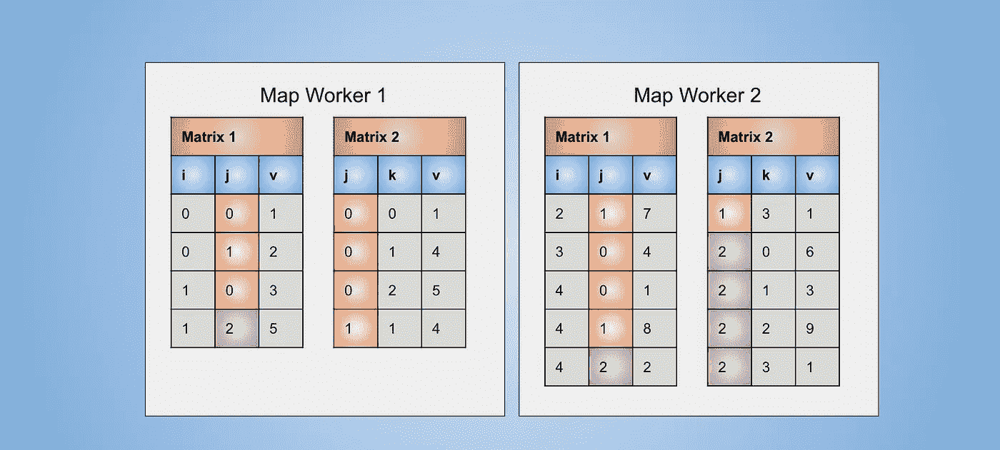

地图工作者的数据

上面表示的矩阵可以被视为具有列(I，j，v)和(j，k，v)的两个关系表。矩阵乘法非常类似于对`j`列的自然连接，然后是求和聚集。

*   **映射函数传递 1** :我们希望为矩阵中用于解释的所有橙色元素实现相同的键，并为黄色和绿色元素实现相同的键，这样我们就可以将所有值相乘，以形成部分相乘结果，如上面解释中所述。为矩阵 1 的每一行创建形式为`j:(M1, i, vij)`的键值对。其中`M1`表示该值来自矩阵 1，而`vij`表示关系中给定`i, j`值的行的值。为矩阵 2 的每一行创建`j: (M2, k, vjk)`形式的键值对。我们需要跟踪该值来自哪个矩阵，因为我们不想将同一个矩阵的元素相乘。
*   **Reduce 函数传递 1** :一旦我们在一个地方有了相同颜色的矩阵元素，我们只需要将它们相乘，并以键值的形式输出结果，该结果可以被提供给下一个 map reduce 作业。对于一个键`j`，取来自 M1 的每个值的形式为`(M1, i, vij)`，取来自 M2 的每个值的形式为`(M2, k, vjk)`，并产生一个形式为`i,k: vij * vjk`的键-值对。

在地图工作者中应用地图函数并对键进行分组后，数据如下图所示，请注意，每个键都有不同数量的值，这是因为我们不存储关于值为零的位置的数据

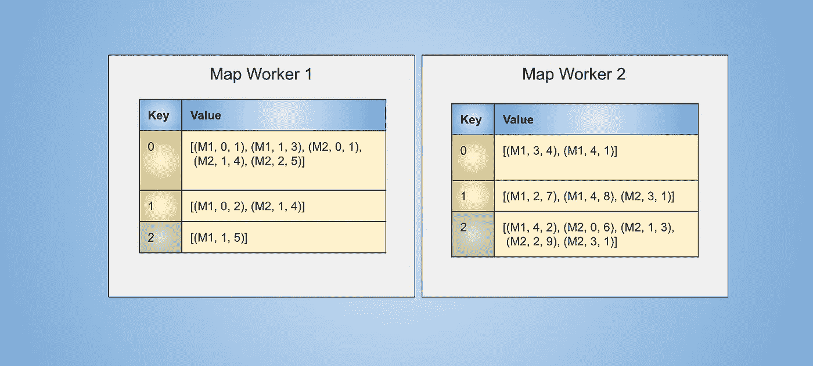

应用地图功能和分组键后地图工作者的数据

将在 map workers 中创建 reduce workers 文件，下图显示了这些文件中的内容

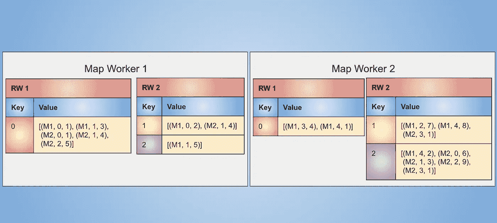

地图工作者中用于减少工作者的文件

这些文件将被发送给裁减员工，其中的文件如下:

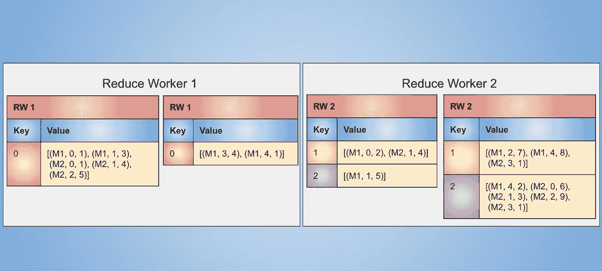

减少工人的数据

在此之后，我们应用 reduce 函数，在这种情况下，该函数将为 map reduce 的下一步生成中间输出。这包括将来自矩阵 1 的值与来自矩阵 2 的所有值相乘。

例如，对于`j`值`1`，我们生成如下密钥

```
Key: 1
Index:  [    0            1           2           3           4    ]
Values: [(M1, 0, 2), (M1, 2, 7), (M1, 4, 8), (M2, 1, 4), (M2, 3, 1)]For value at index 0, 1, 2 which are from matrix 1, we need to multiply the values from index 3 and 4 as those are from matrix 2
Forming the key, values in yellow colour in the below imagee.g. the key (0, 1) for reducer worker 2 is formed by multiplying values from index 0 and index 3\. Which are 2, 4 in this case resulting in output tuple {(0, 1): 8}.
```

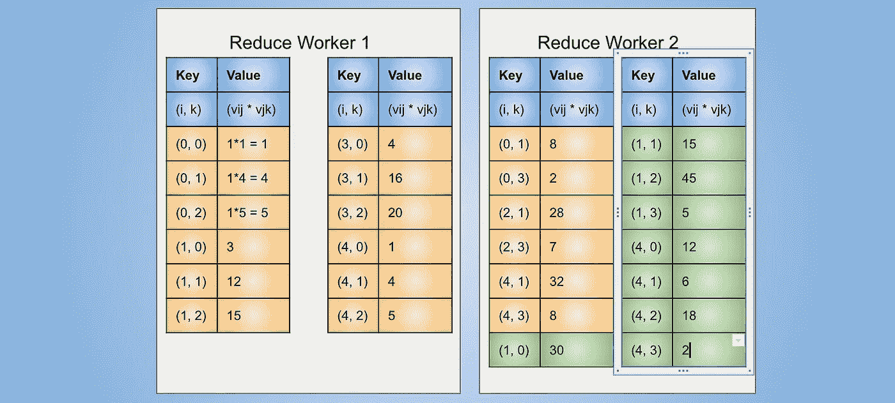

归约操作后的数据

现在乘法已经完成，我们要做的就是按键分组，并应用求和聚合，以`i, k, value`的形式输出数据，其中 I，k 是结果矩阵的索引，`value`是这些索引处的值。

*   **映射函数传递 2:** 映射函数不需要做任何事情，因为我们有一个键值形式的输入。
*   **Reduce 函数传递 2:** Reduce 函数只需要对与同一个键相关联的值求和。

假设 reduce workers 上的数据被发送回 map workers，我们将不得不基于某种散列函数为 reduce workers 创建文件以供其使用，从而确保相同的键到达一个 reduce worker。这些文件将看起来像:

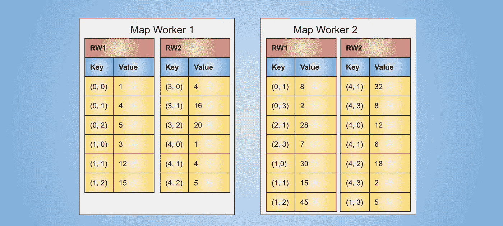

地图工作者中用于减少工作者的文件

这些文件被发送给裁减人员，它们看起来像:

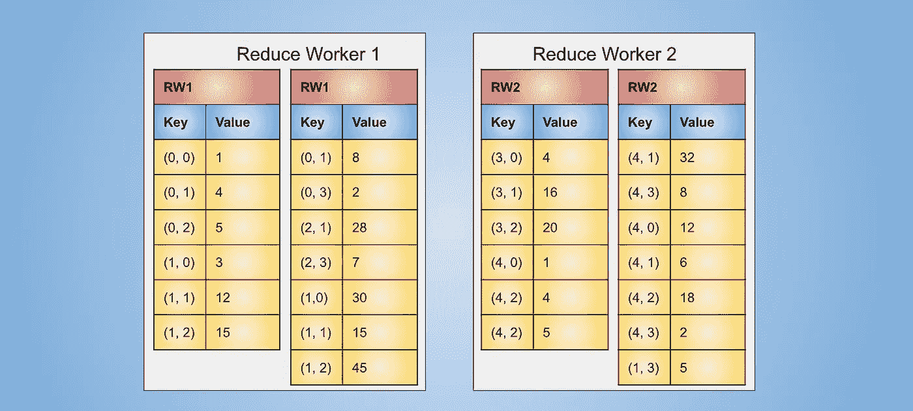

减少工人的文件

最后，应用 reduce 函数，该函数将 reduce worker 中所有文件的公共键的值相加，并以表格`i, k, value`的形式生成输出

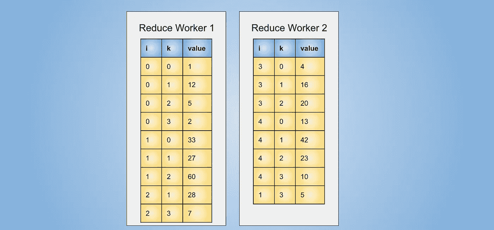

裁员的最终结果

以上是用首席运营官格式表示的两个矩阵相乘的结果。如果需要，这可以存储到某些存储系统的文件中。

# 结论

在本文中，我们看到了矩阵乘法的本质对于并行处理非常重要，但也看到了它如何生成几个键但很多值，如果矩阵很大，值的列表变得非常大，以至于无法在单台机器上运行，这可能会很麻烦。在这种情况下，我们可以增加工作节点的内存大小，甚至将矩阵分成小的矩形块，其工作原理在第五章的第[节 5.2 中解释。如](http://infolab.stanford.edu/~ullman/mmds/ch5.pdf)[第二章](http://infolab.stanford.edu/~ullman/mmds/ch2n.pdf)第 2.2.3 节所述，该矩阵乘法也可以在一次运算中完成。但是在进一步的阅读中，我们发现两遍算法的通信成本优于一遍算法，使得两遍算法在大多数情况下更有效，这与大多数人的直觉相反。在[第二章](http://infolab.stanford.edu/~ullman/mmds/ch2n.pdf)的第 2.5 节中，详细解释了通信成本的主题，这有助于理解查询优化器内部使用的数学计算，以决定如何基于少量数据统计信息执行连接和矩阵乘法等操作。

# 稀疏矩阵乘法的代码片段

我创建了以下代码片段来可视化将在上述地图缩减步骤中创建的步骤的输出。我已经使用原始 python 代码做到了这一点，使得对任何矩阵执行该操作成为可能。最初编写这段代码的目的是为了在单个系统上高效地乘稀疏矩阵，但它对任何矩阵都是通用的。这里没有分区或并行操作，可以认为这是一个具有单个 map worker 的系统，它也用于 reduce worker。

稀疏矩阵乘法

# 资源

*   [http://infolab.stanford.edu/~ullman/mmds/ch2n.pdf](http://infolab.stanford.edu/~ullman/mmds/ch2n.pdf)
*   [https://docs . scipy . org/doc/scipy/reference/generated/scipy . sparse . COO _ matrix . html](https://docs.scipy.org/doc/scipy/reference/generated/scipy.sparse.coo_matrix.html)
*   [https://en . Wikipedia . org/wiki/Matrix _ multiplication _ algorithm](https://en.wikipedia.org/wiki/Matrix_multiplication_algorithm)
*   [https://en.wikipedia.org/wiki/Cannon%27s_algorithm](https://en.wikipedia.org/wiki/Cannon%27s_algorithm)