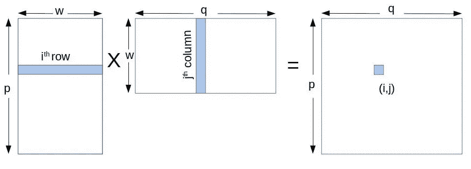
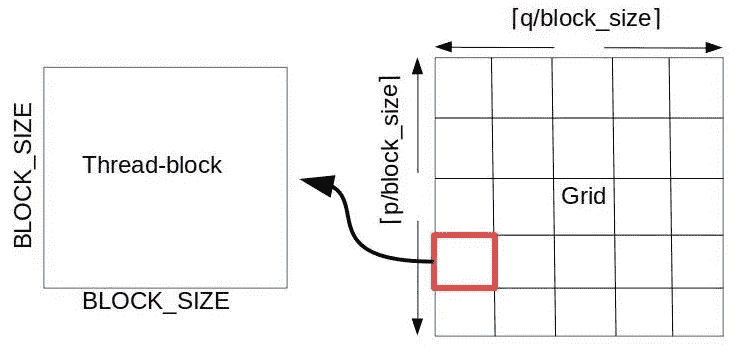
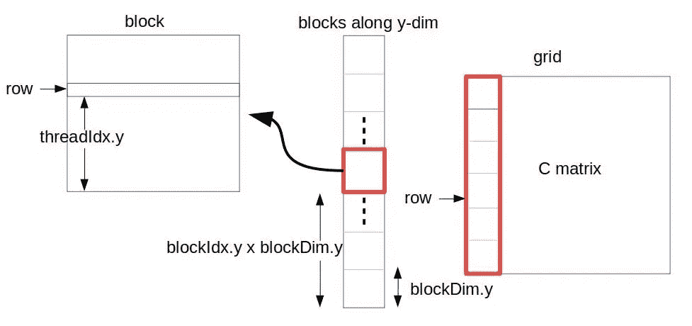

# CUDA 中的矩阵乘法——简单指南

> 原文：<https://medium.com/analytics-vidhya/matrix-multiplication-in-cuda-a-simple-guide-bab44bc1f8ab?source=collection_archive---------1----------------------->

今年春季学期，我参加了*编程加速器架构*课程，并花了一些时间在 CUDA 中实现矩阵乘法。我想和大家分享一下我的经历会很不错！

# 基础

假设我们要将矩阵 ***A*** 与矩阵 ***B*** 相乘来计算矩阵 ***C*** 。假设 ***A*** 是 A***p*×*w***矩阵，B 是 a ***w × q*** 矩阵，那么 ***C*** 将是 ***p × q*** 矩阵。矩阵乘法很简单。要计算***【C】***中的**【T37(I，j)】**第 I 行******第 A 行*** 与***【B***第 j 列****(图 1)。所以 ***C*** 中的单个元素将是一个向量-向量乘法。*

**

*图 1:矩阵乘法会发生什么？*

*在 CUDA 中实现并行矩阵乘法的一个显而易见的方法是让每个线程做一个向量-向量乘法，即 C 矩阵中的每个元素将由一个单独的 CUDA 线程来计算。*

# *简单的 CUDA 实现*

*在 CUDA 编程模型中，线程被组织成线程块和网格。线程块是编程模型允许的最小线程组，网格是多个线程块的排列。如果你不熟悉线程块和网格，请参考[这个](https://stackoverflow.com/questions/2392250/understanding-cuda-grid-dimensions-block-dimensions-and-threads-organization-s)。线程块或网格可以排列成一维、二维或三维*

*因为我们是乘 2-D 矩阵，所以只有在 2-D 中安排线程块和网格才有意义。在大多数现代 NVIDIA GPUs 中，一个线程块最多可以有 1024 个线程。因此我们可以使用一个 32×32 的二维线程块(让我们假设我们的线程块大小是***BLOCK _ SIZE x BLOCK _ SIZE***)。现在我们应该如何安排我们的网格？由于输出矩阵是 ***p × q*** ，我们至少需要有*在***y***-dimension***⌈q/32⌉***在 ***x*** -dimension 中的线程块数(图 2)。**

****

**图 2:简单矩阵乘法的线程块和网格组织**

**因此，使用 CUDA 可以如下指定块和网格尺寸。这里我假设矩阵中的列在***x***-维度中被索引，而行在*-维度中被索引。所以***x***-维网格会有*块。****

```
***dim3 dim_grid(ceilf(P/(float)BLOCK_SIZE), ceilf(Q/(float)BLOCK_SIZE), 1);
dim3 dim_block(BLOCK_SIZE, BLOCK_SIZE, 1);***
```

***现在让我们继续我们的矩阵乘法核心。首先，我们需要内核的哪些参数？我们需要 ***A*** 矩阵、 ***B*** 矩阵和结果 ***C*** 矩阵。假设我们所有的矩阵都按照[行优先顺序](https://en.wikipedia.org/wiki/Row-_and_column-major_order)排列(即一行中的元素将被放置在连续的内存位置)。我们还需要 ***宽度*** 这是每个线程必须完成的向量-向量乘法的长度。因为我们拿 ***q/32*** 和 ***p/32*** CUDA 内核启动器会启动比我们需要的更多的线程。因此我们需要值 ***P*** 和***Q***(***C***矩阵的维度)来检查给定的线程是否计算了输出矩阵中的有效元素。***

```
**template<typename T>
__global__
void naive_matrix_multiply(const T *A, const T *B, T* C, int width, int P, int Q)
{
  int r = blockIdx.y * blockDim.y + threadIdx.y;   
  int c = blockIdx.x * blockDim.x + threadIdx.x;
  // check boundry conditions
  if( r < P && c < Q){
    // do the multiplication for one row and col
    T value = 0;
    for(int k = 0; k < width; k++){
      value += A[r * width + k] * B[k * Q + c];
    }
    // store the result
    C[r * Q + c] = value;
  }}**
```

**要理解这段代码，首先你需要知道每个 CUDA 线程将独立执行这段代码。将有 ***P×Q*** 个线程执行这段代码。因为每个线程都在计算 C 矩阵中的一个元素，所以我们必须首先计算这个元素的行和列。**

**线程排列在二维网格中的二维线程块中。CUDA 提供了一个简单的索引机制来获取线程块内的线程 ID(*threadidx . x*、 *threadIdx.y* 和 *threadIdx.z* )和网格内的块 id ( *blockIdx.x* 、 *blockIdx.y* 和 *blockIdx.z* )。在我们的例子中，行在***y***-维度中被索引。为了根据 CUDA *threadIdx* 和 *blockIdx* 计算第**行 *r* 行的索引，我们可以将 *blockIdx.y* 乘以 *blockDim.y* 得到线程总数达到 *blockIdx.y* 块数。然后我们添加 *threadIdx.y* ，它是该线程所属的块中沿着 ***y*** 维度的线程 ID(图 3)。列 ***c*** 的列索引可以沿着***×维度类似地计算。*******

****

**图 3:行计算**

**接下来的步骤非常简单。我们需要检查 ***r*** 和 ***c*** 是否在界限内 ***P*** 和 ***Q*** 。然后我们把***A**c***列 ***B*** 中的 ***r*** 第 7 行 与****c**做向量-向量相乘。由于 ***A*** 和 ***B*** 是按照行优先顺序在内存中布局的，所以我们可以使用`A[r*width + k]`(*0≤k≤宽度*)来访问***r******A***中的所有元素。 ***B*** 中的接入列 ***c*** 有点棘手。第 0 行第 ***c*** 列的值很容易！也就是整个 ***B*** 数组中索引 ***c*** 的值。现在第 1 行第 ***c*** 列的值将在`B[1*Q + c]`。怎么会这样记住 ***Q*** 是 ***B*** 中的列数。因此，为了访问第 1 行的第*c 列，我们从第 0 行的第*c 列索引开始，沿着整个*B********数组，通过 ***Q*** 元素进行跳转。现在要访问列 ***c*** 中的所有元素，我们可以使用`B[k*Q + c]`(*0≤k≤宽度*)，非常简单！。计算完矢量-矢量积后，最后一步是存储结果。于是我们计算出了输出矩阵 ***C*** 中的 ***r*** 第 ***c*** 列。该元素的索引将简单地为`r*Q + c`。*****

**显然，这种矩阵乘法非常简单，并且没有充分发挥 GPU 的潜力。在下一篇文章中，我将解释如何使用共享内存和分块来优化这段代码。**

**如果您仍然对本教程的代码感兴趣，可以从这里的获得。**