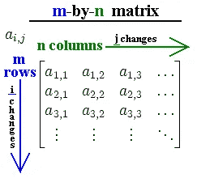
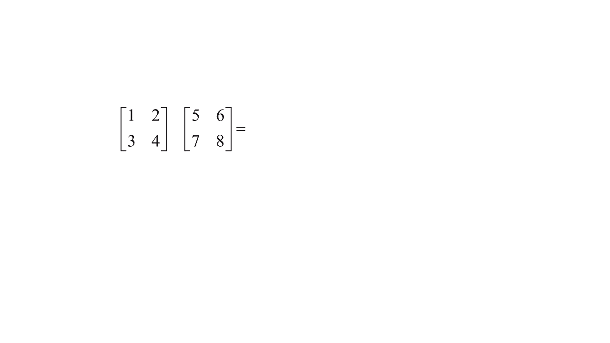
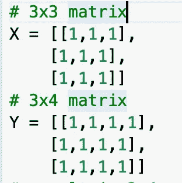
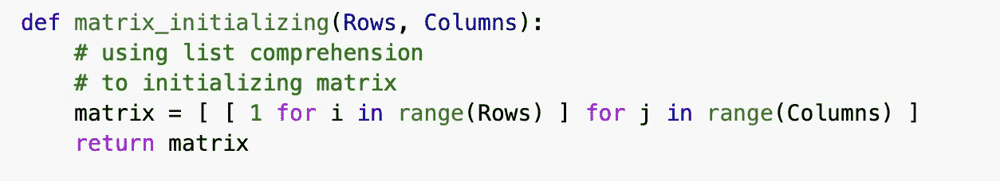
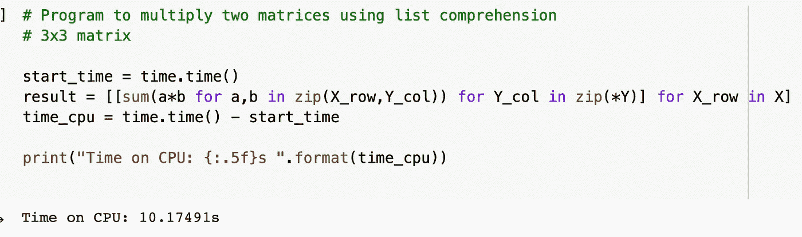
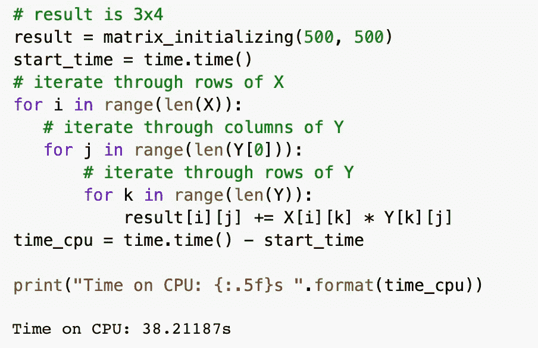
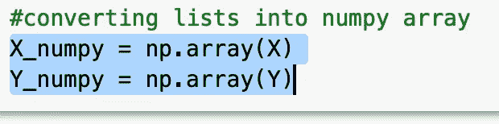
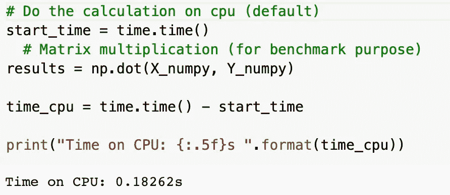
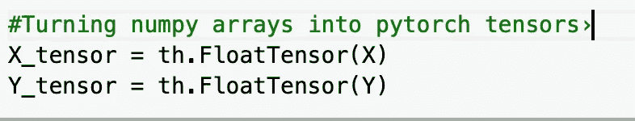
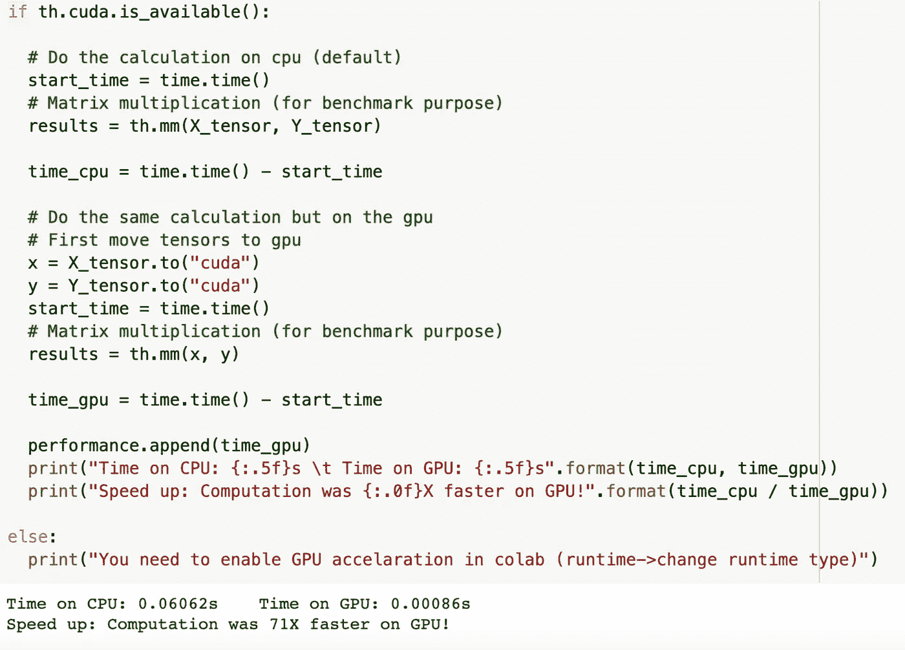

# Python 中的矩阵乘法

> 原文：<https://medium.com/analytics-vidhya/matrix-multiplication-in-python-cc5f14b4f735?source=collection_archive---------7----------------------->

我们经常遇到数据排列成由行和列组成的表格，这种数据结构称为矩阵。

我们可以对矩阵进行数学运算，但是我们必须遵守某些规则。当第一个矩阵的列数等于第二个矩阵的行数时，我们只能将两个矩阵相乘。首先，我们需要将第一个矩阵中每一行的元素乘以第二个矩阵中每一列的元素。然后，我们需要添加产品。

Python 没有内置的矩阵类型。我们可以将矩阵实现为 2D 列表(列表中的列表)。我们可以从初始化两个矩阵开始，使用下面几行代码:

请注意，第一个矩阵中的列数与第二个矩阵中的行数相同。

然而，要真正看到性能速度的差异，我们需要更大的矩阵，这将需要大量的计算。我们将实现以下函数，该函数使用列表理解来初始化我们的矩阵:

借助 Python 的灵活性，我们可以用多种方式执行几乎任何任务。让我们看看执行矩阵乘法的不同方法。

我们首先使用列表理解将两个矩阵相乘:

仅仅使用 for 循环:

矩阵乘法的列表理解版本的代码更简洁，运行速度也更快。Python 解释器在循环期间发现可预测的模式，使得列表理解比 for 循环更快。

让我们使用 Numpy 库来加速矩阵的乘法。Numpy 利用了矢量化，这基本上是用对多个数据元素同时进行的操作来取代循环(对单个数据元素的操作)。

要使用 NumPy 的强大功能，我们需要将列表转换成 NumPy 数组。

现在我们执行 NumPy 矩阵乘法，我们确实看到了计算速度的提高！

是时候加快速度了！

我们将使用 Pytorch 库将我们的计算转移到 GPU，它具有并行架构，非常适合计算大型矩阵的乘法。首先，我们必须将列表转换成张量——这将允许我们使用 GPU 和 CPU。

倍增时间:

结论:如果你有一个有大量矩阵乘法的应用程序，你可以通过将计算转移到 GPU 来显著加快它的速度。

带有完整代码的 colab 笔记本可以在这里找到[https://colab . research . Google . com/drive/1 F3 ekmp 3 VQ 6 oyl h8 w 8 hlowyrwpu 9 x 9 tai](https://colab.research.google.com/drive/1F3EKMP3Vq6oylh8w8HLowYRwpU9x9tAi)

在 GitHub 上

 [## for fire only/Python 中的矩阵乘法

github.com](https://github.com/forfireonly/Matrix-Multiplication-in-Python/blob/master/Testing_Matrix_multiplication.ipynb) 

快乐编码我的朋友们！