# 使用张量流的矩阵运算

> 原文：<https://medium.com/analytics-vidhya/matrix-operations-using-tensorflow-61a6666ded8f?source=collection_archive---------7----------------------->

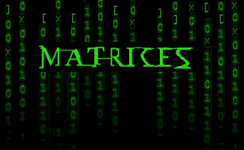

在前一篇文章**TensorFlow 入门**的基础上更进一步，将提供关于使用 tensor flow 执行矩阵运算的额外指南。如果你错过了第一个，你可以点击下面的链接。

 [## TensorFlow 入门

### 本指南将帮助您了解如何开始使用 TensorFlow 2.x

medium.com](/@minixtrator/getting-started-with-tensorflow-7bf021cce0b4) 

# **01。矩阵介绍**

在数学中，**矩阵**(复数**矩阵**)是数字、符号或表达式的矩形阵列，排列在*行*和*列*中。请注意，这篇文章的中心不是教你矩阵。如果你是矩阵新手，请在网上查找，否则，你可以用下面的**矩阵计算器**找点乐子。

 [## 矩阵计算器

### Numpy 矩阵计算器

github.com](https://github.com/Adminixtrator/Numpy_Matrix_Calculator) 

> **1.1。创建我们的第一个矩阵**

TensorFlow 提供了创建矩阵的快捷方式最常用的矩阵，例如单位矩阵，这是使用`tf.eye()`创建的

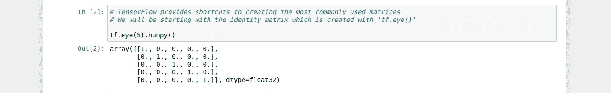

创建标识矩阵

TensorFlow 提供创建快捷方式的另一个矩阵是对角矩阵。使用`tf.diag()`
创建对角矩阵创建对角矩阵最简单和最容易的方法是使用`tf.range()`属性，然后使用`tf.diag()`属性将结果向量用于构建矩阵。

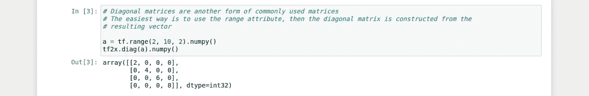

创建对角矩阵

> **本指南中使用的所有笔记本都可以在下面的存储库中找到**

 [## 管理员/深度学习

### ❍这些笔记本将基于你已经看过之前的笔记本的假设，❍指南将基于…

github.com](https://github.com/Adminixtrator/Deep_Learning) 

> **1.2。对矩阵进行运算**

令人惊讶的是，TensorFlow 可以对矩阵执行一些有趣的操作。我们首先要看的是**行列式**。为了得到矩阵的行列式，使用了`tf.matrix_determinant(`属性。`matrix_determinant()`函数接受一个矩阵作为输入，如下例所示。

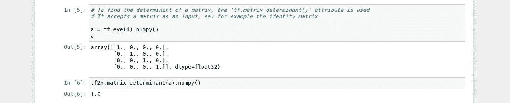

矩阵的行列式

可以执行的另一个有趣的操作是矩阵的转置。这是使用`tf.matrix_transpose()`属性完成的。`matrix_transpose()`函数接受一个矩阵作为输入。看看下面的例子。

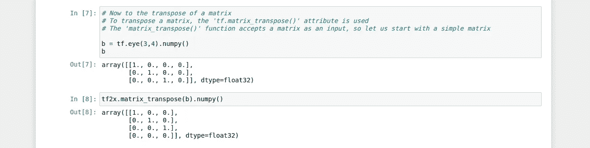

矩阵的转置

矩阵的求逆也可以使用 TensorFlow 的`tf.matrix_inverse`属性来完成。正如`matrix_transpose`和`matrix_determinant`一样，它接受一个矩阵作为输入。下面显示了绕过该操作的一种简单方法。

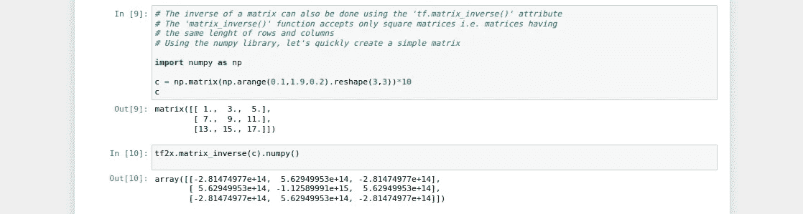

矩阵的逆

就像常量、数组等一样，矩阵也可以被整数或小数加减乘除。加、减和除矩阵的步骤仍然与前一篇文章中使用的步骤相同。`tf.add`、`tf.subtract`和`tf.divide`或`tf.div`

当矩阵相乘时,`tf.multiply()`在这种情况下不起作用——正如我们所知，矩阵相乘的理论不同于常规的乘法思想。
在矩阵的情况下，当矩阵相乘时，我们使用`tf.matmul()`。该函数**接受两个矩阵**作为输入。让我们快速看一下使用该函数的简单方法，如下例所示:

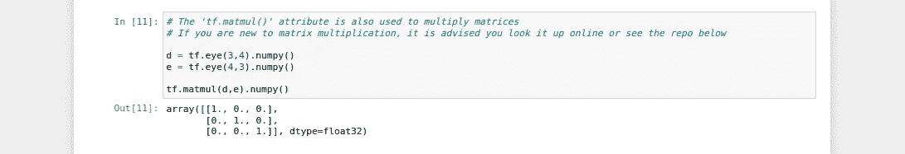

矩阵乘法

如果你是矩阵概念的新手，或者是一个有趣的爱好者，你可以试试下面的库:

 [## adminixtrator/Numpy _ Matrix _ Calculator

### 用 numpy 构建的矩阵计算器。为 Adminixtrator/Numpy _ Matrix _ Calculator 开发做贡献，创建一个…

github.com](https://github.com/Adminixtrator/Numpy_Matrix_Calculator) 

> **1.3。类型转换**

毫无疑问，一致的观察应该会注意到我们一直在研究的张量的数据类型的变化(你一定见过像`dtype=int32` `dtype=float32`之类的东西。).这一部分是操纵不同数据类型的张量的指南。
我们首先要考虑的是`int32` **dtype** 。这个数据类型由 **32 位整数**组成，所以我们将把它转换成`float32`数据类型。

为了将一个张量从一种数据类型转换成另一种数据类型，我们使用`tf.to`标志，例如，当转换成**浮点型**时，我们使用`tf.to_float()`，转换成**整型**时，我们使用`tf.to_int`，同样地，转换成**双精度型**时，我们使用`tf.to_double()`

> **笔记本上写的例子上传到下面的图片中**

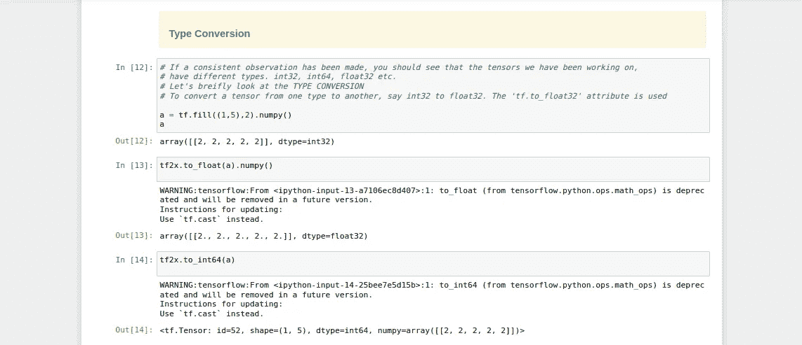

笔记本上的例子

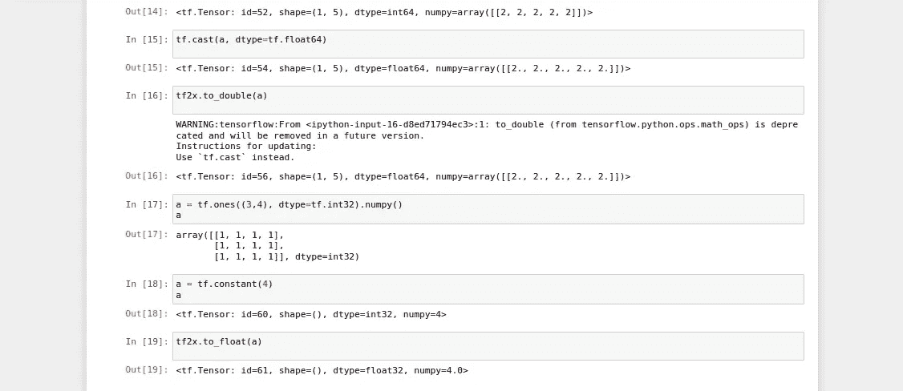

笔记本上的例子

同样，当使用关键字`dtype`创建张量时，可以声明张量的数据类型。它接受数据类型输入，如`tf.int32`、`tf.float32`等。下面的截屏显示了一个如何创建张量的简单示例:

创建张量时声明数据类型

> **1.4。形状操作**

最后，在本指南中，我们将考虑可以用 TensorFlow 执行的另一个有趣的操作— **形状操纵**😃。
在我们学习的过程中，我们可能已经注意到了张量的形状属性(你一定听过类似`shape=(3,4)`、`shape=(1,4,1)`等的东西。).

TensorFlow 提供了一种简单的方法，可以通过一个或多个维度对矩阵进行简单的扩展或缩减。与其他方面相比，这部分需要对矩阵有更深入的理解。

扩大矩阵大小最简单的方法是使用 TensorFlow 的`tf.expand_dims()`属性。`expand_dims()`函数接受一个**矩阵**和**它应该扩展的维数**作为其输入，从**零**开始它的索引。考虑下面的例子:

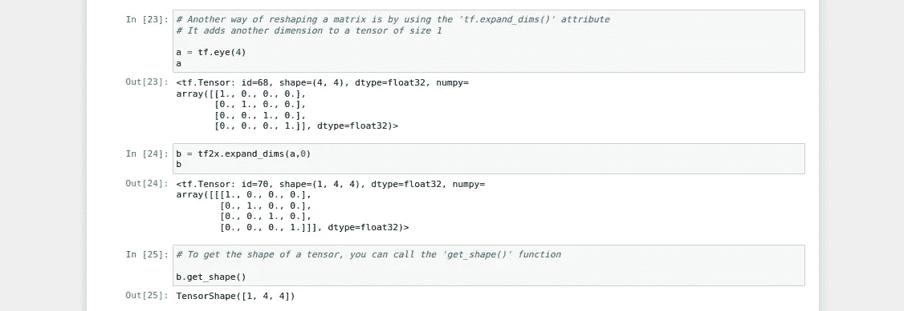

使用 expand_dims()属性

矩阵的形状也可以通过调用上面截图中使用的`tf.shape()`属性的`shape()`函数来获得。

现在来减小矩阵的大小。这是使用`tf.squeeze()` 属性完成的。它删除所有尺寸为 1 的维度。`squeeze()`功能接收一个**矩阵**到*挤压。考虑下面的例子:*

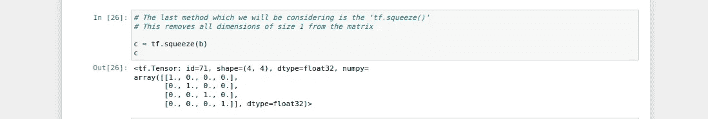

使用挤压功能

# 02。张量流广播

广播是在 **Numpy** 中引入的一个术语。在 TensorFlow 中，指的是将张量系统矩阵加到不同大小的向量上。
它提供了很多便利，比如给矩阵的每一行添加一个**向量**。我们不会深究这些规则，我们所要做的只是了解在一些情况下如何使用它。

向量(与对应矩阵具有相同的数据类型)可以沿着矩阵的行进行**加法**、**减法**、**除法或乘法**。例如，一个 3×3 的矩阵乘以一个 1×3 的向量。笔记本中显示的示例上传如下:

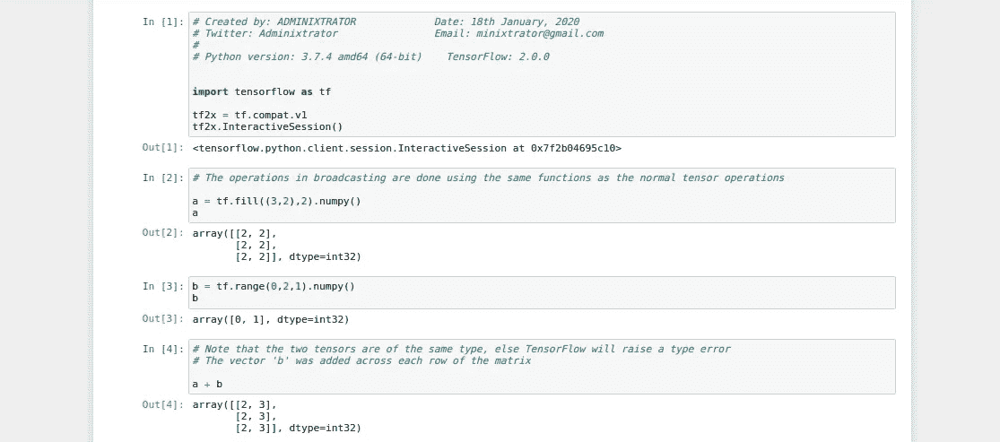

沿着矩阵的行广播

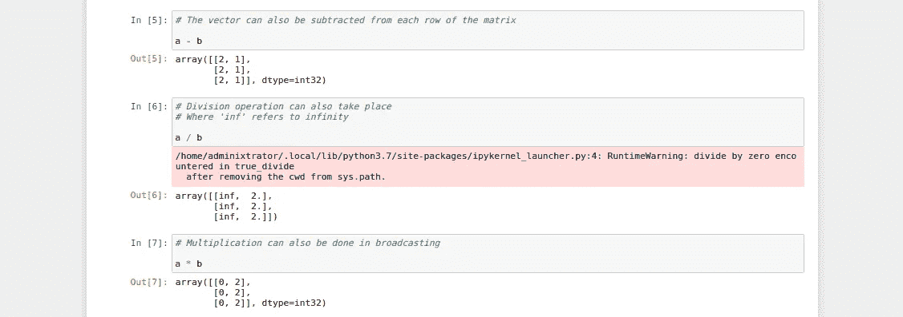

沿着矩阵的行广播

Keynote 读者会指出，这些相同的操作可以用一个**列向量**来执行(前面的称为行向量)。在这里，我们可以在一个大小为 4x4 的矩阵上传播一个大小为 1x4 的列向量，假设它们具有相同的数据类型。
考虑下面的例子:

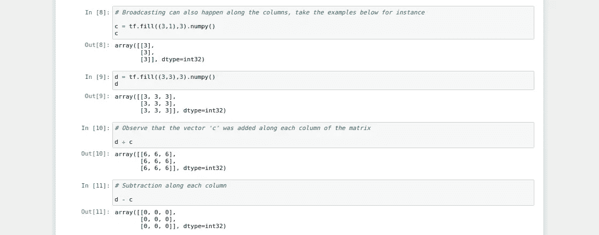

沿着矩阵的每一列广播

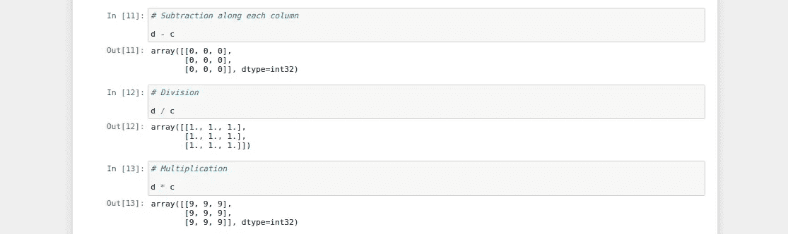

沿着矩阵的每一列广播

> 结束注释

关于张量流中的矩阵，这就是你现在需要知道的全部。持续的练习将有助于掌握这门艺术。
下一篇文章将是关于使用 TensorFlow 的**线性回归。**
本文针对深度学习的 TensorFlow。感谢您的时间，下一篇文章再见。