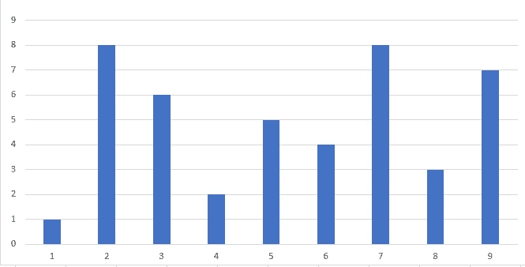

# 使用 Python 最大化条形图线之间的面积

> 原文：<https://medium.com/analytics-vidhya/maximizing-area-between-bar-graph-lines-using-python-6eb6707f53e7?source=collection_archive---------15----------------------->

我们要研究的问题是一个几何问题，与条形图中条形之间的区域有关。目标是选择两个端点，使它们之间创建的区域尽可能最大。用一个例子最容易理解这个问题。假设我们有下面的条形图:

条形图