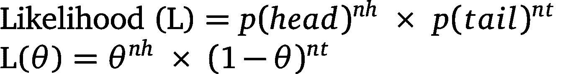
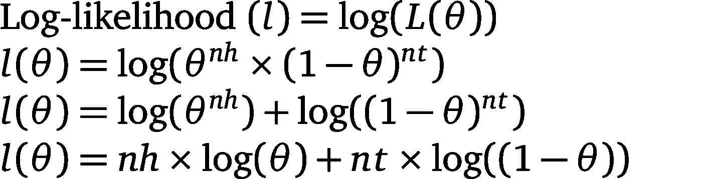
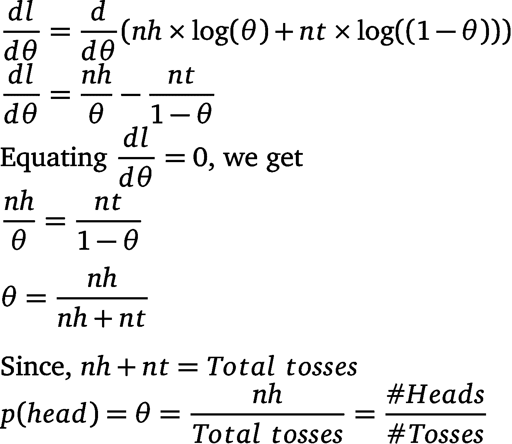

# 最大似然估计-用一个例子理解概念

> 原文：<https://medium.com/analytics-vidhya/maximum-likelihood-estimation-conceptual-understanding-using-an-example-28367a464486?source=collection_archive---------8----------------------->

最大似然估计是机器学习的核心概念之一。许多其他机器学习算法/技术都是基于使用 MLE 得出的结果。因此，总是建议对概念有一个正确的理解，并在我们的口袋里有一个方便的例子。

> 这个故事传达了 MLE 背后的意图，也为我们提供了一个简单的例子，我们可以随身携带以备将来使用。

人们试图尽最大可能减少数学的使用。但建议读者对微分和概率有基本的了解。

我们将从一个例子开始，并使用最大似然估计(MLE)来获得所需的解决方案。借助例子，我们将理解最大似然估计的概念。

## 例子

一枚不公平的硬币被掷 5 次。5 次投掷的结果如下:HHTTH。得到人头的概率有多大？

解:
p(人头)=(我们得到人头的次数)/(总抛数)
p(人头)= #人头/#抛数
p(人头)= 3/5 = 0.6

嗯，解决方案很简单。然而，此时出现了另一个问题:

> 为什么 p(head)= # Heads/# toss？？？？

让我们看看最大似然估计能否帮助我们回答上述问题。

> 在我们移动之前:
> 
> 1)让我们假设 p(头)=θ，p(尾)= 1-θ
> 
> 2)让我们称我们的观察数据集为‘D’。D = HHTTH。

# **最大似然估计**θ的值，即 p(头)

所以，根据我们的假设，我们知道得到人头的概率是θ。

> 我们的最终目标是找到θ的值，这样θ的值可以帮助我们声称，如果我们投掷硬币 5 次，我们将得到类似于数据集 d 中的观察结果。

> *重复上述几行，我们需要为硬币找到(估计)一个θ，这样，在重复 5 次投掷硬币的相同实验时，得到 D 作为最终结果的机会(* ***可能性*** *)是* ***最大化*** *。*

## 我们如何找到一个θ，它增加了得到 D 作为最终结果的机会？

1.  首先，我们试着想出一个函数，它给出我们得到 D 的概率作为最终结果。这被称为**似然函数**。
2.  然后，我们取似然函数的对数，得到**对数似然函数**。(完成这一步是出于后面陈述的数学原因。它不是最大似然的真实概念的一部分。)
3.  最后**，**我们**最大化**这个对数似然函数来最大化得到 d 的概率。

## **1)寻找似然函数:**

考虑到我们已经知道 p(head)是θ，获得数据集 D 作为最终结果的**可能性**是获得与数据集 D 中存在的头部和尾部相同序列(或数量)的**概率**

因此，
**可能性** = p(得到与 D 中相同的首尾序列)

既然 D = HHTTH，
**可能性** = p(头)。p(头)。p(尾巴)。p(尾巴)。p(头)

设 nh= #Heads =头数
设 nt = #Tails =尾数

因此，我们得到的似然函数 L(θ)为:

似然函数

## 2)寻找对数似然函数:

**我们为什么要拿走日志？** 似然函数 L(θ)将θ提升到#heads 的幂次，将(1-θ)提升到#tails 的幂次。由于θ<1，巨大的#heads 或#tails 值可能会导致我们的似然函数采用非常小的浮点值。为了防止这种情况，我们采用了似然函数的对数。这就是众所周知的对数似然函数。

拿走日志还有另一个原因。据观察，与微分似然函数相比，微分对数似然函数更容易。这一点在故事的结尾会变得更加明显。)

因此，对数似然函数 l(θ)为:

对数似然函数

## 3)最大化对数似然估计θ

我们希望找到一个可以最大化的似然函数。然而，我们将似然函数改为对数似然函数。现在我们正朝着最大化对数似然的目标前进。

**对数似然最大化和似然最大化是一样的吗？** 原来是的！！
由于‘log’是一个递增函数，最大化对数似然函数的θ值也将最大化似然函数。

我们如何最大化对数似然函数 l(θ)？
对数似然最大化是指，找到一个θ值，使得对数似然函数值 l(θ)最大化。

这是一个简单的最大化问题，我们已经得到一个等式 l(θ),我们需要找到一个使等式最大化的θ值。

我们可以对 l(θ)w . r . tθ求导，使其等于 0。这有助于我们求出θ的值。

> 因此，使用最大似然估计，我们估计了 p(head)即θ的值，并发现它是#Heads / #Tosses。这有助于我们回答“为什么 p(head)= # Heads/# toss？”。

# 结论:

最大似然法用于估计参数值(在我们的例子中是 p(head))。

1.  我们假设我们知道参数的值，并将该值称为θ
2.  利用θ，我们找到了似然函数。
3.  为了数学上的方便，我们取似然函数的对数。
4.  我们最大化对数似然函数来获得θ的值。