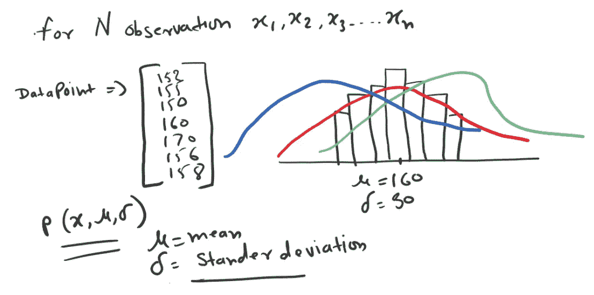
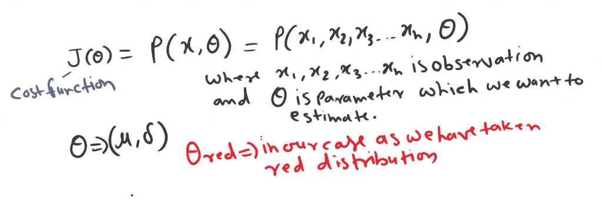
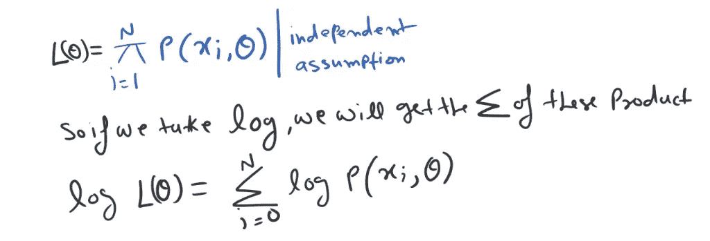

# 机器学习的最大似然估计

> 原文：<https://medium.com/analytics-vidhya/maximum-likelihood-estimation-mle-for-machine-learning-a633116b85fa?source=collection_archive---------5----------------------->

在[使用 Python 进行机器学习的逻辑回归](https://www.nucleusbox.com/logistic-regression-for-machine-learning-using-python/)博客中，我已经介绍了逻辑函数的基本思想。可能性，找到最适合的 s 形曲线。

我们已经讨论了[成本函数](https://www.nucleusbox.com/the-intuition-behind-cost-function/)。我们也看到了优化成本函数的两种方法

1.  封闭解
2.  迭代形式解

在迭代法中，我们重点研究了梯度下降优化方法。([使用 Python 的渐变下降背后的直觉](https://www.nucleusbox.com/an-intuition-behind-gradient-descent-using-python/))。

在这一节，我们将介绍最大似然成本函数。我们希望最大化这个成本函数。

# 最大似然成本函数

[随机变量](https://www.khanacademy.org/math/statistics-probability/random-variables-stats-library/random-variables-discrete/v/discrete-and-continuous-random-variables)有两种。

*   分离的
*   连续的

离散变量可以取一个有限的数。一个离散变量可以分离。例如，在抛硬币实验中，只会出现正面或反面。如果掷骰子，只有 1 到 6 的值会出现。
一个连续变量的例子是男人或女人的身高。例如 5 英尺、5.5 英尺、6 英尺等。

其值由概率分布决定的随机变量。

假设你有 **N** 个观察值 x1，x2，x3，…xN。

例如，每个数据点代表人的高度。对于这些数据点，我们将假设数据生成过程由一个**高斯(正态)分布**描述。

众所周知，任何高斯(正态)分布都有两个参数。平均值μ和标准偏差σ。如果我们根据需要最小化或最大化成本函数。我们会得到优化后的 **μ** 和 **σ** 。

在上例中，**红色**曲线是成本函数最大化的最佳分布。

既然我们选择**θ红**，那么我们想要这个的概率应该很高。基于θ的较高概率，我们希望最大化观察 x1、x2、x3、xN 的概率。

现在，一旦我们用 **θ** 定义了这个成本函数。为了简化，我们需要添加一些假设。

X1，X2，X3… XN 是独立的。假设 X1，X2，X3，…XN 是一个联合分布，这意味着观察样本是随机选择的。通过这种随机抽样，我们可以选择它作为成本函数的乘积。

## 一般步骤

我们选择对数将指数项简化为线性形式。所以一般来说这三个步骤。

*   定义成本函数
*   做出独立的假设
*   将日志简化

因此，让我们遵循高斯分布的所有三个步骤，其中 **θ** 只不过是 **μ** 和 **σ** 。

# 连续分布的极大似然估计

最大似然估计技术寻找最大化观察可能性的参数。例如，在正态(或高斯)分布中，参数是均值μ和标准差σ。

例如，我们有 1000 个随机人的年龄数据，它们是正态分布的。自然界遵循高斯分布，这是一个普遍的经验法则。中心极限定理起着 gin 的作用，但只适用于大数据集。

## [阅读更多](https://www.nucleusbox.com/maximum-likelihood-estimation-for-machine-learning/)