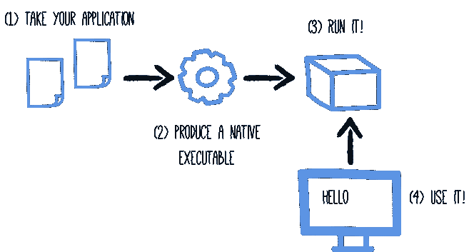
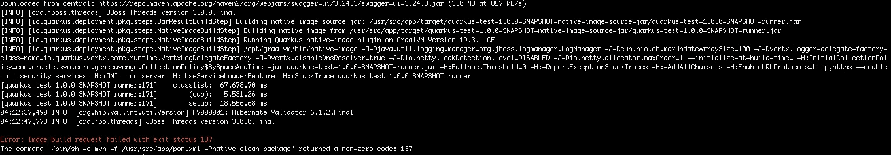
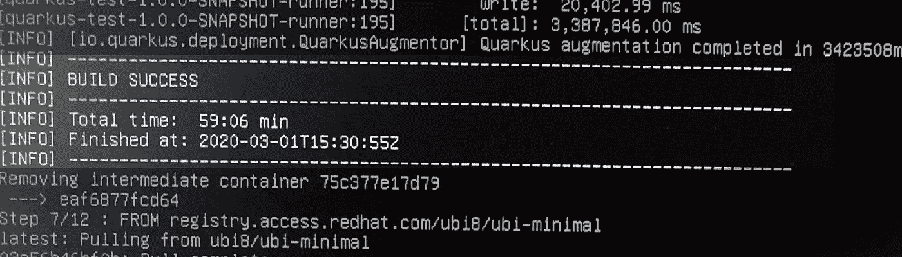
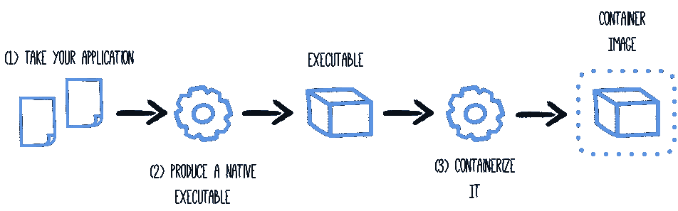

# 也许 Quarkus 中的本地可执行文件不适合你，但是它很棒

> 原文：<https://medium.com/analytics-vidhya/maybe-native-executable-in-quarkus-is-not-for-you-but-it-is-awesome-967588e80a4?source=collection_archive---------6----------------------->



[https://quarkus.io](https://quarkus.io)

首先，如果你没有一台至少 8GB 内存的好机器，也许生成本地可执行文件并不适合你。在一台比这更无能为力的机器上生成本机可执行文件是非常困难的，而且在日常工作中几乎不可能做到。

总结一下历史，a 试图在我的两台机器上生成一个本机可执行文件，一台是 Mac Air i5，另一台是 Dell XPS i7，这两台机器都有 4 GB ram，每次我尝试时都出现相同的错误:



错误:映像构建请求失败，退出状态为 137

我只能在把我的 Linux 机器的配置改为文本模式时创建这个，以尽可能地节省所有的内存，即使那样 a 也要等一个小时。



我试图找出所需的最低机器规格，但我只找到了这个:

> 先决条件
> 
> 因为编译`native-image`依赖于本地工具链，所以请确保:`glibc-devel`、`zlib-devel`(C 库和`zlib`的头文件)和`gcc`在您的系统上可用。
> 
> 要考虑的另一个先决条件是最大堆大小。运行基于 JVM 的应用程序的物理内存可能不足以构建本机映像。对于基于服务器的映像构建，我们允许所有服务器一起使用 80%的报告物理 RAM，但每台服务器决不能超过 14GB(有关确切的详细信息，请参考本机映像源代码)。如果您使用`--no-server`选项运行，您将获得报告为基线的物理 RAM 的全部 80%。此模式另外考虑`-Xmx`参数。

*来源:*[*https://www.graalvm.org/docs/reference-manual/native-image/*](https://www.graalvm.org/docs/reference-manual/native-image/)

我不明白那是什么意思，但我可以肯定。在 4GB ram 机器上生成本机可执行文件至少会适得其反。现在，回到技术问题上来。

在我们关于 Quarkus 的第一篇[帖子](https://link.medium.com/QuDQDUWbu4)中，我已经向你展示了什么是 Quarkus，为什么 Quarkus 是你新项目的一个好选择，以及如何使用它。今天我们将讨论本机可执行文件和 GraalVM，以及为什么它能提高 Quarkus 的性能。

在我们深入了解它是什么以及如何使用 Quarkus 创建可执行文件之前，学习和理解 GraalVM 是很重要的。

根据[https://www.graalvm.org](https://www.graalvm.org):

> GraalVM 是一个通用虚拟机，用于运行用 JavaScript、Python、Ruby、R、基于 JVM 的语言编写的应用程序，如 Java、Scala、Groovy、Kotlin、Clojure 和基于 LLVM 的语言，如 C 和 C++。
> 
> GraalVM 消除了编程语言之间的隔离，并支持共享运行时的互操作性。它可以独立运行，也可以在 OpenJDK、Node.js 或 Oracle 数据库的上下文中运行。

对我们来说重要的是:

> 使用 GraalVM 提前编译的本机映像可以缩短启动时间，并减少基于 JVM 的应用程序的内存占用。

这就是夸尔库斯回来的原因。Quarkus 利用了这一特性，允许我们创建本地映像，甚至改进了应用程序的启动时间。为了测试这一点，我们将使用在第一篇文章中创建的应用程序，并将启动时间与本机可执行版本进行比较。让我们做吧，这很容易。

## 设置环境:

# dnf(基于 rpm)

```
sudo dnf install gcc glibc-devel zlib-devel libstdc++-static
```

#基于 Debian 的发行版:

```
sudo apt-get install build-essential libz-dev zlib1g-dev
```

#苹果电脑

```
xcode-select --install
```

我将继续在我们的例子中使用 docker，以避免需要在我们的机器中安装东西，因为我们只是要测试和肯定，实践 docker。也就是说，我们将使用多阶段 Docker 来创建本机可执行文件。多阶段 Docker 构建就像两个 Docker 文件合二为一，第一个用于构建第二个使用的工件。



[https://quarkus.io](https://quarkus.io)

在 src/main/docker/docker file . multi stage 中创建一个新文件

```
## Stage 1 : build with maven builder image with native capabilitiesFROM quay.io/quarkus/centos-quarkus-maven:19.3.1-java11 AS buildCOPY src /usr/src/app/srcCOPY pom.xml /usr/src/appUSER rootRUN chown -R quarkus /usr/src/appUSER quarkusRUN mvn -f /usr/src/app/pom.xml -Pnative clean package## Stage 2 : create the docker final imageFROM registry.access.redhat.com/ubi8/ubi-minimalWORKDIR /work/COPY --from=build /usr/src/app/target/*-runner /work/applicationRUN chmod 775 /workEXPOSE 8080CMD ["./application", "-Dquarkus.http.host=0.0.0.0"]
```

最后

```
docker build -f src/main/docker/Dockerfile.multistage -t quarkus-test/hello .docker run -i --rm -p 8080:8080 quarkus-test/hello
```

现在，您将看到应用程序在几毫秒内启动，而不是几秒钟，并且您的应用程序有一个本机可执行文件，其中包含应用程序代码、必需的库、Java APIs 和一个简化版本的虚拟机。如前所述，较小的虚拟机基数缩短了应用程序的启动时间，并产生了最小的磁盘占用空间。

# 基准

```
./mvnw compile quarkus:dev...INFO  [io.quarkus] (main) quarkus-test 1.0.0-SNAPSHOT (running on Quarkus 1.2.1.Final) **started in 8.022s.** Listening on: http://0.0.0.0:8080
```

*默认应用程序带有 jar 文件。*

```
$ docker run -i --rm -p 8080:8080 quarkus-test/hello..INFO  [io.quarkus] (main) quarkus-test 1.0.0-SNAPSHOT (running on Quarkus 1.2.1.Final) **started in 0.067s*.*** Listening on: http://0.0.0.0:8080
```

*应用程序从本地可执行文件和 docker 映像开始。不到 1 秒*

我的 GitHub 中提供了所有代码:

[**https://github.com/gigandre/quarkus-test.git**](http://git)