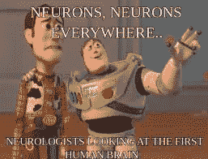
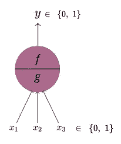
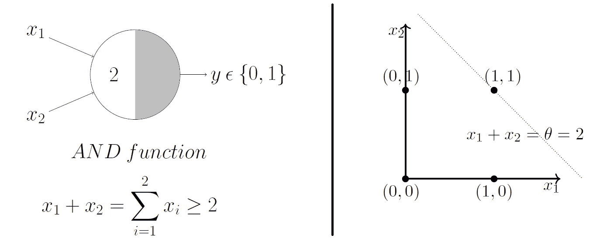
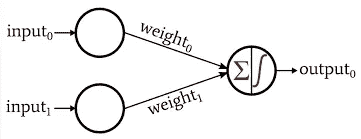
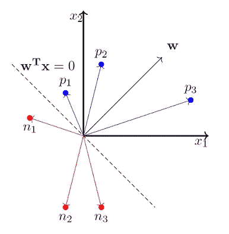
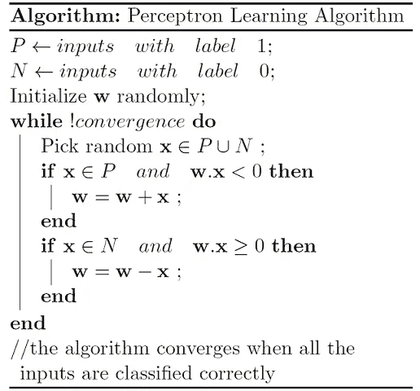
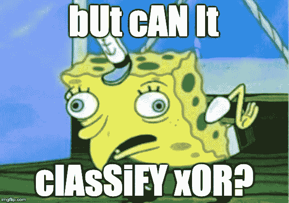

# 麦卡洛克-皮茨神经元、感知器和感知器学习算法

> 原文：<https://medium.com/analytics-vidhya/mcculloch-pitts-neuron-perceptron-and-the-perceptron-learning-algorithm-305796f6f980?source=collection_archive---------24----------------------->

我们的大脑大约有 860 亿个神经元。神经元帮助我们做决定。我们反复做决定——“我是应该看《网飞》还是应该学习？”，“我到底应该看黑暗还是朋友？，“是否观看 IPL 比赛”。我们的决定通常是布尔形式的——是或否，0 或 1。在做出决定之前，我们还会考虑各种因素(通常也是布尔型的)。因此，举例来说，我们观看 IPL 比赛的因素将是——它是否是 CSK 的比赛，如果是，那么我将观看。对手队是不是皇家挑战者 Banglore，如果不是，我就看”等。因此，这个灵感被用来形成生物神经元的第一个数学表示——MP 神经元。让我们看看它是如何工作的:

如图所示，输入和输出都是布尔型的。有两个部分: ***g*** 接受所有的输入并聚合它们， ***f*** 根据聚合做出决定。让我们继续以 IPL 比赛为例。所以，

***y*** :可能是{ 1:我会看比赛，0:我不会看比赛}

***x1*** :可能是{比赛在我的城市进行吗}

***x2***:{ CSK 在玩吗}

***x3***:{ Dhoni 女士在玩吗}

很明显，只有当 ***x1*** 为 1 时，我才能决定去还是不去，也就是说，我要去的比赛必须在我的城市。我不能去另一个城市看比赛了(实际上)。 ***x1*** 为此被称为抑制输入。一般来说， *x1 是所有不去看比赛的理由。*

现在，如果你是 Dhoni 女士的铁杆粉丝——只有 Dhoni 女士在玩的时候你才会去——所有的 ***x1，x2，x3*** 都必须是 1。另一方面，如果你只是 CSK 的粉丝，只有*和 ***x2*** 必须是 1——不管 ***x3*** 是 0 还是 1。拿第一种情况来说，我们可以说，只有当***g(x)= x1+x2+x3≥3***时，这个神经元才会“开火”*

*让我们来看看另一个布尔函数——AND 函数。用 MP 神经元来表示:*

**

*我们可以说，只有当 ***g(x)≥2 时，神经元才会“激发”。*** 因此， ***g(x)=2*** 称为决定边界，对于线上或线上的所有点， ***y=1。*** 一般情况下， ***g(x)≥θ*** ，其中 ***θ*** =阈值参数。*

*这样，一些布尔函数可以用 MP-neuron 来表示。但是非布尔输入呢？所有的输入都相等吗——在我们的例子中，我可能想给 ***x3 更多的“重要性”。*** “威震天来了！”不，感知器*

## *感知器*

**

*在现实生活中，有些因素比其他因素更重要。因此，除了 MP-neuron 中的输入，感知器中也给出了输入的权重(重要性)。此外，除了学习权重，我们之前手动编码的阈值现在将通过一种称为*感知器学习算法*的算法来学习。*

*现在聚合会变成 ***g(x) = w1x1+w2x2+w3x3≥θ或者 w0x0+w1x1+w2x2+w3x3≥0*** 其中**x0**=***1***和***w0***=-***θ。*** 我们也可以把它写成 ***w.x≥0，*** 点积。判定边界将是 ***w.x=0。*** 任务是学习权重*使输入 ***xi 的误差最小化。*****

## **感知机学习算法**

**让我们将权重初始化为:**

****

**案例 1: ***P={p1，p2，p3}*** 是 ***y=1 的所有输入。*** 换句话说，以决策边界为 ***w.x=0*** ，P 是 ***w.x≥0*** 的所有点的集合。**

**案例 2: ***N={n1，n2，n3}*** 为 ***y=0*** 的所有输入。换句话说，N 是 ***w.x≤0*** 的所有点的集合。**

**现在，我们希望在最后，情况 1 和情况 2 必须发生(而不是相反)。还有，注意 w.x≥0 表示 ***α≤90 度，*** 角度 b/w ***w*** 和 ***x.*** 并且，w.x≤0 表示 ***α≥90 度。*****

**有了所有的声明，让我们看看算法:**

****

**我们迭代输入空间(P U N)中的所有点，对于 P 中的点，我们希望最后有 ***w.x≥0*** 。所以每当 ***w.x <，*** 我们给 w 加上 x 向量使其 ***w.x≥0。*** 我们对 n 中的点做同样的处理。**

**因此，当算法已经收敛-当对于 P， ***w.x≥0*** 中的所有点以及对于 N， ***w.x < 0，*** 中的所有点，我们停止。**

**算法总会收敛。收敛的证据可以在这里找到。**

****

**这篇文章只提到了一个感知器。单个感知器只能表示线性可分函数。将需要感知器网络来分类线性不可分的函数。在下一个帖子里！**

***注:本文的概念基于 NPTEL 在线教授的课程* [*CS7015:深度学习*](https://www.cse.iitm.ac.in/~miteshk/CS7015.html) *的视频。***