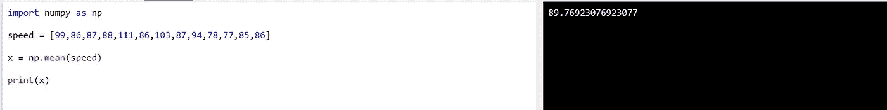
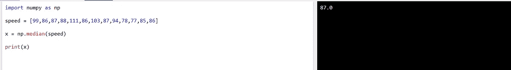
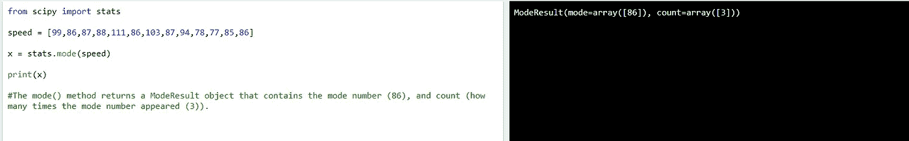
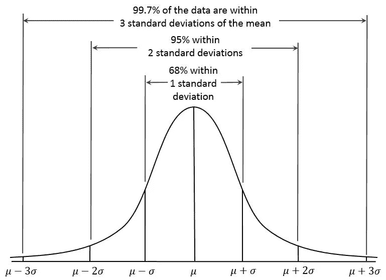

# 统计数据一览

> 原文：<https://medium.com/analytics-vidhya/mean-median-and-mode-e3cb506957cd?source=collection_archive---------32----------------------->

> **统计学**是每个机器学习模型的心脏。因此，我们必须了解统计学的基本术语，以便更好地理解我们的数据，并进一步帮助*分析*和*处理*数据。

所以，很自然的一个问题出现了:**我们能从看一组数字中学到什么？**

在机器学习中(以及数学中)经常有三个值让我们感兴趣: ***均值、中位数*** 和 ***众数。***

# 平均值、中间值和众数

让我们以一个数据集实例为例:

速度= [99，86，87，88，111，86，103，87，94，78，77，85，86]

Mean—数据集的平均值。基本上，要计算平均值，需要计算所有值的总和，然后将总和除以数据集中值的数量。我们也可以使用 NumPy 模块来计算平均值。示例:

> 将 numpy 作为 np 导入
> 
> 速度= [99，86，87，88，111，86，103，87，94，78，77，85，86]
> 
> x = np.mean(速度)
> 
> 打印(x)

**numpy 模块**给出的输出

M 注意:如果中间有两个数字，将这两个数字的和除以 2 得到中位数。我们也可以使用 NumPy 模块来寻找中间值。示例:

> 将 numpy 作为 np 导入
> 
> 速度= [99，86，87，88，86，103，87，94，78，77，85，86]
> 
> x = np.median(速度)
> 
> 打印(x)

**numpy 模块给出的输出**

M **ode** —它是我们给定数据集中出现频率最高的值；或者我们可以说，众数值是出现次数最多的值。例如:在给定的一组值中-

`99, **86**, 87, 88, 111, **86**, 103, 87, 94, 78, 77, 85, **86 , "**86" is our mode as it appears 3 times.`

此外，我们可以使用 SciPy 模块找到模式。示例:

> 从 scipy 导入统计
> 
> 速度= [99，86，87，88，111，86，103，87，94，78，77，85，86]
> 
> x = stats.mode(速度)
> 
> 打印(x)

mode()方法返回一个包含模式号(86)和计数(模式号出现的次数(3))的 ModeResult 对象。

它返回值 86 作为模式。

> ***所有的数据都有均值、中位数、众数吗？***

是也不是，所有的*连续* *数据*都有中值、众数和均值。但严格来说，*序数数据*只有一个中位数和众数，*名义数据*只有一个众数。然而，统计学家之间还没有就平均数是否可以用于序数数据达成共识，在研究中你经常可以看到李克特数据的平均数。

# 标准偏差

数据表示，其中 **μ** 表示平均值， **σ** 表示标准差

> **标准**偏差是一个描述数值分布情况的数字。

一个**的低标准差意味着大部分数字都*接近均值*(平均值)。**

**一个 ***高标准偏差*** 意味着数值*分布在*更宽的范围内。**

**示例:这次我们记录了 7 辆汽车的速度:**

**`speed = [86,87,88,86,87,85,86]`**

**标准差为:`0.9`**

**这意味着大多数值都在平均值 86.4±0.9 的范围内。**

**让我们同样选择范围更广的数字:**

**`speed = [32,111,138,28,59,77,97]`**

**标准偏差为:**

**`37.85`**

**这意味着大多数值都在平均值 77.4±37.85 的范围内。**

**如您所见，较高的标准偏差表明这些值分布在较宽的范围内。**

# ****差异****

**它是随机变量与其均值的方差的期望值。换句话说，它衡量的是一组(随机)数字从它们的平均值分散开了多远。**

**用途:方差分析，也称为方差分析或 ANOVA，涉及评估两个数字之间的差异。**

# **协方差**

**它提供了两组或多组随机变量之间相关性强度的度量。**

# **相互关系**

**两个量之间最常见的相关性度量是皮尔逊积差相关系数，或“皮尔逊相关系数”，通常简称为“相关系数”。它是通过将两个变量的协方差除以它们的标准差的乘积得到的。**