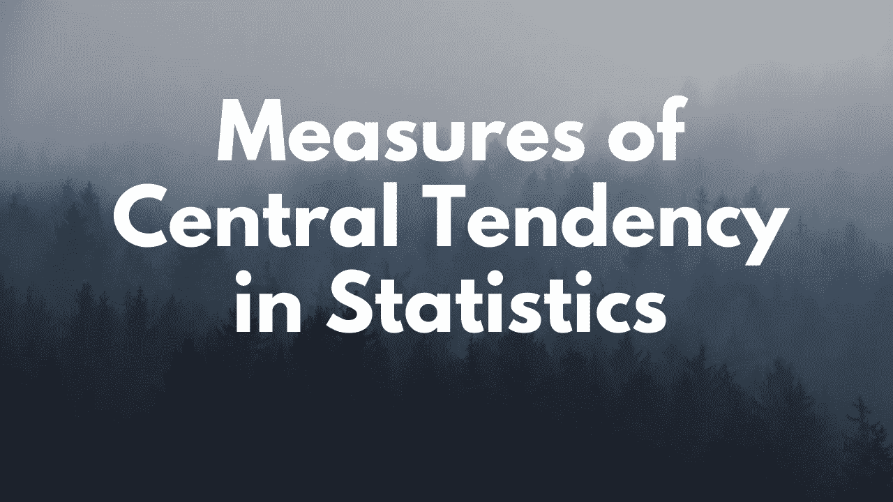

# 统计中集中趋势的度量

> 原文：<https://medium.com/analytics-vidhya/measures-of-central-tendency-in-statistics-d3ffdb33684e?source=collection_archive---------17----------------------->

嗨！在这篇文章里，我会告诉你关于均值、中值、众数的故事，如何计算，他们面临的困难是什么，谁来拯救他们？最后，我会分别解释一下*何时使用*和*何时不使用*。因此，不再浪费时间，让我们开始吧。向下滚动！！

# 1.集中趋势的度量

首先，什么是集中趋势的测量，为什么我需要研究它？在我看来，答案是，当你有数据，有人问你的数据怎么样，你的数据的简短摘要是什么，我们需要得出某种“*平均值*”，这样,*平均值*就代表了你的整个数据的样子。并且*平均值*有多种类型，例如均值、中值和众数。因此，我们需要研究“**集中趋势的度量**”来总结我们的数据，并得出一个值，以便它代表我们的全部数据。

评论里如果我的观点有错请指正！

现在让我们开始吧！！

## 1.1 卑鄙的故事

我想你们都认识我:)我是你们学校介绍给你们的。我就是**一般。**大多数人都叫我一般。但是当人们叫我平均值时，我很生气，因为还有其他类型的平均值(中位数，众数等)。人家叫我用 **μ。**我的公式是所有值的总和除以值的总数。但是，

> 我有一个问题—😒

有 ***离群值*** 的时候我就被吹走了！！你可能会问什么是离群值。它们是比数据中的平均值大得多的值。还没明白？我举个例子解释一下。让我们考虑一下课堂上的分数。让我们假设学生的平均分是 8 分，但是有一个优等生的平均分是 9.8 分。现在，这门课的意义是什么？？是 8 还是别的？嗯，我们可能直觉认为均值应该是 8，但不是！

有什么问题？？问题出在托普身上。如果把他的 GPA 加到整个班级的 GPA 上，平均 GPA 会提高这么多，这显然是不正确的。所以在这里，最高的 GPA 是一个异常值。

让我们更正式地定义它——异常值是一个观察值，它与总体随机样本中的其他值存在异常距离。

因此，**均值受异常值影响较大。**

我还有一个问题。

> 我并不总是出现在数据中。

> 你得到的均值，可能并不存在于数据本身！例如，考虑 1，2，3，101，102，103。平均值是 52。但是 52 本身不是数据中的一个值。

那么现在该怎么办呢？别担心，中位数来拯救！

## 1.2 中位数的故事

中位数:我被介绍给你是因为我朋友 Mean (μ)出了问题。问题是，他不喜欢局外人。那么，我是谁？你怎么能找到我？在这里，

*1。按升序对值进行排序。*

*2。如果有奇数个值，我就是中间元素。*

*3。如果有偶数个值，我就是两个中间数的平均值。*

中位数:就是这样！我很容易计算

> Pranay:中位数的一个好处是它解决了均值面临的问题。中位数不受异常值的影响。

比如考虑数据，1，2，2，3，3，4，5，100。显然，100 是我们数据中的异常值。所以，这里不能用均值，要借助中位数。因此，中位数是(3+3)/2，也就是 3。所以，中位数不受 ***离群值*** 的影响。

中位数:所以，我比我的朋友 Mean(μ)强！我为自己骄傲:)

我有一个问题—😒

> 等等，什么问题？我们修复了异常值的问题。又是什么问题！？

中位数:看看这个数据集，1，1，1，2，2，3，41，42，100，101，101，101。我是(3+41)/2 =22。但是数据集中没有 22！

> 我以为你能解决我所有的问题，但是没有！！现在，解决方案是什么？

中位数:嗯，我有我最好的朋友 ***模式*** 。他会解决这个问题的！！

## 1.3 模式的故事

嗨，我是 **Mode** ！！我被介绍给你是因为我的两个朋友(均值和中值)有时不会出现在数据中。例如，让我们考虑数据 1，1，1，2，2，3，41，42，100，101，101，101。现在，如果我们找到中位数，它是 22，这是不存在的数据。因此，在这种情况下，我们使用模式。

如何计算模式？

1.  *查找数据中所有唯一的值或类别*
2.  *计算所有这些唯一值/类别的频率*
3.  *选择出现频率最高的类别/数值*

所以，在上面的例子中，1，1，2，2，3，41，42，100，101，101，101 模式是 1 和 101 都是！因为它们在数据中出现了 3 次。所以这个数据有两种模式。它有时被称为 ***双峰。*** 我们的数据有 2 个 ***簇。***

> 请注意，数据也可以有任意数量的模式！

所以，风尚拯救了我们！！我们可以知道数据的平均值是 1 和 101。数据有两个平均值，因为它有 2 个聚类/模式！如果我们将数据可视化，我们会看到分类 1 的值为 1，2，3，41，42，第二个分类的值为 100，101。

该模式的两个优点是，它总是出现在数据中，不像均值和中值，而且，它不受离群值的影响！

> 模式也可以用于分类变量，但是如果我们的数据有分类变量，我们就不能使用均值和中位数。

## 1.4 摘要

**的意思是**:何时使用:如果我们的数据没有异常值并且是对称的。

**中位数**:何时使用:如果我们的数据因异常值而出现偏差。

**模式:**何时使用:如果我们的数据有聚类或分类变量。

我希望你已经获得了一些关于集中趋势度量的知识。如果您喜欢该内容，请点击“鼓掌”按钮，

和我联系-

> `*LinkedIn :* [*https://linkedin.com/in/bomma-pranay*](https://linkedin.com/in/bomma-pranay) *GitHub :* [*https://github.com/Bomma-Pranay*](https://github.com/Bomma-Pranay)`
> 
> `*--- By
> Bomma Pranay
> A Data Science Enthusiast*`