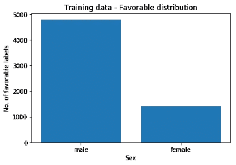

# 在沃森机器学习模型预测上使用 AIF360 度量来测量熵

> 原文：<https://medium.com/analytics-vidhya/measuring-entropy-using-aif360-metrics-on-a-watson-machine-learning-model-predictions-dddf9feefa5f?source=collection_archive---------13----------------------->

无序或熵的增加是过去和未来的区别，给时间一个方向。斯蒂芬·霍金，《时间简史》

**ML 快速介绍**

所以，让我们保持简单。

我们没有做出决定，而是建立了一个机器学习模型，并要求它代表我们做出决定。但是，我们能相信这个决定吗？为什么首先问这个问题？为什么？因为所谓的机器学习模型只不过是一段程序或代码，它是由我们(人类)通过教这个是这个，教那个是那个来训练的(给这群人贷款，不给这群人贷款，或者给这群学生发借书证，不给这群人发借书证，或者..嗯，你看，这样的例子比较多)。作为教导模型的一部分，我们(人类，犯错是人类)可能会有意或无意地犯错误，错误地教导模型，比如有偏见的教导或训练。因此，这个模型很有可能给出有偏见或错误的结果。

在我们继续之前，通常构建机器学习模型包括以下步骤:

*   收集数据并建立训练数据以及地面实况手册标签
*   构建模型，包括
*   *确定用于模型的算法*
*   *找出模型的特征*
*   *训练模型*
*   最后我们有训练好的分类器，不好意思是模型。
*   我们向这个模型发送一个有效载荷或记录来进行预测。

机器学习模型构建的生命周期

**熵是不确定性的量度**

回到做出错误预测的模型，有两个明显的问题——模型给出了“准确”的预测吗？与地面真实标签相比，预测中的“不确定性”是什么？。

在这里，为了设置这篇文章的正确的上下文，这篇文章并没有谈论太多关于模型的准确性度量，而是试图解释模型的不确定性方面的度量。

现在，让我们尝试在机器学习的背景下定义熵是什么。想象一下，政府为农民推出了一项新的福利计划，机器学习模型被用来将农民分类为谁将从这些计划中受益。偏差会导致一些符合条件的农民没有受益(假阳性)，或者一些不符合条件的农民受益(假阴性)。看，这就像是衡量模型的公平性。另一方面，这里的熵是对数据的无序或不确定性的度量——结果是否在所有农民中平均分配，如果不是，无序率是多少。一般熵的公式如下:

广义熵

为简单起见，让我们假设模型预测两个(N)标签类别——积极类别(将授予农民的政府福利计划)和消极类别(不给予)。因此，在上面的公式中,“I”可能是正(+)或负(-)。假设数据集中总共有 100 个数据点，其中 30 个数据点属于正类，70 个数据点属于负类。这个模型根据它被训练的特征预测了 30，70 个结果，比如说，一个这样的特征是农民的种族。从人类直觉的角度来看，正面和负面类别之间的预测存在明显的混乱——30 对 70。我们想量化这个无序值。

因此，yi/ybar 被定义为数据中“I”类的频繁出现概率。也就是说，y+应该是 30/100，y-应该是 70/100。并且α是调节给予分布的不同部分的值之间的距离的权重的参数。

所以 GE(0)=-1/2 *(ln(0.7)+ln(0.3))=-0.5 *(0.36-1.2)= ~ 0.78

这里的熵大约是 0.78。这被认为是一种高熵，一种高度无序。熵的度量值介于 0 和 1 之间。在一个理想的预测分布中，我们应该期望熵应该接近于 0。

**使用 IBM AIF360 测量熵**

如果你注意到这里，我们用一个公式手动计算熵值。为了自动化这些计算，IBM 提供了一个人工智能公平工具包(AIF 360—【https://aif360.mybluemix.net】T2)，使用它我们可以计算各种各样的公平度量。其中一个方法就是计算熵。使用 AIF360 还可以进行其他形式的熵计算。

让我们尝试使用 AIF360 python 实用程序来演示熵检测。继续以政府对农民的补助计划为例，将种族特征编码为 0、1、2，人工标注数据和模型预测标注数据如下表所示。这里有利值是 1，不利值是 0。如果您注意到组{race:0}和{race:2}获得了所有有利的值，而组{race:1}获得了所有不利的值。因此，很明显，在各组之间的预测标签中有一个无序，这就是我们计划使用 AIF360 在各组[{race:0}、{race:1}、{race:2}]之间测量的。

抽样资料

遵循相关的代码。

用 AIF360 计算广义熵

该值几乎接近 0.2，这表明组[{race:0}、{race:1}、{race:2}]之间的有利预测是无序的。

这段代码记录在这个笔记本里:[https://github . com/ravic amarthy/AIF 360 experiments/blob/master/Entropy % 20 identifier . ipynb](https://github.com/ravichamarthy/AIF360Experiments/blob/master/Entropy%20Identifier.ipynb)

**使用 AIF360 测量沃森机器学习中部署的德国信用风险模型的熵**

kaggle 的“德国信用风险”分类旨在预测客户的信用好坏。信用等级好的贷方向客户提供贷款没有风险，信用等级差的贷方向客户提供贷款有风险。

训练数据集的模式如下，其中衡量公平性的属性为“性别”，标签属性为“风险”。

德国信用风险-培训数据模式

训练数据的数据分布如下:

训练数据有利分布

评分模型上的预测分布如下:

得分数据有利分布

显然，该模型似乎在预测所有组之间的广义熵指数为 0.001935845727733805 的值方面做得很好。几乎接近于零。

我使用 AIF360 中的以下代码片段计算组之间的熵值:

笔记本代码片段

此工作流程记录在笔记本中:[https://github . com/ravic amarthy/AIF 360 experiments/blob/master/German % 20 credit % 20 risk % 20 AIF 360 . ipynb](https://github.com/ravichamarthy/AIF360Experiments/blob/master/German%20Credit%20Risk%20AIF360.ipynb)

**结论**

因为熵是无序或不确定性的度量，机器学习模型和数据科学家的目标通常是尽可能减少不确定性。

**参考文献**

熵标识符笔记本[https://github . com/ravic amarthy/AIF 360 experiments/blob/master/Entropy % 20 Identifier . ipynb](https://github.com/ravichamarthy/AIF360Experiments/blob/master/Entropy%20Identifier.ipynb)

部署 WML 模型和测量熵的笔记本
[https://github . com/ravic amarthy/AIF 360 experiments/blob/master/German % 20 credit % 20 risk % 20 AIF 360 . ipynb](https://github.com/ravichamarthy/AIF360Experiments/blob/master/German%20Credit%20Risk%20AIF360.ipynb)

IBM AIF 360
[https://aif360.mybluemix.net](https://aif360.mybluemix.net)

IBM AIF 360 API
[https://aif360.readthedocs.io/en/latest/index.html](https://aif360.readthedocs.io/en/latest/index.html)