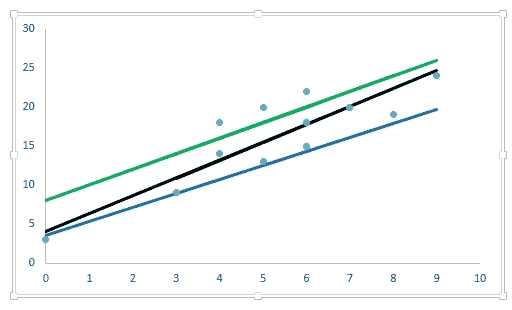
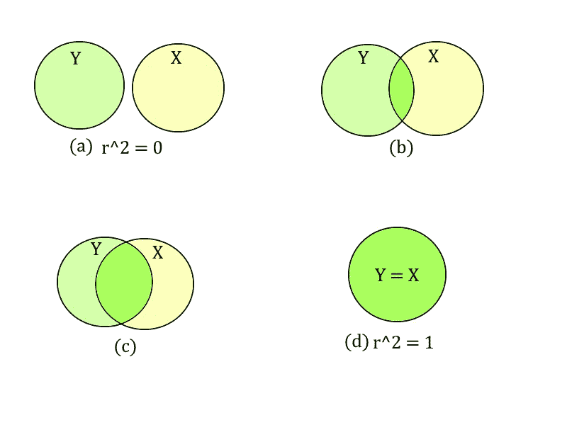
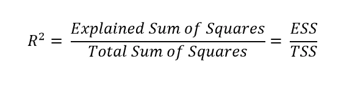
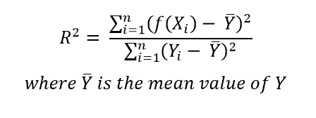
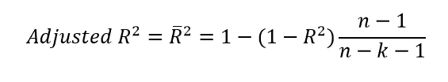
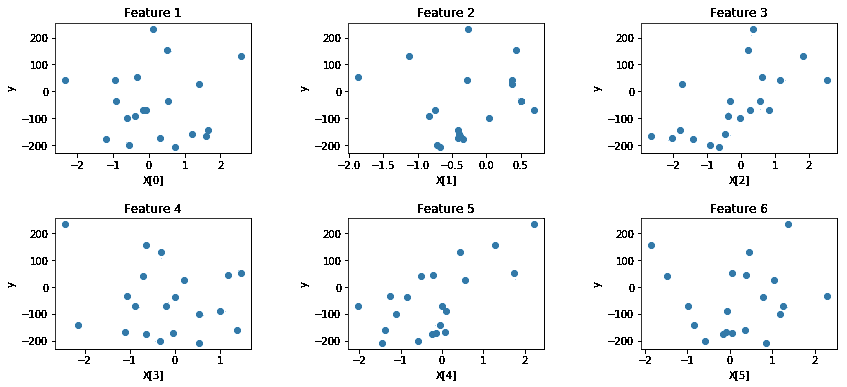
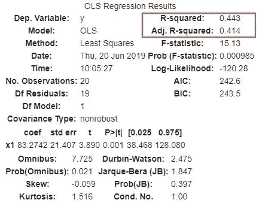
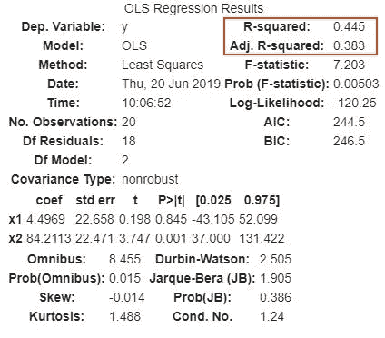
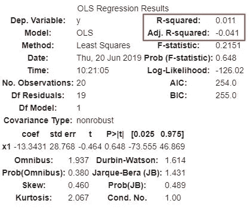
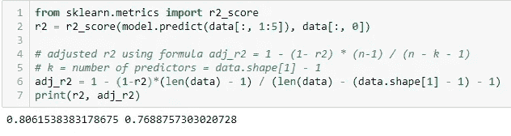

# 测量拟合优度:R 与调整后的 R

> 原文：<https://medium.com/analytics-vidhya/measuring-the-goodness-of-fit-r%C2%B2-versus-adjusted-r%C2%B2-1e8ed0b5784a?source=collection_archive---------0----------------------->

**线性回归**处理因变量和几个解释变量之间的线性关系建模。本质上，我们想要拟合一条穿过空间数据点的线。

但是可以有多条可能的线。因此，为了找到最佳线，需要一个拟合优度的度量，即**决定系数-R .**

*在你继续之前，这里有一份关于回归的 5 篇必读文章的清单*

*   **[*从零开始在 R 学习数据科学的完整教程*](https://www.analyticsvidhya.com/blog/2016/02/complete-tutorial-learn-data-science-scratch/)**
*   **[*5 个可以教你多元回归的问题(用 Python 和 R)*](https://www.analyticsvidhya.com/blog/2015/10/regression-python-beginners/)**
*   **[*你应该知道的 7 种回归技巧！*](https://www.analyticsvidhya.com/blog/2015/08/comprehensive-guide-regression/)**
*   **[*Python 中脊和套索回归完整教程*](https://www.analyticsvidhya.com/blog/2016/01/complete-tutorial-ridge-lasso-regression-python/)**
*   **[*45 题测试一个数据科学家对回归*](https://www.analyticsvidhya.com/blog/2016/12/45-questions-to-test-a-data-scientist-on-regression-skill-test-regression-solution/)**

**您还可以在此查看(并参与)关于此问题的详细讨论，以及其他数据科学专家的回答:**

**[*https://discuse . analyticsvidhya . com/t/difference-between-r-square-and-adjusted-r-square/264/15*](https://discuss.analyticsvidhya.com/t/difference-between-r-square-and-adjusted-r-square/264/15)**

# **决定系数— R**

**考虑下图所示的**简单回归**的情况。**

****

**如古吉拉特语 Damodar N. *基础计量经济学*所述。塔塔麦格劳希尔教育公司，2009 年。**

**圆圈 Y 代表因变量中的**变量**，圆圈 X 代表自变量。**

**圆圈的重叠代表了用 x 的变化来解释 Y 的变化的**程度。****

**系数 *r* 是这种重叠的数值度量，被称为**决定系数**。这成为多元回归情况下的**多元决定系数** *R* 。**

**正式声明，**

> **r 测量回归模型解释的 Y 中总变化的比例。**

**这种变化是根据平均值的误差平方和来衡量的。**

****

**如果我们有 ***n*** 观测值 ***(X_i，Y_i)*** 和 ***f(。)*** 是我们的预测函数，**

****

**以下是关于 R 的一些要点:**

*   **它是一个范围为 ***0 ≤ R ≤ 1*** 的非负量**
*   **R = 0 意味着回归线根本不符合数据。**
*   **R = 1 意味着回归线是完美的拟合。**

## **R 问题——值随着解释变量的数量而增加**

**想想吧。r 是解释方差与总方差的比值。在添加新变量时，解释的方差以及 R ***的值将增加，或者至少不会减少*** 。**

**但是，这个 ***根本不代表*** 有添加变量的模型比没有添加变量的模型好。如果用于比较具有不同数量预测因子的模型，r 可能会产生误导。**

# **调整后 R**

**调整后的 R 是根据预测值的数量调整的 R 的修改版本。它对添加不必要的特征进行惩罚，并允许使用不同数量的预测值对回归模型进行比较。**

****

**这里 ***k*** 是模型中解释变量的个数 ***n*** 是观测值的个数。**

****调整后的 R 值总是小于 R 值。****

> **只有当新项对模型的改善程度超过偶然情况下的预期时，调整后的 R 平方才会增加。当预测者偶然对模型的改进小于预期时，它会减少。**

**此外，请注意，调整后的 R 值可以是负值。**

**获得调整后 R 的负值可能表示以下几项或全部:**

*   **线性模型不太适合数据**
*   **预测器的数量很大**
*   **样本数量很少**

# **Python 中的 R 和调整后的 R**

**首先生成一个随机数据集**

*****X*** 有 6 个特征。这就是因变量 ***y*** 随这些特征变化的方式:**

****

***y 对 X【2】*或 *y 对 X【4】*可能是线性关系。让我们使用 Python 中的 ***statsmodels*** 库，在 ***y*** 和***【X【4】***之间用**普通最小二乘法**拟合一条直线。summary()函数可用于查看 R 和调整后的 R 系数。**

**以下是摘要:**

****

**现在添加另一个解释变量，***【3】***，看看对两个系数的影响。**

****

**有意思！R 值增加，而调整后的 R 值下降。***X【3】***是添加到线性关系中的一个无关紧要的特征。这一点通过分别在 ***Y*** 对***×X***找到 OLS 回归的调整后的 R 得到进一步证实。我们观察到它是负的。**

****

**也可以使用 **sklearn 中 metrics 模块的 ***r2_score*** 函数。**但是，没有这样的函数可以找到调整后的 r2_score。我们需要用它的公式来计算。**

**下面是著名的[***mt cars***](https://www.kaggle.com/ruiromanini/mtcars)数据集的回归分析，没有 sklearn 中的分类变量:**

**我们获得大约 0.81 的 R 分数和大约 0.77 的调整 R 分数**

****

# **结束注释**

**虽然 R 和调整后的 R 都是拟合优度的度量，但线性回归模型不应以最大化这些系数为唯一目标。这最终会诱使我们在模型中引入许多无关紧要的预测因子。因此，我们的模型将是不准确和不可靠的。**