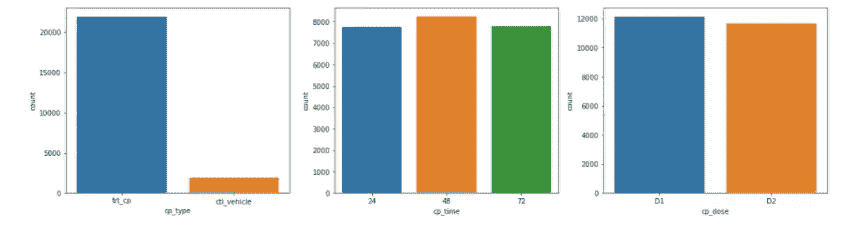
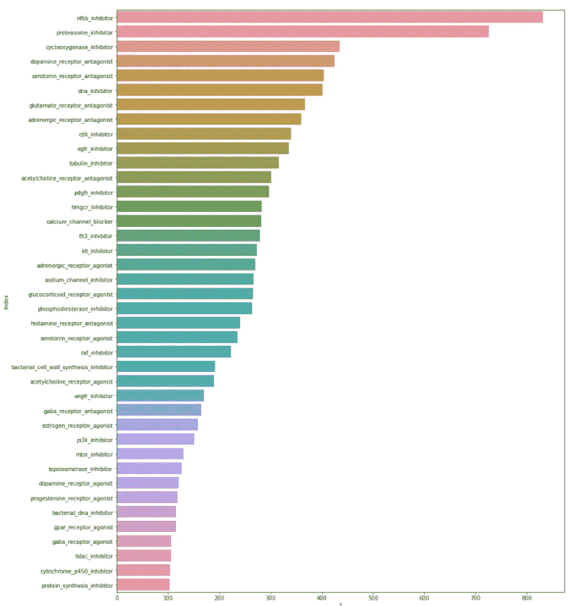
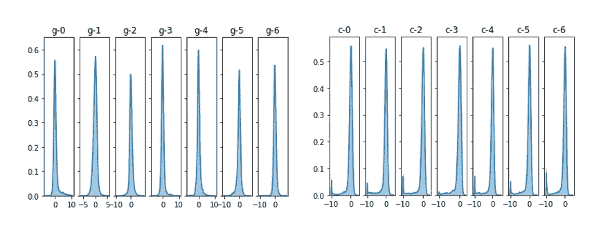
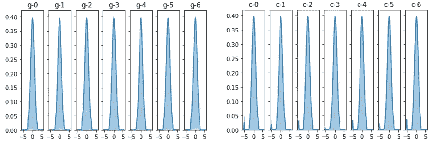
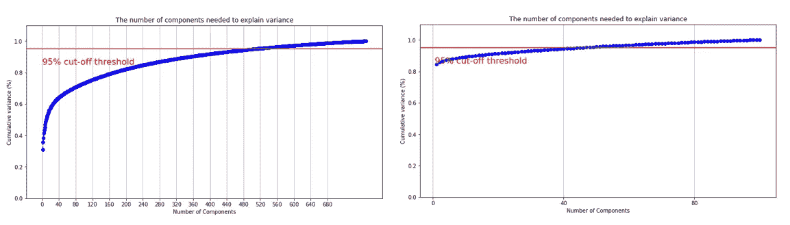

# 作用机制(MoA)-ka ggle 竞争

> 原文：<https://medium.com/analytics-vidhya/mechanism-of-action-moa-the-kaggle-competition-b4be14bdf51e?source=collection_archive---------11----------------------->

马库斯·斯皮斯克在 [Unsplash](https://unsplash.com?utm_source=medium&utm_medium=referral) 上的照片

这是我第二次参加 kaggle 比赛。坦率地说，在这次比赛中我学到了很多东西。许多不同的大师和专家的讨论真的令人兴奋。围绕比赛中不同类型的讨论令人惊叹，例如特征工程、数据扩充、不同建模、迁移学习和最终的 was 堆叠/混合。所以我要谈谈不同的事情(我的经历)，我在这次比赛中学到并运用到的东西帮助我们([Christian](https://www.linkedin.com/in/christian-rohrsen-173919138/)&[Hasan](https://www.linkedin.com/in/md-kamrul-hasan-824a06a4/))获得铜牌(前 8%)——我的第一个:D

因此比赛于 9 月开始，大约有 4373 支队伍参加了比赛。我现在将直接投入工作。

# 探索性数据分析

关于数据的描述，你可以[点击这里](https://www.kaggle.com/c/lish-moa/overview)通读，这样我就不用在这里解释实际的作用机制了。好吧，让我们直接进入细节。我们研究了“cp_time”、“cp_type”、“cp_dose”每个类别中可用的数据点数量。从下图中我们可以很容易地观察到，“ctrl_vehicle”的数量最少。同样从数据集的描述中很明显可以看出，我们可以丢弃所有与" ctrl_vehicle "相关的记录。现在你可能想知道，为什么这个人突然用“ctrl_vehicle”打破记录。如果你错过了这句话(*“带控摄(*`*ctrl_vehicle*`*)；控制扰动没有 MoAs"* )在阅读描述的时候，没问题，我帮你搞定了。

训练数据(基因和细胞)

由于这是一个多分类问题，有一个信息总是需要检查——我们的数据集有多偏斜？为了检查这些信息，我们绘制了相同的图表，你可以看到这些类确实不平衡。

绘制前 40 个类(不能全部完成，因为大约有 200 多个)

另一个我们已经掌握的信息是，基因和细胞数据是完全相互独立的。因此，我们可以将这两种信息分开，然后我们可以尝试绘制出每种信息的分布。我们可以很容易地观察到，数据是倾斜的，有异常值。

训练数据分布(基因和细胞)

# 特征工程

所以现在我们看到我们的数据有很多问题，这就是为什么，它要求我们把它做得非常好，这样我们就可以把数据提供给我们喜欢的模型。让我们记下，我们遇到的这种问题，同时使用某种技术来处理这个问题。

1.  “ctrl_vehicle”没有任何作用机制。

action-删除所有 ctrl_vehicle 相关记录，因为它们将所有类型药物的作用机制设为 0。

2.阶层高度不平衡。

行动——我们需要一种方法来防止这种过度拟合。我们选择了 7 K 倍多分层分裂和不同的种子来处理随机化。

3.数据未标准化，例如未呈正态分布。

行动——我们使用[量化转换器](https://scikit-learn.org/stable/modules/generated/sklearn.preprocessing.QuantileTransformer.html)转换数据，使我们的数据表现正常(点击标题阅读)

分位数转换的数据(现在峰值不那么尖了)

4.添加更多的 PCA 信息总是一个好主意。我们寻找能够捕获最小 95%方差(分别是基因和细胞)的成分的可能数量。我们分别考虑了来自基因和细胞的 600 和 50 种成分。

从基因和细胞中选择成分的数量

5.我们使用的另一个特征选择方法是方差阈值法。这背后想法是丢弃所有低方差特征(因为它包含更少的信息)。

# 系统模型化

现在是准备这些模型管道的时候了，包括数据加载器、训练和推理。你可以看看下面我们的第一个模型，我们尝试过，可以在领导板上取得更好的成绩。我们还在实现中包含了 LabelSmoothing。如果你想了解更多关于 LabelSmoothing 的内容，你可以访问这个[博客](/towards-artificial-intelligence/how-to-use-label-smoothing-for-regularization-aa349f7f1dbb)

1.  Pytorch 模型— CV 损失— 0.01562

我们有 pytorch 模型，具有 3 个密集层和 3 个批次标准化层，这有助于我们的批次保持在中心。然后，我们做了权重归一化，以防止我们的消失/爆炸梯度和泄漏 relu 作为我们的激活函数。辍学有助于防止过度适应。

2.Keras 模型— CV 损失— 0.01569

在这里，我们尝试了具有相似架构类型(但层的排列和组合不同)的多个模型(resnet 和 dnn)，其中我们增加/减少了密集层、BN 层和压差值。我们训练所有这些模型，并取所有损失和预测的平均值。

3.Tabnet— CV 损失— 0.01579

迁移学习是这场竞赛中每个人都尝试的技术之一。事实证明，将这些特征转换成图像格式并应用 efficientnet 是最好的迁移学习技术之一。它使一个队赢得了这场比赛。

之后，我们将所有这些模型叠加在一起，得到了美国公共领导委员会 560+的排名。

比赛结束后，我们得到了 324 的私人 LB 分数(前 8%)，帮助我们在这次比赛中获得铜牌。

我知道这个博客没有代码和片段是不完整的。我建议，试着通过写评论来联系。然后，我将能够与 EDA 和建模部分共享我的笔记本。

如果你喜欢它，那么请鼓掌，分享和评论。