# 媒体和娱乐行业专用 GAN 应用

> 原文：<https://medium.com/analytics-vidhya/media-and-entertainment-sector-specific-gan-applications-d0ce42cd9b92?source=collection_archive---------7----------------------->

媒体和娱乐行业需要大量的智能来满足消费者的愿望。GAN，生成对抗网络是一种特殊的深度学习架构，可以解决最复杂的问题。

甘可以做到以下几点:-

1.  将低质量图像转换为高质量图像(旧电影是低质量的，分辨率为 720p 或更低。消费者会喜欢看高清质量的老电影)
2.  新的报道镜头可以制作成高清视频
3.  将黑白电影转换为彩色电影
4.  将草图转化为绘画
5.  将旧黑白照片转换成彩色照片
6.  没有为创造老年名人的服装设计
7.  人们可以尝试他们最喜欢的名人的化妆
8.  将评论转换成社交媒体上的图片

# 斯尔甘

尽管我们使用深度学习中的各种方法在图像的超分辨率中获得了相当高的精度，但我们无法在超分辨率中获得非常精细的纹理细节。SRGAN 非常强大，可以制作细节非常精细的超分辨率。即使采用 4 倍的放大系数，它也能够实现巨大的输出。

这是低质量的图像:

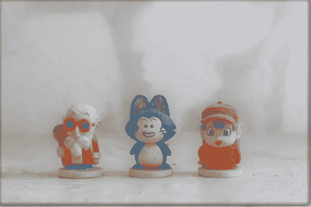

图 2.37:SRGAN 的低质量输入

如果应用 SRGAN，可以得到高质量的图像(超分辨率)。这是 SRGAN 的产量，也是我们工业需要的。

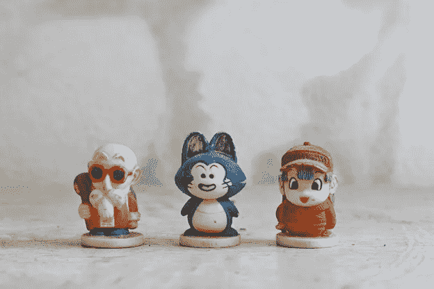

图 2.38:SRGAN 的高质量输出

SRGAN 可用于:

为媒体制作所有品牌图像的超分辨率

对普通相机或手机拍摄的图像进行超分辨率处理

从低质量电影制作高质量高清电影

为新闻报道制作高质量的镜头

将旧的低分辨率图像转换成高分辨率图像

向客户展示高清内容

制作经典电影的新版本/高分辨率版本

> SRGAN 如何工作:它由一个感知损失函数控制，该函数由对抗性损失和内容损失组成。对抗性损失集中在像素空间相似性上，使用鉴别器网络将我们的解决方案推向自然图像流形，所述鉴别器网络被训练来区分超分辨率图像和原始照片真实感图像。另一方面，我们可以使用由感知相似性激发的内容损失。这里，深度残差网络能够从严重欠采样的图像中恢复照片级的纹理。

下图显示了 SRGAN 的架构:

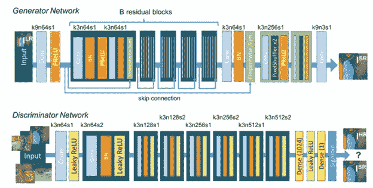

图 2.39: SRGAN 架构

SRGAN 的结果如下图所示:

# **解除锁定**

它旨在将旧的黑白电影转换成彩色电影

我们都看过黑白电影。想象一下，一个天使来到你面前，你要求把你的旧电影拍成彩色电影。假设你看一部关于第二次世界大战的纪录片，你希望看到彩色版本，这几乎是不可能的。

接下来是 DeOldify GAN 模型，它将灰度图像/视频转换为彩色图像/视频。

**输入:**

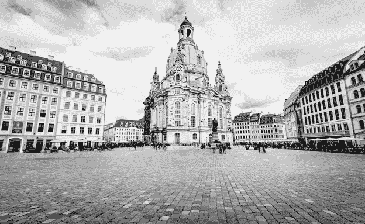

图 2.41:DeOldifyGAN 的黑白输入

**输出:**

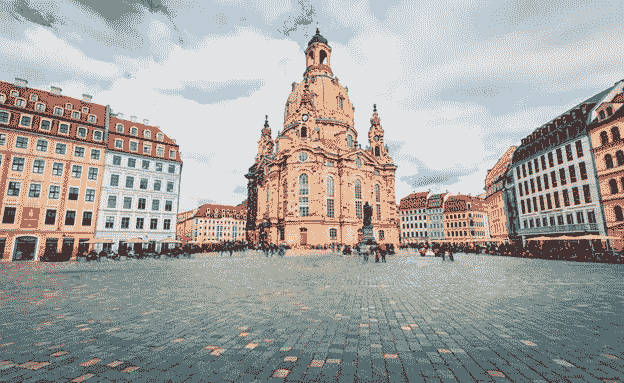

图 2.42:deodifygan 的彩色输出

GAN 有两个深度学习模型:

发电机

鉴别器

> 这个 GAN 的发生器是一个 [U 网](https://arxiv.org/pdf/1505.04597.pdf)。U-Net 基本上分为两部分:
> 
> 1.进行视觉识别的人。
> 
> 2.另一个基于视觉识别特征输出图像。
> 
> 在这种情况下，U-Net 是在 ImageNet 上预先训练的 Resnet34。它的前半部分旨在通过预先训练的模型获得特征。该生成器的另一半旨在基于图像中的对象分配相关颜色，由特征提取驱动。因此，它为灰度图像创建彩色图像。在初始迭代中，生成器的输出可能不大。鉴别者/批评者的角色来了，他们发现损失并帮助结果改进过程。

这种氮化镓可以用于

1.为媒体和电影制作灰度图像的彩色图像

2.为旧灰度图像制作彩色图像

3.从黑白电影制作彩色高清电影

4.为旧新闻报道制作彩色镜头

5.制作新版/彩色版《史记》

为了做得更好，我们在鉴别器和发生器以及光谱归一化中都添加了新的**注意力**层。我们可以用他们的铰链损耗和不同的学习率来对比评论家和发电机。但这真的让训练稳定了很多。此外，在色彩的一致性和总体质量方面，注意力层确实产生了很大的差异。

自关注 GAN 架构和结果分别在*图 2.43* 和*图 2.44、*中说明:

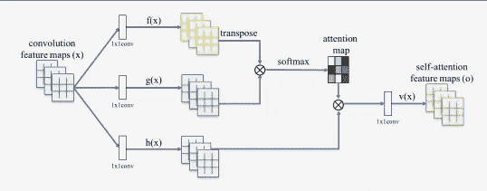

图 2.43:自我关注的甘

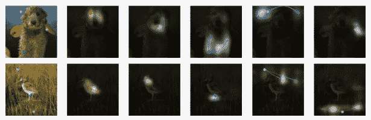

图 2.44:自我关注 GAN 的结果

堆栈根

你能想象一个天使，如果你告诉他什么，他能生成一个图像吗？

请开始想象它，因为它现在正在发生，由于 StackGAN。**如果我们给出一个文本作为输入，堆叠生成对抗网络** ( **StackGAN** )用于生成 256×256 的照片级逼真图像。

**输入**:一个文本

一只黑白相间的狗坐在一个男孩旁边

**输出**:一幅图像

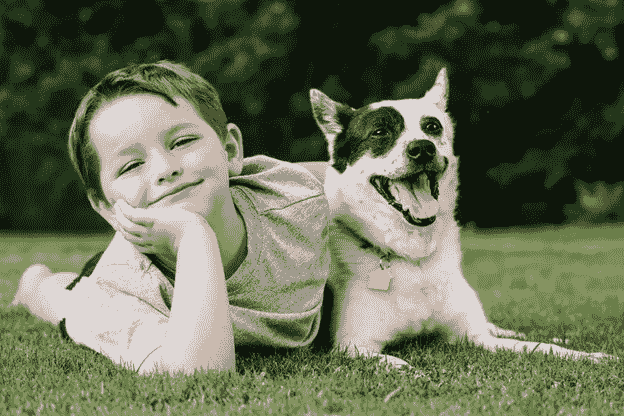

图 2.45:stack gan 的输出图像

StackGAN 可用于:

1.将评论转换成社交媒体上的图片

2.将事实转化为有意义的图像

3.通过添加相关图像使文档更加精彩

4.根据小说制作一个很棒的图像和视频

5.让电子邮件交流更加令人兴奋

6.通过添加照片使新闻报道非常精彩

它通过草图改进过程将难题分解成子问题。它分两个阶段工作:

1.**Stage-I GAN**的目的是根据给定的文本描述获取物体的原始形状和颜色，并输出低分辨率图像。第二阶段 GAN 旨在通过使用低分辨率图像和文本描述作为输入，生成具有照片般逼真细节的高分辨率图像。

2.**第二阶段 GAN** 旨在处理第一阶段结果中的缺陷，并添加更精细的细节，因此第二阶段可视为细化阶段。为了提高输出的质量，我们引入了一种新的条件增强技术，它促进了潜在条件流形的平滑。

stackGAN 的架构如下:

图 2.46:DeOldifyGAN 的黑白输入

stackGAN 的输出如下:

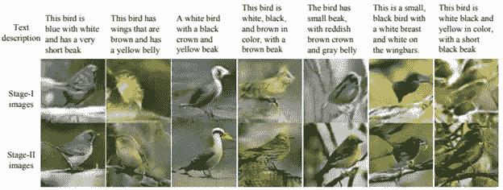

图 2.47:堆栈 GAN 的输出

2.6.3 面部老化-年龄-cGAN

许多社交媒体公司和娱乐公司想看看名人或任何人在非常老的时候会是什么样子。社交媒体可以提供许多关于年龄变化的应用程序，这款 GAN 在这方面很有用:

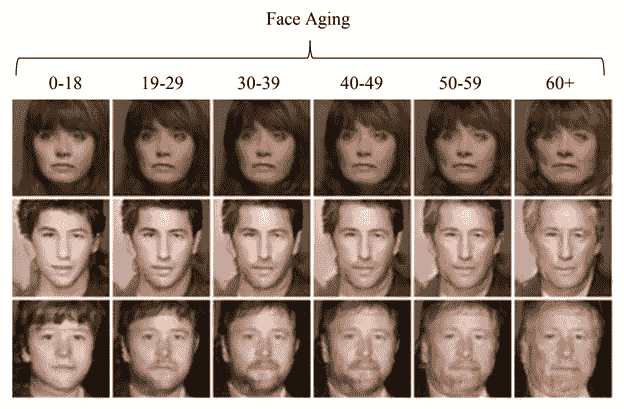

图 2.48:Age-cGAN 的输出

它可用于:

为每个人提供在不同年龄段获得新形象的能力

如果需要，修改电影

为演员制作一部没有服装变化的电影

GAN 架构如下所示:

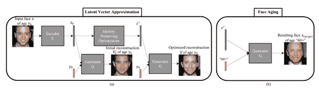

图 2.49:Age-cGAN 的架构

**2.6.4 BeautyGAN:面部化妆转移**

人们希望化妆成不同的名人。这种 GAN 可以用来将化妆品从想要的化妆风格转移到你的脸上。

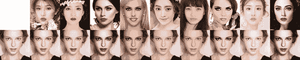

下面是 BeautyGAN 如何工作的粗略想法，它旨在将化妆风格从给定的参考化妆人脸图像转移和翻译到另一个非化妆人脸图像，同时保留人脸身份。提取和传送这种局部的和精致的化妆信息是通过这些现有的风格传送方法来完成的。

以上文章摘自本书: [**甘用工业用例**](https://www.amazon.in/Generative-Adversarial-Networks-Industrial-Cases/dp/9389423856/ref=sr_1_2?keywords=navin+manaswi&qid=1583916025&sr=8-2)

[**【GAN 用工业用例(美国市场)**](https://www.amazon.com/Generative-Adversarial-Networks-Industrial-Cases/dp/9389423856/ref=sr_1_2?keywords=navin+manaswi&qid=1583916025&sr=8-2)

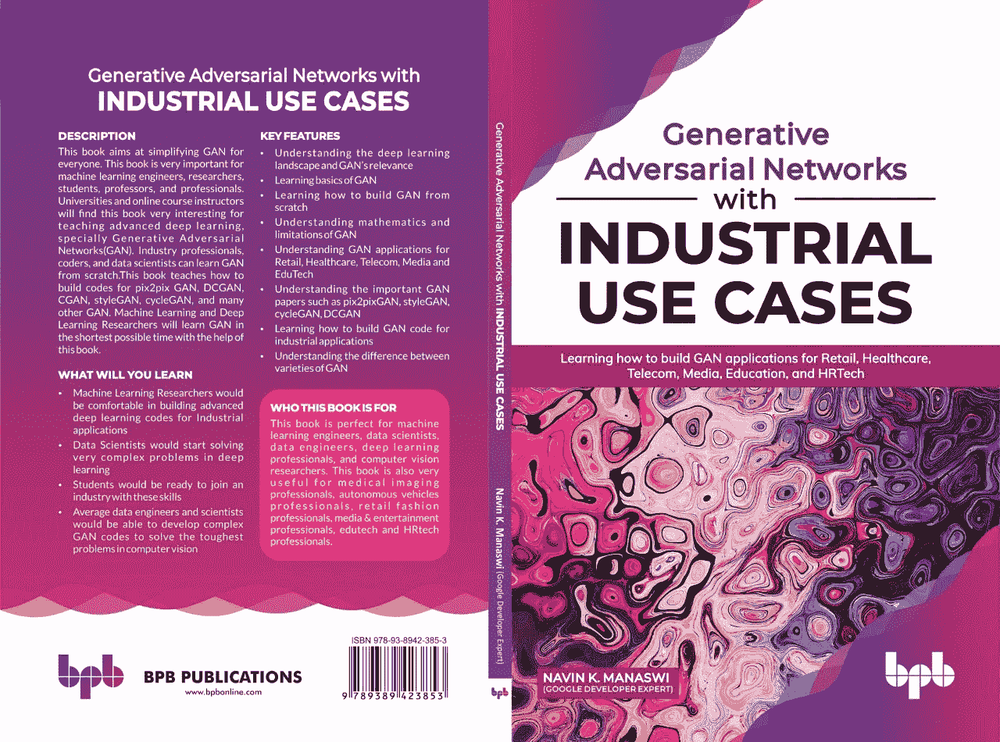

请随时分享您的反馈

—纳文·马纳维

人工智能书籍的作者和人工智能传播者