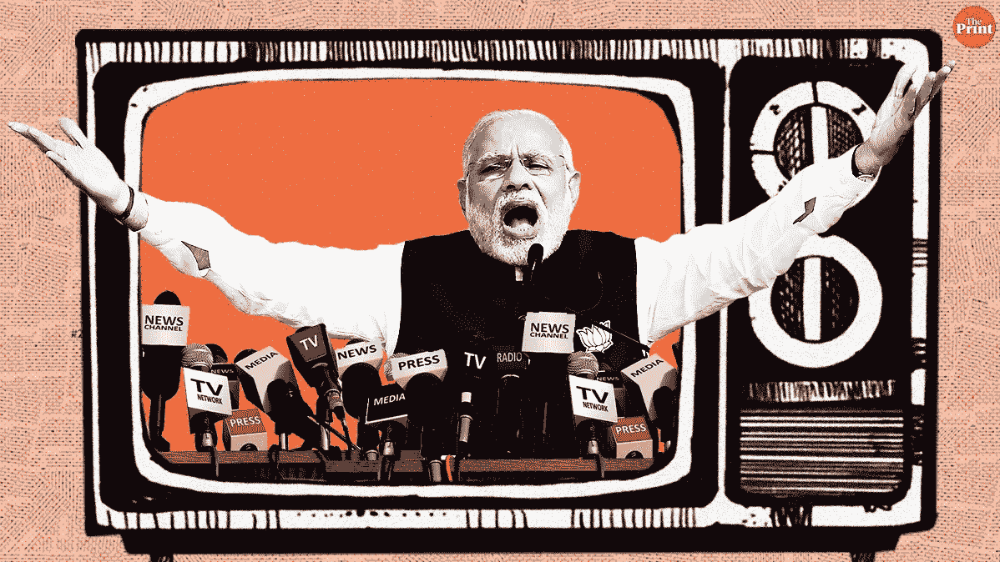
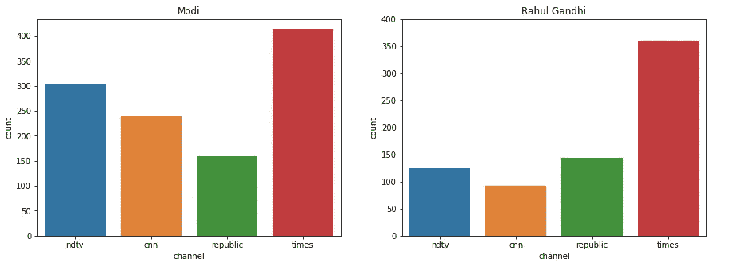

# 使用情感分析的 Twitter 上的媒体偏见[BERT]

> 原文：<https://medium.com/analytics-vidhya/media-bias-on-twitter-using-sentiment-analysis-bert-6a68edbd4eea?source=collection_archive---------15----------------------->

**目录**

*   数据准备
*   模型
*   培养
*   情感预测
*   媒体偏见分析

**媒体偏见**是大众**媒体**中的记者和**新闻**制作人在选择报道的许多事件和故事以及如何报道时的**偏见**或感知**偏见**。

在这篇文章中，我已经展示了印度的一些顶级新闻频道是如何偏向任何特定的政党或个人的。

这个项目的 Jupyter 笔记本可以在这里[找到。](https://github.com/sourabhdharpure/Media-Bias-on-Twitter-using-Sentiment-Analysis-BERT-)

数据收集自以下印度英语新闻频道的官方推特账户

*   CNN 新闻-18
*   NDTV
*   共和国电视台
*   时代现在

预训练的 Bert 基本无案例模型用于情感分析。由此可见于[**抱紧脸**](https://huggingface.co/bert-base-uncased) 库。然后，该模型被用于预测废弃推文的情绪。

# **数据准备**

我们将在 Kaggle 上可用的 [**Tweet 情感数据集**](https://www.kaggle.com/c/tweet-sentiment-extraction) 上训练我们的 BERT 分类器进行情感预测。

train.csv 包含以下列-

*   `textID` -每段文本的唯一 ID
*   `text` -推文的文本
*   `sentiment`——推特的普遍情绪
*   `selected_text`-[仅训练]支持推文观点的文本

数据集包含 selected_text 和情感，但我们将仅使用情感列和文本列进行训练。

将情感值转换为整数:-

*   中性— 1
*   正-2
*   负-0

## 创建数据集

现在我们必须根据 BERT 要求的格式来格式化我们的文本

*   增加了特殊的 SEP 和 CLS 代币。
*   将每个句子截断并填充到固定长度。
*   添加了注意力屏蔽。

这可以使用 BERT 记号赋予器来完成。我们将使用 dataloader 类遍历数据集，这样就不需要将整个数据加载到内存中。

拆分训练和测试数据

# 模型

我们将只使用汇集的输出进行情感分析，忽略序列输出。这里使用的是不区分大小写的 bert，它只有小写字母，是 BERT 的两个版本中较小的一个。

# 培养

在 [BERT 论文](https://arxiv.org/pdf/1810.04805.pdf)中，作者建议从以下参数值中选择

*   **批量:** 16，32
*   **学习率(亚当):** 5e-5，3e-5，2e-5
*   **历元数:** 2，3，4

我们将使用

*   批量大小:16(在创建我们的数据加载器时设置)
*   学习率:2e-5
*   时代:3

# 情感预测

我使用了[Twitter scraper](https://dev.to/natterstefan/scrape-tweets-from-twitter-profiles-without-using-twitter-s-api-47n7)来抓取每个频道最新的 5000 条推文。

**数据描述**

*   频道—新闻频道的名称
*   推文—推文的文本。
*   莫迪—推文是否包含关键字“莫迪”
*   拉胡尔·甘地——推特是否包含关键词“拉胡尔·甘地”
*   BJP——推特是否包含关键词“BJP”
*   国会——推文是否包含关键词“国会”
*   阿米特·沙阿——推特是否包含关键词“阿米特·沙阿”
*   Arvind Kejriwal — Tweet 是否包含关键字“Arvind Kejriwal”

# 媒体偏见分析

总共有 20，000 条推文涵盖了所选择的主题。让我们看看这些主题在每个渠道中的总体覆盖程度。

相关推文数量:3408 推文总数:20000 相关推文百分比:17.04%

## 相对主题覆盖范围

它显示了每个主题对每个频道的重要性，我们将绘制每个频道每个主题的 tweets 计数。

*   调查显示，除了《泰晤士报》新闻频道，其他三个频道谈论纳伦德拉·莫迪比谈论拉胡尔·甘地更多。

*   从上面的图表可以看出，泰晤士报现在是关于 BJP(和莫迪)的推文最多的频道
*   对于国大党，分布在所有频道中几乎相等，CNN 拥有最多关于国大党的推文。

*   它表明 NDTV 经常谈论 BJP 的政治领导人，而 Arwind Kejriwal 在所有四个频道上都很少有推文。

## 对主题的感悟

我们将通过绘制正面推文和负面推文占总推文的百分比来显示新闻频道对我们话题的看法。

## **正面推文百分比**

**莫迪 vs 拉胡尔·甘地**

*   调查显示，所有四个新闻频道对纳伦德拉·莫迪的评价都比拉胡尔·甘地更积极
*   NDTV 的最大正面推文比例为 28.38%。
*   拉胡尔·甘地在所有四个频道都很少有正面的推文。
*   拉胡尔·甘地的综合正面百分比(5.43 + 8.8 + 6.25 + 6.66)低于国家电视台对纳伦德拉·莫迪的综合正面百分比(28.38 %)。

**BJP vs 国会**

*   可以看出，新闻频道对任何特定领导人比对一个政党更感兴趣，因为对 BJP 和国会来说，正面推文的百分比都更低。
*   共和电视台有更多关于 BJP 党的正面推文。

## 负面推文百分比

**莫迪 vs 拉胡尔·甘地**

*   从上图中我们可以清楚地看到，所有的新闻频道都非常负面地谈论拉胡尔·甘地。
*   但对纳伦德拉·莫迪来说，情况并非如此，只有共和电视台的支持率明显为负，其余都低于 20%。

**BJP vs 国会**

*   BJP 在所有渠道的负面推文比例也非常低。
*   国会在这些频道中不是很受欢迎，因为每个频道都有大约 25%的负面推文，这比 BJP 低得多。
*   我们还可以看到，对于 BJP 来说，大多数推文都是中性的(因为正面和负面的数量都很低)。

**参考文献**

*   [使用 PyTorch 的 BERT 微调教程](https://mccormickml.com/2019/07/22/BERT-fine-tuning/)
*   [抱脸变形金刚](https://huggingface.co/transformers/)
*   [文本分类 BERT 使用 huggingface 进行情感分析](https://www.youtube.com/watch?time_continue=2055&v=8N-nM3QW7O0&feature=emb_title)
*   [如何微调 BERT 进行文本分类？](https://arxiv.org/pdf/1905.05583.pdf)