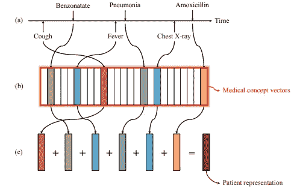

# 医学概念载体-医疗保健应用的发展

> 原文：<https://medium.com/analytics-vidhya/medical-concepts-vectors-evolution-in-health-care-applications-a4f408d4cdad?source=collection_archive---------1----------------------->


大家好！

*最近我正在做一个项目，使用纵向时态 EMR(电子病历)数据集预测慢性肾脏疾病。但是我们的数据集的问题是，它不是根据我们的问题陈述的群组临时对齐的。所以我开始研究如何控制纵向 EHR 数据，并用递归神经网络进行预测。我得到的真是太棒了。激动的继续阅读！*

> **什么是嵌入？**

在探索医学概念向量之前，理解*嵌入是很重要的。* ***嵌入*** *基本上是从离散对象，比如单词，到实数向量的映射。*例如，英语单词的 300 维嵌入可以包括:

```
Cat:  (0.01359, 0.00075997, 0.24608, ..., -0.2524, 1.0048, 0.06259)
Cats:  (0.01396, 0.11887, -0.48963, ..., 0.033483, -0.10007, 0.1158)
Car:  (-0.24776, -0.12359, 0.20986, ..., 0.079717, 0.23865, -0.014213)
Cars:  (-0.35609, 0.21854, 0.080944, ..., -0.35413, 0.38511, -0.070976
```

当谈到神经网络中的嵌入时。嵌入是*低维、* *学习到的*离散变量的连续向量表示。神经网络嵌入是有用的，因为它们可以*减少分类变量的维度*并且*有意义地表示变换空间中的*类别。此外，它们还用于捕捉两个向量或词之间的潜在关系。

神经网络中嵌入的主要目的是:

*   用作机器学习模型的输入，以便获得比传统输入数据更好的预测。
*   为了可视化不同类别之间的关系
*   基于用户兴趣进行推荐，寻找 n 维嵌入空间的最近邻。

***希望你对嵌入有所了解！***

> **医学概念向量**

*建立医学概念向量或 MCV 的主要目的是改进作为输入的一个热编码向量。简单来说，MCV 强加的最著名的自然语言处理技术被称为 Skip-gram* 。跳格模型用于从目标单词预测上下文。该模型通常颠倒上下文和目标，并试图从其目标单词预测每个上下文单词。因此，在医学概念向量中，我们使用跳格技术来训练诊断、药物和程序代码的向量表示。*诊断、用药和程序代码的组合统称为医疗代码或概念。*



来源:[https://arxiv.org/pdf/1602.03686.pdf](https://arxiv.org/pdf/1602.03686.pdf)

通过 Skip-gram 学习的 MCV 表示将显示相似的属性，使得向量将支持临床上适当的向量相加。一个病人的高效表示将简单到将他病史中的所有医学概念如医学编码转换成医学概念向量，然后将所有这些向量相加得到一个表示向量，如上图中的*所示。上述架构清楚地解释了:*

( *a)* 在某个滑动窗口捕获的特定患者电子病历数据。

*(b)* 医学概念通过训练，用向量来表示。

*(c)* 患者通过对其所有医学概念向量求和，表示为一个向量。

> **MCV 的目的**

那么我们为什么需要医学概念呢？这里有几点-

*   医学概念向量旨在捕捉不同医学代码之间的隐藏关系。
*   MCV 做的最有趣的事情是减少一个热编码向量的稀疏性。基本上，随着新患者被添加到具有新医疗代码的训练数据中，一个热编码向量增加了维度。*为了克服一个热点编码数据产生的维数和稀疏性问题，医学概念向量应运而生。*
*   许多研究人员用 MCV 和深度学习模型进行了几次实验，发现两者(MCV 和 RNN)的结合比传统的 OHE 方法给出了更好的结果。

> **MCV 背后的数学**

正如《医学概念向量》的作者所提到的，MCV 的目标是*最大化在某个时间窗口捕获的每个代码的对数概率。*通过在代码序列上滑动固定大小的窗口来训练医学概念向量，最大化对数概率。


来源:[https://academic.oup.com/jamia/article/24/2/361/2631499](https://academic.oup.com/jamia/article/24/2/361/2631499)

害怕数学让我们来分解一下！

说说上面的数学表达式， *T* 表示所有患者就诊的医疗编码总数，**w**为窗口大小， ***ct*** 为位置 **t** 的编码， **v** ( *ct* )为编码 ***ct*** 的向量。因此，我们将 ***p*** *的值代入*跳跃图，该跳跃图试图最大化时间对齐向量的向量表示的内积。

> **医学概念向量的应用**

由于 MCV 氏症是最近才推出的，所以仍有许多研究在进行中，以实现其他传统的深度神经架构。正如我想出的以下几点*MCV 的可以使用，它也优于其他算法*

*   由于 MCV 是时间对齐的向量，因此它可以与不同用例的时间 EMR 数据一起使用，例如心力衰竭的早期检测、慢性肾病的预测等。
*   MCV 的主要实现之一是生成嵌入/向量*，这些向量使用纵向 EHR 数据和跳格图来学习医疗概念的低维表示，如诊断代码、药物治疗代码和程序代码，并学习医疗概念的表示*。此外，这些向量可以直接用于训练 RNN 氏症。
*   医疗概念向量，我们可以利用一些健康应用程序，这些应用程序可以根据患者在一次医院就诊中的医疗代码总数来预测特定的患者代码。
*   此外，医学概念向量被用于对医学数据进行编码，显示出总体上改善了深度学习和传统模型的性能，并且因此可以在需要以简洁的方式表示丰富信息的众多卫生保健应用中具有实用性。

> 所以这都是关于医学概念向量！

> **资源**

*   [*从电子健康档案中学习医学概念表征及其在心力衰竭预测中的应用*](https://arxiv.org/pdf/1602.03686.pdf)
*   [*利用递归神经网络模型进行心力衰竭发病的早期检测*](https://academic.oup.com/jamia/article/24/2/361/2631499)
*   [嵌入张量流指南](https://www.tensorflow.org/guide/embedding)
*   [谷歌制作的嵌入式教程](https://developers.google.com/machine-learning/crash-course/embeddings/video-lecture)

如果你喜欢这个帖子，请关注我，因为我会发布一些关于机器学习和深度学习的可怕话题。

*还有，看看这个关于* [*用 PyTorch*](/@datasciencehub/gentle-introduction-to-linear-regression-in-pytorch-cd6434c98d4d) *进行线性回归的超棒帖子！*

*干杯！*