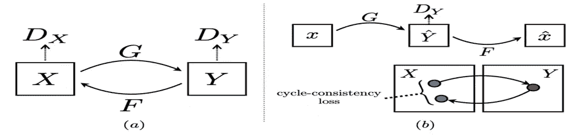

# 使用 CycleGAN 的医学图像合成(MRI T1w 到 T2w)

> 原文：<https://medium.com/analytics-vidhya/medical-image-synthesis-using-cyclegan-mri-t1w-to-t2w-bd5078bfb8c9?source=collection_archive---------5----------------------->

# **概要**

*   **为什么需要医学图像合成？**
*   **选择这种模式，为什么？**
*   **简介——甘**
*   **CycleGAN**
*   **CycleGAN 架构示例**
*   **使用 CycleGAN 在 MRI 中转换 T1 和 T2**
*   **结果**
*   **评估**
*   **各种损耗输出**
*   **与现有方法的比较**
*   **结论**
*   **参考文献**

## 为什么需要医学图像合成？

1.  昂贵的
2.  耗费时间的
3.  隐私问题
4.  有效性
5.  无辐射治疗
6.  图像到图像翻译
7.  更好的研究
8.  经济待遇
9.  探索新的可能性

MRI 到 CT 合成

## 选择的型号和原因？

## CycleGAN

1.  在高分辨率合成真实图像方面脱颖而出。
2.  适用于不成对的数据，最适合医学图像。
3.  无人监督的
4.  相互转换的同步训练。

cycleGAN 的使用示例

# **甘是什么？**

代表生成性对抗网络

**生成式:**学习生成式模型，它以概率模型的形式描述了数据是如何生成的。

**对抗性:**模特的训练是在对抗性的环境中进行的。

**网络:**使用深度神经网络作为用于训练目的的人工智能(AI)算法。

在 GANs 中有一个**发生器**和一个**鉴别器**。

生成器生成虚假的数据样本(无论是图像、音频等。)并试图愚弄鉴别者。

另一方面，鉴别器试图区分真假样品。**发生器**和**鉴别器**都是**神经网络**，它们都在训练阶段竞争运行。

生成器被更新以更好地欺骗鉴别器。

鉴别器被更新以更好地检测生成的图像。

发电机和鉴别器工作

## **cycle GAN:**GAN 架构的扩展，包括同时训练**两个发生器**模型和**两个鉴别器**模型。

一个生成器将来自第一域的图像作为输入，并输出第二域的图像。

另一个生成器将来自第二域的图像作为输入，并为第一域生成图像。

像合成函数一样的发生器的工作(用第二个发生器将结果导向恒等函数)

现在，英语和英语“必须是相同的，法语和法语也是如此”。

# **CycleGAN 架构示例**

*   将图像从夏天翻译成冬天，从冬天翻译成夏天
*   两套摄影集
*   它们没有配对，这意味着它们是不同时间不同地点的照片

我们在冬天和夏天没有完全相同的场景

*   **作品集 1** :夏日风景照。
    **系列二**:冬季风景照。
    **甘 1** :将夏天(集合 1)的照片翻译成冬天(集合 2)。
    **甘 2** :把冬天(集合 2)的照片翻译成夏天(集合 1)。
    **发电机型号 1:** **输入**:拍摄夏天的照片(集合 1)。
    **输出**:生成冬天的照片(集合 2)。
    **鉴别器型号 1**:
    **输入**:采集 2 号采集的冬季照片，发电机型号 1 输出。
    **输出**:图像的可能性来自集合 2。

**发电机型号 2**:
**输入**:拍摄冬天的照片(集合 2)。
**输出**:生成夏天的照片(集合 1)。
**鉴别器模型 2**:
**输入**:从集合 1 拍摄夏天的照片，从发电机模型 2 输出。

**输出**:图像的可能性来自集合 1
每个 gan 也使用**循环一致性损失**进行更新

## 循环一致性损失将输入照片与循环 GAN 和生成的照片进行比较，并计算两者之间的差异。

循环一致性损失

*   **正向循环一致性损失** :
    将夏天的照片(采集 1)输入到 GAN 1
    将冬天的照片从 GAN 1 输出
    将冬天的照片从 GAN 1 输入到 GAN 2
    将夏天的照片从 GAN 2 输出
    *对比夏天的照片(采集 1) 从 GAN 2
    到夏季照片***反向循环一致性损失** :
    将冬季照片(采集 2)输入到 GAN 2
    从 GAN 2
    输出夏季照片从 GAN 2 输入到 GAN 1
    从 GAN 1
    *输出冬季照片将冬季照片(采集 2)与 GAN 1* 的冬季照片进行比较

循环一致性损失

最常见的 MRI 序列是 **T1 加权**和 **T2 加权**扫描。

CSF ( **)脑脊液**在 T1 加权像上呈暗色，在 T2 加权像上呈亮色。

**集合 1**:T1 加权图像

**集合 2**:T2 加权图像

**不成对的图像**

**图**示出了训练中当前时刻的示例图像翻译。这里，我们在 **60 个时期**后附加**最终图像**。

最终图像(中间一个显示过渡)

纪元 1 结果

第 20 纪元结果

纪元 40 结果

纪元 60 结果

最终的图像以一种高度刚毅的合成图像出现

# **评估**

**使用的数据集:**训练超过 3 个数据集

1.IXI 数据集

2.BRATS

3.绿洲大脑数据集

所有图像都已被注册到**一个公共模板脑**中，以具有**相同的位置和相同的尺寸**。

使用来自分割大脑的轴向图像(仅**切片 120)** 。

收藏图片:T1 的 80 张和 T2 的 80 张

英伟达 12 GB 特斯拉 K80 GPU ( **谷歌 Colab**

**cycle gan 的训练时间**为 419 秒/历元
该模型平均使用 **60 个历元**进行训练。

CycleGAN 每幅图像的合成图像生成时间**为 0.0176 毫秒**

# **损失输出**

# **与现有方法的比较**

# **结论**

在所有定量测量中表现最差的**型号是**简单型号**。**

**性能最好的**型号是 **CycleGAN、CycleGAN_s** ，它们的性能相似。

但是 **CycleGAN_s** 需要**配对数据集**和 **CycleGAN** 在没有配对的情况下工作**，因此最适合医学图像合成。**

# **链接**

**IXI 数据集**

http://brain-development.org/ixi-dataset/

**请求 LDCT 数据集的链接**

[https://www.aapm.org/GrandChallenge/LowDoseCT/](https://www.aapm.org/GrandChallenge/LowDoseCT/)

**请求 BRATS 数据集的链接**

[https://www.med.upenn.edu/sbia/brats2018/data.html](https://www.med.upenn.edu/sbia/brats2018/data.html)

**我的 GitHub 代码链接(65 次以上提交)**

 [## 悉达多 24795/医学图像合成

### 它描述了使用生成对抗网络(GAN)的 MRI 到 CT 的转换、3T 到 7T 的转换。由于多重…

github.com](https://github.com/Siddhartha24795/Medical-Image-Synthesis) 

# **参考文献**

[1] *李东旭，金俊英，文渊元，郑哲烨*；IEEE 计算机视觉和模式识别会议(CVPR)，2019 年，第 2487–2496 页

[2]赵、马蒂厄和勒村。基于能量的生成对抗网络。2017 年在 ICLR。
[3]沙特亚斯、阿吉西劳斯、托马斯·乔伊斯、马里奥·瓦莱里奥·朱夫里达和索蒂里奥斯·萨夫塔里斯。"通过模态不变的潜在表征的多模态磁共振合成."IEEE 医学成像汇刊 37，第 3 期(2017):803–814。
[4] M.-Y. Liu，T. Breuel，J. Kautz，“无监督的图像到图像翻译网络”，ArXiv:1703.00848，2017 年 3 月。
【5】y . Choi，M. Choi，M. Kim，J.-W. Ha，S. Kim，J. Choo，“StarGAN:用于多域图像到图像翻译的统一生成对抗网络”，ArXiv:1711.09020，2017 年 11 月。
[6]李志毅，张，谭，龚，“DualGAN:图像到图像翻译的无监督对偶学习”，ArXiv:1704.02510，2017 年 4 月。

[7] A. Krizhevsky 等人，“使用深度卷积神经网络的图像网络分类”，在 Proc .神经信息。过程。系统。，2012 年，第 1097–1105 页

[8] Y. LeCun 等人，“深度学习”，《自然》，第 521 卷，第 7553 期，第 436–444 页，2015 年。
[9] K. He 等，“用于图像识别的深度残差学习”，在 Proc .IEEE 会议。计算机。Vis。模式识别。，2016，第 770–778 页
[10] J. Kim 等人，“用于图像超分辨率的深度递归卷积网络”，在 Proc。IEEE 会议。计算机。Vis。模式识别。，2016，PP . 1637–1645
[11]r . Li 等人，“基于深度学习的影像数据补全用于改善脑部疾病诊断”，在 Proc。里面的糖膏剂医学。图像计算。计算机。-辅助干预，Springer，2014 年，第 305–312 页。

[12] Y. Huang、L. Shao 和 A. Frangi，“使用弱监督联合卷积稀疏编码的 3d 医学图像的同时超分辨率和跨模态合成”，IEEE Conf .计算机。视觉与模式识别(CVPR)，美国檀香山，2017。
[13] C. Ledig 等人，“使用生成式对抗网络的照片级单幅图像超分辨率”，IEEE Conf .计算机视觉和模式识别(CVPR)，美国火奴鲁鲁，2017
[14] J.-Y. Zhu，T. Park，P. Isola 和 A. A. Efros，“使用 CycleConsistent 对抗性网络的不成对图像到图像翻译”，ArXiv:1703.10593，2017 年 3 月

[15]极客之福

[16]谷歌图片