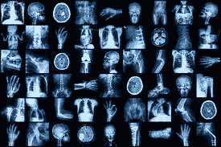
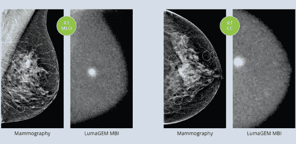
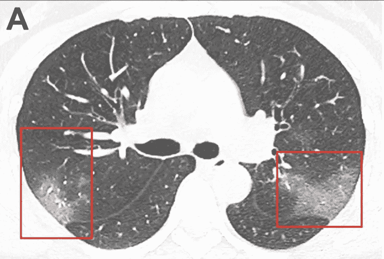

# 医学成像和人工智能

> 原文：<https://medium.com/analytics-vidhya/medical-imaging-and-artificial-intelligence-a230a15c6834?source=collection_archive---------19----------------------->

# 定义:

人工智能:人工智能是计算机科学的一个分支，强调让机器像人一样行动，并让它变得聪明。数据科学、机器学习、深度学习、计算机视觉、自然语言处理等领域是人工智能的子集。

**:医学影像:**医学影像是指为了诊断、医疗状况或监测某一部位而对人体进行观察的各种技术。不同类型的医学成像有 CT 扫描、X 射线、MRI 等。

医学成像在医院中诊断和监测不同类型的危重疾病中一直是至关重要的。医学成像是生成各种身体部位和组织的图像。例如，如果一个人被诊断出肺部有问题，X 射线被用来监测肺部，这将给出肺部可能受到影响的部分。如果图像不够清晰，无法得出任何结论，可以使用 CT 扫描来更好地观察肺部部分。每年，医院都会产生大量的图像数据。这些图像可用于实现深度卷积神经网络，这有助于在图像中找到不同的模式。人工智能将有助于分析这些图像，它将进一步帮助诊断，并为医生做出挽救生命的决定提供工具。

不同的医学影像。图片来源:谷歌

# 基于人工智能的医学成像如何帮助做出拯救生命的决定？

基于人工智能的医学成像依赖于不同医院产生的图像。这些图像用于训练不同的算法以找到不同的模式，这些模式被进一步分析以找到不同的解剖异常。这些分析和模式识别将有助于放射科医生或医生做出更快的诊断和及时治疗疾病。人工智能驱动技术的预测能力有助于在恶性组织或癌细胞变得致命之前检测到它们。

# 使用基于人工智能的医学成像技术的领域:

**乳腺成像:**

人工智能帮助放射科医生诊断乳房的异常，并检测癌细胞或组织。像 QuantX (Quantitative Insights)这样的计算机辅助诊断(CADx)软件使用基于深度学习的工具，通过磁共振成像(MRI)来评估和表征乳房异常。像数字乳房断层合成术(DBT)或 3D 乳房 x 线照相术这样的成像技术在像深度人工智能(iCAD inc .)这样的项目中一直在帮助放射科医生做出挽救生命的诊断。

乳房成像。图片来源:谷歌

**心血管成像:**

人工智能有助于检测和识别患者可能的中风。基于人工智能的技术，如 ContaCT(即 AI)分析计算机断层扫描(CT)图像，以发现潜在的中风。它使用深度学习来识别扫描中的大血管闭塞(LVOs)。通过机器学习和训练模型，动脉的心脏磁共振成像有助于自动化复杂的心脏分析。

**肺部成像:**

AI 受益的另一个领域是肺部成像。基于人工智能的系统使用 CT 扫描等医学图像，有效地评估肺部，以检测潜在的肺癌。基于人工智能的中国初创公司 Infervision 开发了一种称为增强 CT 筛查解决方案(AI-CT)的技术，可以在 CT 扫描中成功检测出可疑的肺癌病变。

2019 新型冠状病毒的 CT 成像。来源:谷歌

**其他字段:**

人工智能已经成功地帮助其他领域，如大脑成像或神经成像，以检测潜在的脑损伤或肿瘤。OsteoDetect 是一种软件，它使用机器学习技术分析手腕 x 光照片(X 射线)，以识别和突出显示桡骨远端骨折。Idx-DR，计算机辅助诊断(CADx)软件程序分析眼睛的图像，寻找糖尿病视网膜病变的迹象，糖尿病视网膜病变是美国糖尿病患者失明的最常见原因。

## 人工智能在医学成像中的未来

基于人工智能的医学成像和技术只会发展并帮助未来的放射科医生和医生做出关键的医疗决策。效率和可靠性是拯救成千上万人生命的保证。需要更多的研究和工作来推进人工智能在卫生领域的发展，这对人类来说是一个遗憾。