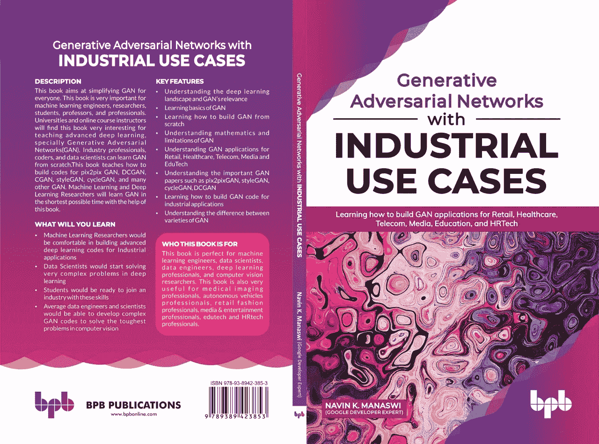

# 医学成像正在用氮化镓转变:从核磁共振成像到 CT 扫描及其他

> 原文：<https://medium.com/analytics-vidhya/medical-imaging-being-transformed-with-gan-mri-to-ct-scan-and-many-others-18a307ef528?source=collection_archive---------1----------------------->

人工智能已经改变了医学成像和整个医疗保健行业。

GANs 或生成对抗网络是一个评估生成模型的框架。通过对抗过程同时训练两个模型:生成器，负责生成数据，以及鉴别器，负责估计图像是从训练数据中提取的(图像是真实的)，还是由生成器产生的(图像是假的)。在训练期间，生成器在生成图像方面变得越来越好，直到鉴别器不再能够区分真实图像和伪造图像。

甘受到零和非合作博弈的启发。这意味着如果一方赢了，另一方就输了。零和游戏也被称为极小极大。玩家 A 想最大化它的行动，但是玩家 B 想最小化它们。在博弈理论中，当鉴别者(玩家 A)和生成者(玩家 B)达到纳什均衡时，GAN 模型收敛。这是极小极大方程的最优点。

甘正在改变以下专家过去的工作方式。

> 神经外科医生(专攻神经系统疾病)，
> 
> 肿瘤学家(专门研究癌症)，
> 
> 放射肿瘤学家(通过开放射疗法处方来治疗和管理癌症)，
> 
> 神经科医生(治疗神经系统疾病)，
> 
> 物理医学和康复专家(恢复身体残疾者的功能和生活质量)

这里讨论的是使用 GANs 的医学成像任务。

MedGAN:使用 GANs 的医学图像翻译

MedGAN 是一个用于医学图像翻译任务的完整框架。它将条件对抗性框架与非对抗性损失和 CasNET 生成器架构的新组合相结合，以增强结果的全局一致性和高频细节。MedGAN 在医学成像的三个挑战性任务中应用时没有特定任务的修改:它可用于:

1. **PET-CT** **翻译** : PET 扫描到合成 CT 扫描

2. **MR 运动校正**:刚性 MR 运动伪影的回溯校正

**3。** **PET 去噪**

根据医疗从业者所做的许多实验，所提出的框架在不同的建议任务中在数量和质量上优于其他类似的翻译方法。

通常，两种成像方法提供补充信息，因此两种或多种类型的医学成像对于完整的诊断过程是必要的。一个例子是混合成像，例如 PET/CT，其中 CT 用于 PET 数据的**衰减校正** ( **AC** )的技术目的。如果使用这种 GAN，我们可以从 PET 扫描中获得综合的、有意义的 CT 扫描。因此，GAN 将 PET 扫描翻译/转换为合成 CT 扫描，其中合成 CT 图像不直接用于诊断，而是用于 PET AC。通过 Cycle-GANs 提出了类似的方法。

图 2.3:使用 GANs 将 PET 扫描转换为合成 CT 扫描

医学图像中刚性和非刚性运动伪影的校正可以被视为从运动破坏图像到无运动图像的域转换问题:

图 2.4:使用 GANs 进行 MR 运动校正

Pix2pix GANs 也用于通过将低剂量 CT 图像转换成高剂量图像来对其进行去噪:

图 2.5

图 2.6:用各种类型的 gan 去噪

MedGAN 的性能与几个最先进的翻译框架进行了比较，包括 pix2pix、PAN、IDCGAN 和 Fila-sGAN。

**梅德根建筑**

图 2.7: MedGAN 架构

在这个 MedGAN 中，这个新的发电机架构被命名为 **CasNet** ，其灵感来自于 ResNets。它将几个具有跳跃连接的全卷积编码器-解码器网络链接成单个生成器网络。

MedGAN 在医学成像的三项挑战性任务中的应用，无需对超参数进行特定应用的修改。这些是从 PET 图像到合成 CT 图像的转换、PET 图像去噪以及最后刚性 MR 运动伪影的回溯校正。

GANs 在医学领域越来越受到关注，尤其是在图像到图像的翻译任务中。例如，具有添加的基于梯度的损失函数的 pix2pix 架构被用于从 MR 到 CT 图像的转换。

传统上，这些医学成像任务可以通过 GAN 模型来管理，如 pix2pix、PAN、ID-CGAN 和 Fila-SGAN 模型。让我们深入了解每种 GAN 模型。

**pix2pix**

2016 年，pix2pix GAN 框架作为监督图像到图像翻译问题的通用解决方案被推出。在这种情况下，生成器接收来自输入域的图像(例如，灰度照片)作为输入，并负责通过最小化像素重构误差(L1 损失)以及对抗损失来将其转换到目标域(例如，彩色照片)。另一方面，鉴别器的任务是区分发生器的假输出和期望的地面真实输出图像。

pix2pix 可用于图像到图像的转换，例如:

图像到分割图像，反之亦然

航空照片到地图或反之亦然

灰度图像到彩色照片。

照片边缘。

草图到照片

**潘**

2019 年 4 月，**感知对抗网络** ( **潘**)推出:也是针对图像到图像的翻译。PAN 将生成对抗损失和所提出的感知对抗损失组合为一种新颖的训练损失函数:

图 2.8:平移

**ID-CGAN**

**图像去训练条件生成对抗网络** ( **ID-CGAN** )于 2019 年 6 月推出。它用于图像到图像的翻译:

图 2.9:ID-CGAN 的结果

ID-CGAN 架构

图 2.10: ID-CGAN 架构

菲拉-斯甘

GAN 的丝状结构图像于 2017 年推出，用于在给定地面实况输入的情况下合成丝状结构图像。合成图像接近真实，并且当用作额外的训练图像时，已经显示出提高图像分割性能。其目的在于合成丝状结构图像，例如视网膜眼底图像和神经元图像:

图 2.11: Fila-SGAN

通常，两种成像方法提供补充信息，因此两种或多种类型的医学成像对于完整的诊断过程是必要的。一个例子是混合成像，例如 PET/CT，其中 CT 用于 PET 数据的 AC 的技术目的。如果使用这种 GAN，我们可以从 PET 扫描中获得综合的、有意义的 CT 扫描。因此，GAN 将 PET 扫描翻译/转换成合成 CT 扫描，其中合成 CT 图像不直接用于诊断，而是用于 PET AC。

来自双重生成对抗网络的合成医学图像

它旨在将 MRI 扫描转换为 CT 扫描。它分两个阶段发生

1.分段掩码生成 DCGAN

2.使用 pix2pix 的图像到图像转换器

我们为什么需要？

> **答** : **正电子发射断层扫描** ( **PET** ) / **计算机断层扫描** ( **CT** )是一种基于 X 射线技术的医学成像方法，基于一种与医用同位素相关的技术生成患者的图像，并给予患者。CT 扫描主要用于诊断肿瘤、头部、胸部、脊柱和骨盆的严重损伤，尤其是骨折。CT 扫描也被用来确定肿瘤的大小和位置。
> 
> 另一方面，MRI 是基于磁场和无线电波的医学成像方法。大多数情况下，CT 扫描通常可以在 3-5 分钟内完成，而磁共振成像需要大约 30 分钟。磁共振成像更适合诊断软组织、韧带和肌腱的问题。
> 
> 由于 CT 扫描过程中的辐射，获得 CT 扫描有点危险，所以希望直接从 MRI 图像获得(合成的)CT 扫描。
> 
> CT 扫描可以在两个阶段中使用 GAN 从 MRI 扫描转换/转换而来。

**输入** : (MRI 扫描)

图 2.12:输入 MRI 扫描

**输出:** (CT 扫描)

图 2.13:输出 MRI 扫描

图 2.14:显示如何按照描述生成合成图像的阶段 GANs

在这里，我们分两个阶段解决了挑战。在第一阶段，目标是产生分割掩模，可以照顾到图像的几何形状。在第二阶段，目标是增强图像，使其成为真实感图像。因此，第二阶段 GAN 仅用于根据给定的几何图形生成医学图像的颜色、光照和纹理。

以上文章摘自本书: [**甘用工业用例**](https://www.amazon.in/Generative-Adversarial-Networks-Industrial-Cases/dp/9389423856/ref=sr_1_2?keywords=navin+manaswi&qid=1583916025&sr=8-2)

[**【GAN 用工业用例(美国市场)**](https://www.amazon.com/Generative-Adversarial-Networks-Industrial-Cases/dp/9389423856/ref=sr_1_2?keywords=navin+manaswi&qid=1583916025&sr=8-2)

