# 使用深度学习的医疗报告生成

> 原文：<https://medium.com/analytics-vidhya/medical-report-generation-using-deep-learning-87b50096ead0?source=collection_archive---------3----------------------->

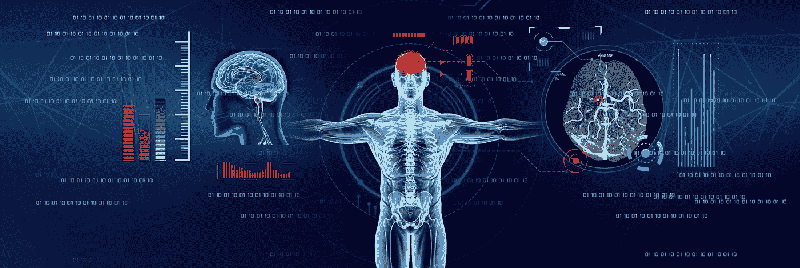

# 目录

1.  概观
2.  先决条件
3.  商业问题
4.  数据分析
5.  ML 公式
6.  绩效指标
7.  数据准备
8.  建模
9.  模型比较
10.  模型部署
11.  未来作品
12.  轮廓
13.  参考

# 1.概观

图像字幕是深度学习中最重要和最具挑战性的任务之一。它是为图像生成文本描述的过程。例如，考虑下面的图像。


从这些图像中，我们人类可以想出一个标题或描述。但是，如果计算机能够理解图像的内容并自动生成这些说明，那会怎么样呢？这一领域被称为图像字幕，最近深度学习模型在这一领域取得了最先进的表现。该模型理解图像的内容并生成相应的文本描述。因此，图像字幕处理可以被认为是两种模型的组合

*   理解图像内容的模型。给定一幅图像，我们需要理解图像的形状、边缘、颜色等，从而对图像的含义有一个整体的概念。因此，我们需要一个模型，能够提取这些特征，并从中得出有用的见解。
*   第二种模式是为了理解文本。为了生成图像的标题，模型应该能够将图像特征翻译成自然语言。

图像字幕的应用包括谷歌图像搜索、医疗报告生成等。

# 2.先决条件

为了更好地理解博客，最好熟悉一些主题，如神经网络、CNN、RNNs、迁移学习、Python 编程和 Keras 库。

# 3.商业问题

在这个案例研究中，我们考虑图像字幕的医学应用。本案例研究旨在使用机器学习算法从一组胸部 x 光图像中生成医疗报告。

x 光(射线照片)是一种帮助医生诊断和治疗疾病的非侵入性医疗检查。x 射线成像包括将身体的一部分暴露在小剂量的电离辐射下，以产生身体内部的图像。胸部 x 光是最常进行的诊断性 x 光检查。胸部 x 射线产生心脏、肺、气道、血管以及脊柱和胸部骨骼的图像。通常，放射科医师的职责是总结这些 x 光片，以便给病人适当的治疗。从这些 x 光片中获得详细的医疗报告通常是耗时且乏味的。在人口众多的国家，放射科医师可能会看到数百张 x 光图像。因此，如果一个经过适当学习的机器学习模型可以自动生成这些医疗报告，那么可以节省大量的工作和时间。然而，从模型生成的医疗报告应该在最后阶段由放射科医师确认。

在这个案例研究中，我们使用了印第安纳大学医院网络提供的数据。这里提供了一组胸部 x 光片和相应的医疗报告。给定一个 x 射线图像，我们需要生成该 x 射线的医学报告。

# 4.数据分析

这个问题的数据由印第安纳大学医院网络提供。数据包含两部分。

1.  x 光片:[http://academic torrents . com/details/5a 3a 439 df 24931 f 410 fac 269 b 87b 050203d 9467d](http://academictorrents.com/details/5a3a439df24931f410fac269b87b050203d9467d)
2.  报道:[https://academic torrents . com/details/66450 ba 52 ba 3 f 83 fbf 82 ef 9 c 91 F2 bde 0 e 845 ABA 9](https://academictorrents.com/details/66450ba52ba3f83fbf82ef9c91f2bde0e845aba9)

X 射线包含一些人的一组胸部 X 射线图像。举个例子，

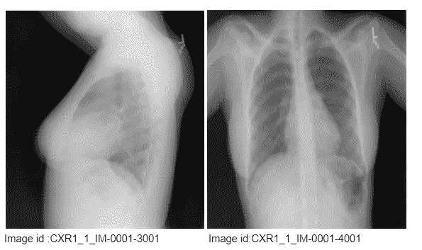

图 1:一个人的 x 光照片

上图是单人的胸部 x 光片。这些图像的图像 id 在图像的底部。此处“CXR1_1_1M-001”表示患者的 id。第一个图像是侧视图，第二个图像是前视图。这些图像的图像 id 显示在图像的底部。因此可能还有一个与独特的人-报告组合相关联的 x 射线图像。

这些报告包括 x 光医疗报告。考虑下面的报告图像

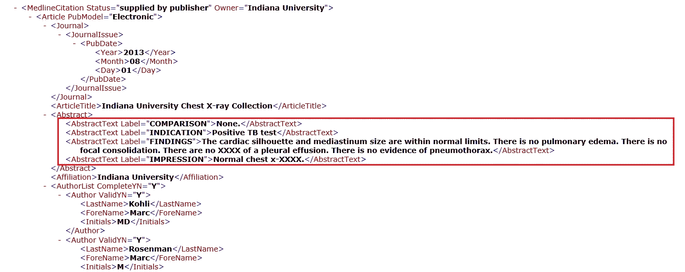

图 2(a):包含调查结果和印象的报告的 XML 文件的屏幕截图

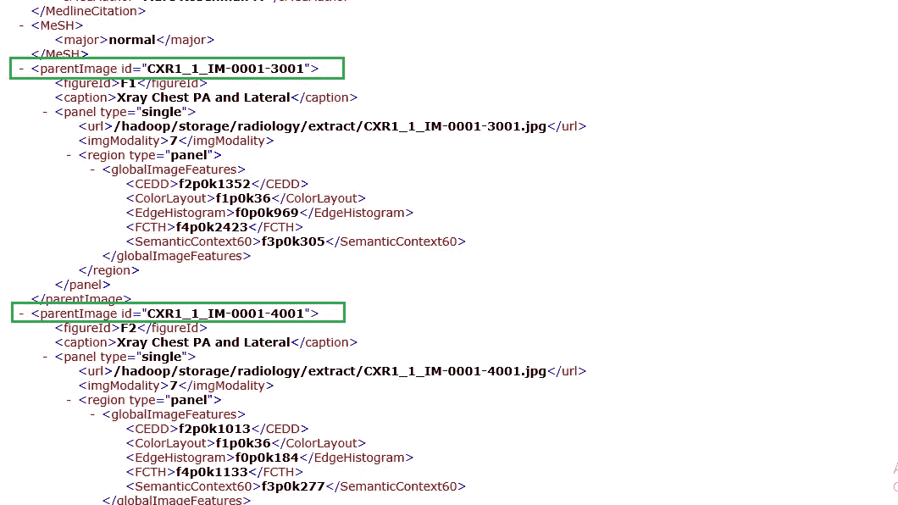

图 2(b):包含图像 id 的报告的 XML 文件的屏幕截图

在图 2(a)中，红框中标记的文本是我们需要生成的 x 光报告。在印模部分，放射科医师提供诊断。发现部分列出了影像学研究中检查的身体各部位的放射学观察结果。在图 2(b)中，绿色框内标记的文本表示父图像 id。这里，上面的报告是上面显示的两张胸片的医学报告。这里，该报告与两个图像相关联。

一个样本数据集看起来像这样:

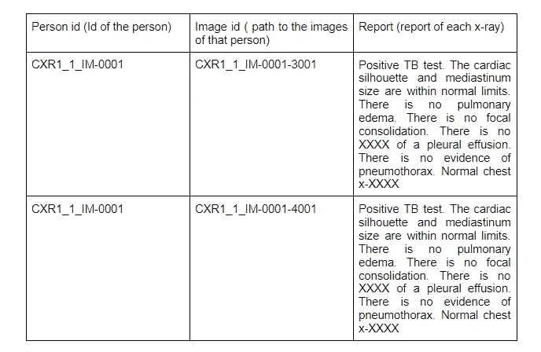

# 5.ML 公式

这个问题包括两个阶段——从图像(x 光)中提取特征，并将这些特征转化为报告。为了提取图像特征，我们需要一个卷积神经网络。通常使用预先训练好的 CNN 模型来获取[瓶颈](https://violetcatastrophe.wixsite.com/data4hire/vgg16-bottleneck-feature#:~:text=Bottleneck%20features%20are%20the%20last,512%20x%207%20x%207.)特征。这些特征应该作为输入提供给某个序列到序列模型以生成报告。这些模型将一次给出一个单词作为输出。这些单词将以[一个热编码](https://scikit-learn.org/stable/modules/generated/sklearn.preprocessing.OneHotEncoder.html)的形式出现。所以我们需要取这些一键编码向量的 [argmax](https://machinelearningmastery.com/argmax-in-machine-learning/#:~:text=Argmax%20is%20an%20operation%20that,with%20the%20largest%20predicted%20probability.) 来得到实际的单词。t 个时间步骤后，模型将生成最终报告。

# 6.绩效指标

为了比较生成的医疗报告和实际报告，我们可以使用 [BLEU](https://en.wikipedia.org/wiki/BLEU) (双语评估替角)分数。如果 BLEU 分数为 1，那么生成的报告和实际报告是相同的。如果 BLEU 分数为 0，那么生成的报告和实际的报告完全不匹配。由于解码器模型的输出是一个独热编码向量，我们也可以使用分类交叉熵作为损失函数。

# 7.数据准备

## 准备文本数据

数据由一组 x 射线图像和包含医疗报告的 XML 文件组成。如图 2 所示，这个 XML 有很多信息，比如 x 射线的图像 id、指示、发现、印象等。我们将从这些文件中提取调查结果和印象，并将其视为报告，因为它们对医疗报告更有用。我们还需要从这些文件中提取图像 id，以获得每个报告对应的 x 射线。

如果报告没有发现或图像 id，我们只需删除它们

## 预处理文本数据

让我们看看数据集中的一些示例报告。

例 1: *“心脏大小正常，肺部清晰。稳定的 5 毫米右肺中叶表现肉芽肿。”*

例 2: *“没有对比胸部 x-XXXX。扩张良好且清晰的肺部。纵隔轮廓在正常范围内..”*

我们可以看到，这些报告包含特殊字符、大小写字母、数字、不需要的空格等。因此，我们需要在将报告输入模型之前对其进行清理和预处理。预处理的文本数据通过以下方式获得:

*   将所有字母转换成小写
*   像“不是”、“不”等词是扩展的
*   删除了除“.”以外的所有特殊字符
*   删除了“xx”、“xxx”等词语。
*   删除了多个空格
*   删除了长度小于或等于 2 的单词

清理完数据之后，下一步就是将这些数据编码成机器能够理解的形式。为此，我们需要将报告分解成令牌，并将这些单词编码成数字。为此，我们使用了 [Keras](https://keras.io/) [标记器](https://www.tensorflow.org/api_docs/python/tf/keras/preprocessing/text/Tokenizer)库。

还注意到每份报告的长度不同。在输入模型之前，我们需要使所有的报告长度相等。这是使用 Keras [焊盘序列](https://www.tensorflow.org/api_docs/python/tf/keras/preprocessing/sequence/pad_sequences)完成的。

## 准备图像数据

通过从 XML 文件中提取图像 id 来获得对应于每个报告的 x 射线。据观察，一份报告可以有多个 x 射线图像。为了更好地理解这一点，我们绘制了每份报告的 x 光片数量。

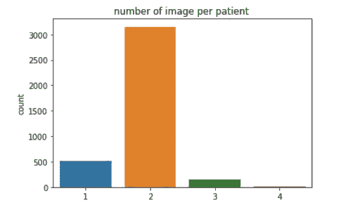

图 3:一个人每份报告的 x 光图像数量图

我们可以看到，大多数报告都有两个相关的图像。从图像 id 中还可以观察到，一份报告中的图像仅与一名患者相关联。所以有些病人可能拍了多张 x 光片。因此，我们在一份报告中考虑患者的两幅图像。

结构化数据将看起来像:

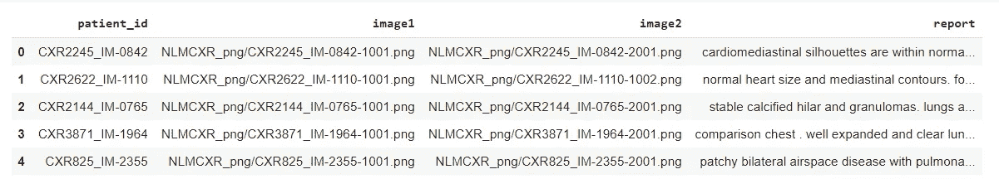

## 图像特征化

与我们讨论的文本编码类似，计算机将无法从图像 id 中理解任何内容。为了理解图像，我们需要将每个图像转换成固定大小的向量。这可以在任何预训练模型上使用[迁移学习](https://en.wikipedia.org/wiki/Transfer_learning#:~:text=Transfer%20learning%20(TL)%20is%20a,when%20trying%20to%20recognize%20trucks.)来完成。通常在所有的计算机视觉任务中，都会用到类似 [VGG-16](https://neurohive.io/en/popular-networks/vgg16/) 、 [VGG-19](https://iq.opengenus.org/vgg19-architecture/) 、[盗梦空间 V3](https://en.wikipedia.org/wiki/Inceptionv3) 等 CNN 模型。

*但是从这些模型中进行迁移学习在这里并不奏效。为什么？*

上述预训练的模型是在与 x 射线图像完全不同的大数据集上训练的。因此，在这种情况下，从这些模型中进行迁移学习不会提供好的结果。

*所以我们需要一个在 x 射线图像上预先训练好的模型。这样的模式存在吗？*

幸运的是是的。我给你介绍一下 CheXNet 模型。CheXNet 是一个在 ChestX-ray14 上训练的 121 层卷积神经网络，包含 14 种疾病的 100，000 多幅正面 X 射线图像。为了使用该模型获得图像特征，我们将移除最终分类层并提取输出。

你可以从[这里](https://drive.google.com/file/d/19BllaOvs2x5PLV_vlWMy4i8LapLb2j6b/view)下载 CheXNet 训练好的权重。

CheXNet 的图像特征提取模型将看起来像[这个](https://imgur.com/ckN7TxZ)。

为了便于理解，让我向您展示模型的最后几层。

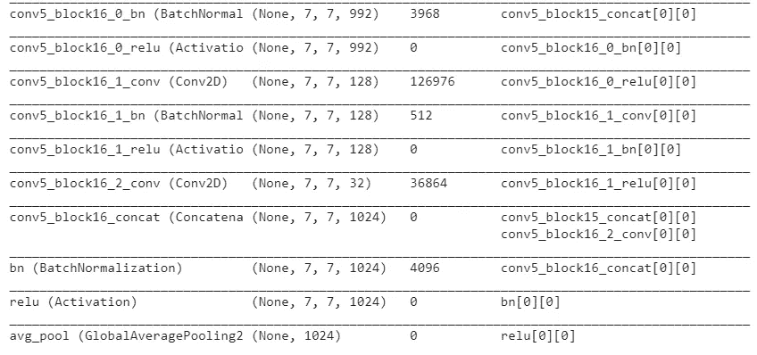

我们将图像的大小调整为(224，224，3)，并将它们传递给 CheXNet 模型，以获得 1024 维的向量。如果你还记得，我们的数据集中每个病人有两张图像。因此，我们将两幅图像都放入模型中，以获得两个图像特征。然后，我们连接这些特征以获得患者的最终图像特征。

既然我们已经将文本和图像数据转换为向量，我们需要将这些数据分成训练数据和测试数据。这里我们将数据分为 80%(训练)和 20%(测试)。现在，让我们进入建模部分。

# 8.建模

从我们到目前为止所讨论的，我们可以说，我们需要一个编码器-解码器架构，为这个案例研究。

*   编码器:该模型用于将输入编码成固定长度的向量。
*   解码器:这个模型将向量表示映射到可变长度的目标序列。

在我们的情况下，或者在任何图像字幕问题的情况下，编码器用于将图像转换成矢量。解码器使用递归神经网络或 LSTMs 或 GRUs 将编码器输出转换成目标句子。下图将有助于更好地理解这一点。

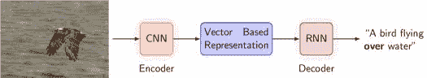

图 4:图像字幕的编码器-解码器架构

你可以在这里了解更多关于图像字幕[的编解码模型。](https://machinelearningmastery.com/develop-a-deep-learning-caption-generation-model-in-python/)

在本案例研究中，我使用了四种编码器-解码器架构模型。让我们试着去理解每一个模型。

# 模型 1:简单的编码器-解码器模型

首先，让我们考虑一个简单的编码器-解码器模型。

**编码器模型**:如前所述，编码器模型用于将图像编码成固定大小的矢量。在本案例研究中，我们考虑了用于提取图像特征的 CheXNet 模型。由于每个患者有两个图像，我们将每个图像特征连接起来，如下所示

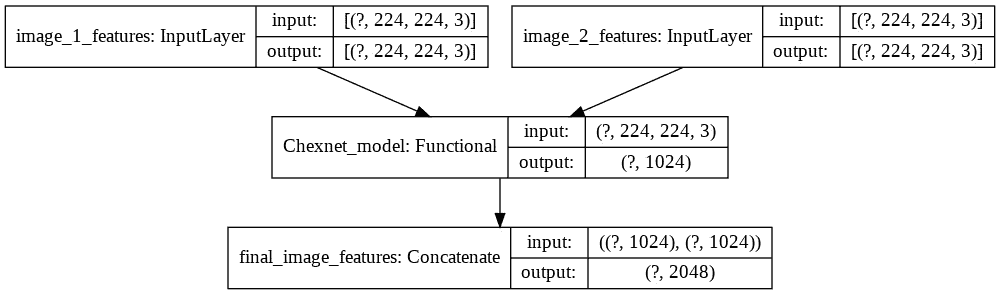

现在，我们可以将这个向量通过密集层，得到一个降维的向量。这个矢量将是最终的编码器输出。

**解码器型号:**现在，我们需要将这个编码器输出转换成文本。为此，我们使用非常适合处理文本数据的 [LSTM](https://colah.github.io/posts/2015-08-Understanding-LSTMs/) 网络。这里我们使用 LSTM 作为序列对序列模型。LSTM 网络的输入以时间步长给出，并且一次获得一个单词作为输出。在每个时间步，编码器输出和单词在时间(t-1)的[嵌入向量](https://keras.io/api/layers/core_layers/embedding/)作为输入，LSTM 层将预测单词在时间 t 的向量表示。该向量然后通过 softmax 层，soft max 层将其转换为独热码编码形式。通过使用 argmax 函数，我们将从词汇表中获得相应的单词

**嵌入层:**嵌入层允许我们用密集向量的形式来表示单词。在这里，每个单词都用预先训练好的[手套](https://nlp.stanford.edu/projects/glove/)模型映射成 300 维的表示。

## 模型架构

## 模型的训练

使用加载数据功能准备用于训练的数据。

## 使用贪婪搜索算法评估模型

贪婪搜索算法[一点一点地构建解决方案，总是选择下一个提供最明显和最直接利益的方案。这里，预测是通过以下步骤完成的:](https://www.geeksforgeeks.org/greedy-algorithms/)

1.  对于给定的患者，使用编码器模型获得图像特征
2.  将编码器输出和单词“<sos>”(句子开头)的 token_index 传递给解码器模型，这将预测词汇表中每个单词的概率分布。我们选择概率最大的单词作为下一个单词</sos>
3.  预测的单词连同解码器的输入是下一个输入句子
4.  重复步骤 2 和 3，直到到达单词“<eos>”(句尾)</eos>

## 模型的结果:

*例 1:实际报告:< sos >心脏和纵隔轮廓在正常范围内。肺部没问题。骨骼结构完好无损。<EOS>*

*生成报告:心脏正常大小。纵隔不明显。肺部没问题。<EOS>*

*例 2:实报:< sos >肺过度充气，膈肌变平，胸骨后间隙增大。肺泡实变发现胸腔积液肺水肿。心脏大小在正常范围内。右肺门钙化提示先前的肉芽肿过程。<EOS>*

*生成报告:心脏大小和纵隔轮廓在正常轮廓范围内。肺部没问题。气胸胸腔积液。完好无损。<EOS>*

我们可以看到，对于较长的句子，该模型表现不佳。该模型未能检测到医疗状况。

我们可以使用 [BLEU](https://www.geeksforgeeks.org/greedy-algorithms/) 分数来评估生成的句子和实际句子之间的相似度。让我们通过计算测试数据的总 bleu 分数来分析模型的性能。

现在让我们转向更高级的模型。

# 模型 2:带注意的编码器解码器模型

## 注意机制

前一种方法的问题是，当模型试图生成标题的下一个单词时，这个单词实际上只描述了图像的一部分。但是在前一种方法中，每个单词的生成是基于图像的整体表示。这就是注意力机制有用的地方。它有助于在生成特定单词时关注图像的某些部分。假设实际输出序列中的第 k 个字是 x 射线的某个特定部分的描述，而不是整个 x 射线图像的描述。因此，如果我们使用整个图像来从解码器生成第 k 个字，则可能无法生成所需的字。相反，如果我们使用一种注意力机制，一次专注于图像的某个部分，那么结果将会改善。

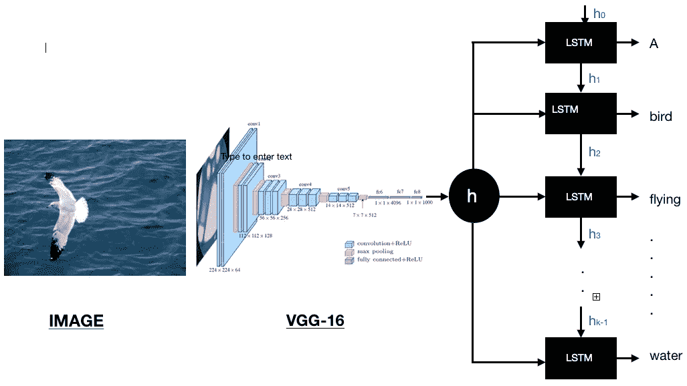

在上图中，如果我们需要生成单词“bird ”,我们需要关注图像中包含鸟的像素。这是使用注意力权重来完成的，注意力权重给图像的每个部分一个权重。这些重量是在训练中学会的。你可以在这里了解更多关于注意力机制[的知识。](https://lilianweng.github.io/lil-log/2018/06/24/attention-attention.html#:~:text=The%20attention%20mechanism%20was%20born%20to%20help%20memorize%20long%20source,and%20the%20entire%20source%20input.)

## 基于注意力的模型

该模型还具有编码器-解码器架构。编码器与之前的型号相同，但解码器中有一个额外的注意单元。

让我们看看这个基于注意力的模型是如何工作的。

1.  从 CheXNet 模型中提取图像特征
2.  将特征传递给编码器模型，该模型给出编码器输出
3.  编码器输出和先前的解码器隐藏状态被传递给注意力模型，注意力模型计算注意力权重
4.  注意力权重和编码器输出用于计算上下文向量
5.  先前解码器输入的上下文向量和嵌入向量被连接并传递到 GRU 单元
6.  GRU 输出被传递到最后的密集层

这是通过模型的流程。下图将有助于更好地理解这一点。

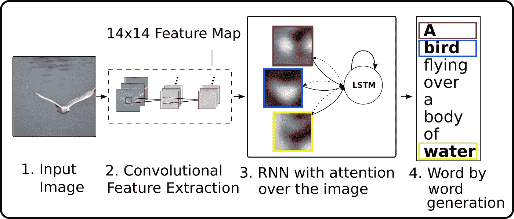

图 5:基于注意力的图像字幕编解码模型的架构

现在让我们试着去理解每一个单元

## 编码器类别

编码器类将把 CheXNet 模型的图像特征转换成低维张量

## 注意类

注意类将使用解码器模型的先前隐藏状态和编码器输出来计算注意权重和上下文向量。

## 一步解码器和解码器类

单步解码器类将执行编码器输出的解码。解码器类将在每个时间步长调用这个单步解码器。单步解码器依次调用注意力模型，并返回该时间步的最终输出。

使用最终解码器模型存储由一步解码器预测的每个输出字，并返回最终输出句子。

## 编码器-解码器模型

下图显示了模型的训练和测试损失

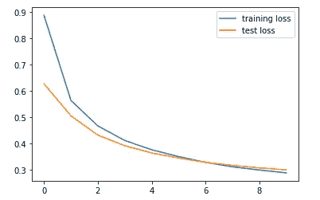

## 贪婪搜索算法的结果

*例 1:*

*实录:< sos >肺清。胸腔积液气胸。心脏和纵隔正常。骨骼结构正常。<EOS>*

*生成报告:心脏大小和肺血管分布在正常范围内。肺部没问题。胸腔积液气胸。<EOS>*

*例 2:*

*实际报告:< sos >气管中线。心脏纵隔轮廓正常大小和轮廓。肺部清晰，无明显急性浸润性积液。有气胸。可视化的骨结构揭示了急性异常。<EOS>*

*生成报告:心脏大小和肺血管分布在正常范围内。肺部没问题。胸腔积液气胸。<EOS>*

在这里，我们也可以看到，该模型对较长的句子预测不佳。使用贪婪搜索算法为测试数据计算的总 bleu 分数如下所示

```
average bleu score on the test data is  0.6514907322500497
average time taken for evaluation is  0.833292394720447 seconds
```

## 使用波束搜索算法评估模型

让我们使用[波束搜索算法](https://towardsdatascience.com/an-intuitive-explanation-of-beam-search-9b1d744e7a0f)来预测句子。光束搜索不是贪婪地为下一步选择最有可能的输出，而是扩展所有可能的结果，并保持 *k* 个最有可能或可能的输出。这里 k 被称为波束宽度，是用户指定的参数，它控制波束的数量或概率序列中的并行搜索。k=1 不过是一个贪婪的搜索算法本身。随着 k 的增加，模型的性能可以提高，但是时间复杂度会增加。所以这是一个性能和时间复杂度之间的选择。

在本案例研究中，我们考虑 k=3。

*例如:*

*实际报告:心脏正常大小。纵隔不明显。肺部没问题。活动性肺结核的证据。<EOS>*

*生成报告:< sos >心脏大小和侧位视图心脏大小和纵隔轮廓在正常肺水肿范围内。*

这里的报道有一些共同的词汇，但它们仍然是不同的。此外，该模型不能预测实际报告中出现的*结核病*。现在让我们计算一下测试数据的总体蓝分。

当使用波束搜索算法时，结果得到了改善。但是我们期望注意力模型表现得更好，这里我们在 Bleu 分数上只有轻微的提高。但是为什么会这样呢？

在从 Chexnet 模型中提取图像特征时，我们在最终图层之前使用平均池，该平均池展平矢量并忽略所有空间特征。

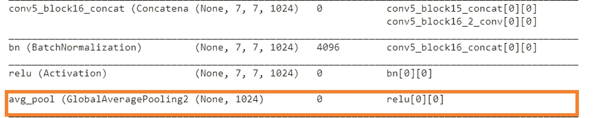

所以注意力机制是用扁平向量来完成的。这可能是我们没有得到改进结果的原因。现在让我们保存图像的空间信息并执行注意机制。

# 模型 3:在模型 2 上使用空间图像特征

这里，我们在从 CheXNet 模型中提取特征时保留了图像的空间信息。这允许模型识别空间模式(边缘、阴影变化、形状、对象等)。现在让我们理解 CheXNet 模型的输出。

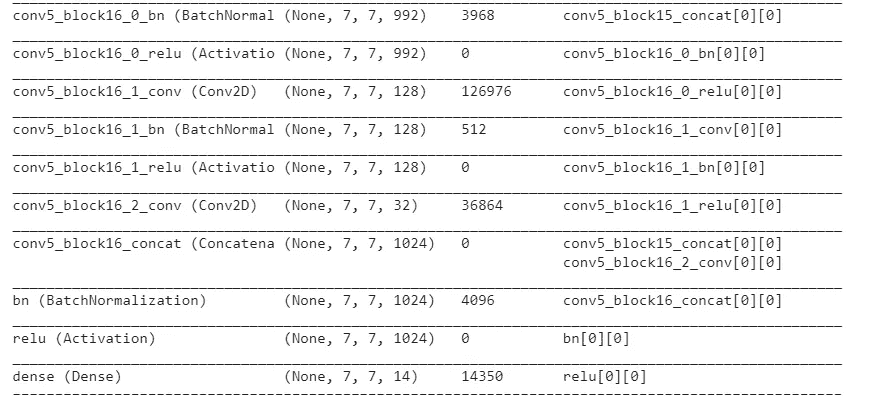

我们可以看到，最终的全球平均池图层被移除，空间信息被保留。我们移除最后的激活层以获得瓶颈特征。因此，对于每个输入图像，我们将得到一个(7，7，1024)维向量作为输出。由于每个患者有两幅图像，我们将连接这些特征以获得(7，14，1024)维张量作为最终的特征向量。这里，7 和 14 表示对应于图像中特定部分的实际位置，1024 表示深度。我们可以把它想象成(7*14)个位置，每个位置有一个 1024 维的表示。所以我们把张量重塑成(98，1024)。

## 模型架构和模型的训练

模型架构和训练过程与之前的模型相同，唯一的区别在于输入图像特征的维度。下图显示了模型的训练和测试损失。

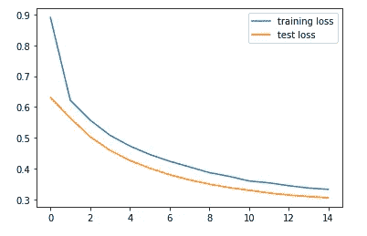

## 使用波束搜索进行评估

*例一:*

*实录:< sos >肺清。胸腔积液气胸。心脏和纵隔正常。骨骼结构正常。<EOS>*

*生成报告:< sos >心脏大小在正常范围内。肺部没问题。胸腔积液。*

*例 2:*

*实际报告:< sos >心脏和纵隔在正常范围内。局灶性肺实变胸腔积液气胸阴性。<EOS>*

*生成报告:< sos >心脏大小在正常范围内。有气胸胸腔积液气胸。*

在第一个示例中，生成的报告与原始报告相匹配。但是在第二种情况下，生成的报告指示存在胸腔积液，但是实际报告显示相同的结果为阴性。现在让我们计算一下测试数据的总体蓝分。

```
average bleu score on the test data is  0.7181150122958847the average time for evaluating the attention model with beam search is 3.2034 seconds
```

我们可以看到，与以前的模型相比，结果有所改善。此外，当使用波束搜索时，用于评估的时间更多。现在，让我们稍微修改一下这个模型。

# 模型 4:在模型 3 上使用双向 GRU

在前面的模型中，我们在解码器类中使用了单向 GRU。这产生了很好的结果，但是如果我们能改进它呢？

让我们考虑一下双向 GRU。双向 gru 只有输入门和遗忘门。它允许使用来自先前时间步骤和后来时间步骤的信息来预测当前状态。模型架构和训练与先前模型的架构和训练相同，唯一的不同是解码器 GRU 被双向解码器取代。

让我们看看这个模型的训练和测试损耗。


我们可以看到，与以前的模型相比，损失更少。

## 使用波束搜索进行评估

*例一:*

*实际报道:< sos >心脏大小和血管分布正常。这些轮廓正常。肺部没问题。胸腔积液。<EOS>*

*生成报告:< sos >纵隔内正常大小胸腔积液气胸。*

*例 2:*

*实录:< sos >心肺和纵隔都在正常范围内。胸腔积液气胸。局灶性空气混浊提示肺炎。脊柱的退化性变化很小。<EOS>*

*生成报告:< sos >正常大小的纵隔和病灶空域内的疾病。*

与以前的型号相比，该型号的性能有所提高。在第一个示例中，生成的报告几乎与实际报告相同，并且模型能够正确预测个人的医疗状况。在第二个示例中，模型部分预测了医疗状况。我们可以看到它能够回忆起*局灶性空域疾病*或*肺炎、*但无法预测*气胸。*尽管如此，该模型的表现仍优于其他模型。让我们看到 Bleu 评分的提升。

```
average bleu score on the test data is  0.7454363912464719the average time for evaluating the attention model with beam search using bidirectinal GRU is  5.068260778931423 seconds
```

# 9.模型比较

下表显示了基于测试数据和平均评估时间的 bleu 分数的模型之间的比较。我们可以看到最终模型比其他模型表现得更好。

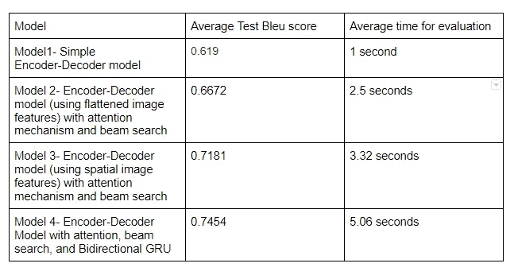

# 10.模型部署

模型部署的代码可以在我的 [Github 库](https://github.com/Vinithavn/MachineLearning/tree/master/Projects/Deployment)中找到。

# 11.未来作品

*   对于这项任务，我们没有大的数据集。更大的数据集将产生更好的结果

# 12.轮廓

您可以在我的 [**Github 库**](https://github.com/Vinithavn/MachineLearning/tree/master/Projects/Medical%20Report%20Generation%20Using%20Deeplearning) 中找到我的完整解决方案，如果您有任何建议，请通过 [**Linkedin**](https://www.linkedin.com/in/vinitha-v-n-5a0560179/) 联系我

# 13.参考

*   [https://www . Applied ai course . com/course/11/Applied-Machine-learning-course](https://www.appliedaicourse.com/course/11/Applied-Machine-learning-course)
*   [https://towards data science . com/image-captioning-in-deep-learning-9cd 23 FB 4d 8d 2](https://towardsdatascience.com/image-captioning-in-deep-learning-9cd23fb4d8d2)
*   [https://towards data science . com/image-captioning-using-deep-learning-fe0d 929 cf 337](https://towardsdatascience.com/image-captioning-using-deep-learning-fe0d929cf337)
*   [https://medium . com/analytics-vid hya/automatic-medical-report-generation-from-x-ray-images-through-ai-FD 04 de 21 E0 e 5](/analytics-vidhya/automatic-medical-report-generation-from-x-ray-images-through-ai-fd04de21e0e5)
*   [https://machine learning mastery . com/develop-a-deep-learning-caption-generation-model-in-python/](https://machinelearningmastery.com/develop-a-deep-learning-caption-generation-model-in-python/)