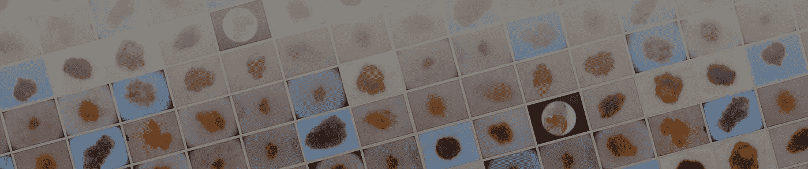

# 黑色素瘤分类:在卡格尔竞赛中获得奖牌

> 原文：<https://medium.com/analytics-vidhya/melanoma-classification-getting-a-medal-on-a-kaggle-competition-4e4ebf1a16b9?source=collection_archive---------9----------------------->

使用深度学习从皮肤图像和患者元数据中识别黑色素瘤

来源:[https://storage . Google APIs . com/ka ggle-competitions/ka ggle/20270/logos/header . png？t=2020-05-06-18-21-24](https://storage.googleapis.com/kaggle-competitions/kaggle/20270/logos/header.png?t=2020-05-06-18-21-24)

K 阿格尔、 [SIIM](https://siim.org/) 和 [ISIC](https://www.isic-archive.com/#!/topWithHeader/wideContentTop/main) 于 2020 年 5 月 27 日举办了 [**SIIM-ISIC 黑色素瘤分类竞赛**](https://www.kaggle.com/c/siim-isic-melanoma-classification/overview) ，目标是使用来自皮肤病变的图像数据和患者元数据来预测皮肤图像是否有[黑色素瘤](https://en.wikipedia.org/wiki/Melanoma)，下面是来自……