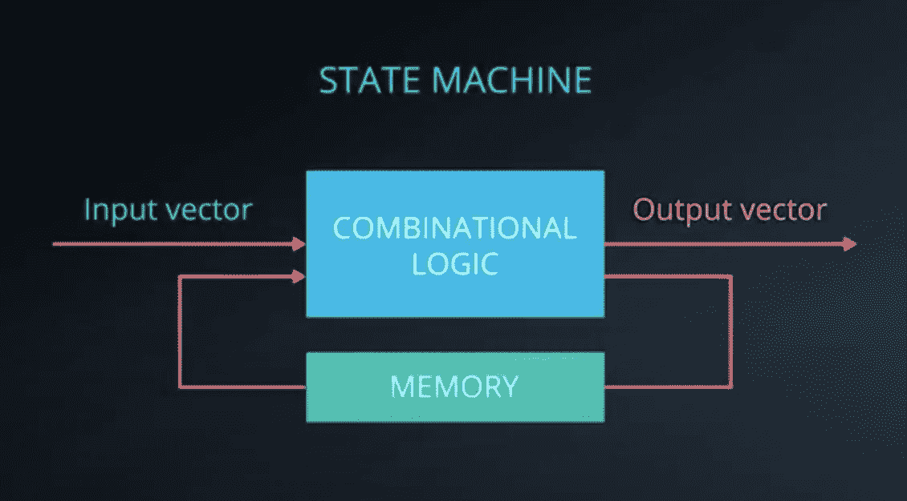
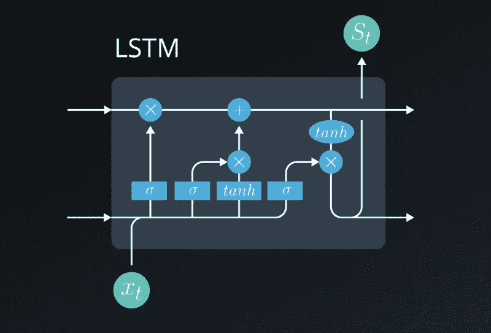
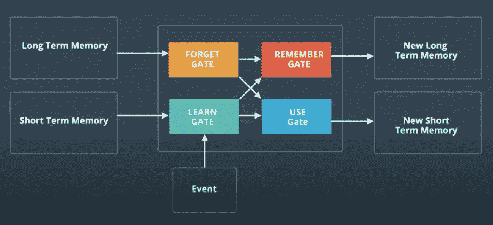
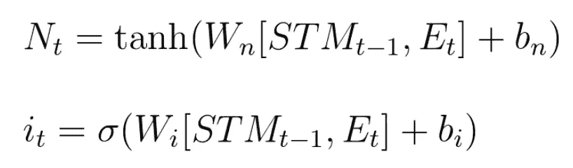
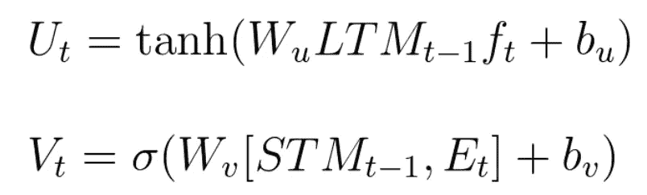
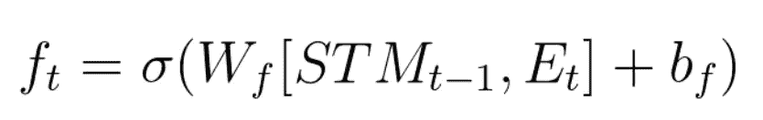
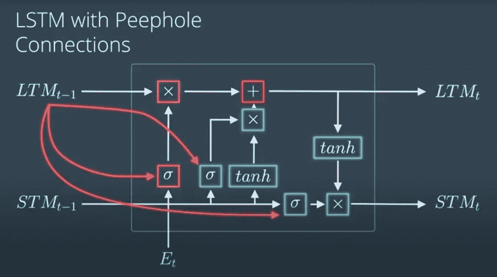

# 神经网络中的记忆？

> 原文：<https://medium.com/analytics-vidhya/memories-in-neural-networks-d650e4593689?source=collection_archive---------39----------------------->

大家好！这是我在一个月内完成*深度学习纳米学位*旅程中的第十篇文字！我已经完成了该学位总共六个模块中第四个模块的 51%。今天，我们将讨论神经网络(LSTMs)对内存的*需求。*

## 第 15 天

今天的模块在*列表*上。这些是构成循环神经网络的细胞。让我继续前面关于 *RNNs* 的谈话。



## RNNs

在处理 *RNNs* 时，我们会遇到两个主要问题，*消失梯度*T52*爆炸梯度*。

对于 ***消失渐变*** ，我们使用 *LSTMs* ，稍后会详细介绍。对于爆炸渐变，我们使用一个术语叫做*渐变剪辑*。

## 剪裁渐变

这就是我们可以解决*爆炸渐变*问题的地方。我们使用这个函数，基本上就是说，如果一个梯度高于某个阈值，就把这个值设置为已经设置好的阈值。给出了使用裁剪的代码表示。请注意'*剪辑*'是一个值。

```
#Gradient Clipping
nn.utils.clip_grad_norm_(net.parameters(), clip)
```

# 长短期记忆细胞(LSTM)

在 *Sepp Hochreiter 的关于 *LSTM* 的原始论文中，他向科学界介绍了算法和方法，他解释说*长期记忆*指的是学习到的权重，*短期记忆*指的是随着时间的每一步而变化的门控细胞状态值。*

*lstm*的基本工作是避免 ***信息*** 丢失。通过存储信息并且在一些时间戳内不暴露它，然后在需要时暴露它。 *LSTM* *单元格*是*完全可微分的*，这意味着我们可以计算所有值的梯度。在该单元内执行的操作是 *Sigmoid、双曲正切、乘法&加法。*

> LSTM 网络非常适合于[分类](https://en.wikipedia.org/wiki/Classification_in_machine_learning)、[处理](https://en.wikipedia.org/wiki/Computer_data_processing)和[基于](https://en.wikipedia.org/wiki/Predict)[时间序列](https://en.wikipedia.org/wiki/Time_series)数据做出预测，因为时间序列中的重要事件之间可能存在未知持续时间的滞后。LSTMs 被开发来处理在训练传统 rnn 时可能遇到的[消失梯度问题](https://en.wikipedia.org/wiki/Vanishing_gradient_problem)。在许多应用中，对间隙长度的相对不敏感性是 LSTM 相对于 RNNs、[隐马尔可夫模型](https://en.wikipedia.org/wiki/Hidden_Markov_models)和其他序列学习方法的优势。[ [*需要引用*](https://en.wikipedia.org/wiki/Wikipedia:Citation_needed) ]

## 为什么？

LSTMs 的需求是，rnn，即递归神经网络，往往会在长时间内丢失存储在其中的信息。例如， *RNN 的*不会记得 10 步前做出的决定，为此，我们使用 *LSTMs* 。



LSTM 细胞

为了存储、使用和删除信息，它使用 ***门*** 来执行所有的操作。

## 盖茨

因此，在一个 *LSTM 单元中使用了四个门。*



Gates 盖茨代表

*   **学习门:**它主要接收*短时记忆*和*事件*，它 ***加入*** 它们。然后它忽略了一部分。
    **数学上**，我们把两个内存相乘，然后应用一个激活函数。但是我们如何忘记一些数据呢？我们对它应用一个遗忘因子。



学习门

*   **遗忘门:**它接收*长期记忆*并决定保留哪个部分。
    **数学上**，记忆与遗忘因子相乘。
*   **记忆门:**它接收*长期记忆*和*短期记忆*，并决定将哪些内容保存在一起。
    **数学上，我们从*学习门*和*遗忘门*获得输出，然后将它们相加。**
*   ****使用门:**它接收刚从*遗忘门*出来的*长期记忆*和刚从*学习门*出来的*短期记忆*以获得新的*短期记忆*和*输出*。** 

****

**使用门**

> **如何*计算****遗忘因子*** ？我们利用短期记忆和当前事件，运行一个小的线性神经网络，得到输出。**

****

**遗忘因子**

> **之所以这样设计 LSTMs，是因为它有效。**

```
#Code Representation of an LSTM
nn.LSTM(input_size, n_hidden, n_layers, dropout, batch_first)
```

## **窥视孔连接**

**我们看到，在先前设计的 LSTM 中，没有长时记忆在寻找和获得遗忘因子中的作用，因此，这里有窥视孔连接。在这些实验中，我们在得到遗忘因子的同时，也把它放入长期记忆中，还有在细胞中进行的所有其他操作中。我们这样做也是为了让细胞知道它的长期记忆。**

****

**窥视孔连接**

**这是我一天能走的路。我很期待这个模块的项目，*生成电视脚本*，这肯定会很有趣。不管怎样，下次再见！**