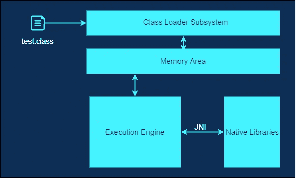
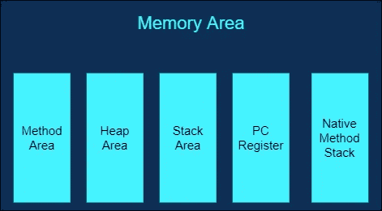
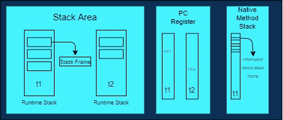

# JVM 中的内存区域和执行引擎

> 原文：<https://medium.com/analytics-vidhya/memory-area-and-execution-engine-in-jvm-28c23dd5fdfe?source=collection_archive---------12----------------------->

嗨伙计们！你过得怎么样？在之前的博客中，我们已经看到了类加载器子系统是如何工作的，以及它在运行时加载类和验证字节码的功能。今天我们将看到执行还需要哪些类型的内存，以及执行引擎在 JVM 进程中的作用。我们先讨论一下内存区域。

## 存储区

内存区也可以称为数据区或运行时内存区，所以请不要与名称混淆。🤪基本上，当加载类或执行字节码时，需要内存来保存类数据，为对象分配内存，不仅如此，还要跟踪指令已经加载到哪里。所以现在你可能已经理解了我们需要不同的内存区域，它们实际上存在于 JVM 中。

因此，存储区可以分为以下类型:

*   **方法区:**在方法区内，将存储包括静态变量在内的类级数据。
*   **堆区域:**这是动态内存分配通常发生的区域。它存储 object，每当你用 new，malloc 关键字创建实例变量时也是数组(在 java 中数组是 object)。
*   **堆栈区:**为每个正在执行的线程创建运行时堆栈。现在，假设我们正在进行方法调用，因此每个方法调用都充当堆栈框架，被注入到堆栈区域内的线程的运行时堆栈中。所有的局部变量都存储在堆栈中。

*   **PC 寄存器:**每个线程都有单独的 PC 寄存器，以便保存指令地址并执行另一个线程，同时在切换时更新当前指令地址，该地址可以继续处理。
*   **本地方法堆栈:**这包含关于特定线程的每个堆栈帧的信息。

**注意:**方法区和堆区**将不是线程安全的**，因为资源将在线程间共享，而对于栈区的情况，它**将是线程安全的**，因为它不是共享资源。

直到这里。类文件已经加载，现在角色来到执行引擎来执行文件。

## 执行引擎

执行引擎通过将字节码转换成机器码来帮助执行字节码，并与存储区进行交互。以下是执行过程中涉及的组件:

*   **解释器**:负责逐行读取、解释、执行 java 程序。因此，如果任何方法被调用多次，就需要新的解释，这是它的主要缺点。
*   **JIT 编译器(Just In Time):**JIT 编译器的概念只适用于重复的方法，而不是每个方法。为了克服解释器在解释字节码时所面临的问题，每当 JIT 编译器发现重复的代码时，它就编译整个字节码并把它变成机器码。这个机器码将直接用于重复的方法调用。
*   中间代码生成器
*   代码优化器
*   目标代码生成器
*   仿形铣床

注意:Profiler 是用来识别 JIT 中热点重复方法的。

为了给执行引擎提供本地库，我们有了连接本地库和执行引擎的 JNI。

**JNI(Java 原生接口):**作为执行引擎和原生方法库之间的桥梁，在执行时提供库。

**本地方法库:**包含执行引擎在执行字节码时需要的库。

那是关于 JVM 架构和它的工作。

如果我遗漏了什么，请评论出来，并在评论框中告诉我你的建议。✌ [阅读了](/@barunsarraf/jvm-architecture-and-working-9f17945d7408)我之前关于 JVM 中的类加载器子系统的博客。

## 快乐编码。！