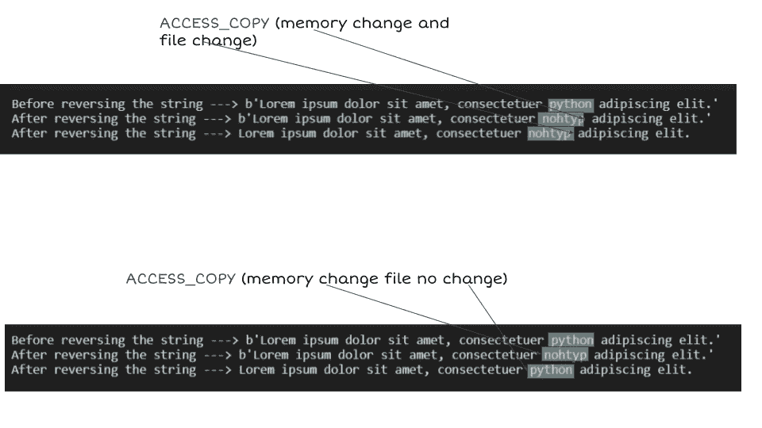

# python 中的内存映射文件和 mmap 模块(有很多例子)

> 原文：<https://medium.com/analytics-vidhya/memory-mapping-files-and-mmap-module-in-python-with-lot-of-examples-d1a9a45fe9a3?source=collection_archive---------6----------------------->


由 [Kote Puerto](https://unsplash.com/@kotecinho?utm_source=medium&utm_medium=referral) 在 [Unsplash](https://unsplash.com?utm_source=medium&utm_medium=referral) 上拍摄的照片

***定义:*** 内存映射文件对象将普通文件对象映射到内存中。这允许我们直接在内存中修改文件对象的内容。

1.  内存映射文件对象的行为类似于`bytearray`和`file objects`。因此所有可以在`bytearray`上执行的操作，如索引、切片、分配切片或使用`re`模块搜索文件。
2.  以及可以在文件对象上执行的所有操作，如从当前位置开始读写数据。或者使用`seek()`将当前指针定位到不同的位置。

## 内存映射文件对象

对于基于 Unix 和 Windows 的系统，内存映射文件对象是不同的。我将讨论 Windows 版本。

`***class* mmap.mmap(*fileno*, *length*, *tagname=None*, *access=ACCESS_DEFAULT*[, *offset*])**`

***fileno:*** 从文件句柄(Unix 中的文件描述符)`fileno`指定的文件中映射`length`字节。并创建一个 mmap 对象。

> `*file*.fileno()`:以数字形式返回流的文件描述符
> 
> 文件句柄(Unix 中的文件描述符)是在计算机操作系统中唯一标识打开文件的数字。它描述了数据资源，以及如何访问该资源。

如果长度大于文件的当前大小，文件将被扩展为包含字节的长度。如果长度为零，则映射的最大长度是文件的当前大小。

为了映射匿名内存，应该将-1 作为 fileno 和长度一起传递。

***标记名:*** 如果被指定，而不是`None`，则是一个字符串，给出映射的标记名。如果省略参数或`None`，则创建的映射没有任何名称。

理解`ACCESS_READ`、`ACCESS_WRITE`、`ACCESS_COPY`

`ACCESS_READ`:只读。

`ACCESS_WRITE`:直写，影响内存和底层文件

`ACCESS_COPY`:写入时复制内存，仅影响内存，不影响底层文件。

示例:

访问读取和访问写入以及访问复制。



现在我们知道了 mmap 模块是如何工作的，现在让我们将它与普通文件进行比较。

1.  假设有一个大于 15MB 的二进制文件(在本例中是 20MB 的 pdf 文件),我们正在像这样处理这个文件的内容。
2.  从当前位置查找 64 个字节并处理该位置的数据。(简单地说，我们从开始移动 64 个字节，并将指针放在那个位置)
3.  从当前位置开始寻找-32 字节并处理该位置的数据。(简单地说，我们向后移动 32 个字节，并将指针放在那个点上)
4.  这个过程持续进行，直到处理的数据大于 10MB。

使用内存映射比普通文件快 13 倍。

创建存储器映射的实用函数

```
import os
import mmap
def memory_map(filename,access = mmap.ACCESS_WRITE):
    size = os.path.getsize(filename)
    # the os.open() method returns a file descriptor for the newly opened file
    file_descriptor = os.open(filename,os.O_RDWR) 
    return mmap.mmap(file_descriptor,size,access = access)
```

结论:

1.  使用 mmap 将文件映射到内存是随机访问文件内容的一种高效而优雅的方式。
2.  我们可以简单地映射文件并使用切片操作访问文件，而不是打开一个文件并执行各种组合的`seek()`、`read()`和 `write()`调用。
3.  应该注意，对文件进行内存映射不会导致整个文件被读入内存缓冲区。相反，操作系统会为文件内容保留一部分虚拟内存。(如果文件的某些部分从未被访问过，它们会保留在磁盘上)。
4.  如果不止一个 python 解释器内存映射同一个文件，那么产生的 mmap 对象可以用来在解释器之间交换数据。

参考资料:

 [## mmap -内存映射文件支持- Python 3.8.5 文档

### 内存映射文件对象的行为类似于和文件对象。你可以在大多数地方使用 mmap 对象…

docs.python.org](https://docs.python.org/3/library/mmap.html) [](https://pymotw.com/3/mmap/) [## mmap -内存-映射文件- PyMOTW 3

### 目的:内存映射文件，而不是直接读取内容。内存映射文件使用操作系统…

pymotw.com](https://pymotw.com/3/mmap/) [](https://www.pythoncentral.io/memory-mapped-mmap-file-support-in-python/) [## Python | Python Central 中的内存映射(mmap)文件支持

### 从 Python 的官方文档中，一定要检查 Python 的 mmap 模块:内存映射文件对象的行为…

www.pythoncentral.io](https://www.pythoncentral.io/memory-mapped-mmap-file-support-in-python/) [](https://www.oreilly.com/library/view/python-cookbook-3rd/9781449357337/) [## Python 食谱，第三版

### 如果你需要用 Python 3 写程序的帮助，或者想更新旧的 Python 2 代码，这本书正好合适。

www.oreilly.com](https://www.oreilly.com/library/view/python-cookbook-3rd/9781449357337/)