# Mercari 价格建议:案例研究

> 原文：<https://medium.com/analytics-vidhya/mercari-price-suggestion-case-study-710ac75c30d5?source=collection_archive---------36----------------------->

这是我第一个与机器学习相关的博客。让我们来看看机器学习这个有趣的问题。

机器学习是解决商业问题的新方法。我们已经使用了许多电子商务网站，在那里我们根据价格和产品的不同质量来选择产品。我们可以使用机器学习方法自动为产品提供价格建议吗？你能自动向网上卖家建议产品价格吗？是啊！！我们可以通过机器学习的艺术来解决这个问题，它将为不同的产品提供价格建议。在这里，我参加了 kaggle 的一个竞赛，即“Mercari 价格建议挑战”。

# **简介:问题陈述**

服装的价格是非常关键的，因为它取决于许多因素，如品牌名称，质量，类别。价格也随着季节的不同而不同。即使很小的变化也会导致衣服价格的巨大差异。一家日本公司遇到了这个问题。如果他们向卖家提供价格建议任务，那么卖家将根据他们给衣服定价。这不是正确的方法，因为卖家会根据他们的价格来定价。因此，日本公司希望在算法的帮助下，自动向客户建议衣服的价格。

在这个问题中，有产品名称、类别、项目描述等输入字段。给定这些信息，任务就是预测产品的价格。因此，使用这些算法，我们可以在不使用人机界面的情况下完成价格建议任务，并提高任务的效率。

# **机器学习问题:**

在给定的任务中，我们预测了连续随机变量的价格。所以这是回归问题。此任务的给定输入变量是名称、品牌名称、类别名称、发货、项目条件标识和项目描述。价格是我们必须预测的目标变量。

# **步骤 1:数据收集**

这方面的数据可从以下网址下载:https://www . ka ggle . com/c/mercari-price-suggestion-challenge/data

训练数据文件是 tsv 文件(制表符分隔文件),测试数据也是 tsv 文件。测试数据没有“价格”列。因此，我们必须构建一个模型，它将在测试数据文件上提供良好的性能。

这些文件由产品列表组成。这些文件用制表符分隔。

*   `train_id`或`test_id` -列表的 id
*   `name`——清单的标题。请注意，我们已经清理了数据，删除了看起来像价格(例如$20)的文本，以避免泄漏。这些删除的价格表示为`[rm]`
*   `item_condition_id` -卖方提供的物品的状况
*   `category_name` -清单的类别
*   `brand_name`
*   `price` -物品的销售价格。这是你要预测的目标变量。单位是美元。这个专栏在`test.tsv`并不存在，因为那是你将要预测的。
*   `shipping` - 1 表示运费由卖方支付，0 表示由买方支付
*   `item_description` -物品的完整描述。请注意，我们已经清理了数据，删除了看起来像价格(例如$20)的文本，以避免泄漏。

现在让我们做一些探索性的数据分析:

# **第二步:探索性数据分析**

在训练数据中有大约 140 万个数据点，在测试数据中有大约 340 万个数据点。

训练和测试数据的形状

关于列车数据的信息

我们可以看到 brand_name、item_description 和 category_name 缺少值。

**2.1 缺失值处理:**

“品牌名称”、“项目描述”和“类别名称”等列中缺少值。此处，缺少的值在“品牌名称”和“类别名称”列中用“缺少”填充。“item_description”列中缺少的值用“no description”填充。

**2.2 单因素分析:运输**

让我们看看“运输”功能对我们的问题是否有用。

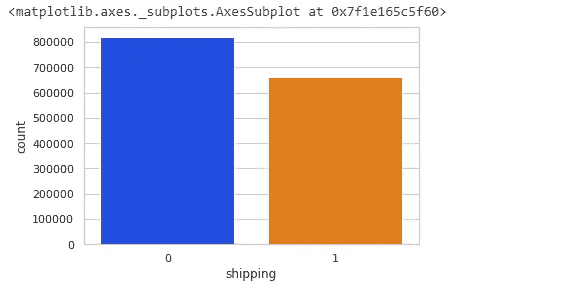

图 1:发货计数图

我们可以看到“shipping”列中有两个唯一的值。当 shipping=0 表示运费由客户支付，shipping=1 表示运费由卖方支付。

平均价格唯一运输价值

*   观察:
*   这里我们可以看到，如果 shipping=0 ie。运费由客户支付，因此价格较高，这与实际情况相反。在大多数情况下，如果产品价格较低，运费由客户支付，而当价格较高时，运费由卖方支付。当 shipping = 1ie 时，这里的场景是不同的。运费由卖家支付，所以价格很低。

**2.3 单变量分析:item_condition_id**

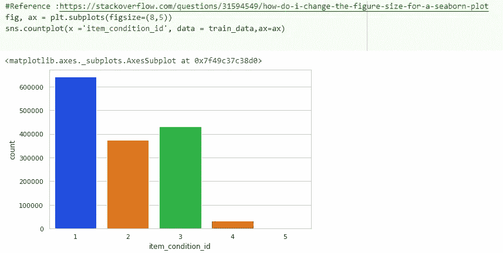

图 2:项目条件标识的计数图

item_condition_id=1 的产品较多，item_condition_id=5 的产品较少。

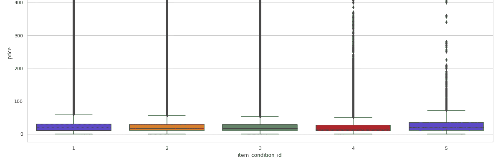

图 3:与项目条件标识相关的价格分布

从上图中可以看出，item_condition_id= 5 的产品价格略高于 item_condition_id 不为 5 的产品。

**2.4 单因素分析:价格**

价格百分点

我们可以看到，50%的产品价格低于 17 美元。有 70%的产品价格低于 26 美元。

有 90%的产品价格低于 51 美元。大多数产品的价格都很低。

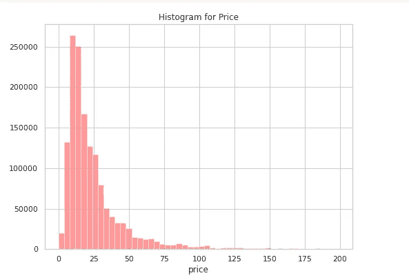

图 4:价格直方图

**2.5 单变量分析:类别名称**

我们可以看到,“category_name”列有三个子类别，由“/”分隔。这里，我们通过从“category_name”中拆分类别来创建新的三列。

拆分 category_name 列的子类别

*   类别 1:

每个类别的数据点 _1

*在 category_1 列中有 11 个独特的类别。我们可以看到“女性”是 column_1 中出现频率最高的类别。

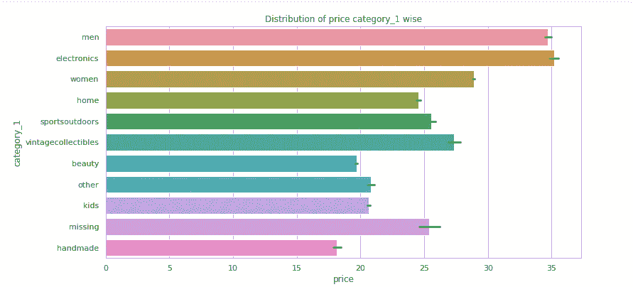

图 5:每个类别的价格分布 _1

我们可以看到每个类别 1 的价格都有变化。不同的类别 1 在价格上有差异。因此，类别 1 可能是预测的重要特征。

*   类别 2:

category_2 中的唯一类别

在 category_2 列中有 114 个唯一的类别。

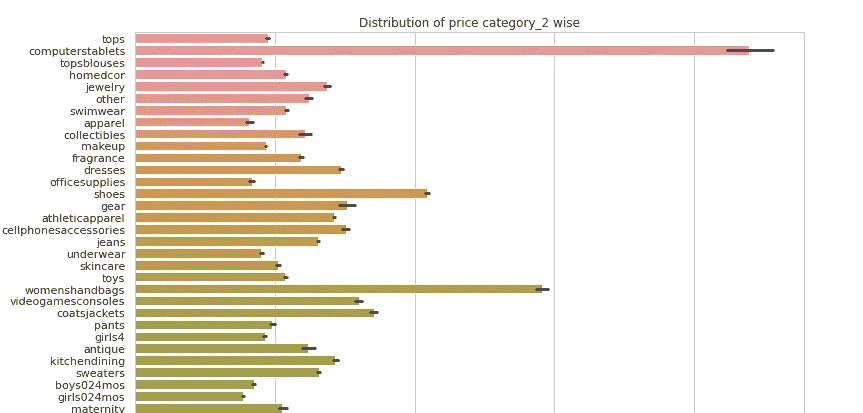

图 6:每个类别的价格分布 _2

我们可以看到每个类别的价格有很大的差异。不同的类别 2 在价格上有差异。因此，类别 2 可以作为预测的重要特征。

*   类别 3:

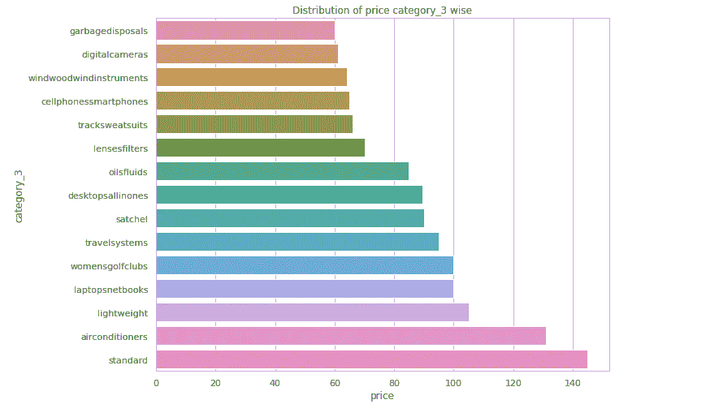

图 7:每个类别的价格分布 _3

这里只考虑来自 category_3 列的价格更高的顶级类别。我们可以看到每个类别的价格有很大的差异。不同的类别 3 在价格上有差异。因此，类别 3 可以作为预测的重要特征。

**2.6 单因素分析:brand_name**

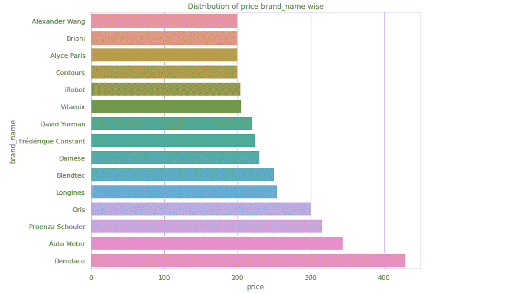

图 8:每个品牌名称的价格分布

我们可以看到每个品牌的价格有很大的差异。不同的品牌价格不同。因此，品牌名称可能是预测的重要特征。

# **第三步:数据预处理**

*   文本特征:“item_description”和“name”列是使用 regex 预处理的文本特征。所有数据清理任务都像删除停用词一样完成(“我”、“我”、“哪里”等)
*   分类特征:分类特征如“品牌名称”、“类别 1”、“类别 2”和“类别 3”被预处理为从它们中移除特殊符号。

# 步骤 4:特征工程

*   文本特征的特征工程:这里有两个文本栏。“name”和“item_description”连接在一起形成新列“cleaned_text”。

特征工程

*   分类数据的特征工程:从探索性数据分析中，我们知道“类别 1”、“类别 2”、“类别 3”和“品牌名称”是有用的特征，因为它们随价格而变化。因此准备了以下新功能:
*   brand_median_price:训练数据中每个唯一品牌名称的中间价格
*   cat1_median_price:列车数据中每个唯一“category_1”的中间价格
*   cat2_median_price:列车数据中每个唯一“category_2”的中间价格
*   cat3_median_price:列车数据中每个唯一“category_3”的中间价格
*   brand_mean_price:训练数据中每个唯一品牌名称的平均价格
*   cat1_mean_price:列车数据中每个唯一“类别 1”的平均价格
*   cat2_mean_price:列车数据中每个唯一“类别 2”的平均价格
*   cat3_mean_price:列车数据中每个唯一“类别 3”的平均价格

# **步骤 5:训练和交叉验证数据分割**

这里，训练数据被分成训练和交叉验证数据。为了获得最佳的超参数，我们使用交叉验证数据。因此，使用最佳的超参数，我们可以在测试数据上获得良好的结果。

# **步骤 6:特征化**

所有的机器学习和深度学习模型都是对数字数据进行处理的。因此，为了将所有文本和分类特征转换成数字数据，我们正在进行如下特征化。

*   分类特征的一种热编码:分类特征，如“category_11”、“category_2”、“category_3”和“brand_name”，一种热编码用于将这些特征转换成数字格式。
*   文本特征上的 TFIDF 矢量器:TFIDF 矢量器应用于“cleaned_text”哪个文本特征。
*   数字特征的标准化:标准化应用于数字特征，如“品牌 _ 中值 _ 价格”、“类别 1 _ 中值 _ 价格”等。

## **数据矩阵:**

现在我们要把所有的特征叠加起来，形成数据矩阵。

# **第 7 步:绩效指标**

Kaggle 给出了均方根对数误差(RMSLE)作为这个问题的性能度量。

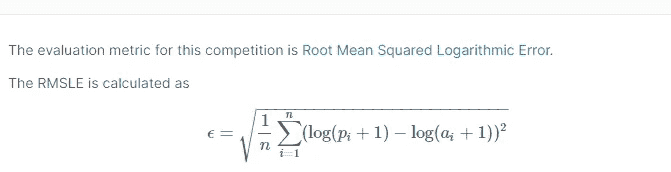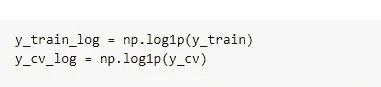

将价格转换成日志形式

性能指标是均方根对数误差，因此价格值被转换为对数形式，以便用于模型训练。

# **步骤 8:机器学习建模**

**8.1 第一次切割方法:**

这里简单的岭回归应用于具有不同 alpha 值的训练数据。这是一个简单的模型，用来观察它的表现以及训练需要多少时间。以便进一步应用复杂的模型。对于超参数调整，使用 GridsearchCV。对于岭回归，训练时间不高。

**岭回归:**

*   执行 L2 正则化，即在优化目标中添加相当于系数大小的**平方的惩罚。**

里脊回归

使用岭回归的均方根对数误差为 0.4880。

现在让我们尝试一些复杂的模型:

**8.2 LGBM 回归量:**

Light GBM 是一个基于决策树算法的快速、分布式、高性能梯度****框架，用于许多机器学习任务。****

****选择 LGMB 回归器而不是 xgboost 的原因:****

1.  ******更快的训练速度和更高的效率** : Light GBM 使用基于直方图的算法，即将连续的特征值放入离散的箱中，加快了训练过程。****
2.  ******更低的内存使用率:**将连续值替换为离散值，从而降低内存使用率。****
3.  ******与大数据集的兼容性:**与 XGBOOST 相比，它能够在训练时间显著减少的情况下与大数据集表现一样好。****

****应用 LGBM 回归器，并使用 RandomizedsearchCv 进行超参数调整，以获得最佳“最大深度”和最佳“n 估计值”。****

****使用 LGBM 回归器的超参数调整****

****当 LGMB 应用于具有最佳超参数的数据时，它给出 RMSLE =0.4810，比岭回归略好。****

## ****观察:****

****1)岭回归器是用于回归任务的简单线性模型，其给出了类似于基于树的 LGBM 模型的良好结果。岭回归器耗时更少。****

****2) LGBM 回归器是基于树的模型，其给出的结果略好于岭回归，但是岭回归器和 LGBM 回归器的结果没有太大差异。LGBM 回归比岭回归耗时更多。****

# ******第九步:深度学习模型******

****在尝试了机器学习模型之后，我们将应用深度学习模型来提高分数。****

******深度学习模型的特征工程:******

1.  ****“item_description”和“name”列连接在一起，形成“cleaned_text”功能。****
2.  ****“名称”、“品牌名称”和“类别名称”连接在一起，并获得“清洁名称”特征。对于深度学习模型,“category_name”列中的类别不会像机器学习模型一样拆分。****

****特征工程:深度学习****

******深度学习模型的特征:******

1.  ****文本特征:TFIDF 矢量器应用于“cleaned_text”和“cleaned_name”列。****
2.  ****一个热编码:对于“发运”和“item_condition_id ”,应用一个热编码。****

# ******9.1 深度学习模型:******

****在应用了机器学习模型之后，我们来看看深度学习模型的表现如何。****

******多层感知器:******

******MLP** 代表多层感知器，是神经网络的经典类型。它们可以有一层或多层神经元。数据被提供给输入层，可能存在一个或多个提供抽象级别的隐藏层，并且在输出层(也称为可见层)上进行预测。 **MLP** 是一类前馈人工神经网络。****

****这里使用 MLP 来解决回归问题，并获得比机器学习模型更好的分数。****

****不同数量的层和每层不同数量的节点，应用激活函数。通过对具有以下规格的不同数量的时期运行模型，用 MLP 获得最佳结果:****

****本案例研究中使用 MLP 网络包括:****

*   ****五个隐藏层****
*   ****激活功能:relu****
*   ****优化器:Adam****
*   ****学习率:3e-4****

****使用 MLP 评分****

****使用简单的 MLP 架构，均方根对数误差(RMSLE)得以降低。所以简单的深度学习模型比机器学习模型给出了更好的结果。****

## ******第 10 步:在 kaggle 中最终提交:******

****Kaggle 得分在本次比赛的所有得分中排名前 8%:****

********

****图 9: Kaggle 得分****

# ******第 11 步:未来工作******

****1.使用不同于 TFIDF 矢量器的特征化技术，可以提高模型性能。****

****2.对文本数据使用嵌入层，并使用像 LSTM 那样的序列模型，可以改进模型。****

****3.随着更复杂的深度学习模型的出现，性能可能会变得更好。****

## ******模型结果对比:******

****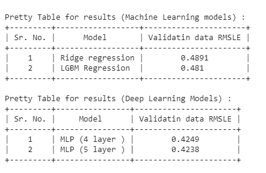****

****图 10:所有模型的结果表****

******参考文献:******

1.  ****[https://www.appliedaicourse.com/](https://www.appliedaicourse.com/)****
2.  ****[https://www.kaggle.com/c/mercari-price-suggestion-challenge](https://www.kaggle.com/c/mercari-price-suggestion-challenge)****
3.  ****[https://towards data science . com/a-data-science-case-study-with-python-mercari-price-prediction-4e 852d 95654](https://towardsdatascience.com/a-data-science-case-study-with-python-mercari-price-prediction-4e852d95654)****
4.  ****[https://www.kaggle.com/apapiu/ridge-script](https://www.kaggle.com/apapiu/ridge-script)****
5.  ****[https://www.kaggle.com/huguera/mercari-data-analysis](https://www.kaggle.com/huguera/mercari-data-analysis)****

******LinkedIn 个人资料:******

****领英简介:[https://www.linkedin.com/in/renuka-jagdale-7ba79314a](https://www.linkedin.com/in/renuka-jagdale-7ba79314a)****

******GitHub 简介:******

****github:[https://github.com/RenukaJagdale](https://github.com/RenukaJagdale)****

****感谢阅读。继续读，继续学。****