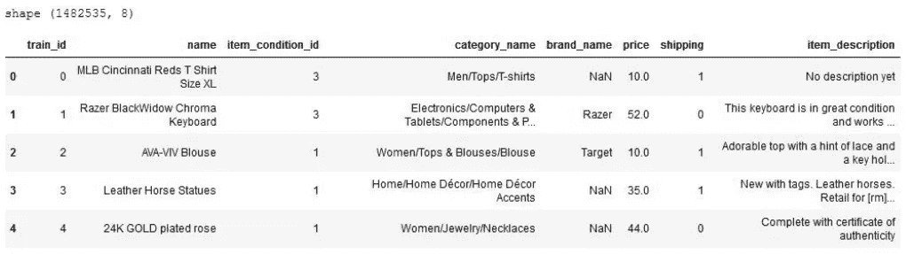
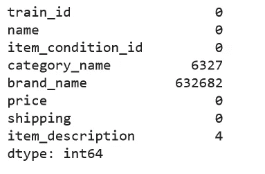
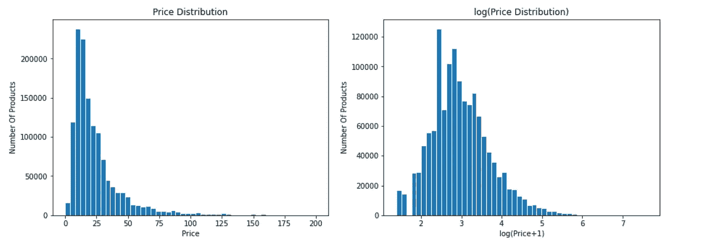
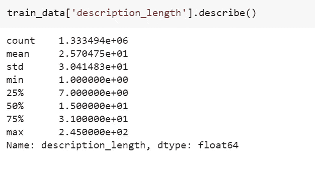
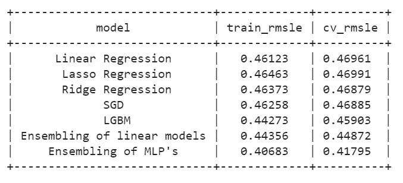

# Mercari 价格建议挑战

> 原文：<https://medium.com/analytics-vidhya/mercari-price-suggestion-challenge-66500ac1f88a?source=collection_archive---------6----------------------->

> 这是我在 kaggle 环境中的第一次数据科学体验。虽然挑战本身很有趣，体验也很神奇，很直观。我希望你在博客的最后意识到你学到了一些东西。

在**机器学习**和**深度学习**出现的今天，电子商务网站上重新调整产品的建议和推荐相当普遍。 [**麦卡利**](https://www.mercari.com/) 就是这样一个例子。

Mercari 是一个在线购物市场，由日本最大的社区之一提供支持，用户可以在这里出售几乎任何东西。

社区希望向卖家提供价格建议，但这是一项艰巨的任务，因为卖家可以在 mercari marketplace 上放置任何东西或任何一捆东西。因为产品的价格取决于它的品牌和产品的用途。不同品牌的相同产品价格不同是很常见的。

例如，其中一件毛衣售价 335 美元，另一件售价 9.99 美元。你能猜出哪个是哪个吗？大概不会！！

但是，如果我建立一个系统，使一切自动化，这样它就消除了建议和增加市场中的买家的人工努力。这就是机器学习和深度学习派上用场的地方。

## 业务问题:

理解给定的问题陈述是数据科学之旅中最重要和最具挑战性的部分。因此，不要浪费时间，让我们探讨一下 Mercari 的业务问题。

Mercari 社区希望我们建立一个算法，根据产品名称、用户输入的产品文本描述、类别名称、品牌名称、商品状况和运输信息，为购物应用程序建议正确的产品价格。在这里，定价是关于在供给和需求之间找到一个中间点。是不是很好玩？

现在，我将带您了解挑战背后的乐趣，以及我处理这个问题的可能解决方案。

## 数据来源:

虽然这是一个 kaggle 问题，但是可以从 kaggle 本身提取数据。下面会提到 Kaggle 链接。这里有五个文件，其中 train.tsv 是训练数据，test_stg2.tsv 是最终提交的测试数据，sample_submission_stg2.csv 是样本提交文件。

https://www . ka ggle . com/c/mercari-price-suggestion-challenge/data

## **现有方法:**

我将提供一个视频链接，讲述本次比赛的一等奖得主**pawei 和**Konstantin 采用的方法。

[*https://www.youtube.com/watch?v=QFR0IHbzA30&t = 2998s*](https://www.youtube.com/watch?v=QFR0IHbzA30&t=2998s)

I)他们很好地解释了优化的东西，比如使用声明性的而不是命令性的语句。

II)对于文本预处理，他们使用词干，BOW，一种用于分类特征的热编码。

III)他们使用 LSTM、CNN 和 relu 作为激活单元，adam 作为优化器，并包含文本数据的单词嵌入，作为应对这一挑战的解决方案。

你也可以查看下面的链接，找到一些类似的思俊和的解决方案。

[https://sijunhe . github . io/blog/2018/03/02/ka ggle-mercari-price-suggest-challenge/](https://sijunhe.github.io/blog/2018/03/02/kaggle-mercari-price-suggestion-challenge/)

## 首次切割方法:

拥有领域知识和理解数据模式确实有助于解决 ML 问题。因此，作为第一步，我想通过探索性数据分析( **EDA** )中的各种绘图技术来探索更多关于数据的信息，以便更好地理解数据。我还想知道目标变量的分布。

对于特征提取，我想使用术语频率逆文档频率( **Tfidf** )和单词包( **BOW** )。我还想引入新的数据功能，如情感分析，停用词计数等..,

我想尝试线性，套索，山脊，LBMs 和简单的 MLPs 作为我的基础模型。抛一抛，我想尝试我的模型组合。

## 目录:

**第一章:数据报废/数据提取/数据导入**

**第二章:探索性数据分析**

**第三章** : **通过 ML 回归模型求解**

*   步骤 3-1:特征工程。
*   步骤 3–2:拆分数据。
*   步骤 3–3:特征提取。
*   步骤 3–4:处理数字特征。
*   步骤 3–5:回归模型。

**第四章:通过深度学习的解决方案——多层感知器(神经网络)的概念**

*   step _ 4–1:处理缺失值
*   步骤 4–2:特征提取
*   步骤 4–3:构建模型架构

第五章:结论。

> **第一章:数据提取:**

对于这个案例研究，我使用 google colaboratory 来访问 **GPU 和高 RAM。**

我用 Curlwget 来更快地下载数据。要了解更多这方面的信息，请点击以下链接:[https://www.thegeekstuff.com/2012/07/wget-curl/](https://www.thegeekstuff.com/2012/07/wget-curl/)

因为给定数据采用制表符分隔值格式(**)。tsv** 我们可以把它转换成逗号分隔的值(**)。csv)** 文件。

转换中。tsv 文件到。csv 文件格式

我们可以看到，我们的训练数据由 14 万多个数据点组成。虽然这是我们可以看到一些值丢失的前 5 个数据点(**南**)。

**检查数据中的缺失值:**

每个特征中 NaN 值的数量。

正如我所料，该数据集包含缺失值，通常称为 NaN 值，因此，在对这种类型的数据应用任何模型之前，我们需要填充该数据或简单地将其作为空字符串

**处理数据中的缺失值:**

在 category_name 特征的每个数据点中，我们可以看到三个不同的类别。因此，这里我们将这三个类别分为三个特征，同时我们将在其中填充 NaN 值。

将类别功能拆分为三个新功能

在商品描述和品牌特征中填入 NaN 值

> **第二章:探索性数据分析:**

在统计学中，EDA 是一种分析数据集的方法，通常总结主要特征，并经常用于发现模式以发现异常，测试假设并检查我们对数据做出的主要假设。

## **单变量分析:**

**子类别 1:**

我们可以看到，产品的前三个主要类别是女性、美容和儿童。近 60 万的产品以女性为主要类别。

类似地，对 sub_category2，sub_category3 做同样的操作，我们得到了下面的结果。

**子类别 2:**

以前 10 个子类别 2 为例，我们有以下分析:

从上面的柱状图我们可以看到，近 120 万卢比的产品是运动服装。化妆品和上衣&衬衫是下两个重复出现的子类别。

**子类别 3:**

以 sub_category3 中的前 10 个子类别为例，我们进行了以下分析:

裤子、紧身衣、打底裤、脸等类别是子类别三级中重复次数前三的东西。

从上面的分析可以清楚地看出，数据集包含了与女性最相关的大多数产品，如化妆品、连衣裙和一些女性的相关配饰。现在让我们探索数据中的其他特征。

品牌名称:

Nike 和 PINK 是最常见的两个品牌，这两个品牌的产品比例几乎相等。维多利亚的秘密是比赛中的下一个。正如我们已经知道的，大多数产品在数据中没有品牌，那么显然未知品牌将在所有这些品牌中名列前茅。但作为可视化的一部分，我跳过了这一步。

**名称:**

取数据中重复次数最多的前 10 个产品名称。

捆绑、保留和匡威是重复次数最多的产品名称的前三名。数据中有近 2000 个捆绑产品。

## 项目条件标识:

值为 1 的 Item_condition_id 是数据中重复次数最多的 id。近 600 万卢比的数据包含以 1 作为条件 id 的产品。而 item_condition_id 为 5 是训练数据中所有产品中重复次数最少的 id。

## 运输:

*   我们可以看到，大部分运费只由买家支付。(55.3%)
*   44.7%的产品的运费由卖家支付。

**价格(目标值):**

对价格的完整描述，这是我们的目标价值

价格对日志(价格+1)

在左图中，我们可以看到价格特征严重右偏，更像是遵循右偏分布，以便使低价的误差比高价的误差更相关，竞争已经采取了均方根对数误差( **RMSLE** )。因此，我们在这个数据集中取了目标变量(价格)的 log(价格+1)。

## 双变量分析:

**运费 vs 价格:**

在上面的 pdf 图中，装运 0 比装运 1 具有更高的峰值，并且两个 pdf 图几乎彼此合并。

**品牌和非品牌产品与价格:**

正如我已经预料到的，品牌产品比低峰值的产品具有更高的峰值，这意味着品牌产品会比没有品牌的产品相对具有更高的价格。

**项目条件标识与价格:**

item_condition_id 为 5 的产品的第 50 个百分位数高于具有其它条件 id 的产品。除了 item_condition_id 的值为 5 的产品之外，几乎所有的图都具有相同的范围。

> **第三章:通过机器学习回归模型的解决方案:**

在博客的开始，我已经说过我们将使用 ML 和 DL 模型来解决这个问题。让我们在这些数据上尝试不同的机器学习模型。

## 步骤 3–1:文本数据的特征工程:

到目前为止，我们已经完成了数据分析。现在有趣的部分出现了，那就是特征工程。

我们已经看到了文本数据，即 item_description，我已经尝试使用各种功能工程技巧，但我发现了四种方法来在我的数据中获得有趣的模式。所以我在我的数据中添加了这些特征，这将在下面清楚地讨论。

*   item_description 中的停用词数量
*   项目 _ 描述长度
*   是品牌化的
*   通过 vader 词典进行情感评分分析

**I)停用词的数量:**

我们来统计一下物品描述中的停用词数量。这将是我们的新功能。

计算 item_description 中停用字词的数量

现在，在进入下一个特征工程之前，我们需要对数据进行预处理。请注意，我没有在上面的函数中使用预处理文本，因为在预处理步骤中，它将删除所有的停用词，因此我们在预处理数据之前对停用词进行了计数。

**文本预处理:**

在应用特征工程之前，文本数据的预处理是我们需要做的最重要的步骤。

基本的文本预处理包括以下步骤:

I)用完整表格代替速记。在这里，像“不会”这样的词将被替换为“不会”等..,

ii)我们将用空字符串替换\r、\、\n 这样的字符串文字

iii)去除字母数字字符以外的字符。

文本是标点符号、特殊字符、空格等的组合..，这些在模型训练中不再有用。因此，我们将删除所有这些字符。

iv)停用词的删除:

1.  通常，文本数据包含**停用词**，这些停用词作为特征不再有用，因为它们只是为了在英语中表达完整的意思
2.  因此，有必要删除对回归模型无用的停用词。
3.  一种方法是使用 **nltk** (自然语言工具包)

基本文本预处理

现在我们完成了文本预处理，为了可视化预处理后的文本，我们将在这里使用 **Wordcloud** 来查看在 item_description 中出现频率最高的单词。重复次数最多的单词比其他任何单词都要大。

使用 wordcloud 可视化预处理文本

*   从上面的 wordcloud(品牌、新、免费、发货、描述、还)是物品描述中最常见的词。
*   卖家使用新的、免费的、送货的、描述性的词语向买家宣传他们的产品。
*   现在让我们看看预处理文本中重复次数最多的前 25 个单词。

*   **新**和**尺寸**是物品描述中重复次数最多的两个顶级词汇。
*   近 450 万卢比的产品在商品描述中使用了 new。

作为下一个功能工程任务，让我们使用 item_description、is_branded 和情感分析作为我们的新功能，

**II)项目 _ 描述长度:**

描述长度特征的完整描述。

**III)是 _branded:**

*   我们可以看到，大多数产品没有品牌。这可以作为我们数据的一个特征。
*   我们知道不同品牌的产品价格不同。这是基于它正在生产的公司。但是一个好的品牌会比不同品牌的相同产品有一个好的价格。
*   因此，两个不同品牌(已知品牌，未知品牌)的类似产品可以帮助我们了解产品的价格。

**四)情感得分分析:**

*   情感得分分析经常被用作处理文本数据的特征工程黑客。
*   它试图在给定的文本中识别和提取观点。
*   情感分析是一个棘手的部分，但是通过在 python 中使用 nltk，它变得很方便。
*   它将返回四个值:正的、负的、中性的和复合的。

要了解更多信息，请点击以下链接:

[https://www . geeks forgeeks . org/Facebook-情操-分析-使用-python/](https://www.geeksforgeeks.org/facebook-sentiment-analysis-using-python/)

**情感评分分析如何帮助我们完成任务？？**

*   更常见的是，正面描述的产品可能收费较高。类似地，负面描述产品可能收费较低。
*   这意味着它们与我们的数据中的描述和价格(目标值)有一些关联，这标志着我们的任务有了良好的氛围。

正如我们所看到的，他们将有四个价值观，积极的，消极的，中性的和复合的。现在这四个将成为我们在数据中的新的四个特征。

## 步骤 3–2:拆分数据:

分割数据主要对机器学习的**超参数调整**部分有用。由于每个任务 ML 在模型训练中起着关键作用，并且为了使我们的模型在测试数据上相当好，调整模型超参数是重要的。

为了完成这项任务，我们需要数据，这些数据通常取自小部分的训练数据，如基于训练数据大小的 1-2 %,可以称为交叉验证数据或简单的验证数据。

在给定的数据集中，我找到了 831 种零价格产品。但是市场上不会有价格≤0 的产品。它们可能是异常值或人为错误。所以我已经把这些产品从数据中剔除了。

## 步骤 3–3:特征提取:

我们已经完成了特征工程，现在是特征提取的时候了。我们的数据是分类、数字和文本特征的组合。但是我们只能向任何 ML 模型提供数值数据。让我们看看如何使用特征提取技术来实现这一点。

矢量化可用于文本数据。让我们使用单词包( **BOW** )表示分类和术语频率，使用逆文档频率( **TFIDF** )表示文本数据。

**分类特征的矢量化(一个热编码):**

我们将子类别 1、子类别 2、子类别 3、品牌名称、名称作为我们的分类特征。

通过**计数矢量器的 **sklearn** 实现可以实现一次热编码。**下面是完成这项工作的代码片段。

分类特征的一种热编码- sub_category1

请注意，countvectorizer 的拟合只应在训练数据上进行。

对 sub_category2、sub_category3、brand_name 和 name 特征等其他分类特征执行相同的操作。

**文本特征的矢量化:**

它们对于将文本特征转换成数字格式是不同的，如 TFIDF、word2vec、加权平均 word2vec、使用手套向量等..,

正如我们对分类特征使用简单的单词包一样，我们将使用 TFIDF 作为我们的文本特征(item_description)。

下面是实现此任务的代码片段。

item_description 矢量化

我在这里只选取了前 5000 个特性，其中每个特性都有至少 10 个文档的频率。我还使用了双字母组合来描述项目。

## **步骤 3–4:处理数字特征:**

在向我们的数据添加新特征之后，我们总共有 6 个数字特征。(正、负、中性、复合、描述 _ 长度、计数 _ 停用词)

**特征 _ 缩放:**

由于数字特征包含不同的比例值(有些可能非常高，有些可能非常低，有些也可能是异常值),因此在解决优化问题时，对这些特征进行重定比例非常重要。这些可以通过使用标准化、规范化、最小最大值等多种方式来实现..,

我使用了标准化，这意味着值将遵循标准正态分布，通过拟合平均值=0 和标准差=1 的每个要素的值。

同样，我们也将对其他数字特征进行同样的处理。查看 github 资源库，获取完整的代码指南。

**二元特征和 item_condition_id:**

现在，我们只剩下商品标识、品牌和运输特征。这些也是一种分类特征。我们将使用 pandas.get_dummies()将其转换为矢量表示，并最终将其制作成稀疏矩阵。

可以用 sklearn 来完成。对于我们来说，这就是事情变得更容易的原因，不需要为它编写显式的代码，也不需要在一行代码中完成。

**所有功能的串联:**

我们已经得到了所有分类和文本特征的数字格式。现在，我们将把所有这些特征合并成一个最终的稀疏矩阵，它将被馈送给我们的机器学习回归模型。

## 步骤 3–5:回归模型:

现在我们都开始应用回归模型来解决我们的问题。但是对我们的数据应用哪个模型呢？？

迷茫吧？

**机器学习**是世界上发展最快的领域。每天都会有一系列新算法推出。它们中的一些可能对数据起作用，而一些可能不起作用。他们没有这样的最大似然算法可以给出比现有模型更好的结果。如果它存在，那么所有的模型都将被扔进垃圾箱。基于先验知识、领域专家、从问题陈述甚至从一等奖获得者中选择算法来解决他们的问题。

作为实验，我使用了四个线性回归模型和一个 boosting 模型:

*   线性回归
*   里脊回归
*   套索回归
*   SGD 回归器
*   像 LGBM 这样的助推模型

最后，我们还将尝试从这些模型中组合出最佳模型。

**超参数调整需求:**

超参数在模型预测中起着重要的作用，因为使用超参数调整，我们可以抗议我们的模型过拟合和欠拟合。

因此，我们需要以这样一种方式选取这些值(超参数),即训练和测试误差都很低并且彼此一致。

出于超参数调整的目的，我们使用 gridsearchcv 和三重交叉验证数据。

**I)线性回归:**

线性回归是一种基本、简单和常用的预测分析类型。线性回归的总体思想是检查两件事:

*   一组预测变量在预测一个结果(因变量)方面做得好吗？
*   哪些变量特别是结果变量的重要预测因子，它们以何种方式——由 beta 估计的大小和符号表示——影响结果变量？
*   这些回归估计用于解释一个因变量和一个或多个自变量之间的关系。

**线性回归的 RMSLE:训练时为 0.4612，cv 数据时为 0.4693**

在线性回归中不存在超参数调整，因为模型本身会找到一个最适合数据的平面。

这是一个简单模型的好成绩，但让我们尝试一些其他模型，通过执行超参数调整来改善指标。

**II)套索回归:**

**最小绝对收缩和选择运算符**简单套索是一种回归分析方法，可执行变量选择和正则化

*   套索回归类似于线性回归，但除了线性回归之外，它还执行收缩。
*   不像线性回归拉索有超参数调整超参数:阿尔法

我得到了 alpha = **1e-09** 作为最佳值。所以我再次用最好的 alpha 值训练模型。

**Lasso 回归的 RMSLE:训练集上为 0.4642，cv 数据上为 0.4699。**

*   在做了所有的事情之后，我们得到了 0.4699 RMSLE，这大约等于线性回归的 RMSLE。
*   但是，与 LR 相比，训练和 cv 误差之间的差异很小，这意味着与 LR 模型相比，该模型的过拟合较少。

**III)岭回归:**

岭回归是一种分析多重共线性数据的技术。

*   通过系数收缩降低了模型的复杂度。
*   它也是一个线性模型。
*   此回归模型中也有超参数{alpha，solver}。我们将在这里使用两个解算器，即 cholesky 和 lsqr，作为超参数调整的目的。

我将 alpha = 10 和 solver = 'cholesky '作为最佳值。所以让我们用这些值来训练模型。

**岭回归的 RMSLE:训练样本为 0.4637，cv 数据为 0.4667。**

结果略好于上述两个模型。

**IV)新币回归量。**

随机梯度下降(SGD)是一种简单但非常有效的方法，用于线性分类器在凸损失函数如(线性)下的判别学习。

*   每次估计每个样本的损耗梯度，并且模型随着强度的降低而更新，即..学习率。
*   这是一种迭代方法，用于优化具有适当光滑性质的目标函数。因此它也被称为优化算法。

我将 alpha = 1e-09 和 learning_rate = 'adaptive '作为最佳值。所以让我们用这些值来训练模型。

**SGD 回归的 RMSLE:训练上为 0.4625，cv 数据上为 0.4688。**

**V) LGBM 回归量:**

到目前为止，我们已经尝试了四个简单的线性模型。所以现在让我们尝试一个叫做 LGBM 的助推模型。

Light GBM 是一个基于决策树算法的快速、分布式、高性能梯度提升框架。

*   比我们在数据集上训练的其他模型训练速度更快，效率更高。
*   我们可以看到它占用的内存更少。
*   它支持并行学习，并兼容更高的数据集。

我们可以看到，在 lgbm 中有许多超参数需要调整。在做了所有的事情之后，我得到了“learning _ rate”:0.1，“max_depth: 15”，“n_estimators: 200”，“num_leaves: 75”，“boosting _ type”:“gbdt”作为我的最佳值。

它比我们迄今为止训练过的任何其他模型都有更好的性能。

**LGBM 回归器的 RMSLE:在训练集上为 0.4427，在 cv 数据上为 0.4590。**

## 合并所有模型的结果(集合):

作为在我们的模型中使用集成的承诺，让我们使用这个 toss 模型。

我选择了四个最好的模型，并根据它们的性能为每个模型增加了权重。下面是它的代码片段。

四个最佳模型的集合。

由于 lgbm 工作良好，我增加了 0.6 的重量，基于套索的不太适合的性质，我增加了 0.2，对于山脊和线性，我增加了 0.1。

**因此，通过机器学习回归模型，我们的解决方案在 cv 数据上的最终 RMSLE 为 0.4487。**

> **第 4 章:通过多层感知器(神经网络)的深度学习概念的解决方案**

**为什么选择神经网络？**

神经网络是一套特定的算法，它彻底改变了机器学习。它们受到生物神经网络的启发，目前所谓的深度神经网络已经被证明工作得相当好。神经网络本身是一般的函数近似，这就是为什么它们可以应用于几乎任何关于学习从输入到输出空间的复杂映射的机器学习问题。

多层感知器(MLP)是一种前馈人工神经网络，它从一组输入生成一组输出。MLP 的特征在于若干层输入结点在输入层和输出层之间连接成一个有向图。MLP 使用反向传播来训练网络。

*   这是一种深度学习的方法。
*   与任何机器学习模型不同，MLP 不需要显式的特征工程任务，因为模型本身通过反向传播适应数据中的模式。有趣吧？
*   让我们使用一个 MLP 模型，并检查它是否改善 RMSLE 指标。

现在，我们将再次加载数据，并像上面一样将其分为 train(用于训练)和 val(用于验证)。

我们从一开始就在做的事情是，为了训练，MLP 可能无法与我们在 ML 模型中引入的功能一起工作。我从这个案例研究中体验到了这个事实。

## **步骤 4–1:处理缺失值:**

我们可以看到，我已经用空字符串替换了丢失的值。根据一等奖获得者的概念，我将名称、类别名称、品牌名称和商品描述连接成一个功能，将名称和品牌名称连接成另一个功能。我还规范化了 item_condition_id 特性。

我没有采用 price，而是采用 log(price+1 ),最后我使用 minmaxscaler 对这些值进行了预处理。

## **步骤 4–2:特征提取:**

这里，我们将使用 TFIDF 矢量化作为“total_name”和“total_txt”要素的要素提取工具。

正如我所说的，MLP 模型本身通过权重适应数据中的模式，它所需要的只是通过网络传递的大量数据。我为每个矢量化选择了 1 个 lakh 特征，还包括了文本数据的二元模型。

如果您使用的是 colaboratory，那么当 Colab 崩溃时(我个人在处理这个案例研究时多次经历过这种情况),笔记本会自动断开连接，我们需要从头开始运行所有功能，因此我们不能使用超过 220 万个功能。

**项目 _ 条件 _id 和发货特征:**

正如我们在 ML 中使用 pd.get_dummies()一样，我们在这里也将使用相同的方法。

**误差度量:**

对于模型评估，我们将使用 **RMSLE** (均方根对数误差)指标。

## **步骤 4–3:构建模型架构:**

我们可以使用不同类型的神经网络架构来训练我们的模型。我们将讨论到今天为止的四大著名建筑。

**I)感知器:**

被认为是第一代神经网络，**感知器**是单个神经元的简单计算模型。他们似乎有一个非常强大的学习算法，并且对他们能学会做什么提出了很多宏伟的主张。然而，感知器学习过程今天仍然广泛用于具有包含数百万个特征的巨大特征向量的任务。

**II)卷积神经网络(CNN):**

随着时间的推移，机器学习研究广泛关注于对象检测问题。但是有各种各样的事情使得识别物体变得困难，比如分割、光照、变形等等..,

卷积神经网络可以用于从手写数字到 3D 对象的所有与对象识别相关的工作。CNN 的真正价值是在 ImageNet 上的 **ILSVRC-2012** 比赛中显现出来的 ImageNet 是一个拥有大约 120 万张高分辨率训练图像的数据集。竞赛的获胜者[**Alex Krizhevsky(NIPS 2012)**](http://www.image-net.org/challenges/LSVRC/2012/supervision.pdf)开发了一种由 Yann LeCun 开创的非常深度的卷积神经网络。这些使他们如此受欢迎。

**三)递归神经网络(RNN):**

rnn 非常强大，因为它们结合了两个属性:

1.  分布式隐藏状态，允许它们高效地存储大量关于过去的信息，以及
2.  2)非线性动力学，允许它们以复杂的方式更新它们的隐藏状态。如果有足够的神经元和时间，RNNs 可以计算任何你的计算机可以计算的东西。

**四)长短期记忆(LSTM):**

[**hoch Reiter&schmid Huber(1997)**](http://www.bioinf.jku.at/publications/older/2604.pdf)**通过建立所谓的**长短期记忆网络，解决了让 RNN 人长时间记住事情(比如几百个时间步骤)的问题。**他们设计了一种记忆细胞，使用逻辑和线性单元，具有乘法相互作用。每当单元的“写”门打开时，信息就进入单元。只要单元的“保持”门打开，信息就留在单元中。通过打开单元的“读取”门，可以从单元中读取信息。**

**我们的数据集是基于文本特征的，所以我正在构建一个简单的 **MLPs** 来训练神经网络。这是它的代码片段。**

********

*   **我已经尝试运行了几个时期的模型，但火车和 CV 上的 rmsle 都变得更糟。**
*   **因此，我对模型进行了四次训练，用不同的批量大小对每个模型进行了三次拟合。**

****

**模型预测。**

*   **现在，对于这些模型中的每一个，我对数据进行了单独的模型预测。**
*   **最后，我将所有四个模型的结果进行综合，以减少 RMSLE 度量。**

****

**综合 MLP 的 RMSLE:在列车上为 0.4068，在 cv 数据上为 0.4179**

## **所有模型的结果:**

**在训练了机器学习的各种回归模型和神经网络的 MLP 之后，我得到了 0.4179 作为我最好的 RMSLE 分数。**

****

**总结所有模型的结果**

## **最终提交分数:**

**到目前为止，我们已经在列车数据(train.tsv.7z)上使用了所有这些模型，但对于最终提交，我们有单独的数据(test_stg2.tsv)。我提交了组装 mlp 模型的价格预测，这是我们问题的最终解决方案。**

**这是我通过本次比赛的 kaggle 内核之一提交提交文件后在 kaggle 上的最终排行榜分数。**

****

**本次比赛排行榜上的最终提交分数**

> ****第五章:结论:****

****我们问题陈述的最终解决方案:****

*   **因为给定问题陈述的主要约束是减少 rmsle 度量。在对数据训练不同的 ML 模型后，我们发现 cv 数据的最小 RMSLE 为 0.44。**
*   **进一步应用 MLP，rmsle 减少到 0.41，因此这个问题的解算器是 **MLP** 。**

****关于模特培训:****

*   **我试着在未来的 5-10 个周期内训练这个模型，我从结果中观察到 rmsle 正在变得更糟。因此我把训练限制在一个时期。我达到了 0.44 rmsle。**
*   **之后，我用不同的 2 的倍数的批量对同一个 MLP 模型进行了三次拟合，rmsle 降低到大约 0.42。**
*   **现在，我对所有四个相似的经过训练的 MLP 模型进行了整合，对于每个数据点，我使用这些模型预测了价格，并最终取这些预测价格的平均值。**
*   **结果，我在 cv 数据上获得了 **0.41** rmsle。**
*   **ML 和 DL 是一项试验不同方法的任务，所以我尝试了各种方法来完成这项任务。**

## **我对现有方法的改进:**

**我没有采用单独的特征，而是将特征组合起来得到两个新特征，并通过矢量化从中提取了 20 万个新特征。我还做了这些特征的二元图，这些特征对这些数据非常有效。我还发现了产品价格等于零的数据中的异常值，因此在训练模型时，我删除了产品价格小于或等于零的所有数据点。所有这些都提高了我的模型误差度量，超过了本次比赛的在线解决方案。**

## **未来工作:**

*   **作为未来的工作，我想通过尝试模型的新工程特征来试验新的 ML 回归模型。**
*   **这个问题我也想试试卷积神经网络。我希望尝试使用不同的超参数来加快模型的收敛。**

## **参考资料:**

*   **[https://www . kdnugges . com/2018/02/8-神经网络-架构-机器学习-研究人员-需求-学习. html](https://www.kdnuggets.com/2018/02/8-neural-network-architectures-machine-learning-researchers-need-learn.html)**
*   **[https://medium . com/analytics-vid hya/mercari-price-suggestion-challenge-a-machine-learning-regression-case-study-9d 776d 5293 a 0](/analytics-vidhya/mercari-price-suggestion-challenge-a-machine-learning-regression-case-study-9d776d5293a0)**
*   **[https://sijunhe . github . io/blog/2018/03/02/ka ggle-mercari-price-suggest-challenge/](https://sijunhe.github.io/blog/2018/03/02/kaggle-mercari-price-suggestion-challenge/)**
*   **[https://www . ka ggle . com/c/mercari-price-suggestion-challenge/discussion](https://www.kaggle.com/c/mercari-price-suggestion-challenge/discussion)**
*   **[https://towards data science . com/a-data-science-case-study-with-python-mercari-price-prediction-4e 852d 95654](https://towardsdatascience.com/a-data-science-case-study-with-python-mercari-price-prediction-4e852d95654)**
*   **[https://www . Applied ai course . com/course/11/Applied-Machine-learning-course](https://www.appliedaicourse.com/course/11/Applied-Machine-learning-course)**

**这是我的第一次 Kaggle 体验，在这里我学到了应用 ML 和 DL 的真实场景。作为一名渴望成为数据科学家的人，我来到了这里。这包括我这次比赛的最终作品。谢谢你阅读我的文章。**

**您可以查看。ipynb 在我的 [**Github 存储库中获得这个案例研究的完整代码片段。**](https://github.com/ChaitanyaNarva/ChaitanyaNarva/blob/master/mercari_casestudy.ipynb)**

****关注我**了解更多关于数据科学中不同真实案例研究的文章和实现！也可以通过 [**LinkedIn**](http://www.linkedin.com/in/sai-chaitanya-narava-20b3571a0) 和**[**Github**](https://github.com/ChaitanyaNarva/ChaitanyaNarva)与我联系****

****我希望你从这件事中学到了一些东西。这方面的学习永无止境，所以快乐学习吧！！签署再见:)****