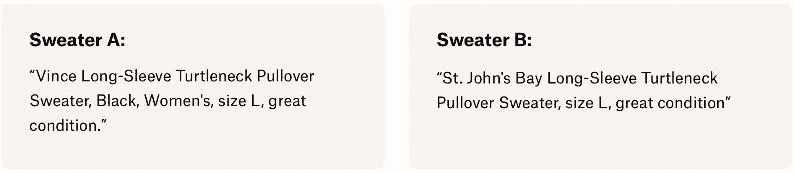
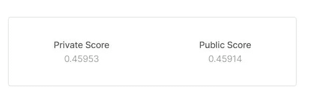

# Mercari 价格建议挑战——机器学习回归案例研究

> 原文：<https://medium.com/analytics-vidhya/mercari-price-suggestion-challenge-a-machine-learning-regression-case-study-9d776d5293a0?source=collection_archive---------1----------------------->

> 这是我的第一个媒介故事。希望你读它的时候开心，就像我喜欢为观众写它一样

现代是机器智能的时代。这些都是风靡全球的流行语，几乎每一条途径都以某种方式享受着机器学习的味道。今天，我将带大家了解一个现实世界中的数据科学问题，这个问题是我从 Kaggle 的现场比赛中挑选出来的，并将展示我解决这个问题的方法。这个案例研究从头开始解决所有问题。所以，你将会看到在现实世界中，案例研究是如何解决的每一个阶段。在我谈论我解决问题的方法之前，我将简要地向您介绍一下正在讨论的案例研究的问题陈述。

# **问题陈述**

很难知道一件东西到底值多少钱。小细节可能意味着价格上的巨大差异。例如，其中一件毛衣售价 335 美元，另一件售价 9.99 美元。你能猜出哪个是哪个吗？



Mercari 中的产品功能示例

考虑到有多少产品在网上销售，产品定价在规模上变得更加困难。服装有很强的季节性定价趋势，受品牌名称的影响很大，而电子产品的价格会根据产品规格而波动。

[日本最大的社区购物应用 Mercari](https://www.mercari.com/) ，深谙这个问题。他们希望向卖家提供定价建议，但这很难，因为他们的卖家可以在 Mercari 的市场上出售任何东西或任何一捆东西。

**挑战解决:**

给定产品的详细信息，如产品类别名称、品牌名称和商品条件，您能否构建一个算法来自动建议正确的产品价格？很有挑战性，对吧？

但如果解决得当，它可以消除给出产品价格建议的人为干扰，并加快购物应用程序的效率。这就是机器学习发挥作用的时候了。

# 将现实世界的问题映射到机器学习问题

## 机器学习问题的类型:

```
For a given item, we need to suggest the price of that item given its different features like category, name, brand name, item description etc. 
The given problem is a Regression problem as it will return the price of an item which is a real-valued value.
```

## 误差度量:RMSLE(均方根对数误差)

## 现实世界/业务目标和约束

**目标:**

1.  根据物品的状况、描述和其他相关特征，预测物品的价格。
2.  最小化预测价格和实际价格之间的差异(RMSLE)
3.  尝试提供一些可解释性

## 数据

数据概述:

从[获取数据:https://www . ka ggle . com/c/mercari-price-suggestion-challenge/data](https://www.kaggle.com/c/mercari-price-suggestion-challenge/data)

数据文件:

*   train.tsv

```
All these are tab-separated files
```

train.tsv 文件的每一行都具有下列属性/功能，这些属性/功能列出了特定产品的详细信息。

*   `train_id`或`test_id` -产品的 id
*   `name` -产品的名称
*   `item_condition_id` -卖方提供的产品状况
*   `category_name` -产品的类别
*   品牌名称:产品的品牌名称
*   `price` -产品的销售价格。**(这是你将要预测的目标变量)**单位是美元。
*   `shipping` - 1 表示运费由卖方支付，0 表示由买方支付
*   `item_description` -项目的完整描述。请注意，我们已经清理了数据，删除了看起来像价格(例如$20)的文本，以避免泄漏。这些删除的价格表示为`[rm]`

**输入特征:**列车标识，名称，项目条件标识，类别名称，品牌名称，运输，项目描述

**目标变量:**价格

我们将建立各种有监督的机器学习回归模型，并查看哪种模型能够以最佳方式成功解决输入变量和价格特征之间的给定映射。让我们以一步一步的方式开始。

## **第一步:探索性数据分析**

解决任何数据科学案例研究的第一步是正确地查看和分析您拥有的数据。它有助于对其所要传达的模式和信息给出有价值的见解。统计工具在数据的适当可视化方面有很大的作用。尽管它被认为不是解决问题的一个非常重要的部分，但是成功的数据科学家和 ML 和 ML 工程师通过分析他们所拥有的数据来花费最大的部分来解决问题。适当的 EDA 为您的数据提供有趣的特性，这反过来也会影响我们的数据预处理和模型选择标准。

首先，我们从导入解决问题所需的基本库开始。

## **加载数据:**

要加载数据，我们只需要 train.tsv 文件。我们将把它加载到熊猫数据帧中。


将 train.tsv 加载到数据帧中


我有一个包含 1482535 种产品及其价格的数据集。前 5 行如上所示。

看到一些关于数据的信息。


数据中某一行的简要概述

## **检查数据集中的空值:**

在使用任何机器学习模型之前，必须检查数据集中的缺失值。


显示数据中哪一列有空值

我们可以看到列“类别名称”、“品牌名称”和“项目描述”具有空值。有多种处理缺失值的方法，例如移除缺失值的行、移除缺失值百分比较高的要素或者用其他值填充缺失值的列。这里，我们选择用其他值来填充数据中缺失的值。

## **填充数据中缺失的值:**

函数 fill_missing_values 用一些可选值填充所有具有空值的列“类别名称”、“品牌名称”和“项目描述”。


正如您在第 0 行中看到的，最初具有空值的列“item_description”已被替换为非空值。

现在让我们对数据集中的每个特征进行单变量分析，并寻找隐藏的关系(如果有的话)。

**价格:**

这是“价格”变量在所有产品中的分布。


价格描述


所以，从描述表中我们可以得出结论:

1.  25%的产品价格低于 10 美元，50%的产品价格低于 17 美元，75%的产品价格低于 29 美元。
2.  此外，任何产品的最高价格是 2009 美元。

让我们看看“价格”变量的直方图，以便更好地了解它的分布。


价格分布直方图

可以得出结论,“价格”变量的分布严重右偏。由于“价格”变量遵循偏态分布，为了使低价产品的误差比高价产品的误差更相关，本次竞争中的评估指标是均方根对数误差(RMSLE)。因此，我将对数转换应用于价格目标变量，以使该假设可用于模型训练。因此，我们必须将“价格”功能缩小到对数尺度。


将“价格”标度改为对数标度


带“对数(价格+1)”刻度的直方图

将分布改为对数标度后，它看起来不再偏斜了。

**发货:**

产品的运输价格为“1”(买方付费)或“0”(卖方付费)。让我们看看运输特性是如何分布在所有数据点上的。


在这里，我们可以看到，对于价格较低的项目，出于利润的原因，运费必须由买方支付。还有，随着价格的上涨，我们可以看到运费已经由卖家支付。当我们在网上购买产品，并且我们的“价格”值低于免运费的特定阈值时，通常会观察到这种趋势。

**物品类别:**

让我们来看看这些项目主要涉及的项目类别。为此，我们将查看产品列表中 10 个最常见的商品类别。


从统计数据可以看出，女性服装的数量最多，其次是其他类别。

类别名称由'/'分隔符列出，分隔符说明产品的主类别、子类别 1 和子类别 2。因此，为了更好地了解每种产品，我们将在这里进行功能工程，并将类别名称分为 3 个不同的列，即“一般类别”、“subcat_1”和“subcat_2”。


category_name 拆分为 general_cat、subcat_1 和 subcat_2

拆分 category_name 列后，我在每个新形成的列中拥有的唯一项目如下所示:


**一般类别:**

让我们找出哪些产品在出现频率方面排名最高。


从上面的直方图可以看出，女性产品出现的频率最高，其次是美容产品。第三大一般类别是儿童产品。

**子类 1:**

在“子类别 1”中，大约有 114 个独特的类别。由于很难将所有类别可视化，我们将看看子类 1 中出现频率最高的前 10 项。


子类别 1 中的前 10 项

由于女性产品在一般类别中出现频率最高，因此在子类别 1 中出现频率最高的类别是运动服装，它传达了关于主要类别中观察结果的良好想法。子类别 1 中第二受欢迎的项目是化妆品，这也符合女性产品出现频率最高的理念。

**子类 2:**

在“子类别 2”中，大约有 865 个不同的类别。但是为了更好的可视化和理解，我们将在子类别 2 中绘制前 10 项。


子类别 2 中的前 10 项

众所周知，女性产品在一般类别中出现的频率最高，而运动服装在子类别 1 中出现的频率最高。因此，这显然与“裤子、紧身衣、绑腿”在子类别 2 中出现频率最高的观点一致。

**品牌名称:**

数据集中有许多独特的品牌，但我们将根据销售频率来看看 10 个最受欢迎的品牌。


销售频率排名前十的品牌

对于没有给出品牌信息的品牌名称列，我们已经用值“未知”填充了这些单元格。大多数商品的品牌名称没有列出，这可以从柱状图中推断出来。其次，大多数商品都以“粉色”和“耐克”作为品牌名称。

**物品描述:**

为了从“item_description”功能中理解有用的模式，我们将对数据进行可视化。可视化文本数据的一个好方法是绘制文字云。这将有助于我们看到描述列中出现频率最高的单词。


这里，我们用 300 个最常出现的单词绘制了一个单词云。以比其他字体更大的字体出现的单词比其他单词出现得更频繁。

## **第二步:基本特征工程和预处理:**

我们试图通过研究“item_description”列来探索数据中有意义的模式。例如，描述的长度可能会影响价格、运输或数据。我们还试验了一些附加功能，如物品描述栏的“情感评分”,以了解物品描述所传达的情感。在现实世界中，情绪积极的商品描述会比情绪消极的商品标价更高。因此，我们已经完成了功能工程，并探索了这些功能。

首先，我们需要预处理列‘item _ description ’,因为它有文本值。在 ML 现实世界的问题中，每当您遇到文本数据时，在应用任何模型之前，预处理文本数据对于提取有用的信息是必不可少的。通常，常见的预处理步骤有:

1.  将所有单词转换成小写。
2.  停用词的删除
3.  删除标点符号和特殊字符。
4.  删除不需要的多个空格
5.  处理字母数字值等等。

这些是一些常用的预处理技术，但它会随着底层数据的性质和我们要解决的目的而不断变化。下面是我们对“item_description”列进行预处理的代码片段。


“项目 _ 描述”的预处理

**物品描述长度:**


描述长度与项目价格

这里给出了描述长度与价格的关系。从图中可以看出，随着长度的增加，要价越来越低。描述长度越短的商品越有价格价值。


**物品描述情感评分:**

我们将计算数据集中每个项目描述的情感分数。


计算项目描述中文本的情感得分

Vader lexicon 中的 SentimentIntensityAnalyser 软件包用于计算情感得分。它为每个项目描述返回一个包含四个值(正、负、中性、复合)的列表。

**绘制相关矩阵:**

相关矩阵基本上是协方差矩阵，它是一种非常好的多变量探索技术。我们的数据集中已经有了这么多的特征。除此之外，我们还创建了两个额外的功能，“项目描述长度”和“项目描述的情感分数”。为了可视化一个特征是否与另一个特征有很强的相关性，我们将绘制相关矩阵。正的相关值表示更强的关联，反之亦然。


数据集中特征的相关矩阵

从上表可以看出，我们新创建的特征‘description _ len’与商品的目标变量‘price’有着相当的相关性。此外，情绪得分与“价格”变量有一定的相关性。因此，我们将把它们作为附加功能包含在我们的功能列表中。

因此，我们将选择用于建模的特征是*‘项目 _ 名称’，‘品牌 _ 名称’，‘发货’，‘一般 _ 类别’，‘子类别 _ 1’，‘子类别 _ 2’，‘项目 _ 描述 _ 长度’，‘情感 _ 得分 _ 项目 _ 描述’和‘项目 _ 描述’*。

## **拆分成训练和测试数据集:**

在应用任何 ML 模型之前，我们将把我们的数据集分成训练和测试。我们将拟合整个列车数据，并使用测试部分进行预测。此外，我们将根据我们的评估指标 RMSLE 来评估哪个模型在测试数据上表现最好。


数据集的分割

## **处理分类特征:**

**一键编码:**

在应用任何机器学习模型之前，我们的数据必须以适当的格式提供给这些模型。我们经常遇到列中数据的数值、分类值。在我们的问题中，列中的大多数数据都是分类的。因此，它们必须被转换成适当的格式以提取相关信息。尽管有许多方法来处理分类数据，但最常见的方法之一是进行一次性编码。对于那些觉得这个术语“陌生”的人，我们将在进入后续阶段之前简单描述一下。


独热编码的例子

从图中，很容易理解什么是独热编码。在“工作类”列中，有三种不同类别的值“私人”、“州政府”、“联邦政府”。为了将这种分类数据转换成独一无二的编码向量，我们检查了训练数据中存在的唯一类别的数量。由于工作类别有 3 个唯一的类别，因此工作类别字段中的任何值都将被转换为三维向量。关于该特定行的工作类值在向量的一个字段中将具有值“1 ”,而向量的所有其他字段将被标记为“0”。

针对训练数据专门进行一位热码编码，以避免数据泄漏问题。我们不包括测试数据，因为测试数据对我们来说是不可见的。因此，如果任何类别在测试时出现新的，我们将忽略该值，而转换成一个热编码的形式。

因此，我们将“名称”、“品牌名称”、“一般类别”、“子类别 1”、“子类别 2”作为具有分类值的列。我们将把这些分类值转换成独热编码形式。如何做到这一点的代码片段如下所示。

**名称:**


同样，对**品牌名称、一般类别、子类别 1、子类别 2** 的矢量化也已完成。

## **处理文本功能:**

就像分类特征一样，我们也必须处理数据中的文本特征。数据中包含文本特征值的列是“项目描述”。有不同的方法将文本特征转换成数字格式，如 BOW、TF-IDF、Word2Vec。在这个问题中，我们已经为项目描述值中的所有单词计算了 TF-IDF 向量。

**物品描述:**

这是如何对文本特征执行 TF-IDF 矢量化的代码片段。


## **处理数值特征:**

由于不同类型的要素的最小值和最大值的范围不同，数字要素可能很难处理。在本节中，我们将在输入机器学习模型之前处理数字特征。

由于数字特征可能具有不同的比例值，因此我们对特征进行了归一化，并分配了一致性，以便不会在特征之间存在比例差异的情况下训练模型。Scikit Learn 有一个内置的规格化器库来规格化给定范围内的值。下面是数字特征和处理数字特征的代码片段。

**物品描述长度:**


以类似的方式，对描述中的项目的**情感分数进行了归一化。关于它的细节可以参考 GitHub repo。**

**发货和商品条件 id:**

列“Shipping”和“Condition id”也是分类变量，我们采用了一种更简单的方法对其进行一次性编码。Pandas 包含 get_dummies 方法，这是对分类变量进行一次性编码的最快方法。获取分类值的向量表示只需一行代码，返回的输出也是 dataframe 类型。“get_dummies”方法中的算法将识别分类特征，并将自动获得独一无二的编码值。下面是如何做到这一点:


## **合并矩阵中的所有特征:**

在处理了所有类型的特征之后，我们离机器学习建模只有一步之遥了。为了使用我们转换后的特性，我们将把它们全部合并到一个矩阵中，并将该矩阵水平地(按列)顺序转换成压缩的稀疏行格式堆栈数组。需要注意的一点是检查训练和测试特征矩阵的形状。以下是如何使用 Scikit Learn library 的 hstack 将矩阵中的所有特性结合起来。Hstack 创建一个水平序列的连接形式的数组。


## 步骤 3-机器学习建模:

在完成了数据的统计分析和清理之后，我们还做了一些特征工程，从已有的特征中增加了两个新的特征——‘T0’条目描述长度‘T1’和‘T2’条目情感分数‘T3’。我们还处理了分类、文本和数字特征，并合并到训练和测试数据矩阵中。我们现在准备在准备好的数据矩阵上应用机器学习算法。

## **机器学习建模及最佳参数选择:**

当你在处理一个特定的问题时，有许多机器学习算法可以尝试。你永远不知道哪种 ML 模式最适合你。然而，领域知识和实践中的专业技能有时确实会发挥作用。但是对于任何想掌握技能的人来说，最好的选择是通过实验。因此，我试验了几个回归模型，并检查了哪一个表现最好。使用模型时，对模型进行超参数调整也非常重要。您为 ML 模型选择的超参数集是至关重要的，因此请记住这一点。

我试验了四种机器学习回归模型:

1.  **岭回归**
2.  **随机梯度下降回归**
3.  **随机森林回归**
4.  **光梯度增强回归**

我对每个模型都进行了超参数调整。从通过在训练数据集上训练而获得的最佳超参数中，它被用于预测测试数据集上的价格值，并比较这些 ML 模型中的每一个的 RMSLE。我尝试了各种各样的超参数，因为最佳超参数集因问题而异，因此实验是成功的关键。

我们将应用的超参数调整技术是对某些模型进行 K 倍交叉验证的随机搜索，对其他模型进行 K 倍交叉验证的网格搜索。在一些模型中选择随机搜索的原因是因为与网格搜索相比，它的训练速度更快，因为后者检查所有的参数配置。

对于模型构建，我们将使用 Python 的 Scikit-learn 库。用 Scikit Learn 建立模型极其容易，因为它非常简单。在接下来的几节中，我们已经说明了所提出的算法的建模。

## **线性模型:**

**岭回归:**

岭回归的均方根误差为: **0.48**


**随机梯度下降回归:**

随机梯度下降回归的 RMSLE 为: **0.49**


## **非线性模型:**

**随机森林回归:**

随机森林回归的均方根误差为: **0.49**


**光梯度推进机回归:**

大多数情况下，在大数据集上，使用基于树的算法会产生最好的结果。在这种情况下，我们使用 LightGBM 代替 XGBoost，原因如下:

1.  更快的训练速度和效率
2.  低内存使用率
3.  更高的精度
4.  大型数据集的良好性能

LightGBM 回归的 RMSLE 为: **0.46**


## **合奏:**

最后一步是找出哪个模型给出了最好的结果。我们在所有 4 个基于回归的算法上使用集成建模，我们已经使用这些算法来预测我们最终提交的文件。由于 RMSLE 是我们问题的指标度量，我们将根据它们的 RMSLE 值给每个算法加权。因为，LightGBM 给出了最好的结果，因此我们在计算集合建模中某个项目的最终预测价格时，给了它最大的权重。


## **结果:**

在所有构建的模型中，LightGBM 的损耗最低，为 0.46，这是一个非线性模型。然而，随机森林回归是一种非线性模型，其表现不如线性模型。最简单的线性模型之一岭回归给出了仅次于 LightGBM 的第二好的性能，为 0.48。它只是阐明了为什么我们也应该尝试简单的 ML 模型来寻找更好的准确性。


在漂亮的表格中总结结果

## 最终提交分数:

这是我提交帖子后在 Kaggle 上的排行榜分数。



我的排行榜分数

## **总结:**

上表是对 train.tsv 数据集的总结。但是比赛中的评估将基于他们提交的数据集。所以，我试着用这些模型中最好的超参数来提交。但是需要注意的关键点是，几乎所有的单个 ML 模型都具有相对较高的 RMSLE 值，而使用集合建模生成的模型给出了最低的 RMSLE 值，因此是我在本案例研究中的最终模型。

基于合奏的方法在 Kaggle 比赛中非常流行，这是我以前读到过的。但是现在有了这个案例研究，我也有了同样的第一手经验。

**对现有方法的改进:**

我尝试了特征工程，并在我们的建模中加入了两个新特征:'**项目描述长度'**和**'项目情感得分'**。在我经历过的所有在线解决方案中，大多数实际上都没有添加**“项目情感得分”**作为一种特征工程技术，我认为这是对我解决问题方式的改进。我还用大量的功能组合对我的所有模型进行了广泛的超参数调整，这无疑是对在线解决方案的一个改进。

## 未来工作:

*   作为未来工作的范围，我希望设计更多的功能，并希望提高我的模型的准确性。
*   我还希望试验更多的超参数，并尝试不同的机器学习算法来进一步改进我的解决方案。

## **结论:**

这是我第一次关于机器学习的自我案例研究，也是我第一次提交 Kaggle 竞赛。虽然提交得晚了，但我得到了一个相当不错的 Kaggle 分数，我认为这对初学者来说是很棒的。在努力提高机器学习建模的准确性时，我学会了大量的技术。阅读关于方法论的书籍和博客总是感觉很棒，但是除非你自己动手，从头开始学习，否则你不会有一个好主意，知道如何在实践中解决这个问题。因此，我对任何有抱负的数据科学家的建议是，开始参加 Kaggle 竞赛，永远不要让学习新事物的渴望在你心中消失。

我的工作到此结束。感谢您的阅读！

*虽然博客中包含了一些代码片段，但完整的代码可以在 Github* ***上查看这个* [***Jupyter 笔记本。我希望你通过这次阅读学到了一些新东西！***](https://github.com/oin156/Mercari-Price-Suggestion-Challenge/blob/master/MercariPrice.ipynb)**

**关注我**以获得更多关于数据科学不同现实问题的文章和实现！

## **参考文献:**

1.  [://www . renom . jp/notebooks/tutorial/预处理/onehot/notebook.html](http://www.renom.jp/notebooks/tutorial/preprocessing/onehot/notebook.html)
2.  [https://www . slide share . net/sharadjain 19/mercari-price-suggestion-challenge](https://www.slideshare.net/SharadJain19/mercari-price-suggestion-challenge)
3.  [https://github . com/Randy laosat/Price-re commendation-Mercari-Challenge/blob/master/跳板% 20 project % 202% 20 Mercari % 20 report . docx](https://github.com/randylaosat/Price-Recommendation-Mercari-Challenge/blob/master/Springboard%20Project%202%20Mercari%20Report.docx)
4.  [https://towards data science . com/a-data-science-case-study-with-python-mercari-price-prediction-4e 852d 95654](https://towardsdatascience.com/a-data-science-case-study-with-python-mercari-price-prediction-4e852d95654)
5.  [https://www.kaggle.com/c/mercari-price-suggestion-challenge](https://www.kaggle.com/c/mercari-price-suggestion-challenge/discussion)

*你也可以在**[***LinkedIn***](https://www.linkedin.com/in/oindrilla-ghosh-86a385aa/)**和*[***GitHub****上找到并联系我。*](https://github.com/oin156)**