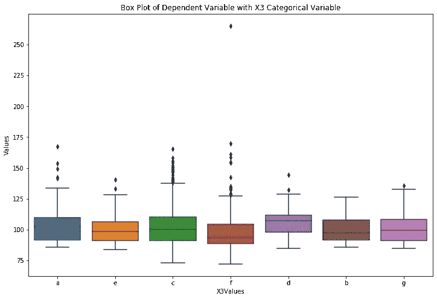
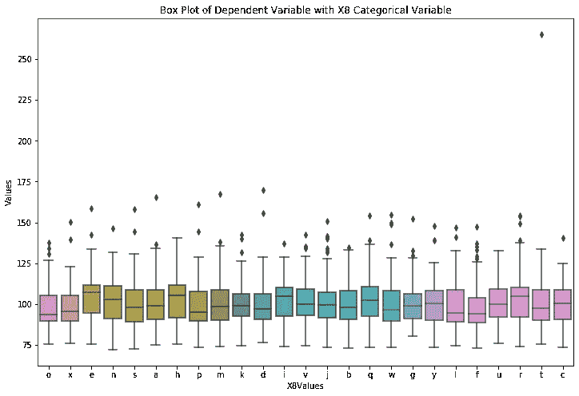

# 梅赛德斯-奔驰绿色制造

> 原文：<https://medium.com/analytics-vidhya/mercedes-benz-greener-manufacturing-74a932ae0693?source=collection_archive---------2----------------------->

***(能不能削减一辆奔驰在测试台上的时间？)***

**业务问题:**

自 1886 年第一辆汽车——奔驰专利汽车问世以来，梅赛德斯-奔驰一直代表着重要的汽车创新。例如，这包括带有防撞缓冲区的乘客安全单元、安全气囊和智能辅助系统。梅赛德斯-奔驰每年申请近 2000 项专利，使该品牌成为欧洲高档汽车制造商中的佼佼者。戴姆勒的梅赛德斯-奔驰汽车是高档汽车行业的领导者。凭借丰富的功能和选项，客户可以选择他们梦想中的定制梅赛德斯-奔驰。

为了确保每一个独特的汽车配置在上路前的安全性和可靠性，戴姆勒的工程师们开发了一个强大的测试系统。但是，如果没有强大的算法方法，为如此多可能的功能组合优化测试系统的速度是复杂和耗时的。作为世界上最大的高档汽车制造商之一，安全和效率是戴姆勒生产线的重中之重。

在这场比赛中，戴姆勒正在挑战卡格勒，以解决维度的诅咒，并减少汽车在测试台上花费的时间。竞争对手将使用代表梅赛德斯-奔驰汽车功能不同排列的数据集来预测通过测试所需的时间。获胜的算法将有助于加快测试速度，从而在不降低戴姆勒标准的情况下降低二氧化碳排放。

**问题陈述:**

预测汽车通过测试所需的目标变量“y”的时间(秒)。

**现实世界/业务目标和约束:**

1.  用高 R 值(决定系数)以秒为单位预测时间。
2.  没有严格的延迟限制。

**数据来源:**

您可以使用以下链接从 Kaggle 下载数据:

 [## 梅赛德斯-奔驰绿色制造

### 你能减少一辆奔驰花在测试台上的时间吗？

www.kaggle.com](https://www.kaggle.com/c/mercedes-benz-greener-manufacturing/data) 

**文件描述:**

带字母的变量是分类变量。带有 0/1 的变量是二进制值。

1. **train.csv** —训练集

2. **test.csv** —测试集，您必须预测该文件中“ID”的“y”变量

3.**sample _ submission . CSV**—格式正确的样本提交文件

**机器学习问题公式化:**

该数据集包含一组匿名的变量，每个变量代表一辆奔驰汽车的定制功能。例如，变量可以是 4WD、附加空气悬架或平视显示器。

地面实况标记为“y ”,代表汽车通过每个变量测试的时间(秒)。

由于“y”是一个连续变量，因此我们可以把这个问题表述为一个回归问题。

**这里使用的性能指标是:**

**R2(决定系数):**是从自变量中可预测的因变量中方差的比例。

**现有方法:**

您可以查看以下链接，了解一些类似的解决方案:

 [## 顶点项目:梅赛德斯-奔驰绿色制造竞赛

### Udacity 机器学习工程师纳米学位

medium.com](/@williamkoehrsen/capstone-project-mercedes-benz-greener-manufacturing-competition-4798153e2476) 

**描述:**

以上博客由 Will Koehrsen 撰写，其项目工作流程如下:

1.数据探索和准备

2.数据预处理

3.型号选择

4.模型优化

5.模型测试和评估

6.结果报告

他使用线性回归作为他的基准模型。

最终模型是以下模型的加权平均值:

使用许多决策树的极端梯度提升

具有弹性网的线性回归和具有多个决策树的额外树的堆叠模型

这个模型帮助他用一个简单的回归器设计一个强大的回归器。

[**https://blog . good audience . com/stacking-ml-algorithm-for-Mercedes-benz-greener-manufacturing-competition-5600762186 AE**](https://blog.goodaudience.com/stacking-ml-algorithm-for-mercedes-benz-greener-manufacturing-competition-5600762186ae)

**描述:**

上面的博客是叶达鑫·拉德写的，他漂亮地展示了解决给定问题的方法。

他处理这个问题的方法如下:

1.解释问题陈述

2.描述数据

3.数据分析

4.数据预处理

5.降维

6.特征化

7.ML 建模

8.XGBoost 回归模型

9.深度学习 MLP 模型

10.堆叠回归模型

堆叠模型为数据集提供了最佳性能。

请访问他们的博客了解详细的方法。

**我的解决方案(首次切割方法):**

由于‘y’是一个连续变量，所以它是一个回归问题。最初，我可以将线性回归方法视为我的基准模型，因为它是我们拥有的最简单的回归算法。因此，我最初的方法如下:

**1。** **导入基本库**

**2。** **执行 EDA 以理解数据集和特征分析**

**3。正如 Mercedes 在 Kaggle 上告诉我们的那样，我们必须执行降维技术，我们必须处理维数灾难。通过分析数据，我们可以更好地理解。**

**4。** **列车数据的标准化和特色化**

**5。** **准备测试数据**

**6。** **训练基线模型**

**7。** **根据 R2 分数评估结果**

**8。** **基于基线模型的结果，尝试更复杂的模型进行进一步改进。**

1.  **导入、可视化和理解数据:**

我们使用 Pandas 来导入 csv 文件。我们在训练数据集中有 4209 个数据点和 378 个特征。

我们可以清楚地看到训练数据的稀疏性。这意味着与分类特征相比，有更多的二元特征。

让我们进一步分析这些特性，以便更深入地了解它。

在分析了特征的数据类型之后，我们可以说有 369 个二元特征，其中 8 个特征的数据类型=**‘object’**很可能是分类特征，剩下的一个特征是我们的目标变量，即**‘y’。**

**2。分类特征分析:**

让我们对分类特征进行单变量分析，从中获得洞察力。为此，我将使用箱线图。每个特征的对应图如下:

我们观察到，**‘X4’**与其他分类特征相比具有非常低的方差。因此，我们可以从数据集中移除该特征。

**3。二进制特征分析:**

我们的第一步是检查二元特征中值的数量。

由此，我们观察到有 13 个特征在所有数据点上具有恒定值。因此，根据我的假设，这些特性不会对建模有所贡献。

我们将从数据集中移除这些要素。

**4。目标变量(' y'):**

为了分析目标变量，我们将使用散点图和箱线图。

正如我们所观察到的，目标变量的阈值位于 150 左右，超过该值可被视为异常值。

**5。检查重复特征:**

我们观察到有许多特征是重复的。我们将删除这些功能，只保留一个。

**6。EDA 结论:**

1.数据集中有 13 列包含常量值。

2.X4 具有非常低的方差

3.我们也将尝试移除异常值

**7。数据准备:**

1.在这里，我们将删除所有不变的功能

2.我们将删除 X4 功能

3.我们将移除异常值，并将目标变量的阈值保持为 150

在数据准备之后，我们得到了 378 个特征中剩余的 319 个特征。因此，我们能够从 378 个特征中移除 59 个特征。

我们将按照相同的步骤准备测试数据集。

**8。特征化:**

在数据准备之后，我们留下了 7 个分类变量。我们将使用标签编码对它们进行编码。

对于二进制特征，我们将对数据进行标准化，然后使用 PCA 作为一个新的特征，其中组件的数量为 6。

除此之外，我们将使用双向和三向交互特征工程。

特征化后，我们有 4 个特色数据集，我们可以在上面尝试我们的模型。这些措施如下:

1.标签编码功能

2.标签编码+ PCA 组件特性

3.标签编码+交互功能

4.标签编码+ PCA +交互特征

**9。实施模式:**

实现模型背后的想法是在所有 4 个特征数据集上尝试基线模型，然后尝试使用复杂模型来改善结果。

**9.1 线性回归:**

我们将使用线性回归作为基线模型，因为它是最简单的回归模型。因为我们有 300 多个特性，所以线性回归会给我们一个不错的基线分数，以供进一步参考和改进。

线性回归模型的结果如下:

我们可以看到，我们在 Kaggle 上得到的最低私分是 **0.50994** 。

我们将这个分数作为我们的基线分数。

**9.2 随机森林回归量:**

随机森林基于被称为 Bagging 的集成技术，以基本学习者作为决策树。与线性回归相比，随机森林的优势在于它将特征空间划分为轴平行的矩形或超平面，并且还处理过拟合情况。这就是为什么它是一个比线性回归更复杂的模型。此外，它是高度可解释的，所以我们可以很容易地得到数据的特征重要性。对于超参数调优，我们将使用 RandomSearchCV，因为它将比 GridSearchCV 花费更少的时间。

随机森林回归模型的结果如下:

正如我们可以观察到的，随机森林回归器使 Kaggle 的私人得分急剧增加。我们得到的最高分是 **0.55148** 。

我们还可以观察特征的重要性，因为这将有助于我们未来的探索。

**9.3 XGB 回归器:**

XGBoost 基于集成技术 Boosting，将基础学习器作为决策树。boosting 算法在训练模型的下一次迭代时，会考虑前一次迭代的残差。由于随机森林回归器在数据集上表现良好，因此值得尝试 XGBoost 回归器来提高性能。该算法是 Kaggle 竞赛中最常用的算法之一。

XGBoost 回归模型的结果如下:

XGBoost 回归模型的最佳得分为 **0.54654** ，仍然无法超越随机森林回归模型。我们最好的分数仍然是随机森林回归模型，分数为 0.55148。

**9.4 额外的树回归量:**

额外树回归也称为极度随机化树。

额外树回归的结果如下:

我们从额外的树回归器得到的最好分数是 **0.55045** ，这比 XGB 回归器好，但仍然比我们从随机森林回归器得到的分数低。

**9.5 叠加回归量:**

到目前为止，我们尝试了三种基于树的模型。现在让我们尝试堆叠模型，它将所有基于树的模型与作为元回归变量的“山脊”结合起来。

叠加回归的结果如下:

我们从堆叠回归元 **0.55227** 得到的最好分数超过了我们的随机森林回归元结果。

**9.6 车型对比:**

模型总结如下:

根据 Kaggle 私人排行榜，以 **0.55227** 的分数，站在第**156 位——第**190 位，排名前 **5%** 。

让我们选出最好的两个模型进行进一步的尝试，这可能会提高我们的分数。

**10。尝试另一种方法:**

在浏览 Kaggle 的讨论部分时，我得到了一个美丽的讨论，它的作者名叫 David。讨论的环节如下:

 [## 梅赛德斯-奔驰绿色制造

### 你能减少一辆奔驰花在测试台上的时间吗？

www.kaggle.com](https://www.kaggle.com/c/mercedes-benz-greener-manufacturing/discussion/34949) 

根据他的观点，分类特征是由其他特征改造而来的。我正在尝试使用他的假设，看看这种方法是否能提高我们的分数。

此外，如果我从以前的基于树的模型中看到特征重要性，分类特征的重要性与其他特征相比非常低。所以，这支持了大卫关于分类特征的假设。

**11。实施模式:**

当我们绘制“X5”与“ID”特征时，有一个非常有趣的发现:

我们可以清楚地看到，X5 不过是数据集的一组 ID。

x4’特征也具有非常低的方差。

因此，我们去除了所有的分类特征，并训练了我们的模型。

随机森林回归和堆积回归的结果如下:

**12。对比模型及结论:**

正如我们可以看到的，如果我们从数据集中删除分类特征，我们在 Kaggle 上的得分就会下降。这证明了我们的假设是错误的。所以，结论如下:

1.根据 Kaggle 排行榜，最佳解决方案是一个**“堆叠模型”**，除了交互功能之外，还具有标签编码器、PCA 的功能工程，这使我在排行榜上处于**第 156 位**到**第 190 位**之间。

2.移除低方差特征有助于提高模型性能。

3.超参数调整防止模型过度拟合。

4.添加 PCA 特征有助于模型的降维，这有助于增加得分。

交互功能极大地改善了解决方案。

> T **最好的模型是(堆叠+标签编码+ PCA +交互特征)，私有分 0.55227。**

**13。Kaggle 私人排行榜分数和排名:**

**14。Kaggle 排行榜:**

15。未来工作:

1.在我的特征工程中，我使用了 PCA。我们可以进一步使用 TSVD，ICA，GRP 进行特征工程。

2.我们可以使用深度学习技术。

**16。参考:**

1.  [https://www . ka ggle . com/c/Mercedes-benz-greener-manufacturing/discussion/37700](https://www.kaggle.com/c/mercedes-benz-greener-manufacturing/discussion/37700)

2.[https://blog . good audience . com/stacking-ml-algorithm-for-Mercedes-benz-greener-manufacturing-competition-5600762186 AE](https://blog.goodaudience.com/stacking-ml-algorithm-for-mercedes-benz-greener-manufacturing-competition-5600762186ae)

3.[https://www . ka ggle . com/c/梅赛德斯-奔驰-更环保-制造/概述](https://www.kaggle.com/c/mercedes-benz-greener-manufacturing/overview)

4.[https://www . ka ggle . com/c/Mercedes-benz-greener-manufacturing/discussion/34949](https://www.kaggle.com/c/mercedes-benz-greener-manufacturing/discussion/34949)

5.[https://www.appliedaicourse.com](https://www.appliedaicourse.com)

**Github 链接:**

 [## aditya 2029/梅赛德斯-奔驰-更环保-制造商

### 通过在 GitHub 上创建一个帐户，为 aditya 2029/梅赛德斯-奔驰-绿色制造商的发展做出贡献。

github.com](https://github.com/aditya2029/Mercedes-Benz-Greener-Manufacturer) 

**LinkedIn 个人资料:**

 [## aditya Pandey-Vogo Automotive PVT . ltd .数据分析师| LinkedIn](https://www.linkedin.com/in/aditya-pandey-b9bb968b/)