# 预测梅赛德斯-奔驰在制造过程中的测试持续时间

> 原文：<https://medium.com/analytics-vidhya/mercedes-benz-greener-manufacturing-85d7621b5b08?source=collection_archive---------0----------------------->

## 更快的测试将有助于降低排放和更高效的生产线


作者注:这是我用应用人工智能课程完成梅赛德斯-奔驰绿色制造项目后的博客。在这个博客中，我将写下这个方法，并展示我的项目的结果。所有的作品都是原创的，可以使用/扩展/传播。

# **业务问题:**

自 1886 年第一辆汽车——奔驰专利汽车问世以来，梅赛德斯-奔驰一直代表着重要的汽车创新。例如，这包括带有防撞缓冲区的乘客安全单元、安全气囊和智能辅助系统。梅赛德斯-奔驰每年申请近 2000 项专利，使该品牌成为欧洲高档汽车制造商的领导者。戴姆勒的梅赛德斯-奔驰汽车是高档汽车行业的领导者。凭借丰富的功能和选项，客户可以选择他们梦想中的定制梅赛德斯-奔驰。。

为了确保每一个独特的汽车配置在上路前的安全性和可靠性，戴姆勒的工程师们开发了一个强大的测试系统。但是，如果没有强大的算法方法，为如此多可能的功能组合优化测试系统的速度是复杂和耗时的。作为世界上最大的高档汽车制造商之一，安全和效率是戴姆勒生产线的重中之重。

在这场比赛中，戴姆勒正在挑战卡格勒，以解决维度的诅咒，并减少汽车在测试台上花费的时间。竞争对手将使用代表梅赛德斯-奔驰汽车功能不同排列的数据集来预测通过测试所需的时间。获胜的算法将有助于加快测试速度，从而在不降低戴姆勒标准的情况下降低二氧化碳排放。

**问题陈述:**预测目标变量 y Iie 汽车需要通过测试的时间(秒)。

**现实世界/业务目标和约束:**
1:用高值 R(决定系数)预测以秒为单位的时间。
2:没有严格的延迟限制。

# 数据描述:

该数据集包含一组匿名的变量，每个变量代表一辆奔驰汽车的定制功能。例如，变量可以是 4WD、附加空气悬架或平视显示器。

地面实况标记为“y ”,代表汽车通过每个变量测试的时间(秒)。

## **机器学习问题公式化:**

**数据描述:**例如，变量可以是 4WD、附加空气悬架或平视显示器。

地面实况标记为“y ”,代表汽车通过每个变量测试的时间(秒)。

**文件描述:**
带字母的变量是分类变量。带有 0/1 的变量是二进制值。train.csv —训练集 test.csv —测试集，您必须以正确的格式预测此文件 sample_submission.csv —示例提交文件中“ID”的“y”变量。下面是下载文件的链接。

[](https://www.kaggle.com/c/mercedes-benz-greener-manufacturing/data) [## 梅赛德斯-奔驰绿色制造

### 你能减少一辆奔驰花在测试台上的时间吗？

www.kaggle.com](https://www.kaggle.com/c/mercedes-benz-greener-manufacturing/data) 

## E.D.A 关于**奔驰绿色制造**数据集:

因为我们只有 378 个特征，所以我们做了**列分析**

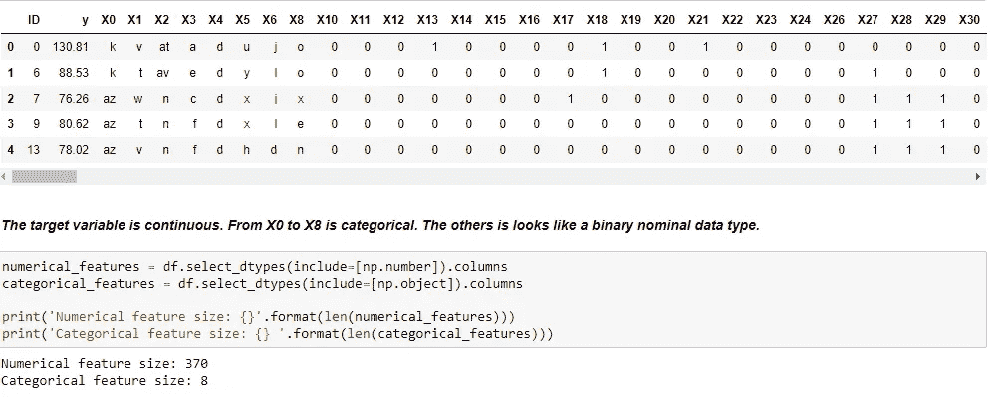

**如我们所见，我们有 8 个分类特征具有超过 EN 2 值，其余的是二进制数字特征**

```
Columns containing the unique values :  [0, 1]
['X10', 'X12', 'X13', 'X14', 'X15', 'X16', 'X17', 'X18', 'X19', 'X20', 'X21', 'X22', 'X23', 'X24', 'X26', 'X27', 'X28', 'X29', 'X30', 'X31', 'X32', 'X33', 'X34', 'X35', 'X36', 'X37', 'X38', 'X39', 'X40', 'X41', 'X42', 'X43', 'X44', 'X45', 'X46', 'X47', 'X48', 'X49', 'X50', 'X51', 'X52', 'X53', 'X54', 'X55', 'X56', 'X57', 'X58', 'X59', 'X60', 'X61', 'X62', 'X63', 'X64', 'X65', 'X66', 'X67', 'X68', 'X69', 'X70', 'X71', 'X73', 'X74', 'X75', 'X76', 'X77', 'X78', 'X79', 'X80', 'X81', 'X82', 'X83', 'X84', 'X85', 'X86', 'X87', 'X88', 'X89', 'X90', 'X91', 'X92', 'X94', 'X95', 'X96', 'X97', 'X98', 'X99', 'X100', 'X101', 'X102', 'X103', 'X104', 'X105', 'X106', 'X108', 'X109', 'X110', 'X111', 'X112', 'X113', 'X114', 'X115', 'X116', 'X117', 'X118', 'X119', 'X120', 'X122', 'X123', 'X124', 'X125', 'X126', 'X127', 'X128', 'X129', 'X130', 'X131', 'X132', 'X133', 'X134', 'X135', 'X136', 'X137', 'X138', 'X139', 'X140', 'X141', 'X142', 'X143', 'X144', 'X145', 'X146', 'X147', 'X148', 'X150', 'X151', 'X152', 'X153', 'X154', 'X155', 'X156', 'X157', 'X158', 'X159', 'X160', 'X161', 'X162', 'X163', 'X164', 'X165', 'X166', 'X167', 'X168', 'X169', 'X170', 'X171', 'X172', 'X173', 'X174', 'X175', 'X176', 'X177', 'X178', 'X179', 'X180', 'X181', 'X182', 'X183', 'X184', 'X185', 'X186', 'X187', 'X189', 'X190', 'X191', 'X192', 'X194', 'X195', 'X196', 'X197', 'X198', 'X199', 'X200', 'X201', 'X202', 'X203', 'X204', 'X205', 'X206', 'X207', 'X208', 'X209', 'X210', 'X211', 'X212', 'X213', 'X214', 'X215', 'X216', 'X217', 'X218', 'X219', 'X220', 'X221', 'X222', 'X223', 'X224', 'X225', 'X226', 'X227', 'X228', 'X229', 'X230', 'X231', 'X232', 'X234', 'X236', 'X237', 'X238', 'X239', 'X240', 'X241', 'X242', 'X243', 'X244', 'X245', 'X246', 'X247', 'X248', 'X249', 'X250', 'X251', 'X252', 'X253', 'X254', 'X255', 'X256', 'X257', 'X258', 'X259', 'X260', 'X261', 'X262', 'X263', 'X264', 'X265', 'X266', 'X267', 'X269', 'X270', 'X271', 'X272', 'X273', 'X274', 'X275', 'X276', 'X277', 'X278', 'X279', 'X280', 'X281', 'X282', 'X283', 'X284', 'X285', 'X286', 'X287', 'X288', 'X291', 'X292', 'X294', 'X295', 'X296', 'X298', 'X299', 'X300', 'X301', 'X302', 'X304', 'X305', 'X306', 'X307', 'X308', 'X309', 'X310', 'X311', 'X312', 'X313', 'X314', 'X315', 'X316', 'X317', 'X318', 'X319', 'X320', 'X321', 'X322', 'X323', 'X324', 'X325', 'X326', 'X327', 'X328', 'X329', 'X331', 'X332', 'X333', 'X334', 'X335', 'X336', 'X337', 'X338', 'X339', 'X340', 'X341', 'X342', 'X343', 'X344', 'X345', 'X346', 'X348', 'X349', 'X350', 'X351', 'X352', 'X353', 'X354', 'X355', 'X356', 'X357', 'X358', 'X359', 'X360', 'X361', 'X362', 'X363', 'X364', 'X365', 'X366', 'X367', 'X368', 'X369', 'X370', 'X371', 'X372', 'X373', 'X374', 'X375', 'X376', 'X377', 'X378', 'X379', 'X380', 'X382', 'X383', 'X384', 'X385']
--------------------------------------------------
Columns containing the unique values :  [0]
['X11', 'X93', 'X107', 'X233', 'X235', 'X268', 'X289', 'X290', 'X293', 'X297', 'X330', 'X347']
--------------------------------------------------WHEN WE DID INTEGER COLUMN ANALYSIS WE OBSERVE THAT THERE ARE SOME COLUMNS WHICH ARE HAVING ONLY 0 VALUES SO WE DISCARD THOSE COLUMNS
```

现在我们只有 7 个分类特征，所以我们对它们进行了**单变量分析**:

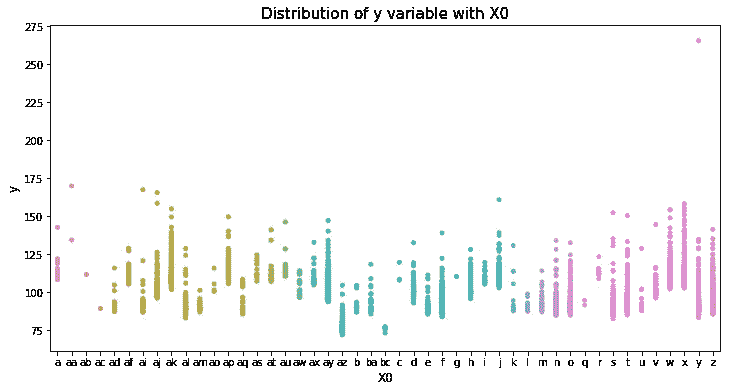

正如我们在该图中看到的，y 值均匀分布在(X0)的每个类别中，我们还可以观察到大多数 y(目标变量)值在 80 和 150 之间。

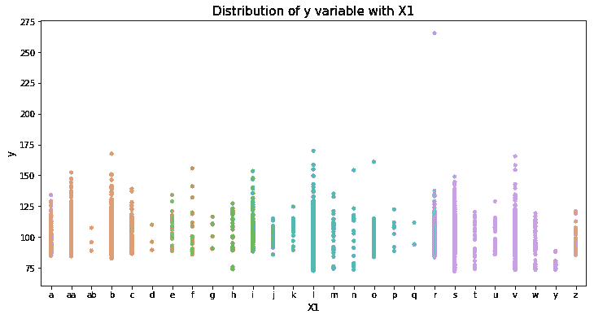

正如我们在该图中看到的，y 值均匀分布在(X1)的每个类别中，我们还可以观察到大多数 y(目标变量)值在 80 和 150 之间。

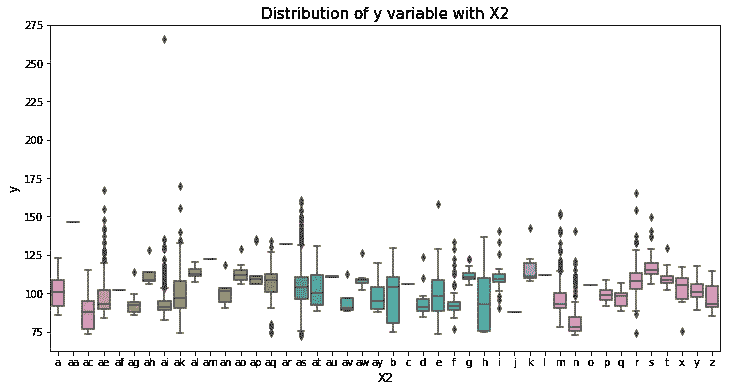

正如我们在该图中看到的，y 值在每一类(X2)中都是均匀分布的，我们还可以观察到大多数 y(目标变量)值在 75 到 138 之间。

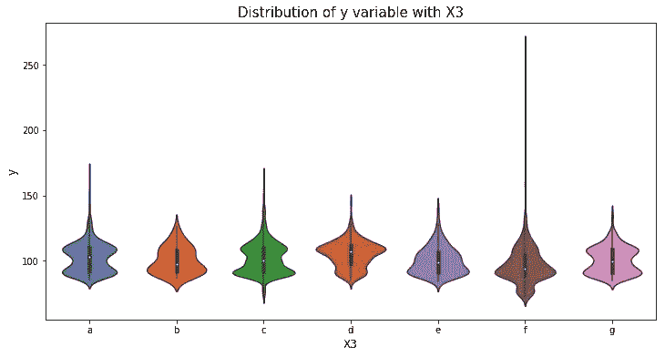

正如我们在该图中看到的，y 值在每一类(X3)中都是均匀分布的，我们还可以观察到大多数 y(目标变量)值在 70 到 135 之间。

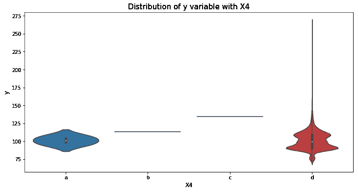

正如我们在该图中所看到的，y 的值不是均匀分布在(X4)的每个类别中，它主要出现在 a 和 d 中，我们还可以观察到大多数 y(目标变量)值在 80 和 120 之间。

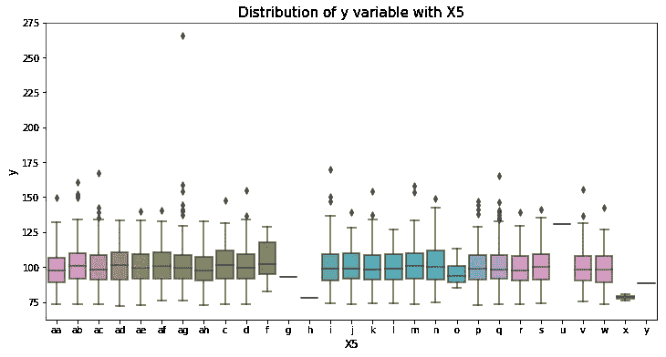

正如我们在该图中所看到的，y 值均匀分布于除 g、h、x、y 之外的所有类别(x5 ),我们还可以观察到大多数 y(目标变量)值在 70 和 130 之间。

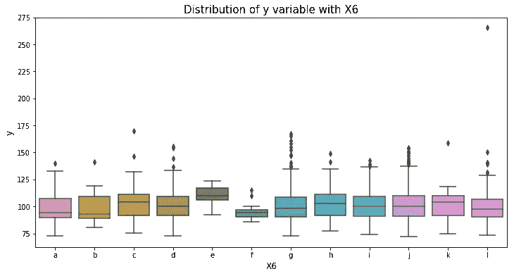

正如我们在该图中看到的，y 值均匀分布在(x6)的每个类别中，我们还可以观察到大多数 y(目标变量)值在 80 和 150 之间。

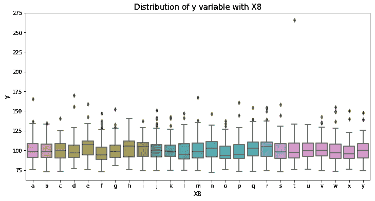

正如我们在该图中看到的，y 值均匀分布在(x8)的每个类别中，我们还可以观察到大多数 y(目标变量)值在 75 和 130 之间。

## 二元变量:

现在我们可以看看二元变量。像我们以前看到的那样，有不少。让我们从获得每个变量中 0 和 1 的数量开始。

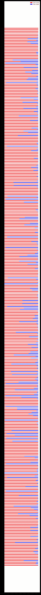

有些列只有 0 值，因此我们将丢弃它们，我们还观察到数据非常稀疏

对目标变量 y 的一些分析:

```
#SOME STATISTICS TARGET VARIABLE ON Y
count    4209.000000
mean      100.669318
std        12.679381
min        72.110000
25%        90.820000
50%        99.150000
75%       109.010000
max       265.320000      (MAY BE OUTLIER)
Name: y, dtype: float64
```

让我们画出 y 的 CDF

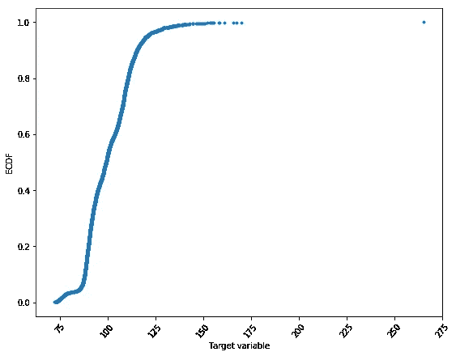

这里我们还可以看到，大部分 y 值都在 70-180 之间，还有一个异常值为 256.32

让我们绘制目标分布图:

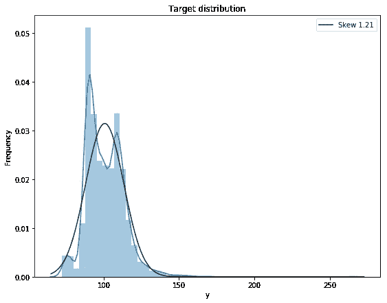

有一点向右倾斜，所以这里我们可以看到右边的大部分异常点可以大于 145

**让我们找出离群值:**

在这里，我们已经找到了基于观察上述图的异常值，所以我们将设置我们的阈值为 150。

```
[150.43 169.91 154.87 265.32 158.53 154.43 160.87 150.89 152.32 167.45
 154.16 158.23 153.51 165.52 155.62] NOWRemoving outliers based on above information and setting 150 as a threshold value . . . . . . . . . . . . . . . . . . . . 
(4194, 378)
```

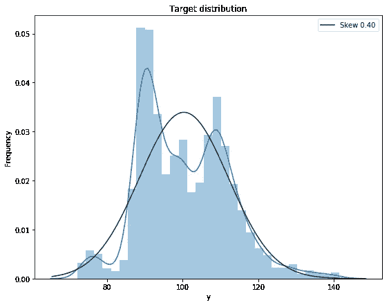

现在，在去除异常值(即去除大于 150 的值)后，它看起来好多了

## 预测功能:

探索目标变量和预测变量之间的关联:

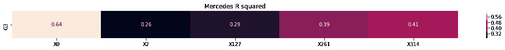

**X0 与目标有最好的关系。(64%)**

## E.d .结论:

1:包含唯一值的列:[0]我们必须删除这些只包含零的列['X11 '，' X93 '，' X107 '，' X233 '，' X235 '，' X268 '，' X289 '，' X290 '，' X293 '，' X297 '，' X330 '，' X339 '，' X347']

2:我们也尝试去除异常值。

## 数据准备:

1:在这种情况下，我们删除这些列。['X11 '，' X93 '，' X107 '，' X233 '，' X235 '，' X268 '，' X289 '，' X290 '，' X293 '，' X297 '，' X330 '，' X339 '，' X347']

2:通过使用带有函数 np.percentile(ys，[20，80])的四分位数再次找到异常值，并删除行 216，678，1031，1135，1340，2346，2365，2874，2892，3077。

3:用标签编码器预处理[“X0”、“X1”、“X2”、“X3”、“X4”、“X5”、“X6”、“X8”]。

4:随机训练和测试分割(80:20):

## 特征工程:

这是解决机器学习问题的最重要的一步，因为这是通过良好的特征工程改善结果的唯一方法。

因此，在这里，我们通过在不在“y”、“X0”、“X1”、“X2”、“X3”、“X4”、“X5”、“X6”、“X8”中的列上实现，使用 tsvd、pca、ica、grp、srp 作为新功能，组件数量为 10。

## 实施模型:

**1 —因此，我实施的第一个模型是带有超参数调整的决策树回归:**

```
hyper = [1, 5, 10, 50, 100, 500, 1000]
param_grid = {‘max_depth’ :hyper}
lasso_model = DecisionTreeRegressor()
grid_search = GridSearchCV(lasso_model,param_grid, cv=5,scoring=’r2')
grid_search.fit(X_train, Y_train)
print(“Best SGDR alpha: “, grid_search.best_params_)
print(“Best SGDR score: “, grid_search.best_score_)Best SGDR alpha:  {'max_depth': 5}
Best SGDR score:  0.6169689489084359The R2 score for DEPTH = 5.000000 ON TEST DATA is 0.599141%
```

**2 —我实施的第二个模型是 XGB_Regression，带有超参数调整:**

```
x_cfl=XGBRegressor()
prams={
 ‘learning_rate’:[0.01,0.03,0.05,0.1,0.15,0.2],
 ‘n_estimators’:[100,200,500,1000,2000],
 ‘max_depth’:[3,5,8,10],
 ‘colsample_bytree’:[0.1,0.3,0.5,1],
 ‘subsample’:[0.1,0.3,0.5,1]
 }
first_xgb=GridSearchCV(x_cfl,prams,verbose=10,n_jobs=-1,scoring=’r2')
first_xgb.fit(X_train, Y_train)
```

使用第二代 i7 完成上述超参数调整需要 300 分钟。

```
print (first_xgb.best_params_){'colsample_bytree': 0.5, 'learning_rate': 0.03, 'max_depth': 3, 'n_estimators': 200, 'subsample': 1}The R2 score of XGBRegressor ON TEST DATA is 0.609613%
```

**3 —现在，我实施的第三个模型是 Lasso 回归和超参数调整:**

```
hyper = []
i = 0.0000001
while(i<=1000000000):
 hyper.append(np.round(i,7))
 i *= 10lasso_grid = {“alpha” : hyper}
lasso_model = Lasso(fit_intercept=True,normalize=True)
grid_search = GridSearchCV(lasso_model, lasso_grid, cv=5, scoring=’r2')
grid_search.fit(X_train, Y_train)
print(“Best lasso alpha: “, grid_search.best_params_)
print(“Best lasso score: “, grid_search.best_score_)Best lasso alpha:  {'alpha': 0.01}
Best lasso score:  0.611276230109042The R2 score for ALPHA = 0.010000 ON TEST DATA is 0.584410%+--------------------------+----------+--------------------------+
| MODEL  |  R^2| R^2(KAGGLE_SCORE_PUBLIC) |R^2(KAGGLE_SCORE_PRIVATE) |
+--------------------------+----------+--------------------------+
|Lasso Regression   | 0.58441  | 0.51797  |          0.52655     
+--------------------------+----------+--------------------------+-|Decision Tree Regression | 0.599141 |   0.53522  |  0.54524   
+--------------------------+----------+--------------------------      
| XGB Regression          | 0.608679 | 0.5457   |    0.55275          |
+--------------------------+----------+-----------------------\
```

## 结果:在第一种方法中，我们在 kaggle 上得到(私人分数:0.5457)和(公共分数:0.55275)。

我把我的作业提交给了应用 A。当然，他们建议我做更多的特征工程来提高分数。

# 第二种方法

## 具有不同特征工程的第二种方法增加得分 R (Coef。决心)。

## E.d .第二种方法:

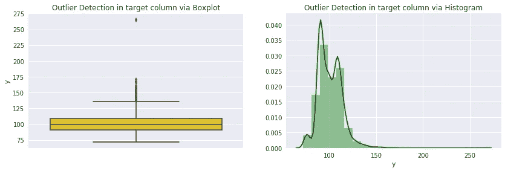

**正如我们在上面的图中所看到的，异常值大约接近 140 °,这是安全点，为了不过度拟合，我们将像前面的方法一样在 150°之后移除异常值。**

# 预处理:

1: Ist 我们将根据上述观察结果移除异常值:

```
We removed these outlier on the basis of above observation
[150.43 169.91 154.87 265.32 158.53 154.43 160.87 150.89 152.32 167.45
 154.16 158.23 153.51 165.52 155.62]
Removing outliers based on above information and setting 150 as a threshold value . . . . . . . . . . . . . . . . . . . . 
(4194, 378)
```

2:与第一种方法一样，也删除零值列。

3:再次为每一列的方差设置阈值 0.01，并且也将它们移除。被移除的列也被从所有临时数据帧中移除。结果是有 146 列用于移除。从原始数据帧中删除要素后，更新 df_num 数据帧。

3:获得与目标列 y 相关的重要特征的字典。一些与目标变量相关的重要特征。基于实验变化以 0.25 作为阈值。

```
Important Features with there respective correlations are  
 --------------------------------------------------------- 
 {'X28': -0.261548387853112, 'X29': -0.3979846718424932, 'X54': -0.39362263688450944, 'X76': -0.39362263688450944, 'X80': -0.2566304628986176, 'X118': 0.2911340078121633, 'X119': 0.2911340078121633, 'X127': -0.5359508861669307, 'X136': 0.39362263688450944, 'X162': -0.3809601526804208, 'X166': -0.3469061103890677, 'X178': -0.3105490342608788, 'X185': -0.25654857309239765, 'X232': -0.3979846718424932, 'X234': -0.27530886410908445, 'X250': -0.32318814896929704, 'X261': 0.6184684577479749, 'X263': 0.3979846718424932, 'X272': -0.36779944561534245, 'X275': 0.29297093005751373, 'X276': -0.37663134331800774, 'X279': -0.3979846718424932, 'X313': -0.3453785698372581, 'X314': 0.6371978536813558, 'X316': -0.2747484119054767, 'X328': -0.3839243197734775, 'X348': -0.25754835598033654, 'X378': -0.27115936517391354}1: This states that X29, X54, X76, X127, X136, X162, X166, X178, X232, X250, X261, X263, X272, X276, X279, X313, X314, X328 are important features later we will select using some selection techniques.2:But , YOU MUST SEE THAT SOME FEATURES ARE HAVING SAME CORRELATIONS THAT COULD INDICATE THE POSSIBLE DUPLICATE FEATURES. Lets check them too .
```

4:我们还删除了一些重复的列，它们显示了大约的相关性。一

```
Dublicates: 
 ['X232', 'X279', 'X35', 'X37', 'X113', 'X134', 'X147', 'X222', 'X76', 'X324', 'X84', 'X244', 'X119', 'X146', 'X226', 'X326', 'X360', 'X247'
```

检查一组重复特征之间的相关性，并准备高度相关的对。同样，0.9 的相关阈值是在多次实验后判断和采用的，即我们丢弃那些特征。

5:标签编码分类特征，如第一种方法。

**到目前为止，我们已经删除了许多特性，即列，因此我们将使用 XGBoost 和随机森林回归器来查找其余列的特性重要性。**

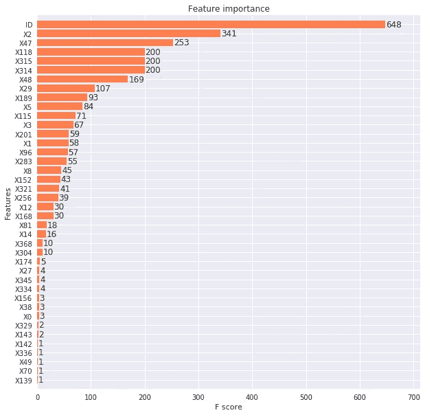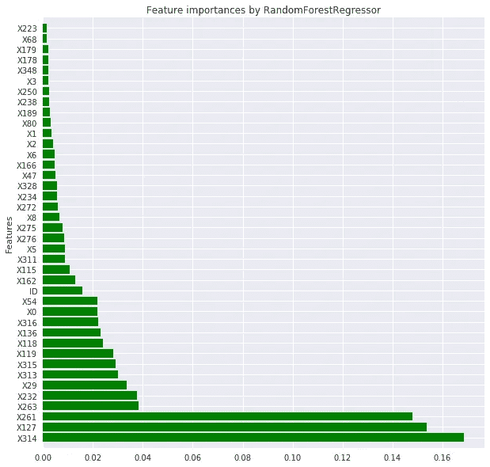

## 现在让我们使用交互变量进行一些特征工程:

双向交互:['X314_plus_X315']，["X10_plus_X54"]，["X10_plus_X29"]。三方互动:['X118_plus_X314_plus_X315']。

再次检查相关性！

*   获取数字数据帧，找到所有相关性非常高的特征，并对其进行检查。也如上所述制造它们的对。
*   结果是 63 个高度相关的特征的列表。**同样，0.95 的值是通过实验判断和确定的，没有经验法则来确定阈值。**

**现在让我们看看 XGBoost 和随机森林回归器的新交互特性的重要性。**

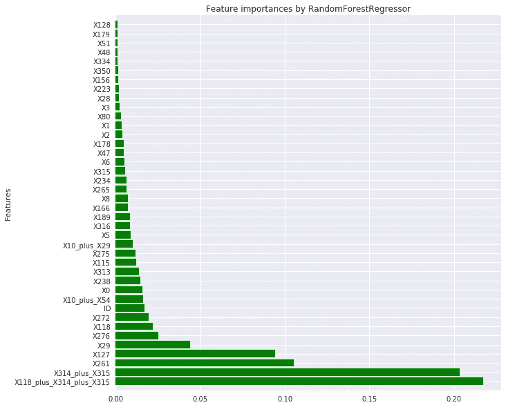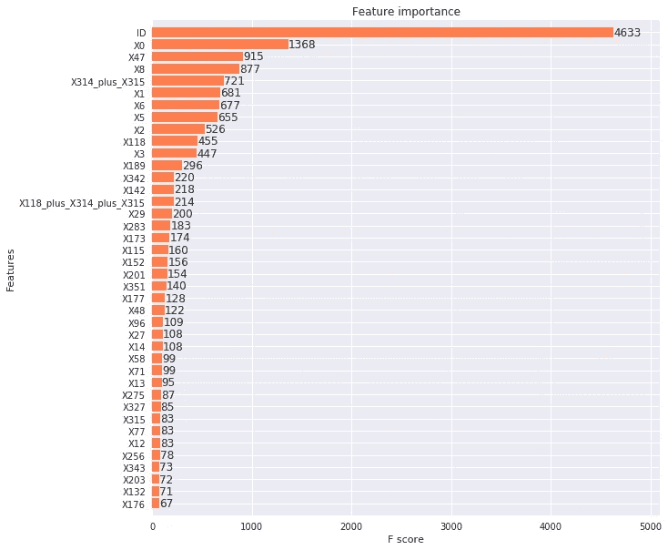

**XG boost 的特性重要性**

正如我们在上面的功能图中所看到的，它显示了我们新的交互功能比其他许多令人印象深刻的功能更重要。

## **模型实现:**

正如我们在第一种方法中看到的，XGboost 很好地处理了这个数据集，而且我们的数据集不是很大，功能也较少，这就是我们选择实现 XGboost 的原因。

**培训代码片段:**

```
x_train, x_valid, y_train, y_valid = train_test_split(train_X, train_y, test_size=0.2, random_state=420)
d_train = xgb.DMatrix(x_train, label=y_train)
d_valid = xgb.DMatrix(x_valid, label=y_valid)
d_test = xgb.DMatrix(test)
xgb_params = {
 ‘n_trees’: 500, 
 ‘eta’: 0.0050,
 ‘max_depth’: 3,
 ‘subsample’: 0.95,
 ‘objective’: ‘reg:linear’,
 ‘eval_metric’: ‘rmse’,
 ‘base_score’: np.mean(train_y), # base prediction = mean(target)
 ‘silent’: 1 }
def xgb_r2_score(preds, dtrain):
 labels = dtrain.get_label()
 return ‘r2’, r2_score(labels, preds)
watchlist = [(d_train, ‘train’), (d_valid, ‘valid’)]
clf = xgb.train(xgb_params, d_train, 1050 , watchlist, early_stopping_rounds=70, feval=xgb_r2_score, maximize=True, verbose_eval=10)
```

**结果:在第三种方法中，我们在 kaggle 上得到了(私人分数:0.55282)和(公共分数:0.55709)。**

# 第三种方法

**结合第一项和第二项特征工程，提高得分 R (Coef。【决心之光】(T15)**

## 注意:

在这里，我们所做的是，我们采用第二种方法中用于训练模型的相同最终数据，并通过在不在“y”、“X0”、“X1”、“X2”、“X3”、“X4”、“X5”、“X6”、“X8”中的列上实施，将 tsvd、pca、ica、grp、srp 作为新特征应用，所采用的组件数量是 3 个不同的实验，此处未显示，以最大化这些特征组合的得分。

现在让我们一起来看看特征的重要性，即交互特征和 tsvd、pca、ica、grp、srp 与 XGBoost 和随机森林回归，哪个特征存在于哪里。

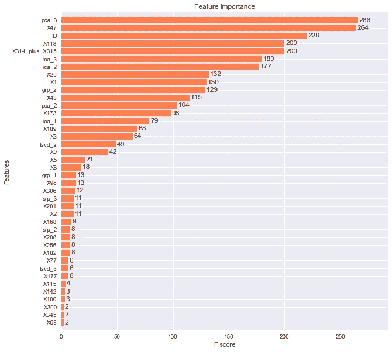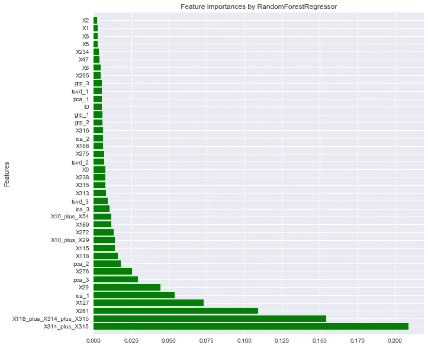

正如我们在上面的特性图中所看到的，它显示了由两种不同的特性工程方法所产生的特性的重要性，这两种特性看起来都很重要，令人印象深刻，但是两个最重要的特性来自交互特性化。

**训练代码片段:**

```
x_train, x_valid, y_train, y_valid = train_test_split(train_X, train_y, test_size=0.2, random_state=420)
d_train = xgb.DMatrix(x_train, label=y_train)
d_valid = xgb.DMatrix(x_valid, label=y_valid)
d_test = xgb.DMatrix(test)
xgb_params = {
 ‘n_trees’: 500, 
 ‘eta’: 0.0050,
 ‘max_depth’: 3,
 ‘subsample’: 0.95,
 ‘objective’: ‘reg:linear’,
 ‘eval_metric’: ‘rmse’,
 ‘base_score’: np.mean(train_y), # base prediction = mean(target)
 ‘silent’: 1
}
def xgb_r2_score(preds, dtrain):
 labels = dtrain.get_label()
 return ‘r2’, r2_score(labels, preds)
watchlist = [(d_train, ‘train’), (d_valid, ‘valid’)]
clf = xgb.train(xgb_params, d_train, 1050 , watchlist, early_stopping_rounds=70, feval=xgb_r2_score, maximize=True, verbose_eval=10)
```

**测试代码片段:**

```
d_train = xgb.DMatrix(train_X, label=train_y)
#d_valid = xgb.DMatrix(x_valid, label=y_valid)
d_test = xgb.DMatrix(test)
xgb_params = {
 ‘n_trees’: 500, 
 ‘eta’: 0.0050,
 ‘max_depth’: 3,
 ‘subsample’: 0.95,
 ‘objective’: ‘reg:linear’,
 ‘eval_metric’: ‘rmse’,
 ‘base_score’: np.mean(train_y), 
 ‘silent’: 1
}
def xgb_r2_score(preds, dtrain):
 labels = dtrain.get_label()
 return ‘r2’, r2_score(labels, preds)
watchlist = [(d_train, ‘train’)]
clf = xgb.train(xgb_params, d_train, 1050 , watchlist, early_stopping_rounds=70, feval=xgb_r2_score, maximize=True, verbose_eval=10)
```

在第三种方法中，我们在 kaggle 上得到了(私人分数:0.55077)和(公共分数:0.55744)。

## KAGGLE 评分结果:

```
+--------------+-----KAGGLE SCORE RESULT:----------+---------------|APPROACH_NO | Private_Score | Public_Score  | Feature_engineering      |
+--------------+---------------+---------------+--------------------
|1st_approach | 0.5457  | 0.55275  | SVD,PCA,GRP,SRP,ICA 
        |
|2nd_approach | 0.55282 | 0.55709  | Interaction_variable|3rd_approach | 0.55077 | 0.55744  | Combine_of_1st_2nd_approach 
```

# 接下来的步骤:

**1—->>探索性数据分析:**
答:数据加载和清洗。
B:浏览数据集中出现的分类和二元变量列。
**2—->>数据准备:**
答:找出离群值并丢弃。
B:删除只有一个值的列。
C:将每个类别值转换成标签。
D:随机训练测试分割(80:20)比例。
E:我们做了奇异值分解、主成分分析、GRP、SRP 和 ICA，并从每种方法中提取 3 个分量作为特征。女:我们还做了交互式可变特征工程。
**3———>>机器学习模型。**
A:超参数调优的 Lasso 回归:
B:超参数调优的决策树回归
C:超参数调优的 XGB 回归:

## 观察结果:

**答:**当我们应用以上三个回归模型时，我们知道如果我们使用生产套索回归模型
在时间复杂度和 R 矩阵方面是最好的。
**B:** 如果我们只关心 R 矩阵那么 XGB 最好。如果我们采用在 XGB 和 LASSO 回归之间取得平衡的模型，那么我们可以使用决策树。
**D:** 我们观察到，使用简单的特征工程，如交互变量，我们会得到最好的分数。

## 结论:

在这个案例研究中，作为我在应用人工智能课程中的一部分，我学到了(学会学习)以及如何从零开始解决问题。在这个项目中，数据集是真正匿名的(没有名称提示)，v.dirty 数据集需要一个好的 EDA 标签，预处理等。

这个案例研究的最重要的方面是特征工程，这是改善我们结果的唯一方法，我认为它暗示了整个机器学习，因为我们的重模型总是不能像特征工程那样为我们做改进。在这个案例研究中，我用交互变量做特征工程，这非常有趣。

我还观察到方法 1 和 2 中的特征，当我们将它们组合时，分数下降。有可能一些特征再次相互关联并使分数下降。反复消除相关特征也是本案例研究的重要任务。我认为我们可以通过消除相关特征和超参数调整来改进我们的第三种方法。

这就是项目的全部内容。我希望您喜欢这个案例研究。在这里，我们可以通过做更多特征工程以及其他回归模型和一些其他高级技术来改进我们的模型。在这个案例研究项目中，我们的目标是对机器学习行业问题有所了解，并做出最佳模型。

感谢阅读！

*参考文献*

[https://www . ka ggle . com/sudalairajkumar/simple-exploration-notebook-Mercedes](https://www.kaggle.com/sudalairajkumar/simple-exploration-notebook-mercedes)

[https://www . ka ggle . com/c/Mercedes-benz-greener-manufacturing/discussion/37700](https://www.kaggle.com/c/mercedes-benz-greener-manufacturing/discussion/37700)