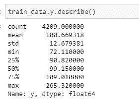
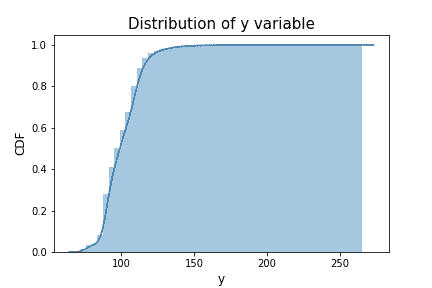
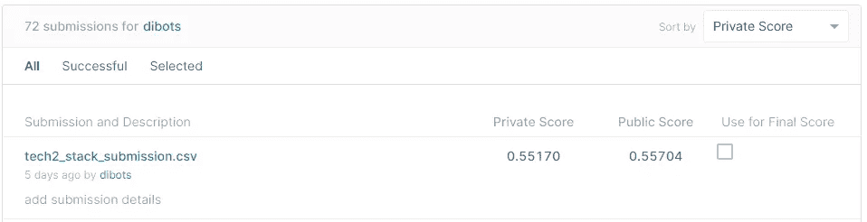
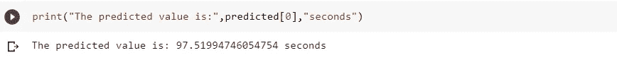

# 梅赛德斯-奔驰-预测测试台下各配置车辆的测试时间

> 原文：<https://medium.com/analytics-vidhya/mercedes-benz-greener-manufacturing-kaggle-competition-1c25c89e012?source=collection_archive---------13----------------------->

**目录:**

1.  商业问题
2.  如何通过机器学习解决问题
3.  数据来源
4.  数据预处理
5.  探索性数据分析及其观察。
6.  解决问题的现有方法
7.  我解决问题的第一个捷径
8.  模型和代码片段的解释
9.  表格形式的模型比较
10.  kaggle 提交
11.  问题的最终解决途径
12.  未来的工作
13.  参考

# 1.业务问题:

**1.1 简介:**

作为第一家豪华汽车制造商，奔驰于 1886 年获得汽车专利，梅赛德斯-奔驰代表了重要的汽车创新。例如，这包括带有防撞缓冲区的乘客安全单元、安全气囊和智能辅助系统。梅赛德斯-奔驰每年申请近 2000 项专利，使该品牌成为欧洲高档汽车制造商的领导者。戴姆勒的梅赛德斯-奔驰汽车是高档汽车行业的领导者。凭借丰富的功能和选项，客户可以选择他们梦想中的定制梅赛德斯-奔驰。。

为了确保每一个独特的汽车配置在上路前的安全性和可靠性，戴姆勒的工程师们开发了一个强大的测试系统。但是，如果没有强大的算法方法，为如此多可能的功能组合优化测试系统的速度是复杂和耗时的。作为世界上最大的高档汽车制造商之一，安全和效率是戴姆勒生产线的重中之重。

**1.2 项目概述:**

1.  在汽车工业中，有一个测试部门，生产制造出来的每辆车都在这个部门。安全可靠的测试是汽车制造过程中至关重要的一部分。

2.梅赛德斯-奔驰汽车工业每天都在生产大量的汽车，并送往测试部门，这是生产的最后阶段。每一种可能的车辆组合都必须经过测试台，以确保车辆足够坚固，能够保证乘客的安全并承受日常使用。更多的测试导致在测试台上花费更多的时间，增加了公司的成本，并产生二氧化碳，一种污染性的温室气体。

**1.3 项目目标:**

该项目的主要目标是优化/减少测试台下每辆量产车的测试时间。通过这种优化，它肯定会减少与测试过程相关的二氧化碳排放。

**汽车正在测试台上进行最终测试。**

# 2.如何通过机器学习解决问题:

上述问题可以使用经典的机器学习技术来解决，以基于车辆配置来预测汽车将在测试台上花费的时间(目标变量)。(独立功能)

1.  这种类型的问题是监督学习问题，其中模型可以从标记的数据中学习。
2.  这是一个机器学习回归任务的例子，因此结果的预测将是连续的目标变量。(试验台的持续时间)。

**2.1 性能指标:**

在竞赛中，建议使用 R(决定系数)来评价模型性能。

r(决定系数)是一种统计度量，表示由回归模型中的一个或多个自变量解释的因变量的方差的比例。

# 3.数据来源:

奔驰行业在 Kaggle 平台上发布了他们的问题。以 CSV 文件格式提供的数据。以下是下载数据集的链接。

链接:[https://www . ka ggle . com/c/梅赛德斯-奔驰-更绿色-制造](https://www.kaggle.com/c/mercedes-benz-greener-manufacturing)

 [## 梅赛德斯-奔驰绿色制造

### 你能减少一辆奔驰花在测试台上的时间吗？

www.kaggle.com](https://www.kaggle.com/c/mercedes-benz-greener-manufacturing) 

**3.1 数据概述:**

以 *train.csv* 和 *test.csv* 两种 CSV 文件格式提供的数据。

train.csv 数据集的说明，

1.  总共有大约 377 个功能，表示为 x0、x1、x2…x386，每个功能都是匿名的，这意味着没有物理表示，就像悬架设置、自适应巡航控制、全轮驱动等配置选项一起定义了一个汽车模型。
2.  总的特征由两种格式组成

a.分类特征。

b.数字二元特征。

c.产品 ID 列(车辆 ID 的唯一配置)。

3.输出变量“y”代表每辆车测试阶段所花费的时间，单位为秒。

# **4。数据预处理:**

**4.1 加载训练数据集:**

此处，加载训练数据，其中包含相应产品 ID 的分类和数字二进制特征，以及以秒为单位表示的相应目标变量“y”。

**加载训练数据集**

**4.2 ID 特征和目标特征的统计描述:**

**输出变量的统计描述**

**4.3 检查训练数据集是否包含 NaN 值:**

**检查空值**

1.  在上述数据集中，所有要素中都不存在 NaN 值。
2.  因此，每一列都由二进制数和类别填充。

**4.4 检查数据集中是否存在重复 ID:**

**检查重复值**

1.  上述数据集没有重复的 ID
2.  因此，在数据集中提供了车辆 id 的唯一类别。

**4.5 寻找多少个数值二进制特征和分类特征:**

输出:

从上面的分析我们可以得出结论，在数据集中，它有 368 个数值二进制特征和 8 个分类特征。

# 5.探索性数据分析及其观察:

在通过机器学习解决问题之前，首先要了解数据，这是一种重要的方法，称为探索性数据分析。这提供了数据分布的统计特征和行为，并且还提供了对数据的洞察。

在这里，我们正在研究数据，并将分布可视化为三个部分。

第一部分

1.  分类特征(分析)
2.  分类特征(可视化)

第二部分

1.  数值二进制特征(分析)
2.  数值二进制特征(可视化)

第三部分

1.  目标“y”输出(分析)
2.  目标“y”输出(可视化)

**5.1 第 1 部分(分类特征的分析和可视化):**

由于它提供了 8 个分类特征，我们对分类数据进行了一些分析，并绘制了每个分类特征中每个独特类别的频率计数，还通过使用箱线图、小提琴图和散点图绘制了独特类别与输出变量“y”的关系。

**5.1.1 分类数据分析:**

在这里，我们分析了每个独特类别在每个分类特征中出现的频率，并根据其在每个分类特征中的频率计数找到了一个顶级类别。

**5.1.2 分类数据的可视化:**

所有 8 个分类变量条形图:

**每个分类特征的计数器图**

**对上述图的观察:**

1.  上面的图显示了每个分类特征中存在的每个类别的计数。
2.  该图更直观地显示了哪个类别在范围内较高，哪个类别在范围内较低。
3.  从上面的图中可以观察到，X4 特征在其中的变化较小。

**分类特征 1:“X0”**

**散点图 X0 特征**

**对上述情节的观察:**

1.  上图显示了相应类别如何随输出变量分布。
2.  x 轴代表类别，y 轴代表输出变量。
3.  在上图中，“y”类别(远离该类别正态分布的数据点)可被视为异常值。

**分类特征 2:“X1”**

**散点图 X1 特征**

**对上述情节的观察:**

在上图中,“r”类别(远离该类别正态分布的数据点)可视为异常值。

**分类特征 3:《X2》**

**散点图 X2 特征**

**对上述情节的观察:**

在上图中,“ai”类别(远离该类别正态分布的数据点)可被视为异常值。

**类别特征 4:《X3》**

**盒子剧情 X3 特写**

**对上述图的观察:**

1.  上面的图表示每个类别均匀分布并且相互重叠。
2.  大多数类别位于输出变量的 85 到 120 个值的范围内。
3.  但是在类别“f”中，类别(远离该类别正态分布的数据点)可以被认为是异常值。

**分类特征 5:“X4”**

**方框图 X4 特征**

**对上述情节的观察:**

1.  上图显示了“d”类别分布在 90 到 110 的数值范围内。
2.  “b”类和“c”类在数量上很少，大多分别为 120 和 130 产值。

**分类特征 6:“X5”**

**方框图 X5 特征**

**对上述情节的观察:**

1.  上图表示分布在 85 到 120 个输出值范围内的大多数分类值。
2.  这种特征表明，大部分特征出现并均匀分布，它可以观察到一些出现在少数的特征。

**分类特征 7:“X6”**

**小提琴剧情 X6 特色**

**对上述情节的观察:**

1.  代表大部分类别 PDF 曲线的图位于 75 到 125 个输出“y”变量的范围内。
2.  我们可以观察到类别“I”是高度偏斜的，并且显示出该类别相对于输出变量 y 具有异常值。

**分类特征 8:“X8”**

**小提琴剧情 X8 特写**

**对上述地块的观察:**

1.  上图显示所有的分类值都是一致的，几乎 PDF 曲线位于输出“y”变量的 75 到 125 个值的范围内。
2.  我们可以观察到类别“t”是高度偏斜的，并且显示出该类别相对于输出变量 y 具有异常值。

**5.2 第 2 部分(数值型二元变量的分析和可视化):**

因为它有 368 个数字二进制特征，对二进制特征在每个特征中的分布进行了一些分析，并绘制了条形计数图。

**5.2.1 数值型二进制数据分析:**

这里分析二进制数据在每个数值二进制特征中的分布。

输出:

从上面的分析中，我们可以得出结论，12 个数字二进制特征在整个列中具有相同数量的分类值。

**5.3 第三部分(输出 y 目标变量的分析和可视化):**

这里的问题是输出变量将是连续数值的回归任务。我们对目标变量的分布进行了直方图、PDF 和 CDF 分析，并对分布进行了可视化。

**5.3.1 分析目标输出数据:**

上面的代码描述了输出变量的统计特性。

**5.3.2 目标输出数据可视化:**

**散点图:**

**输出变量散点图**

**对上述情节的观察:**

1.  上面的图是散点图，其中 x 轴包含数据点的索引，y 轴包含输出变量。
2.  从该图中，我们可以得出结论，输出变量的大部分值(测试台花费的时间)位于 80 到 120 秒的时间范围内。

**输出变量的概率密度函数图:**

**输出变量的 PDF 图**

**对上述情节的观察:**

1.  上面的图是输出变量的 PDF 分布，显示了两个峰值曲线的上升。
2.  PDF 曲线在右侧高度倾斜，这表明很少有值大于 250。

**输出变量的累积密度函数图:**

**产出变量 CDF 图**

**对上述情节的观察:**

1.  这表明 95%的输出变量小于 120
2.  很少有输出超出 150 的范围。

**5.4 探索性数据分析结论:**

1.  从上面的分析中，我们可以得出结论，数据集有一个异常值和一些在整个列中包含相同值的数值二进制特征。
2.  通过去除上述异常值和零方差特征，我们可以提高模型的性能。

# 6。问题的现有解决方法:

**解决方案 1:**

[https://medium . com/@ williamkoehrsen/capstone-project-Mercedes-be](/@williamkoehrsen/capstone-project-mercedes-be)NZ-greener-manufacturing-competition-4798153 e 2476

关于威廉·科尔森的问题解决方法:这里他用下面的模型架构解决了上面的问题，

他所采用的模型是堆叠模型和 xgboost 模型的结合。堆叠模型由具有弹性网正则化的线性回归和具有许多树的额外树森林组成。另一方面，一种称为极端梯度推进的集合方法。在顶层，最终模型取每个中间模型预测的平均值。在训练期间，预处理的数据将被传递给两个中间模型。极端梯度模型将在训练时学习决策树森林中每片叶子的阈值。堆叠模型将首先通过线性回归传递训练数据，其中模型将学习应用于每个要素的参数(权重)，然后线性回归将对每个训练点进行预测，并将其作为输入与已知目标值一起传递给额外树森林。额外的树回归器将同样形成其自己的决策树森林，其中每个分裂的阈值在训练期间确定。测试时，每个新的实例都将被传递给两个中间模型。对于堆叠模型，将通过线性回归进行预测，然后额外的树回归器将根据线性回归的输出进行预测。梯度推进模型将生成其自己的预测。然后，总体预测将是两个中间模型的平均值。

通过这个模型的实现，他得到的最终结果是

**解决方案 2:**

 [## 14 级 taken/梅赛德斯-奔驰-绿色-制造

### kaggle 竞赛，自我案例研究 1。通过以下方式为 14 级 taken/梅赛德斯-奔驰绿色制造发展做出贡献…

github.com](https://github.com/level14taken/mercedes-benz-greener-manufacturing) 

这是 manoj 解决问题的方法，

根据他的特征工程，他使用 T-SVD 和 PCA 来降低维数。他制作了三个数据集

1.  独热编码分类

2.标签编码分类

3.目标编码分类

他提出，许多 kaggle 内核将 Id 特性作为重要的特性来使用，他对此进行了 T 检验，以确定其真假。为此，他采用 250 倍的交叉验证分数(5 倍，50 次重复)来获得他使用 ID 和无 ID 分数训练的模型的分数。

他从有 id 特征和没有 Id 特征的交叉验证分数得到的图。

该图显示分数遵循高斯分布。他应用 scipy.stats.ttest_rel 模块输入上述模型，并计算 p 值，如果 p 值小于<0.05 accepting the hypothesis by this Id features is really significant else not. And he attained the p values as 0.074 which is less than 0.05 alpha and thus the Id features is acceptable.

Here I learned whether the experiments of Id features are important or not. By the way of his conclusion ID feature is important in predicting output variable.

# **7，alpha 值取 0.05。我对上述问题的第一个捷径:**

根据特征工程，我采用了三种技术，

技术 1:使用 PCA 降维。

技术 2:分析特性并添加新的交互特性。

技巧 3:使用 SelectKBest 选择技巧 2 中的顶级特性。

**技术 1:使用 PCA 进行降维。**

在这里，分类特征是用三种不同的数据集进行编码的。

1.  标签编码
2.  频率编码
3.  平均编码

这种技术的主要焦点是通过用基线模型训练来选择哪种分类编码执行得更好并给出好的分数。

在上述三个数据集上，每个数据集都使用 PCA 技术进行了降维。

为了在 PCA 中为每个编码数据集选择 n 个主成分特征，我执行了阈值为 0.95 的累积图。从该图中，我们可以选择达到阈值 0.95 的主成分的数量。

1.  **标签编码累积图**

通过将阈值设置为 0.95，我们可以观察到 150 个主成分能够解释数据集的整个特征中 95%的方差。

**2。频率编码累积图**

通过将阈值设置为 0.95，我们可以观察到 151 个主成分能够解释数据集的整个特征中 95%的方差。

**3。平均编码的累积图**

通过将阈值设置为 0.95，我们可以观察到 149 个主成分能够解释数据集的整个特征中 95%的方差。

因此对于三个数据集，应用于简单基线回归模型，以检查哪种编码执行得更好并给出好的结果。

结果:

从以上每个编码数据集的结果来看，与其他编码特征相比，Mean 编码表现良好，得分较高。

**技巧 2:分析特性并添加新的交互特性。**

根据上述技术，当与其他编码相比较时，基于来自基线模型的良好分数来选择平均编码。

在这场竞争中，戴姆勒向卡格勒挑战，以解决维度的诅咒。

数据维数的增加导致了数据的稀疏，这种指数级的增加导致了一种被称为维数灾难的模型。

通过记住这一点，我做了一些分析，以减少低信息特征，并添加一些新的特征，以帮助模型进行更准确的预测。

1.  移除差异较小的特征。通过将阈值设置为 0.01，从数据集中移除小于该阈值的对应特征方差。

输出:

根据上述过程，因此有 136 个特征属于方差小于 0.01。这些要素将从数据集中移除。

2.移除它们之间相关的重复特征等于 1。通过去除这一点，降低了模型维数的复杂性。

输出:

从上述过程中，19 个特征是重复的，并具有相关性。因此，这些要素将从数据集中移除。

3.通过该特征检查哪些特征与输出变量“y”高度相关，将能够在预测中对模型做出更大的贡献。

因此，皮尔逊相关系数技术被应用于挑选顶部相关特征。

皮尔逊相关系数给出了两个变量之间的关系有多强。值的范围将是 0 到 1。

其中 0 表示两个变量之间不相关，1 表示两个变量之间高度相关。

输出:

上述结果代表了具有高相关系数值顶部特征。

通过查找上述结果，我们可以将这些特征与双向和三向交互结合，这仍然可以增加输出变量之间的相关值。

**双向互动功能:**

两个特征彼此之间被添加，以获得新的双向交互特征。

输出:

上述结果给出了双向交互特征的相关值，这些值表明它们与输出变量高度相关。

**三方互动功能:**

三个特征相互之间相加，得到三向交互特征。

输出:

上述结果给出了三方交互特征的相关值，这些值表明它们与输出变量高度相关。

4.去除彼此高度相关的特征。将阈值设置为 0.95。从数据集中移除超过阈值的彼此相关的特征。

从特征工程的上述分析中，应用简单的随机森林模型来检查特征的重要性。

输出:

**使用随机森林回归的特征重要性图**

## 结果和观察:

从上述特征重要图中我们可以观察到，双向和三向交互特征对预测输出变量的贡献更大。

通过这种技术，原始数据集总共有 377 个特征，其中 190 个特征被移除，9 个新特征被添加。

因此，数据集的最终形状，

**技术 3:使用 SelectKBest 选择技术 2 中的顶级特性。**

从技术 2 开始，已经获得了 196 个维度特征，并且仍然可以降低维度以提高模型性能。

通过使用 SelectKbest 技术，从技术 2 中的 196 个特征中选择顶部特征。

SelectKbest 是统计测试，如 F-test，可用于选择与输出变量关系最密切的那些要素。

使用简单线性回归从 Selectkbest 中选择顶级功能。

输出:

这里我们执行了 repeatedfoldcv 来选择顶部的特性。从上面的结果我们可以得出结论，使用 146 个顶级特征通过简单的线性回归给出了一个好的分数。

因此，最终的数据集形状，

最后选择 146 个最佳特征并应用于各种回归模型。

让我们使用 f-score 检查 selectkbest 中的特征重要性。

输出:

**具有相应 F_score 的顶级特征**

从上面的结果我们可以得出结论，交互特征具有较高的 f_score。

通过以上技术，我们可以说交互特征在模型预测输出变量中起着至关重要的作用。

# 8.模型实现:

这里我们使用了一个基线模型和四个集合模型。

1.  套索回归
2.  随机森林回归
3.  树外回归
4.  Xgboost 回归
5.  堆叠模型

基于问题选择的每个模型的解释。

**1。拉索回归:**

Lasso 回归也称为 L1 正则化模型，它将不重要的特征置零并完全从中删除。由于 Mercedes-Benz 提供的特征是匿名的，在维数较大时没有物理意义，因此许多不需要的特征可以通过该模型删除。

套索回归超参数调整使用网格搜索交叉验证。

**由网格搜索 cv** 选择的参数

**2。随机森林回归:**

自从奔驰提供了大量的功能。在机器学习中有一个假设，如果我们有大量的维度，模型很容易过度拟合。

因此，随机森林模型在集成中也称为 bagging 技术，它使用 bootstrap 抽样而不需要替换每个样本来训练，并且在训练时减少方差，防止过拟合。

使用随机搜索交叉验证的随机森林回归超参数调整。

**随机搜索 cv** 选择的参数

**3。树外回归:**

在随机森林中，从训练数据集的引导样本开发每个决策树，而额外树算法适合整个训练数据集上的每个决策树。

与随机森林一样，额外树算法将在决策树的每个分割点随机采样要素。与使用贪婪算法选择最佳分割点的随机森林不同，额外树算法随机选择分割点。

由于梅赛德斯-奔驰提供的数据集的大小很小，大约 4209 个数据点，所以用每个决策树的全部数据进行训练不会有很高的时间复杂度。

使用随机搜索交叉验证的树外回归超参数调整。

**随机搜索 cv** 选择的参数

**4。Xgboost 回归:**

Xgboost 回归是集成中的 boosting 技术，用于在训练模型时减少偏差。

Xgboost 回归超参数调整，随机搜索 cv

**随机搜索 cv** 选择的参数

**5。堆叠型号:**

最后，我们将上述集成模型叠加在一起，给出了更好的结果。在这里，我们使用元回归作为岭模型作为最终的预测。

堆叠随机森林回归模型、树外回归模型和 XGB 回归模型，这里元回归模型为岭模型。

**堆叠模式选择的参数**

# 9.表格格式的模型比较:

因此，上面讨论各种模型适用于特征工程的所有技术。

具有相应特征工程的每个模型的分数以表格形式表示。

**模特成绩**

从每个模型的上述得分中，我们可以观察到，与其他模型相比，堆叠模型表现良好并获得较高的私人得分。

从结论我们可以说，技术 3 特征工程与堆叠模型可以考虑作为一个最好的模型。

**9.1 保存最佳模型:**

# 10.Kaggle 提交:

在比赛中，私人领先板是用大约 81%的测试数据计算的。

我的提交分数:

大约有 4831 人参加了比赛，我的分数是 472，低于 10 个百分点。

# 11.问题的最终管道:

这里我们将看到模型生产化，

基于上述过程，我们选择了技术 3 堆栈模型作为最佳模型，在实时过程中，具有由 Mercedes-Benz 提供的所有特征配置的单个查询数据点被发送到训练模型，并且需要以秒为单位预测测试时间。

让我们看看它是如何发生的。

1.  从梅赛德斯-奔驰提供的测试数据集中选择随机数据点，数据点大小为(1*377)。
2.  单个查询数据点被发送到预处理，该预处理检查并填充任何特征中存在空值。
3.  在预处理之后，发送到特征工程的查询数据点获得期望的特征以由模型预测。
4.  最后完成所有的过程，将查询数据点发送给训练好的模型。

输入:

查询点具有所有可能的车辆特征配置集、

输出:

通过提供车辆的所有特征配置，最佳模型预测车辆测试时间为 97.5199 秒..

# 12.未来的工作

1.  通过定义合适的层数和超参数来实现神经网络，可以取得较好的成绩。
2.  为每个模型执行一些优化算法，如贝叶斯优化，将能够在评分中获得良好的结果。

# 13.参考

1.  [https://analytics week . com/content/how-to-perform-feature-selection-for-regression-data/](https://analyticsweek.com/content/how-to-perform-feature-selection-for-regression-data/)
2.  [https://blog . good audience . com/stacking-ml-algorithm-for-Mercedes-benz-greener-manufacturing-competition-5600762186 AE](https://blog.goodaudience.com/stacking-ml-algorithm-for-mercedes-benz-greener-manufacturing-competition-5600762186ae)
3.  [https://medium . com/@ williamkoehrsen/capstone-project-Mercedes-benz-greener-manufacturing-competition-4798153 e 2476](/@williamkoehrsen/capstone-project-mercedes-benz-greener-manufacturing-competition-4798153e2476)
4.  [https://www . ka ggle . com/c/梅赛德斯-奔驰-更环保-制造/讨论](https://www.kaggle.com/c/mercedes-benz-greener-manufacturing/discussion)
5.  [https://www.appliedaicourse.com/](https://www.appliedaicourse.com/)

在[链接到](https://www.linkedin.com/in/dhilip-kumar-a3b283135)中与我连接

这里是上述问题的全部代码的链接，

 [## dhilip 1997/梅赛德斯-奔驰-绿色制造-卡格尔-竞赛

### 为 dhilip 1997/Mercedes-Benz-Greener-Manufacturing-Kaggle-Competition 的发展作出贡献

github.com](https://github.com/Dhilip1997/Mercedes-Benz-Greener-Manufacturing-Kaggle-Competition)