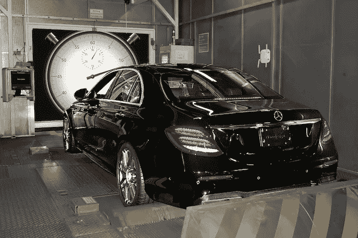
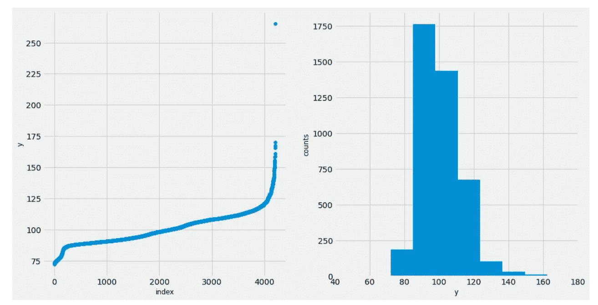
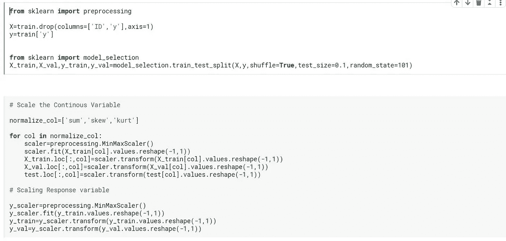
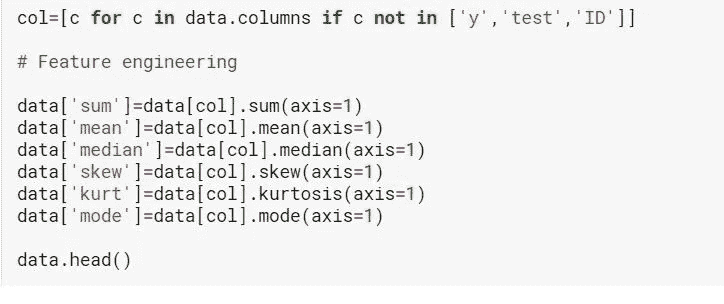

# 梅赛德斯绿色制造:卡格尔竞赛

> 原文：<https://medium.com/analytics-vidhya/mercedes-green-manufacturing-kaggle-competition-ba55ad553c75?source=collection_archive---------28----------------------->

作为我持续的数据分析学习旅程的一部分，我想尝试过去完成的 Kaggle 比赛，以测试我迄今为止的技能和知识。在浏览数据集时，我遇到了 2017 年某个时候举办的梅赛德斯绿色制造 Kaggle 竞赛。

我来自汽车领域，虽然这可能是一个很好的数据集，可以通过数据分析技巧来应用。在阅读比赛描述时，我可以更密切地联系到这个问题。**竞赛的问题是，给定一组匿名的分类和二元变量，你能预测汽车完成测试所需的时间吗？**

作为这个领域的工程师，我完全可以看到这样一个模型的重要性。我知道车辆测试有多耗时。这个过程包括制造一辆原型车，给它装上仪器，然后进行必要的测试。汽车测试中的主要瓶颈出现在仪表化阶段，这需要拆卸汽车，安装所需的记录仪器，然后重新组装汽车。

测试过程中的另一个瓶颈是测试设备的可用性，如运行测试所需的驱动单元。

所有这些因素导致了工时的浪费和车辆开发计划中开发时间的增加。这给公司增加了计划外的开销。因此，可以预测汽车完成测试所需时间的模型将有助于更好地计划和管理成本和资源。

下面是 [**比赛页面**](https://www.kaggle.com/c/mercedes-benz-greener-manufacturing/overview) **的链接。**本次比赛的评估指标是 R-square，其中是一种统计方法，表示回归模型中自变量或变量解释的因变量方差的比例。**三年前这场比赛的获胜者的 R 平方值为 0.555** 。我的目标是在一周内尽可能接近上述数值。

# **关于数据集的描述**

与大多数 Kaggle 竞争对手一样，这个数据集的列名被删除了，所以不能对它进行太多讨论。数据集的形状(行，列)，其中(4209，377)。其中有 8 个分类列和 1 个因变量，另一个是只有 1 或 0 值的二进制列。即使是 8 个分类列也有许多唯一值，因此在提供给训练的数据如此之少的情况下，对分类变量使用一种热编码将会很困难。

因变量的分布(测试所需的时间)

有一个异常值被从数据集中删除。

由于评估指标是 R-square，我从线性回归开始，即 Sk-learn 库中的岭、拉索和贝叶斯回归模型，仅针对数据的二元特征。我还从下面显示的二进制变量中设计了一些特性。使用最小-最大标量对因变量值进行归一化，并通过首先拆分数据，然后应用最小-最大标量，小心避免数据泄漏到训练集和验证集中。

**分割和缩放以避免泄漏**

**从二进制变量逐行设计的特征**

令我惊讶的是，他们在坚持验证集上表现得非常好，给出了 0.59 的 R 平方值(我的意思是与竞赛获胜者相比)，通过使用三个模型的平均系综，我能够分别获得 0.535 和 0.531 的公共 LB 和私有 LB 分数。不错的开始。

集成意味着组合不同模型的输出来得到一个预测。这个想法在于利用群众的知识。通过对不同模型进行平均，我们可以提高评估指标得分

之后，为了进一步增加我的分数，有必要加入分类栏。我使用标签编码将字符串值转换为唯一的整数，以便提供给我的模型。在这个阶段，我选择随机森林和 XG-Boost。XG-Boost 模型使用随机搜索和 5 倍交叉验证进行了调整，这也给了我一个大约 0.60 的 R 平方值。

在我的最终提交中，我尝试了许多不同的模型组合，例如使用随机森林、山脊、套索和贝叶斯的只有二元特征的模型的集合和堆叠

仅使用二元特征、分类特征和整个数据集的模型集成

**我最好的 R 平方提交 0.54440** 由一组加权的

**0.4 * XG-Boost(针对整个数据集)+ 0.6*堆叠(仅针对二元要素的山脊、套索、贝叶斯和随机森林)**

请随意查看我在 [Kaggle 笔记本](https://www.kaggle.com/sumeetsawant/mercedes-green-manufacturing-ensemble-and-stacking)或 [Github](https://github.com/sumsaw/Mercedes-Benz-Green-Manufacturing-Kaggle-Competition) 个人资料中试用的各种型号

我希望保持这种狂热，因为我觉得提高数据分析和数据构建技能的唯一方法是通过动手实践。