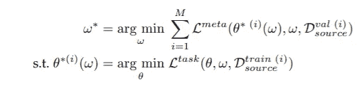
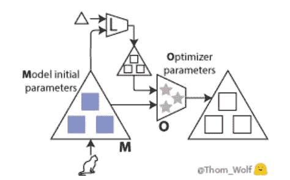
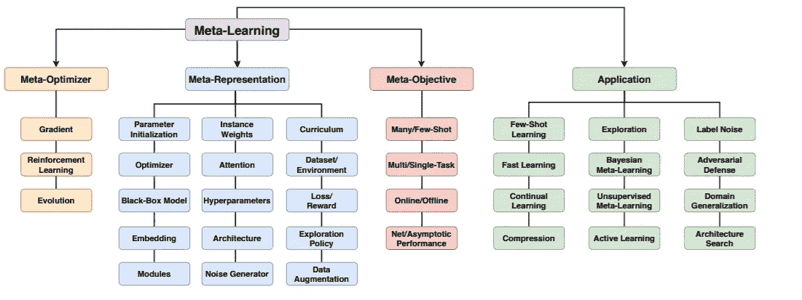

# 元学习:学会在神经网络中学习

> 原文：<https://medium.com/analytics-vidhya/meta-learning-learning-to-learn-in-neural-networks-843f10408493?source=collection_archive---------13----------------------->


礼貌用语:[https://www . quanta magazine . org/foundations-build-for-a-general-theory-of-neural-networks-2019 01 31/](https://www.quantamagazine.org/foundations-built-for-a-general-theory-of-neural-networks-20190131/)

本文综述了各种学习技术，尤其是元学习，以及这些年来它们在神经网络环境中的演变。人工智能中的传统方法倾向于坚持一种学习算法，而元学习试图改进学习算法本身。元学习允许意识到并控制自己的学习。这种学习解决了深度学习的挑战，如数据和计算瓶颈以及泛化的基本问题。

对于传统的机器学习算法，模型的性能依赖于手工制作的特征提取。另一方面，深度学习提供了一种考虑特征和模型学习的方法，这极大地提高了性能。神经网络中的元学习通过集成联合特征、模型和算法学习将它带到下一个级别。

# 形式化元学习

这种“学会学习”与人类和动物的学习非常一致，在人类和动物的学习中，学习方法在一段时间内逐渐改进。这种方法具有数据和计算效率的优势。

元学习算法可以理解为由两个层次的学习组成——内部和外部算法。内部学习类似于传统的学习算法，例如改进图像分类。在元学习期间，内部算法学习模型，同时也改进外部目标(元目标)。这个目标可以是内部算法的泛化性能或学习速度。基本任务的学习迭代可以被认为是提供外部算法所需的激励，以便学习基本学习算法。

# 术语

元学习算法的目标函数在数学上可以表示为



```
L:a function that measures the match between true labels and those predicted by f(θ)θ: parameter for inner algorithm
D: the Dataset under consideration.
ω: meta-knowledge to denote dependence on θ and class of labels.
```



礼貌:[https://medium . com/hugging face/from-zero-to-research-an-introduction-to-meta-learning-8e 16 e 677 f 78 a](/huggingface/from-zero-to-research-an-introduction-to-meta-learning-8e16e677f78a)

# 历史

元学习最早出现在 1987 年 J. Schmidhuber 和 G. Hinton 的两篇独立论文中。他们为一种新的算法家族奠定了理论基础，这种算法家族可以使用自我参照学习来学习如何学习。

然后在 2001 年，首次提出了使用梯度下降和反向传播来训练元学习系统的建议。最后，在 2012 年，元学习在深度神经网络的现代时代被重新引入，这标志着这里讨论的现代元学习类型的开始。

# **分类学**

元学习环境可以大致分为以下几类，每一类都确定了算法的参数和功能:

**元表示法**

这种分类基于元知识ω的表示。这包括估计优化器初始化参数。这些参数可以是特定于域的。

**元优化器**

这种分类基于对用于外层算法的优化器的选择。这包括梯度下降、强化学习和进化搜索等方法。

**元目标**

这种分类基于元学习的目标，元学习的目标由元目标(损失函数)、任务分配 p(T)和两个层次之间的数据流的选择来确定。



元学习前景概述

让我们研究一下上图中的几个模型。

**参数初始化**

如果我们从好的初始化参数开始，那么从 p(T)得到的任何任务 T 的解都可以在几个梯度步骤中找到。这里的目标是找到对应于神经网络初始参数的 find 方法族ω。这种方法的应用包括少量学习，其中模型可以使用少量的例子来训练，而不会过度拟合。

**以优化器为中心的方法**

这里的目标是通过训练一个函数来学习内部算法优化器，该函数将优化状态(如θ)作为输入，并为每个基本学习迭代产生优化步骤。

**嵌入函数(度量学习)**

在这种情况下，借助于使用余弦相似性或欧几里德距离在查询和支持实例之间进行简单的相似性比较，嵌入网络ω将原始输入转换成与识别兼容的表示。

**黑盒模型(递归、卷积、超网络)**

这些方法不是依赖于θ的梯度迭代优化，而是训练ω，ω提供直接从支持集到分类测试实例所需的参数的前馈映射。

**超参数**

在这些方法中，优化ω表示优化基本学习算法的超参数，例如正则化强度、每参数正则化、多任务学习中的任务相关性或数据清理中的稀疏强度

**损失和辅助任务**

这里，小型神经网络接受损失(例如，预测、特征或模型参数)的输入，并输出标量作为内部任务优化器的损失。

**进化**

进化学习方法已经发现了有趣的应用，其中它们可以优化任何类型的基本模型和元目标，而不需要可微性。它们不依赖于反向传播，这既解决了梯度退化问题，又使传统的基于梯度的方法所需的高阶梯度计算的成本最小化。

**强化学习**

当基础学习者或元目标不可微时，使用强化学习。这通常使用策略梯度定理来估计损失函数的梯度。

**多镜头 vs 少镜头插曲**

根据目标是提高少镜头还是多镜头的性能，内部循环学习片段由每个任务的许多或少数示例定义。

**多对单任务**

多任务:如果目标是调整学习者更好地解决从给定任务族中抽取的任何任务，那么内部循环学习片段对应于从任务族中随机抽取的任务。

*简单任务*:如果目标是调整学习者简单地更好地解决一个特定的任务，那么内部循环学习情节都从相同的底层任务中提取数据。

**快速适应与渐近性能**

*无症状表现:*验证损失在内部学习阶段结束时计算，这导致基本任务的最终表现更好。

*快速适应*:验证损失计算为每个内部优化步骤后的验证损失之和，这导致在基本任务中更快的学习。

# **应用**

**计算机视觉与图形学**

元学习(meta-learning)——基于少量学习方法训练算法，使强大的深度网络能够成功地在小数据集上学习。应用包括对象检测、界标预测、对象分割、图像生成、视频合成、密度估计。

**元强化学习和机器人**

强化学习通常与学习控制策略有关，学习控制策略使智能体在环境中完成一系列动作任务时获得高回报。元学习已被证明在实现强化学习方面是有效的。

人形机器人站立能力的元知识对于所有需要运动的任务家族来说是可转移的技能，而迷宫布局的元知识对于迷宫中的所有导航任务来说是可转移的技能。

**环境学习和模拟现实**

在 Sim2Real 中，我们感兴趣的是训练一个模拟，一个能够概括真实世界的模型。

元学习算法在以下情况下特别有用:内层优化学习仿真模型，外层优化算法评估模型在现实世界中的性能，元表示ω对应于仿真环境的参数。

**神经架构搜索**

架构搜索包括寻找代表神经网络最佳架构的ω。外部优化搜索具有良好验证性能的架构，而内部优化用外部算法找到的架构训练网络。

**贝叶斯元学习**

贝叶斯分层建模和贝叶斯推理强调通过推理来学习，而不是直接学习优化参数。此外，它还提供了θ参数的不确定性度量，从而提供了预测不确定性的度量。

**持续、在线和适应性学习**

*连续:*元学习已经被应用于改进连续学习，其中可以实现类似人类的学习能力，其中在给定过去经验的情况下，新任务被学习得更好，而不忘记先前学习的任务，并且不需要存储所有过去的数据用于针对遗忘的预演。

*在线和自适应学习:*在线和自适应学习也考虑到达流中的任务，但是关注有效适应流中当前任务的能力，而不是记住旧任务。

# 挑战

元学习中的元推广遇到了跨任务族的推广挑战，类似于传统机器学习中跨实例推广的挑战。

**多模态**

许多元学习算法假设任务分布是单峰的，而实际上这种分布通常是多峰的，单一的学习策略可能不会给出好的结果。

**计算成本**

元学习算法通常导致二次学习步骤，因为每个外部步骤需要多个内部步骤。此外，在多次实验的情况下，有大量的内部步骤，这些需要存储在内存中。由于这个原因，大多数元学习框架在时间和内存资源上都非常昂贵，并且通常局限于小型架构。

**跨通道迁移和异构任务**

能够从每个都有自己的模态的任务集中提取知识，并将其转移到另一个具有独特模态的异构任务中，这是一个开放的挑战和非常丰富的研究领域。

# 结论

元学习算法呈指数级增长，很容易将它与相关领域混淆。借助于以功能和目标为中心的分类法和广义分类法，我们能够清楚地识别和测试这些算法的性能，并有效地评估它们的应用。

# 参考

[神经网络中的元学习:综述](https://arxiv.org/pdf/2004.05439.pdf)

[学习梯度下降法学习梯度下降法](https://papers.nips.cc/paper/6461-learning-to-learn-by-gradient-descent-by-gradient-descent.pdf)

[从零到研究——元学习导论](/huggingface/from-zero-to-research-an-introduction-to-meta-learning-8e16e677f78a)