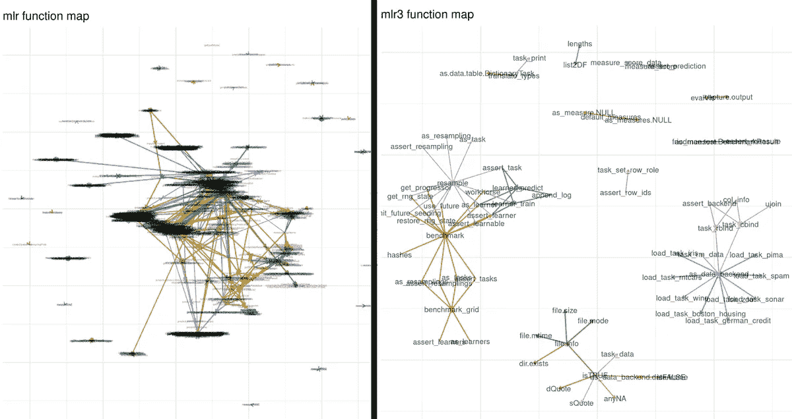
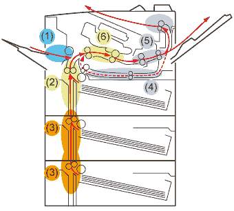

# R 中的元机器学习聚合器包:第二代

> 原文：<https://medium.com/analytics-vidhya/meta-machine-learning-aggregator-packages-in-r-round-ii-71ee1ff68642?source=collection_archive---------11----------------------->

写于 2019 年 12 月。

我在 2018 年年中的[上一篇帖子](https://towardsdatascience.com/meta-machine-learning-packages-in-r-c3e869b53ed6)描述了我对‘meta’机器学习聚合器包的 R 包的学习体验:mlr、caret 和 SuperLerner。这些包在多个独立的单个多元模型/包上统一了机器学习框架，并围绕它们为常见任务(如重采样、调整、基准测试、集成等)提供了“元”机器学习框架。

从那以后，R 生态系统中的几个主要开发已经发展和成熟，取代了不推荐使用的包，这些包，咳咳，咳咳，承认起来不舒服，已经开始遭受… [范围蔓延](/free-code-camp/scope-creep-and-other-software-design-lessons-learned-the-hard-way-edacf021965b)。

我将在这里讨论的当前重构包有:

1.  [mlr](https://mlr.mlr-org.com/) - > mlr3 ( [页](https://mlr3.mlr-org.com/)，[手动](https://mlr3book.mlr-org.com/))
2.  [插入符号](http://topepo.github.io/caret/index.html)->tidyModels([github](https://github.com/tidymodels/tidymodels))

这篇文章将试图描述这两个包的下一代之间的主要区别，重点是每个包使用的软件设计和对象体系结构/结构，以及它如何影响用户/从业者/开发人员的体验，不仅是对于基本的使用，而且是在为了更具体的使用而对其进行定制和修改时。

[https://lean kit . com/WP-content/uploads/2013/11/Screen-Shot-2013-11-25-at-4 . 25 . 52-pm . png](https://leankit.com/wp-content/uploads/2013/11/Screen-Shot-2013-11-25-at-4.25.52-PM.png)

# *范围蠕变…你是在告诉我你的‘昨天的最先进的包实际上是垃圾吗？*

当我第一次接触 mlr 时，我心想，哇，这个软件包投入了多么大的精力，更不用说大量的文档，它可能会永远存在下去。在回顾中，我发现它绝对值得我花时间去学习，尽管它有不平凡的“方言”，这不同于我已经习惯的老朋友“caret”包。

然后，在一个阳光灿烂的日子，我惊讶地发现，mlr 的开发人员实际上不再满足于他们当前的 mlr 版本，并且已经在开发一个新的包 mlr3，它主要由 R6 组成，这是一个面向对象类的高级系统，远远超出了我的舒适区。

我最初的担忧是:我和 mlr 的恋情就此结束了吗？我不仅要应对机器学习本身的复杂性挑战，还要在其上添加一个我一无所知的复杂的 R6 类结构，我该如何应对呢？

但是在处理了一段时间这个可怕的消息后，一个新的认识出现了…如果 R6 值得 mlr3 的开发者以如此激烈的方式学习曲线，以至于他们将放弃他们以前在 mlr 上的全部努力，并且永远不回头，它一定有一些功能给它一些优势…也许是时候我也从它的优势中受益了。

不要理解错了！我一直想学习和使用 R6，尽管我已经是面向对象类的 S4 系统的超级粉丝。然而，也许它太方便了，无法无缝地受益于它运行在许多复杂的软件包(tidyverse 和许多其他软件包)的背面，这使我无法潜入一个新的未知的 R6 世界。

虽然 mlr3 仍在开发中，但我认为至少我可以赢得一些时间，直到它正式成熟为稳定版本，这样我就不必经历痛苦的成长时间，如果 mlr 不再被维护，我可以随时回到 caret。

拍摄者:雅各布·里克特[https://twitter.com/jak0br/status/1281711302340227072](https://twitter.com/jak0br/status/1281711302340227072)

但是 mlr 并不是唯一被其开发者抛弃的……caret 正经历类似的[范围蔓延](/free-code-camp/scope-creep-and-other-software-design-lessons-learned-the-hard-way-edacf021965b)问题。但是，在 caret 的案例中，它的开发人员已经与 [RStudio](https://rstudio.com/) 的专家联手，完成了 [tidyverse](https://www.tidyverse.org/) 框架中缺失的环节，并发布了以“ [tidymodels](https://github.com/tidymodels/tidymodels) 为总括术语的软件包集合，包括:

*   [rsample](https://tidymodels.github.io/rsample/) 和数据预处理方法(转换、保持采样等)。
*   [欧洲防风草](https://tidymodels.github.io/parsnip/)，用于模型创建
*   [标尺](https://tidymodels.github.io/yardstick/)，用于测量模型性能

Tidymodels 的设计利用了 tidyverse 方法，一种成熟流行的直观方法，以及大量有用的文档和插图。作为 tidyverse 的狂热用户，我不能期望更多。

# *关于内聚机…*

我的[上一篇文章](https://towardsdatascience.com/meta-machine-learning-packages-in-r-c3e869b53ed6)讨论了设计这种‘元’工具的主要挑战，其中，也许最具挑战性的是整个系统的内聚性，也就是说，当你在处理特定的功能时，如何处理它而不意外地伤害其他微妙的组件，这些组件期望修补组件具有非常特定的行为/结构。

[https://oip.manual.canon/](https://oip.manual.canon/)

你有没有尝试过修理或排除大型复印机的故障，这种复印机可以做任何事情，从双面打印、装订，甚至可能是一杯奶昔，但要加两勺糖？在这样一个紧密的系统中有这么多微妙的部分？去想想。然而，当发生意外卡纸时，您下一步要做什么？你怎么能找出故障的确切位置呢？在诊断出问题的根源之前，您是否希望取出每一部分？

唉，不用担心！请放心，您甚至不需要呼叫技术人员！复印机是如此智能，它会自动告诉你在哪里寻找可能的问题，所以你不需要把它一部分一部分地拆开。详细的说明仔细地告诉你按哪个门/夹子，打开另一个可能卡纸的隐藏抽屉。瞧。修好了。剩下要做的就是关门了。机器自动运行快速自检，并为下一项任务做好准备。

多么神奇优雅的机器。我们不需要担心凌乱的墨水，破坏性的激光束射遍。相反，所有的魔法都是在复印机内部完成的。机器里发生的事情只能留在机器里。所有用户关心的是得到有组织的，干净的，装箱的打印输出。

# *那么为什么要面向对象呢？物体中发生的事，留在物体中！*

对我来说，面向对象的系统是一个受约束的受限类，它把其他东西(属性、函数/方法)包装在里面，所以东西只放在它们应该放的地方，而不是全部。是的，处理这样的约束是很痛苦的，但是从软件设计的角度来看，它们被故意设计成恼人的“不可打破的”,唯一的目的是把我们从自己的混乱中拯救出来！

S3 和 S4 是面向对象类的通用系统，而 S4 是一个更受限制的系统，支持多重调度。在我之前的[系列文章](/@drorberel/bioconductor-s4-classes-for-high-throughput-omic-data-fd6c304d569b)中，我[描述了](/@drorberel/meta-analysis-of-multiple-multi-omic-oy-vey-a45a9533e68d)生物导体开发人员如何利用 S4 系统，通过先进的统计方法，满足他们分析大型数据集的复杂需求。虽然 caret 和 mlr 不支持 Bioconductor 流行的 S4 基因组分析数据汇总实验类的非扁平结构，但有 Bioconductor 软件包尝试做与 caret 和 mlr 类似的事情，即围绕汇总实验对象统一多变量模型。另一种方法是由[的 Bioc2mlr 包](https://drorberel.github.io/Bioc2mlr/)，走另一条路，将 S4 对象展平成 mlr 和 caret 期望的标准宽数据帧格式，但代价是失去/打破了将多个插槽相互捆绑在一起的紧密结。

# *为什么是 R6？自我分配、目标节俭法:*

在我自己的经验中，我学到了一个艰难的方法，即一个人在代码中管理的对象越少，需要处理的混乱和认知负担就越少，或者更简单地说，当事情不按预期进行时，寻找 bug 的地方就越少。

按照这种节约对象的方法，我非常喜欢使用管道操作符%>%，我发现这有助于减少对象的代码。然而%<>%‘self-assignment’操作符甚至做得更多，它为我们节省了两次使用对象的冗余:第一次作为起始类，第二次作为目的类，分配新修改的内容。

R6 系统支持对象状态改变和引用语义的优雅方式。这意味着，你甚至不需要一个任务。你需要做的就是调用对象上的方法(函数)。它将自动用函数创建的新内容更新对象中的指定槽。瞧。这可能需要一段时间来适应，但是一旦你习惯了，传统的带有赋值的代码会突然变得冗余、重复、混乱和不优雅。

优雅当然是个人的品味，但对我来说，它意味着更强大，更“脆弱”的代码。它可能仍然会中断，但是因为一开始就非常严格，所以您将确切地知道从哪里开始在对象的机制中探索问题的原因，并且一旦找到，如何以安全的方式在本地修复它，而不会意外地损坏代码的其他相关部分。

好了，现在你已经知道我是面向对象类的狂热爱好者，所以我在下面的部分可能会有严重的偏见:)，所以回到 ML…

# *优秀的老式汽油发动机 vs 奇特的电动发动机……*

你开电动车吗？我还不知道，但我所知道的是它更可靠，当它坏了时，传统的机械师可能没有工具打开它并修理它。他们可能会得到故障代码的非常详细的日志信息，但他们甚至没有工具来打开电动发动机罩。相反，你可能需要把它送到专门从事这种新的先进技术的专门商店，他们将有工具来快速诊断它，找到问题，并修复它。

嗯，我的朋友，这可能也是比较这两种重构 ML 方法的情况。

# **相似之处:**

一方面，mlr3 和 tidymodels 共享相同的多变量模型、重采样等算法，并且可能实现非常相似的模型性能(精度)。在可伸缩性方面也可能存在差异，这超出了本文的范围。

# **不同点:**

对我来说，有 3 个主要的关键区别，前两个直接来源于 R6 类的架构:

1.  **有一个隔离的、紧凑的、分离的“空间”,用于 ML 分析(mlr3)和传统的 R 函数，它们做一些事情，并在这个结构或另一个结构中返回一个结果(tidymodels)。**

我只是发现，当专门的任务在指定的空间中完成时，它会更优雅(即稳定、一致、不那么脆弱)，它会仔细监控并只关心什么会进入，什么会被排出。仅此而已。

对于许多用户来说，mlr3 R6 可能不是微不足道的，但对于欣赏这种严格分类的人来说，它就是天堂。tidymodels 将让许多其他人对传统的 R S3 系统感到满意，该系统也受益于简单运行函数的灵活性，而不必太担心边缘场景，只有当您一直调整它到其边界时，它才会意外中断函数。对于许多用户来说，他们可能永远不会接近这些界限，所以为什么要担心呢。

**2。当我需要以最安全的方式为新的特定需求进行定制时，自己连接电线。**

[https://www.syfy.com/](https://www.syfy.com/)

经久耐用的好包装设计范围非常广。足够让开发人员演示如何定制软件包的主要功能。在 ML 环境中，定制和添加新的多元模型(学习者)、新的性能指标、新的转换等。mlr3 和 tidymodels 在文档(向您展示如何从头添加新方法的教程)和严格约束(在某种程度上)方面都做得很好。

然而，mlr3 的 R6 约束可能比 tidymodels 实施的约束更严格，当您将它与 ML 方法的其他部分结合在一起时，tidy models 会扩展。换句话说，在这样一个集成了重采样+调优+基准测试+的强大多功能管道中，即使是一点点锡(例如，预测向量中不应该出现的 NAs)以某种方式卡在轮子中，也可能导致副作用，从而损坏整个机器。这种情况发生的可能性有多大？也许它永远不会发生，但是最小化这种可能性的最佳实践是使用一个更受限制的系统。

就我的运气而言，(嗯，我确实喜欢将这种方法发挥到极限)，它确实偶尔会发生，当它发生时，花费宝贵的时间去寻找错误的原因一点也不好玩。你可能根本不在乎，但有些人在乎。

**3。预处理:定制新的可组合(monad)转换**

正如我在[的上一篇文章](https://towardsdatascience.com/meta-machine-learning-packages-in-r-c3e869b53ed6)中提到的，预处理的棘手部分是保证无论在训练数据集上应用哪种变换，都应该在测试数据集上应用。当需要传递保存转换细节的参数时，这不是一个简单的任务。这两个包都支持 monad 编程，这意味着允许以任何顺序组合不同的转换，同时保证“管道”之间的兼容性。

更重要的任务是编写您自己定制的预处理转换。尽管'[配方](https://tidymodels.github.io/recipes/articles/Custom_Steps.html) s '和'[MLR 3 管道](https://mlr3book.mlr-org.com/extending-mlr3pipelines.html)都有大量的文档，但这一点并不简单。总的来说，这两种方法具有相似的功能，但是，每种方法都有自己的术语和行话，可能需要一些时间来适应。

**4。生存和无监督模型**

目前由 mlr3 支持，但似乎 tidymodels 开发人员也计划添加它。

**5。你能给我看看代码吗？**

[https://mlr3 pipelines . MLR-org . com/articles/comparison _ MLR 3 pipelines _ MLR _ sk learn . html](https://mlr3pipelines.mlr-org.com/articles/comparison_mlr3pipelines_mlr_sklearn.html)在 MLR 3 和 tidymodels(以及其他)之间有很好的代码对比。

# *视觉:*

与我在上一篇文章中的观点相似，真正重要的是让用户对文档感到舒服，并能获得可靠的支持渠道。我还设想开发从一个包到另一个包的“转换器”功能，至少是为了转换。不管上面的差异，丰富的转换库集合是两种方法的共同兴趣。

由于某种原因，我并不完全清楚，这两种方法都没有为'[可解释的模型不可知的](https://christophm.github.io/interpretable-ml-book/)工具提供指定的包/功能，例如 [LIME](https://lime.data-imaginist.com/) 、 [DALEX](https://modeloriented.github.io/DALEX/) 和 [iml](https://cran.r-project.org/web/packages/iml/vignettes/intro.html) (等等)。对我来说，这些后 ML 工具似乎是对通用 ML 框架的补充，尽管提到的一些包可能已经支持它们了

# *底线*:

1.  **尊重好的老的弃用包。在你掌握它们之前，不要跳到下一级！**

我首先鼓励新的 ML 从业者使用 caret 和 mlr 的废弃版本，这样您就可以熟悉常见机器学习组件的基本术语、范围和功能。

只有这样，当你对分类、回归、特征工程、模型参数调整、交叉验证、集成、基准测试和其他术语感到舒适时，才可以逐步前进，进入下一个阶段。

**2。如果你不必把它变得复杂，简单就好。**

很多从业者大概连我上面说的区别都不会在意。在这种情况下，tidymodels 可能是首选。它简单、直截了当、有良好的文档记录并且受到支持。

**3。你不是一直想学习 R6，但从来没有足够的动力这样做吗？**

不要错过这个机会，否则就留下来。

**4。当事情发生时…**

对于其他喜欢修补和扩展工具范围的人来说，对包对象结构和后端发生的实际机制的关注可能更重要。

一天结束时，即使今天最先进的工具也是明天被弃用的废弃包，但活在当下，在目前，一个人应该赌上最稳定的解决方案，那是不太可能打破的。

为什么会破？如果它不会破裂，就根本没有必要写这个帖子。

# **免责声明**:

除了软件包 [Bioc2mlr](https://drorberel.github.io/Bioc2mlr/) 之外，作者不属于开发上述软件包的任何团体。

重构为[的超级学习者呢？](https://tlverse.org/)顺便说一下，R6 也是这样做的。我不知道。也许在未来的博客里。然而，我想说的是，它背后的开发团队的学术兴趣主要是受激励的，并倾向于基于目标最大似然/最小损失的估计(TMLE)，这是一种参数估计的统计方法，而不是其他两个可能更面向“工程”的软件包。最近有一个关于它的很棒的文档[在这里](https://tlverse.org/tlverse-handbook/)。

有趣的事实:mlr3 从不提及 p 值。甚至不确定那是不是故意的。

我是不是忘了这篇(半偏)评论中的一个关键人物？如果是这样，请告诉我。如果我没有好的理由排除它，我不介意添加它。

查看我的[博客](/@drorberel)和 [github 页面](https://drorberel.github.io/)了解更多有趣的东西。

[Dror.Berel@gmail.com](http://Dror.Berel@gmail.com)

[LinkedIn 个人资料](https://www.linkedin.com/in/dror-berel-1848496/)