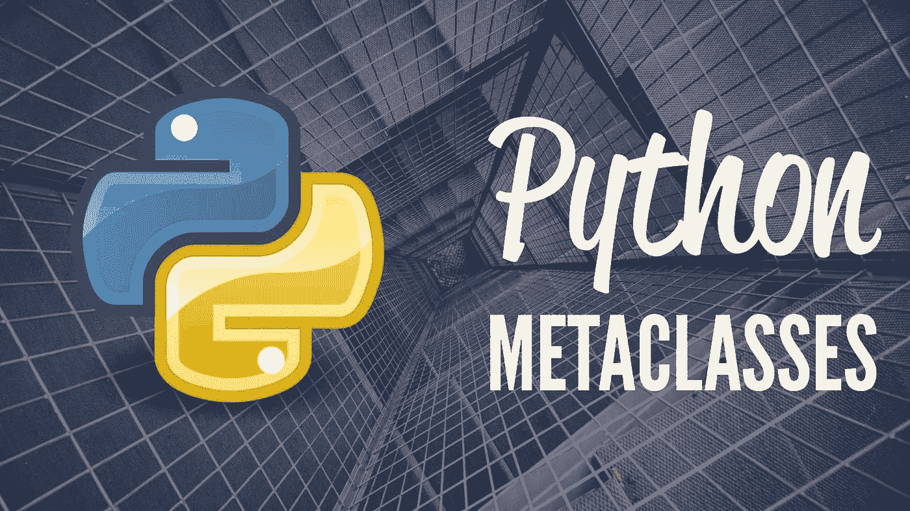

# Python 元类——实际用例

> 原文：<https://medium.com/analytics-vidhya/metaclass-practical-use-cases-a8f24957322?source=collection_archive---------17----------------------->



在我们上一个故事([https://medium . com/analytics-vid hya/meta programming-in-python-for-初学者-546adbc76f98](/analytics-vidhya/metaprogramming-in-python-for-beginners-546adbc76f98) )中，我们看到了元类的基础知识。

在本文中，我们将看到一些`metaclass`非常有用的用例。

**用例 1:** 使用`metaclass`创建单例类(重复上一篇文章中的相同场景)

```
**class** SingletonMeta(type):
    _instances = {}

    **def** __call__(cls, *args, **kwargs):
        **if** cls **not in** SingletonMeta._instances:
            obj = super(SingletonMeta, cls).__call__(*args, **kwargs)
            SingletonMeta._instances[cls] = obj
        **return** SingletonMeta._instances[cls]

**class** Singleton(metaclass=SingletonMeta):
    **pass** a = Singleton()
b = Singleton()
print(a **is** b)
```

**提示:**

1.  每当该类被用作可调用的对象时(即在对象创建期间)，在我们的元类上定义的`__call__`方法就会被调用。
2.  我们在我们的`metaclass`上维护了一个字典`_instances`来映射每个类及其新创建的对象。
3.  如果这个类在`_instances`字典中已经有了一个对象，我们返回相同的对象，而不是再次创建它。

**用例 2:** 我们如何使用`metaclass`来创建类的注册表？

```
**class** Animal(type):
    _register = {}

    **def** __new__(cls, name, bases, dct):
        class_ = super(Animal, cls).__new__(cls, name, bases, dct)
        **if** name **not in** Animal._register:
            Animal._register[name] = class_
        **return** class_

    **@classmethod**
    **def** list_animals(cls):
        **print**(cls._register)

**class** Dog(metaclass=Animal):
    **pass

class** Cat(metaclass=Animal):
    **pass

class** Shark(metaclass=Animal):
    **pass** Animal.list_animals()
```

**提示:**

1.  元类`Animal`维护一个字典`_register`，其中保存了类名和类之间的引用。
2.  元类`Animal`上的方法`list_animals`使用字典`_register`中的数据显示动物列表

**用例 3:** 元类定制类的创建

```
**class** Animal:
    **def** __init__(self, type, count):
        self.type = type
        self.count = count

    **def** __repr__(self):
        **return f"{**self.name**}:{**self.type**}:{**self.count**}"

class Zoo**Meta(type):
    **def** __new__(cls, name, bases, dct):
        animals = []
        **for** key, val **in** dct.items():
            **if** isinstance(val, Animal):
                val.name = key
                animals.append(val)
        dct[**"herbivores"**] = [animal **for** animal **in** animals **if** animal.type == **"herbivore"**]
        dct[**"carnivores"**] = [animal **for** animal **in** animals **if** animal.type == **"carnivore"**]
        dct[**"total_herbivores"**] = sum([animal.count **for** animal **in** dct[**"herbivores"**]])
        dct[**"total_carnivores"**] = sum([animal.count **for** animal **in** dct[**"carnivores"**]])
        dct[**"total_animals"**] = dct[**"total_carnivores"**] + dct[**"total_herbivores"**]
        class_ = super(ZooMeta, cls).__new__(cls, name, bases, dct)
        **return** class_

**class** ChennaiZoo(metaclass=ZooMeta):
    tiger = Animal(**"carnivore"**, 10)
    lion = Animal(**"carnivore"**, 4)
    elephant = Animal(**"herbivore"**, 25)
    camel = Animal(**"herbivore"**, 12)
    snake = Animal(**"carnivore"**, 5)

**class** MumbaiZoo(metaclass=ZooMeta):
    tiger = Animal(**"carnivore"**, 6)
    lion = Animal(**"carnivore"**, 7)
    elephant = Animal(**"herbivore"**, 14)
    camel = Animal(**"herbivore"**, 7)
    snake = Animal(**"carnivore"**, 20)

**print**(ChennaiZoo.total_animals)
**print**(ChennaiZoo.herbivores)
**print**(ChennaiZoo.carnivores)

**print**(MumbaiZoo.total_animals)
**print**(MumbaiZoo.herbivores)
**print**(MumbaiZoo.carnivores)
```

**提示:**

1.  元类`ZooMeta`的行为就像一个工厂，让开发人员不必定义创建其他附加属性的逻辑。
2.  开发人员只需定义`Zoo`类，元类负责在创建类时向类添加其他相关属性。
3.  元类`ZooMeta` 在运行时将自定义属性`herbivores, carnivores, total_herbivores, total_carnivores, total_animals`动态添加到 zoo 类中，这非常有用。

感谢您通读。如果你喜欢这篇文章，请订阅我的频道。