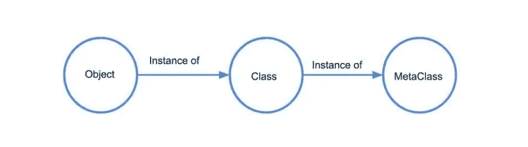

# Python 中的元类

> 原文：<https://medium.com/analytics-vidhya/metaclasses-in-python-35f7787c762e?source=collection_archive---------15----------------------->

元类简介


由[麦克斯韦·纳尔逊](https://unsplash.com/@maxcodes?utm_source=unsplash&utm_medium=referral&utm_content=creditCopyText)在 [Unsplash](https://unsplash.com/s/photos/python-programming?utm_source=unsplash&utm_medium=referral&utm_content=creditCopyText) 上拍摄的照片

在大多数编程语言中，类只是为对象定义规则的代码片段，但是在 Python 中，正如您所听到的，一切都是对象:事实证明，类本身也是如此。类实际上是一级对象，它们可以在运行时创建，作为参数传递，从函数返回，以及赋给变量。

让我们看看下面的例子-

```
class Tutorial:
    passprint(Tutorial())# Output - 
# <__main__.Tutorial object at 0x7fd92c1500f0>
```

正如我们所看到的,`Tutorial`类的实例告诉我们这是主教程对象的一个对象。在某个地方。

现在只打印类本身-

```
print(Tutorial)# Output -
# <class '__main__.Tutorial'>
```

我们能够这样做的原因是因为`Tutorial`类是一个对象，就像任何其他对象一样。当你使用`class`关键字时，Python 会自动创建这个对象。这是一个元类的实例- `type`。



理解 Python 元类

> *元类是一个类的类；它定义了一个类的行为。*

现在为了更简单，让我们深入一下，也许你在 Python 中遇到过`type`关键字？用来寻找物体的类型-

```
print(type(1))# Output - 
# <class 'int'>print(type('Hey'))# Output - 
# <class 'str'>
```

果然`1`是`int`类的类型，`Hey`是`str`类的类型，让我们找出我们类的类型——

```
print(type(Tutorial))# Output - 
# <class 'type'>
```

这一次，我们得到了一个打印输出，表明`Tutorial`是类`type`的类型。但是`type`本身呢？什么是类型的`type`？

```
print(type(type))# Output -
# <class 'type'>
```

`type`的类型是类`type`，你可能会觉得这很奇怪。因此我们发现`type`也是它自己的元类！

# 理解元类如何工作

`type`是 python 中内置的元类。它用于构造类，就像类用于构造对象一样。所以每当我们创建一个类时，默认的元类(`type`)就会被调用，并给我们一个选项来使用它作为一个对象。
这意味着 python 中的每个类也是`type`的对象，因此我们可以直接使用`type`来生成一个类，而不需要任何类语法。type()函数可以通过使用以下三个参数来直接定义类

```
type(<name>, <bases>, <dct>)
```

*   **名称** —这是类的内部表示。这是类的名称。
*   **bases**——这指定了我们从超类或父类继承的任何东西。这是父类的元组。
*   **dct** —这指定了包含类的方法和变量定义的名称空间字典。

更清楚地说-

```
Test = type('Test', (), {})
```

所以上面的代码完全等同于下面的代码-

```
class Test:
    pass
```

他们绝对没有什么不同。

因此，如果我们想要修改类的行为，我们将需要编写我们自己的自定义元类。

为了创建我们自己的定制元类，我们首先必须继承默认的元类`type`，并实现元类的`__new__`方法和/或`__init__`方法。

*   `__new__`:这个 dunder 方法通常被类型的`__new__`覆盖，在调用创建类的原始`__new__`之前，修改要创建的类的一些属性。
*   `__init__`:创建实例/对象后，当您想要控制初始化时，调用此方法。

```
class MyMeta(type):
    def __new__(self, name, bases, attr):
        print(attr)
        return type(name, bases, attr)
```

这里我定义了一个简单的元类`MyMeta`，我们将打印出属性，这样我们就可以看到它们的样子。之后，我定义了另一个类`Sample`，它有元类`MyMeta`，有`name`和`age`变量-

```
class Sample(metaclass=MyMeta):
    name = 'bob'
    age = 24
```

现在，在没有创建实例的情况下，它仍然会运行，您可以看到下面的输出

```
{'__module__': '__main__', '__qualname__': 'Sample', 'name': 'bob', 'age': 24}
```

那么这个类`Sample`是如何被创建的

解释器看到了在`Sample`中定义的`metaclass=MyMeta`，所以现在解释器得到信息，默认元类`type`不能用于创建`Sample`类，而必须使用`MyMeta`来创建`Sample`类。

因此，解释器调用`MyMeta`来创建类`Sample`，当`MyMeta`被调用时，`MyMeta`的`__new__`被调用，它打印出属性，并使用`type`构造`MyMeta`的实例，即`Sample`并将对象返回给我们。

这个元类只覆盖对象创建。类和对象行为的所有其他方面仍然由类型处理。

现在我们已经介绍了足够多的理论来理解什么是元类以及如何编写自定义元类。现在让我们看一个简单的真实案例--

假设我们有一个要求，你的类的所有属性都应该是大写的，有多种方法可以实现这个功能，但是这里我们将在模块级使用`metaclass`来实现，所以在名称空间字典(属性)中，如果一个键不是以双下划线开头，我们需要将其改为大写-

```
class MyMeta(type): def __new__(self, name, bases, atts): print(f'current_attributes - {atts}\n')
        new_atts = {} for key, val in atts.items():
            if key.startswith('__'):
                new_atts[key] = val
            else:
                new_atts[key.upper()] = val print(f'modified_attributes - {new_atts}')        
        return type(name, bases, new_atts) class Sample(metaclass=MyMeta):
    x = 'bob'
    y = 24 def say_hi(self):
        print('hii')
```

输出-

```
current_attributes - {'__module__': '__main__', '__qualname__': 'Sample', 'x': 'bob', 'y': 24, 'say_hi': <function Sample.say_hi at 0x7fd92c10d048>}modified_attributes - {'__module__': '__main__', '__qualname__': 'Sample', 'X': 'bob', 'Y': 24, 'SAY_HI': <function Sample.say_hi at 0x7fd92c10d048>}
```

正如您在上面看到的，我们已经打印了当前的属性，并创建了一个字典来表示我们修改过的属性。

在这里，我们只是检查键是否以双下划线开头，然后添加正确的值，否则我们将添加具有相应值的大写属性。

现在，为了确保这是可行的，让我们来试试，我已经创建了一个`Sample`的实例，并且只打印一个旧的属性。

```
s = Sample()
s.x
```

输出-

```
AttributeError Traceback (most recent call last)
<ipython-input-18-87b2922593a9> in <module>
      1 s = Sample()
----> 2 s.xAttributeError: 'Sample' object has no attribute 'x'
```

不出所料，我们得到了一个错误`AttributeError`，这完全没问题，因为我们刚刚修改了对象的构造，让我们尝试通过修改后的属性来访问

```
print(s.X)s.SAY_HI()
```

输出-

```
bob
hii
```

这就是他们称之为魔术的原因，因为通过这种与类创建的挂钩，你真的可以对如何创建类施加相当多的约束

例如，如果你想让一个特定模块中的每一个类都不被允许使用某个特定的属性或者遵循某个特定的模式，你可以为这些特定的模块设置元类。

# 结论

元类的目的不是用元类/类代替类/对象的区别，而是以某种方式改变类定义(以及它们的实例)的行为。
元类使用的合理模式是在定义一个类时做一次，而不是在实例化同一个类时重复做。当多个类共享相同的特殊行为时，重复`metaclass=X`显然比重复特定目的代码要好。

# 参考

[](https://stackoverflow.com/questions/100003/what-are-metaclasses-in-python) [## Python 中的元类是什么？

### 在理解元类之前，您需要掌握 Python 中的类。Python 对什么有一个非常特殊的想法……

stackoverflow.com](https://stackoverflow.com/questions/100003/what-are-metaclasses-in-python) 

[https://stackoverflow . com/questions/392160/元类的具体用例是什么/393368](https://stackoverflow.com/questions/392160/what-are-some-concrete-use-cases-for-metaclasses/393368)