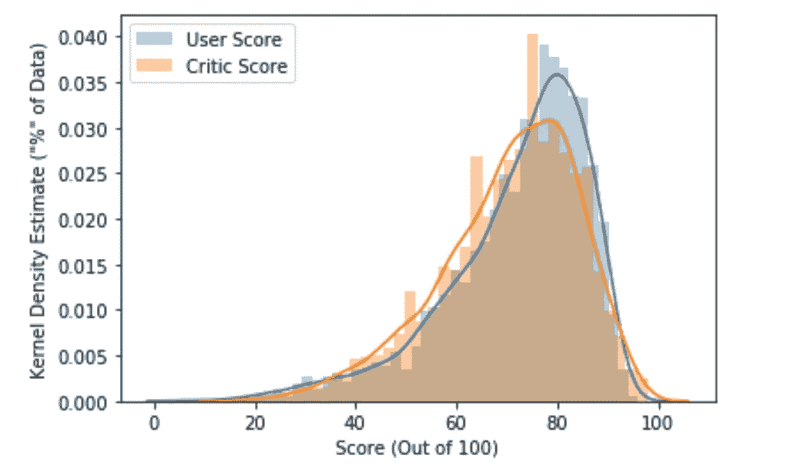
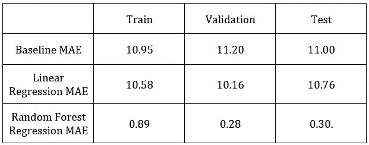
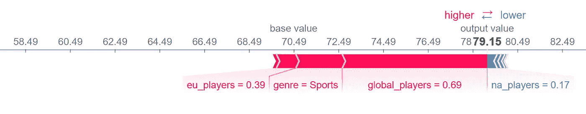

# 视频游戏的元分数预测

> 原文：<https://medium.com/analytics-vidhya/metacritic-score-prediction-for-video-games-b2ffce70acc8?source=collection_archive---------6----------------------->

图片来自 [Pixabay](https://pixabay.com/) 的[van duti](https://pixabay.com/users/vandulti-8204949/?tab=latest)

**简介**

娱乐有无穷无尽的选择。随着每天都有更多的内容被创造出来，你可以在任何媒体上消费的内容数量是惊人的。伴随着所有这些选择而来的是“选择什么”的问题。消费者在寻求卓越体验时使用的一种启发式方法是可信元批评分数。

元批评分数是总的批评分数。理想情况下，对许多分数进行平均会增加分数的确定性。在视频游戏行业，元批评分数可以左右观众，促使他们尝试他们以前可能没有尝试过的游戏。这些分数对开发者和观众都很重要，尽管原因不同。

我决定尝试创建一个模型，可以预测尚未发布的视频游戏的元批评分数。我使用了来自 Kaggle 的关于视频游戏销售和评级的[数据集，以生成我的模型并探索游戏特征和评论家评分之间的关系。](https://www.kaggle.com/rush4ratio/video-game-sales-with-ratings)

**起点**

我想创建的模型是一个可以预测尚未上市游戏的收视率的模型。然而，当我探索我的数据时，我意识到我不能达到这个结果，因为“泄漏”的数据。这是因为这个数据集中收集的信息是在游戏推出后收集的。

换句话说，我拥有的数据无法用于我想要做出的新预测。我需要更多关于视频游戏开发阶段的数据来制作理想的模型。我花了一小段时间研究获得我需要的数据的方法，但是我决定暂时不去追求那些方法。

创建的模型 I *根据以下变量预测元临界评级:*

*   发布平台
*   发行年份
*   类型
*   玩家在:北美，欧洲，日本和“其他”
*   全球玩家，
*   ESRB 评级

这些输入变量中的一些，例如:北美玩家的数量，在游戏推出之前是不确定的。但是，通过一些市场调查，您可以对这些输入值进行估计。作为模型输入的一部分进行估计的结果是模型“确定性”降低了。我不知道如何量化由于这种输入估计而导致的“确定性”的降低。这是一个值得探索的领域。

我想指出的是，我所说的“确定性”并不等同于模型的“准确性”。准确性是用于对模型进行评分的一个指标。它告诉您模型正确的频率(对于分类任务)。确定性与你对模型结果的信心有关。你可能有很高的准确性，但如果你对模型“不确定”，你可能不想对模型做出的预测下任何赌注，或任何实质性的赌注。

**数据探索**

我对这个数据集的一个探索性问题是:用户评分和评论家评分有多一致？为了显示用户分数和评论家分数之间的统计差异，我制作了下面的直方图。

图 1:用户和评论家得分的直方图。

请注意，平均而言，用户给出的分数要比评论家高，而且评论家对游戏的评分也更加平均。这两个直方图是用相同数量的观察值创建的

用户和评论家分数的一个偏差是，并不是每个玩游戏的人(评论家或用户)都会评论它。有些人只是没有在公共论坛上分享他们的观点，他们的观点也没有被记录在这个数据集中。

**型号**

这个模型在很多方面都是整个项目中最简单的部分。一旦数据采用了模型需要 scikitlearn 的线性回归的格式，随机森林回归模型就会处理所有的工作。我没有花太多时间来调整这些模型的超参数，因为我预计随着我技能的提高，数据会发生巨大的变化，并在这个数据集中获得更多关于视频游戏的数据。然而，即使数据集有限，随机森林回归模型也比基线高出不少。

表 1:基线和最佳模型的平均绝对误差。

请记住，该模型是由“泄漏”数据产生的，因此实际误差将取决于地区玩家数量的准确性。

然而，理解模型预测特定值的原因仍然很重要。图 2 显示了一个 shapley 力图示例。Shapley 力图显示了特定变量对模型预测的影响。这张图显示了数据集中一场比赛的预测。

图 1:解释随机森林回归模型预测的 Shapley 力图。

如果你想查看数据集中其他游戏的预测，你可以查看我的代码，并通过笔记本末尾的 shapley 函数运行你自己的预测。

你可以在这里找到我的代码:[https://github . com/mvkumar 14/Video-Game-Ratings-dash app/tree/master/notebooks](https://github.com/mvkumar14/Video-Game-Ratings-DashApp/tree/master/notebooks)

**结论:这种模式在“现实生活”中的价值**

归根结底，metacritic score 是人们真正想要的信息的代理。你想要的信息取决于你是谁。开发人员希望衡量他们游戏的质量，他们希望知道游戏设计的哪些领域值得探索。发行商想知道投资什么类型的游戏，以及如何指导他们的开发者的时间和资源投资。观众希望找到一种他们会喜欢的体验。元批评分数是一个尽最大努力成为这些不同群体之间共同点的数字。它失败得很可怕，但就像我在这里做的模型一样，总比没有好。这个分数可以作为寻找你真正想要的信息的起点。

作为一名消费者，我经常查看元批评分数，并将用户分数作为“价值”的代表。理解“价值”实际上是我所寻求的，回避了问题:对我来说“价值”到底是什么？对别人？

我并不总是确定，但我正在学习数据科学可能有助于回答这个问题。