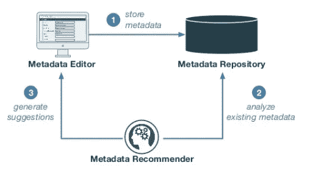
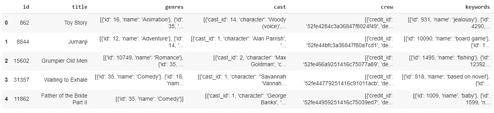
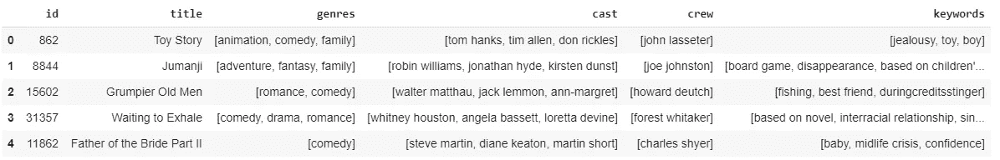
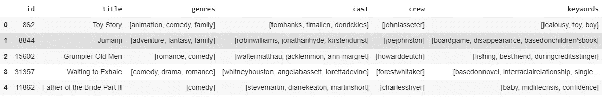
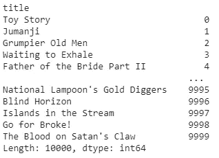
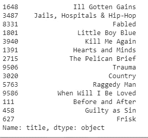

# Python 中基于元数据的推荐系统

> 原文：<https://medium.com/analytics-vidhya/metadata-based-recommender-systems-in-python-c6aae213b25c?source=collection_archive---------11----------------------->

## *本博客用 python* 展示了一个 ***基于元数据的推荐系统***

****

*在开始用 python 实现基于元数据的推荐系统之前，我建议您花 4 分钟阅读这篇博客，它用外行的术语定义了推荐系统及其类型。*

*[https://medium . com/@ saketgarodia/the-world-of-recommender-systems-e4ea 504341 AC？source = friends _ link&sk = 508 a 980d 8391 DAA 93530 a 32 e 9c 927 a 87](/@saketgarodia/the-world-of-recommender-systems-e4ea504341ac?source=friends_link&sk=508a980d8391daa93530a32e9c927a87)*

*通过这篇博客，我将展示如何在 Kaggle 的 MovieLens 100k 数据集上用 Python 实现一个基于元数据的推荐系统。*

*我们将使用的数据集是 Kaggle 上的 MovieLens 100k 数据集:*

*[](https://www.kaggle.com/prajitdatta/movielens-100k-dataset) [## MovieLens 100K 数据集

### 稳定的基准数据集。1000 名用户对 1700 部电影的 100，000 次评分

www.kaggle.com](https://www.kaggle.com/prajitdatta/movielens-100k-dataset) 

让我们开始实施它。

# 问题定式化

*建立一个推荐系统，根据之前看过的电影的流派、演员、剧组和一些关键词推荐电影。*

# **实施**

首先，让我们导入所有必要的库，我们将使用它们来创建一个基于内容的推荐系统。让我们也导入必要的数据文件。

```
#importing necessary librariesimport numpy as npimport pandas as pdfrom sklearn.metrics.pairwise import cosine_similarityfrom sklearn.metrics import mean_squared_errorfrom sklearn.model_selection import train_test_splitfrom sklearn.feature_extraction.text import TfidfVectorizerfrom sklearn.metrics.pairwise import linear_kernelfrom ast import literal_evalfrom sklearn.feature_extraction.text import CountVectorizermovies = pd.read_csv(‘movies_metadata.csv’)credits = pd.read_csv(‘credits.csv’)#keywords like jealousy, fishing, etc that belongs to particular movies are also part of the metadata.#we will grab keywords from keywords.csvkeywords = pd.read_csv(‘keywords.csv’)#importing necessary columnsmovies = movies[[‘id’,’title’,’genres’]]#clean movie_id functiondef clean_id(x):try:return int(x)except:return np.nanmovies['id'] = movies['id'].apply(clean_id)movies = movies[movies['id'].notnull()]#converting everything into integermovies['id'] = movies['id'].astype('int')keywords['id'] = keywords['id'].astype('int')credits['id'] = credits['id'].astype('int')#merging the 3 dataframes to get all the required data on 1 datafarame moviesmovies = movies.merge(credits, on='id')movies = movies.merge(keywords, on='id')
```

在合并独立的数据文件 credits.csv、keywords.csv 和 movies_metadata.csv 之后，这里是我们在 ***movies 数据帧*** 中的内容:



现在，让我们对数据进行必要的讨论，因为这些数据似乎格式混乱，有很多我们在分析中不会用到的信息。

**流派**、**演员表**、**剧组、**和**关键词**列都是对象(或字符串数据类型)。让我们首先使用 ***literal_eval*** 将这些字符串转换成 python 对象(这里是字典列表)并使用 pandas 和 numpy 来处理它们，从而从这些列中获得我们将使用的单词。

```
#changing the 4 columns into python objects ( list of dictionaries here)movies[‘genres’] = movies[‘genres’].apply(literal_eval)movies[‘cast’] = movies[‘cast’].apply(literal_eval)movies[‘crew’] = movies[‘crew’].apply(literal_eval)movies[‘keywords’] = movies[‘keywords’].apply(literal_eval)#grabbing the names of all the genres attached to each moviemovies[‘genres’] = movies[‘genres’].apply(lambda x: [i[‘name’].lower() for i in x])#grabbing the name of the director from all the crew members#we will only use directors from the creqw column for our purposemovies[‘crew’] = movies[‘crew’].apply(lambda x: [i[‘name’].lower() for i in x if i[‘job’]==’Director’])#grabbing the cast and keywords from the list of dictionaries of those columnsmovies[‘cast’] = movies[‘cast’].apply(lambda x: [i[‘name’].lower() for i in x])movies[‘keywords’] = movies[‘keywords’].apply(lambda x: [i[‘name’].lower() for i in x])#taking maximum 3 cast/genre/keywords for each moviemovies[‘genres’] = movies[‘genres’].apply(lambda x: x[:3] if len(x)>3 else x)movies[‘cast’] = movies[‘cast’].apply(lambda x: x[:3] if len(x)>3 else x)movies[‘keywords’] = movies[‘keywords’].apply(lambda x: x[:3] if len(x)>3 else x)
```

在进行了必要的清理并选择了 3 个流派、3 个关键词和演员后，我们的数据看起来是这样的:



现在，我们有了构建基于元数据的推荐系统所需的干净数据。我们只需要**删除名字和姓氏之间的空格**，因为如果我们不删除空格，汤姆克鲁斯**和汤姆汉克斯**的电影将被机器认为是相同的，因为名字“汤姆”很常见。让我们去掉空格，这样汤姆·汉克斯就成了汤姆·汉克斯，汤姆·克鲁斯就成了汤姆·克鲁斯。****

```
#removing spacesmovies[‘cast’] = movies[‘cast’].apply(lambda x: [i.replace(‘ ‘,’’) for i in x])movies[‘crew’] = movies[‘crew’].apply(lambda x: [i.replace(‘ ‘,’’) for i in x])movies[‘keywords’] = movies[‘keywords’].apply(lambda x: [i.replace(‘ ‘,’’) for i in x])movies[‘genres’] = movies[‘genres’].apply(lambda x: [i.replace(‘ ‘,’’) for i in x])
```



现在，演员表中的所有名字都有 0 个空格，这使得它们是唯一的。

现在，让我们通过在“流派”、“演员”、“工作人员”和“关键字”列中追加值，为所有元数据创建一个列。

```
movies[‘metadata’] = movies.apply(lambda x : ‘ ‘.join(x[‘genres’]) + ‘ ‘ + ‘ ‘.join(x[‘cast’]) + ‘ ‘ + ‘ ‘.join(x[‘crew’]) + ‘ ‘ + ‘ ‘.join(x[‘keywords’]), axis = 1)
```

由于 google colab 的内存问题，我将只运行前 10000 部电影来构建推荐系统。相同的代码可用于进一步扩展。

我们将使用一个**计数矢量器**从我们的元数据中构建数字特征。我们不会在这里使用 TfIdf，因为可能有很多电影是由同一个导演拍摄的，我们绝对不想惩罚那个导演。用户可能希望被推荐属于该导演的电影。我们拥有的大多数单词是名称和流派，它们的数量实际上对推荐电影很有用。

我将使用**余弦相似度**来找出任意两部电影之间的相似度。现在，让我们使用计数矢量器值创建一个余弦相似性矩阵，然后构建一个推荐器函数。

```
count_vec = CountVectorizer(stop_words=’english’)count_vec_matrix = count_vec.fit_transform(movies_df[‘metadata’])cosine_sim_matrix = cosine_similarity(count_vec_matrix, count_vec_matrix)#movies index mappingmapping = pd.Series(movies_df.index,index = movies_df[‘title’])
```



```
#recommender function to recommend movies based on metadatadef recommend_movies_based_on_metadata(movie_input):movie_index = mapping[movie_input]#get similarity values with other moviessimilarity_score = list(enumerate(cosine_sim_matrix[movie_index]))similarity_score = sorted(similarity_score, key=lambda x: x[1], reverse=True)# Get the scores of the 15 most similar movies. Ignore the first movie.similarity_score = similarity_score[1:15]movie_indices = [i[0] for i in similarity_score]return (movies_df[‘title’].iloc[movie_indices])
```

现在我们已经构建了推荐器函数，让我们看看它是如何工作的。让我们尝试使用基于元数据的推荐系统来获得类似于《盲视界》的电影。

推荐 _ 电影 _ 基于 _ 元数据('盲视界')



对于输入电影《盲视界》，通过学习它的元数据，我们被推荐了 15 部电影。是不是很神奇？

要了解基于内容和协作过滤的方法，请浏览我的以下博客:

1.  基于内容的推荐系统:[https://medium . com/@ saketgarodia/content-based-Recommender-Systems-in-python-2b 330 e 01 EB 80？](/@saketgarodia/content-based-recommender-systems-in-python-2b330e01eb80?source=friends_link&sk=339a4eaa360453fe6952a10190ec5e9e)
2.  使用协同过滤的推荐系统:[*https://medium . com/@ saketgarodia/recommendation-system-using-Collaborative-Filtering-cc 310 e 641 FDE*](/@saketgarodia/recommendation-system-using-collaborative-filtering-cc310e641fde)

**谢谢**

不断学习*