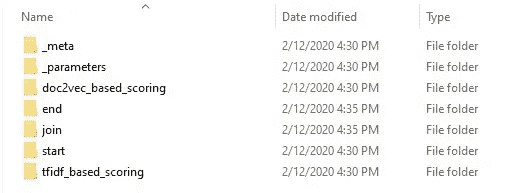

# 网飞的元流——善、恶、丑

> 原文：<https://medium.com/analytics-vidhya/metaflow-by-netflix-the-good-the-bad-and-the-ugly-b7fc6a833484?source=collection_archive---------7----------------------->

【2019 年 12 月，网飞开源 metaflow —一个为 Python 编写以人为中心的机器学习基础设施的框架。目标是抽象出 ML 建模的管理和工程方面，让数据科学家(可以说他不太擅长开发和编码最佳实践)专注于数据科学。它被网飞的数据科学团队广泛使用。


网飞数据科学公司对 Metaflow 的采用率正在飞速上升！

但是什么是元流呢？！根据[官方文件](https://docs.metaflow.org/introduction/what-is-metaflow)，

> Metaflow 是一个对人类友好的 Python 库，可以帮助科学家和工程师构建和管理现实生活中的数据科学项目。Metaflow 最初是在网飞开发的，旨在提高数据科学家的工作效率，这些科学家从事从经典统计到最先进的深度学习的各种项目。
> 
> Metaflow 为执行数据科学项目(从原型到生产)所需的基础架构堆栈提供了统一的 API。


学分:[https://www . slide share . net/InfoQ/human centric-machine-learning-infra structure-网飞](https://www.slideshare.net/InfoQ/humancentric-machine-learning-infrastructure-netflix)

Metaflow 引入了一个 API，其中每个 ML 管道都被写成一个“流”。

流就像有向无环图(DAG)。它可以有步骤(节点)、分支和数据工件，如参数、文件等。


典型的(元)流！演职员表:[元流启动](https://www.youtube.com/watch?v=XV5VGddmP24&t=2374s)

为了更详细地理解这些概念，请参考[这篇文章](https://towardsdatascience.com/learn-metaflow-in-10-mins-netflixs-python-r-framework-for-data-scientists-2ef124c716e4)，它很好地解释了这些组件。还有，[官方文件](https://docs.metaflow.org/)也很有帮助。

最近，我在我的一个项目中使用了 metaflow。以下是一份固执己见的利弊清单。

# **好人**

*   **Dag 给出正确的模型**
    大多数(ML)流水线可以(也应该)被认为是 Dag。你有一些预处理和后处理，中间是一个模型。Metaflow 重申了这个框架。
*   **类似于 Airflow**
    Airflow 是一种流行的数据管道工具，用于编排 ETL 管道。元流使您能够以类似的方式考虑 ML 管道。
*   **对并行性的内置支持** 如果您的流程中有多个可以并行运行的“步骤”或功能，Metaflow 会为它们提供开箱即用的支持，从而有效地利用您的计算。
*   **面向对象编程** 告别管理这么多函数的脚本。欢迎一个通过逻辑图组织步骤(如那些函数)的类。
*   **广泛的日志记录和版本控制** 关于 Metaflow 最好的事情之一是，它记录你的每个流的每次运行。这使得在生产环境中调试工作流变得轻而易举。您不仅可以获得日志和流程中任何步骤可能发生的错误，还可以获得 *latest_run* ，您可以用它来恢复上一次运行的状态。


流程每次运行的日志



运行的每个步骤的日志

*   **可读性**
    这可能是使用元流的最大优势——它让你的 ML 代码可读性更好。步骤带来的抽象非常棒。此外，您甚至可以在不运行/查看代码的情况下生成流的文档。只需运行:

```
python my_flow.py show
```


使用 Metaflow 的 show 命令生成文档

很好，是吧？

# **坏的(和丑陋的)**

*   **有限的功能集和文档**
    于 2019 年 12 月开源，该库仍处于非常活跃的开发中。目前，[文档有些有限](https://github.com/Netflix/metaflow/issues/115)，你必须依赖很多教程，甚至偷看库代码。也就是说，机器学习基础设施管理正在快速发展，该团队正在尽最大努力推出所需的功能。
*   **Windows 上不支持** [您目前无法在 Windows 上运行元流。然而，如果你熟悉 Docker，这应该不成问题。只要确保在 Docker 文件中设置了一个用户名，因为 Metaflow 需要一个用户名来记录日志](https://github.com/Netflix/metaflow/issues/60)

```
# User needed for metaflow loggingENV USERNAME my_user
```

*   与 AWS 紧密结合网飞与 AWS 的合作是众所周知的。有些人甚至说，内容流平台对云平台今天的发展功不可没。因此，自然地，Metaflow 内置了对 AWS S3 桶、EC2 计算和其他云功能的支持。然而，有[说对 Azure](https://github.com/Netflix/metaflow/issues/40) 的支持即将到来。
*   **通过子流程** 调用这可能是元流最烦人的限制——不能通过创建流类的对象来启动运行。它必须通过终端运行。如果您有一个触发运行的队列，这应该不是问题。然而，如果您有一个服务请求的服务器，这可能是丑陋的。在 python 中，从代码运行终端命令通常是通过 subprocess 方法完成的，这也是元流作者推荐的[方法。](https://github.com/Netflix/metaflow/issues/116)

```
subprocess.run(['python', 'my_flow.py', 'run'])
```

仅此而已！虽然 Metaflow 似乎是朝着正确的方向迈出了一步，但在它准备好被普遍使用之前，还有很长的路要走。感谢您的阅读！