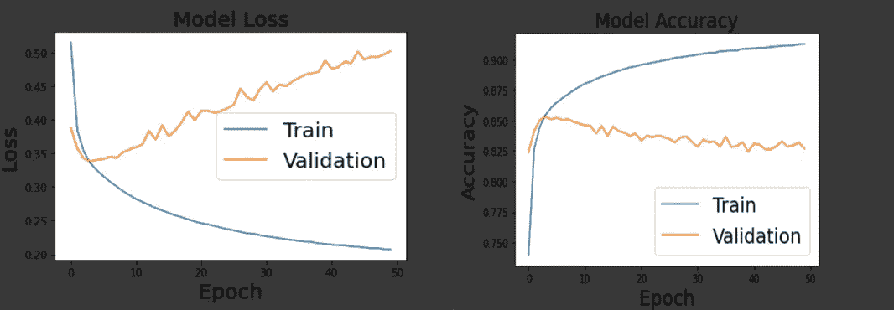

# 基于自然语言处理的宏基因组学基因预测

> 原文：<https://medium.com/analytics-vidhya/metagenomics-gene-prediction-using-nlp-7d843b67ef58?source=collection_archive---------6----------------------->

## 宏基因组学阅读中基因预测的 CNN+嵌入层。

在这个病变中，我将演示我们如何使用深度学习来预测编码 orf 和非编码 orf。我们将使用在自然语言处理(NLP)框架内开发的方法，并将其应用于 orf，将 DNA 序列视为生物分子文本。

我们将实现四种不同的算法 CNN，RNN，LTSM，GRU，并比较他们的性能，看看哪一个优于另一个。

算法的预处理是相同的，我们使用这篇文章****提供的数据，其中包含大约 400 万个 orf，我提取了 60 万个 orf 进行训练和测试。****

****该数据可在我的 [**驱动器**](https://drive.google.com/drive/folders/1_R6Dpyllq3gtu2llVzxVZzEEVYbyIGAv?usp=sharing) 中获得****

# ****预处理数据****

****第一步是将数据加载到 google colab 中。****

****将数据加载到 tmpdata 后，我们将这个列表转换成 pandas 数据帧。****

********

****将 DNA 序列视为“语言”，也称为 k-mer 计数****

****DNA 和蛋白质序列可以被比喻为生命的语言。这种语言为在所有生命形式中发现的分子编码指令和功能。序列语言类比继续以基因组为书，子序列(基因和基因家族)是句子和章节，k-mers 和肽(基序)是单词，核苷酸碱基和氨基酸是字母表。既然这个类比看起来如此贴切，那么自然语言处理领域所做的惊人工作也应该适用于 DNA 和蛋白质序列的自然语言。****

****我们要用的方法简单易行。我首先将长的生物序列分解成 k-mer 长度的重叠“单词”。例如，如果我使用长度为 6(六聚体)的“单词”，“ATGCATGCA”就变成了:“ATGCAT”，“TGCATG”，“GCATGC”，“CATGCA”。因此，我们的示例序列被分解为 4 个六聚体单词。****

********

****我们现在需要将每个基因的 k-mers 列表转换成字符串句子****

****我们可以看到我们有一个相当平衡的数据。****

********

****这里我们将使用 Kears 的 **Tokenizer** 类来将单词/ K-mers 转换成整数，然后应用填充来处理标准化输入的长度。****

****创建模型前的最后一步是将数据分为训练和测试，并定义词汇大小。****

# ****CNN +嵌入层****

****让我们创建模型，看看它表现如何。****

********

****一旦模型准备好了，训练的时间终于到了。****

****************

****因为我们的模型似乎没有很好地学会区分编码 orf 和非编码 orf。****

****我们得到的准确率为 82.51%，敏感性为 80.39%，特异性为 79.17%，调和平均值为 79.78%****

********

# ****摘要****

****在这一课中，我们探索了 NLP 在基因预测中的应用，下一篇文章将是基因预测中的最后一篇，我将比较 RNN、LSTM 和 GRU 的表现，看看哪个模型给我们的结果最好。****

****在 [LinkedIn](https://www.linkedin.com/in/rachid-elfermi-75a84b8b/) 和 [GitHub](https://github.com/rachidelfermi) 上查看我。****

****下次见****