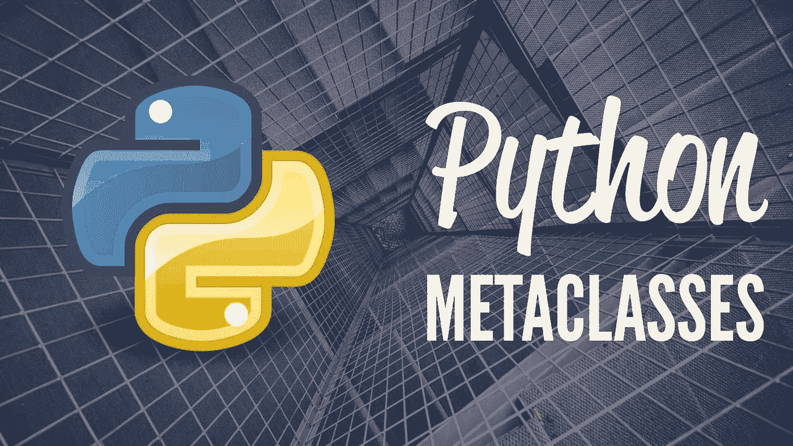

# Python 中元类的介绍

> 原文：<https://medium.com/analytics-vidhya/metaprogramming-in-python-for-beginners-546adbc76f98?source=collection_archive---------2----------------------->

python 中元类的介绍

许多有过用`python`编写面向对象代码经验的人可能会遇到`metaclass`的概念，如果你不知道它是什么，那么这篇文章就是为你准备的！

**什么是元类？**

元类是定义类及其实例的行为的类。元类是一个类，它的实例是类。