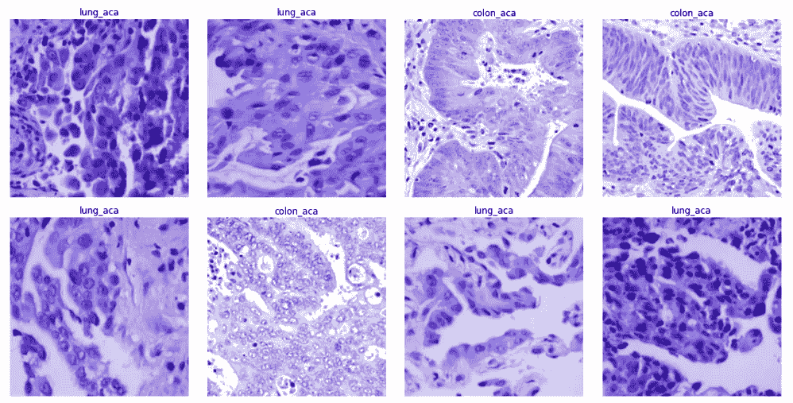

# 使用卷积神经网络的转移性腺癌分类

> 原文：<https://medium.com/analytics-vidhya/metastatic-adenocarcinoma-classification-using-convolutional-neural-networks-49de90b4cb7b?source=collection_archive---------7----------------------->

# Keras vs fastai

机器学习(ML)在医疗保健领域有许多应用的潜力。一个有希望的应用是在解剖病理学领域。ML 允许使用代表性的图像来训练计算机从标记的照片中识别模式。基于选择的一组图像…