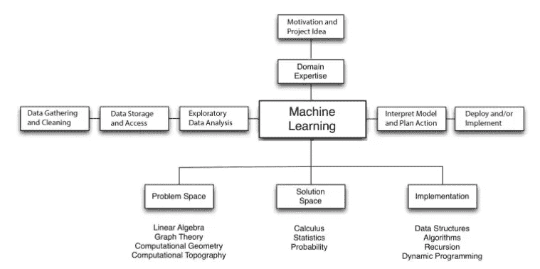
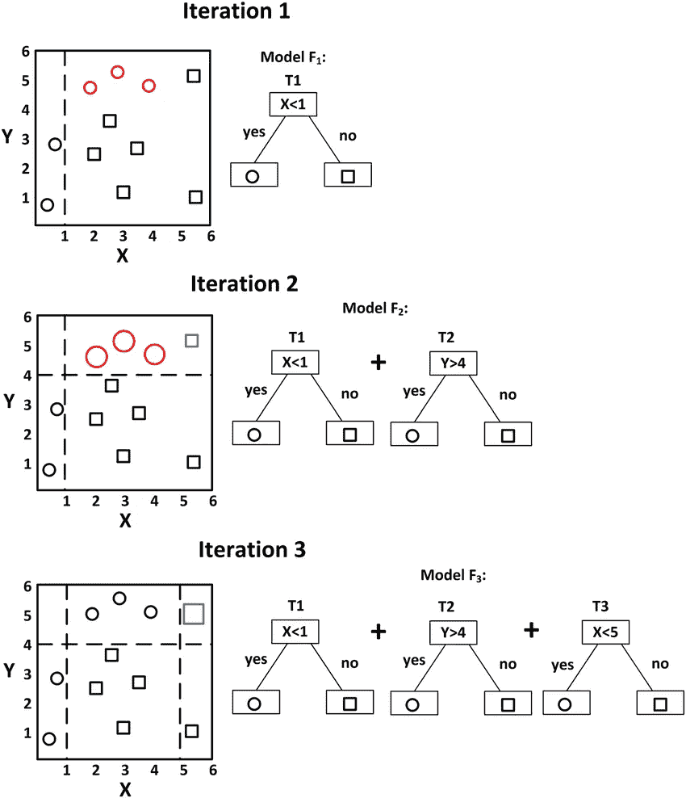
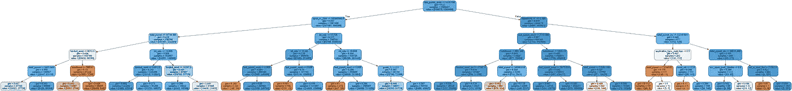
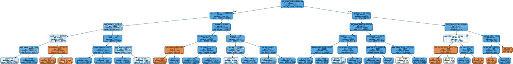
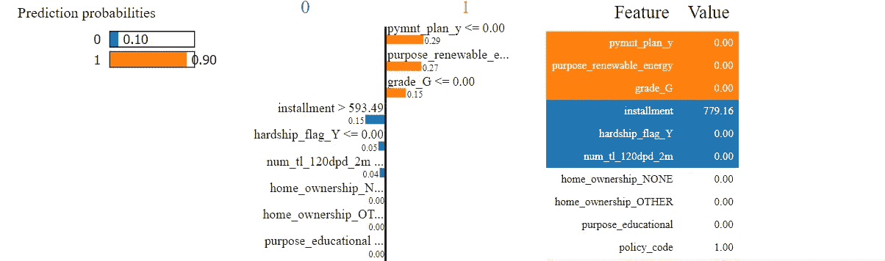
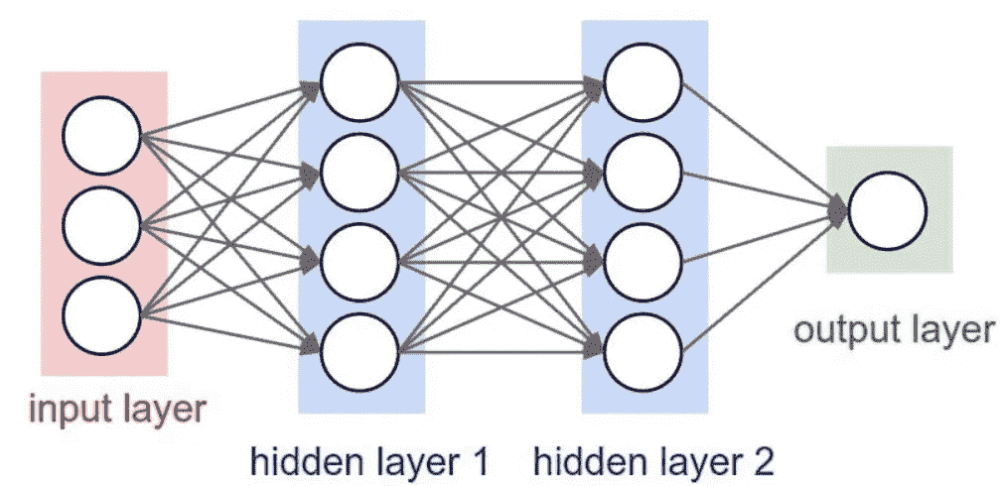
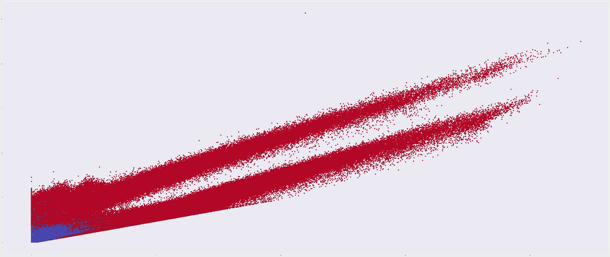
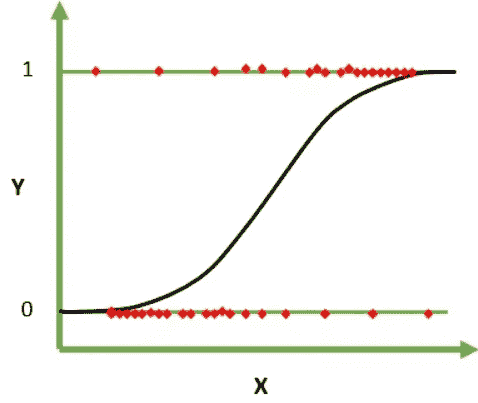

# 解释信用模型预测的方法

> 原文：<https://medium.com/analytics-vidhya/methods-to-interpreting-credit-model-predictions-8dbfb10db3d5?source=collection_archive---------16----------------------->


> ~“就数学定律所指的现实而言，它们是不确定的；就它们是确定的而言，它们不是指现实。”~爱因斯坦

通过数学框架与人类可以理解的更高维度科学的结合，在时间上向前或向后移动在理论上是有效的。然而，过去可以被用来在某种程度上确定地引领未来，因为历史总是会重演。这种说法受制于人的本性，因为人是创造历史的主要因素，因此人的行为和行动也可以高度确定地预测。为了捕捉这些思维链，数学和统计模型是如何做出决策的基线，是使用过去模式来了解近期或未来的最佳工具。一种方法是根据使用 if & else 可以淹没某条路径的场景(if 和 so)做出决策。使用这个概念，if 和 else 框架可以扩展到某个决策。另一种方法是模仿人类的神经系统，该系统连接通过突触的信号细胞，并促使人类的身体移动，并促使大脑对身体部位做出决定。

# 我们的使命宣言


解码我们的黑盒

为了达到我们的目的，一家银行要求我们建立三个预测模型来预测贷款违约，它们如下:

*   梯度推进模型

梯度推进模型

*   神经网络
*   逻辑回归

然后，银行向我们提供了贷款违约的数据集(过去的数据),用于训练和拟合我们的模型。该数据集将用作构建所述模型的过去信息，以基于数据将暴露给模型的特定模式或概率分离做出未来决策。在通过主流数据准备管道运行我们的数据之后，模型被训练、验证，然后在样本数据上进行测试。然后，目标是向银行展示几种技术，说明如何解释每种模型的决策或隐藏的问题解决模式。

```
#Target variable 
loan_status = {'Current': 1, 'Fully Paid':1, 'Late (31-120 days)':0, 'In Grace Period': 1, 'Charged Off': 0, 'Late (16-30 days)': 1, 'Default':0,'Does not meet the credit policy. Status:Fully Paid': 1, 'Does not meet the credit policy. Status:Charged Off':0}
```



任何预测模型的建模过程

# 模型解释

## 梯度推进分类模型



梯度推进模型决策过程

boosting 模型是一个集合树模型，其中基础学习者是依赖的。每个基础学习器都是建立在来自先前迭代的模型误差上的。在梯度增强模型中，梯度增强通过沿梯度方向移动来最小化误差。

为了解释我们的梯度推进模型，可以使用三种技术向银行展示。

*   简单的决策树
*   符合决策树 GBM 的预测
*   局部观测解释

1.  简单决策树:

```
from sklearn.tree import DecisionTreeClassifier
from IPython.display import Image  
from sklearn.externals.six import StringIO  
from sklearn.tree import export_graphviz
import pydotplus
#code to view my feature splitting using dtree
import os
os.environ['PATH'] = os.environ['PATH']+';'+os.environ['CONDA_PREFIX']+r"\Library\bin\graphviz"dt = DecisionTreeClassifier(max_depth = 5, random_state=1)# fitting the decision tree model on the training set
dt.fit(X_train, y_train)plt.figure(figsize=(25,25));dot_data = StringIO()  
export_graphviz(dt, out_file=dot_data,feature_names=X_train.columns,filled=True,rounded=True)graph = pydotplus.graph_from_dot_data(dot_data.getvalue())  
Image(graph.create_png())
```



观察一个简单的决策树是如何将数据分割成最重要的变量的

2.在决策树上拟合 GBMs 预测

为了解释梯度推进模型，在简单决策树上拟合训练预测。

> 另一种方法是将梯度提升的类概率作为决策树中的一个特征进行堆叠。

```
# saving the predictions of Random Forest as new target
new_target = GBModel.predict(X_train)# defining the interpretable decision tree model
dt_model = DecisionTreeClassifier(max_depth=5, random_state=1)# fitting the surrogate decision tree model using the training set and new target
dt_model.fit(X_train,new_target)plt.figure(figsize=(25,25));dot_data_2 = StringIO()  
export_graphviz(dt_model, out_file=dot_data_2,feature_names=X_train.columns,filled=True,rounded=True)graph = pydotplus.graph_from_dot_data(dot_data_2.getvalue())  
Image(graph.create_png())
```



基于梯度推进预测的树拟合

3.LIME(本地可解释模型不可知解释)

莱姆解释了一个局部的观察，在这个被解释的预测的附近。当银行希望检查某个客户的预测过程时，该软件包非常有用，可以了解某些变量如何影响接受或拒绝该客户的可能性。例如，如果利率对拒绝客户有影响，则在特定情况下减少/增加。

> 源代码:[https://github.com/marcotcr/lime](https://github.com/marcotcr/lime)

```
# import Explainer function from lime_tabular module of lime library
from lime.lime_tabular import LimeTabularExplainer# creating the explainer function
explainer = LimeTabularExplainer(X_train.values, mode="classification", feature_names=X_train.columns)# fetching any observation 
customer = 52
X_observation = X_test.iloc[[customer], :]GBM_model.predict(X_observation)[0]* 1 
# Model predicted Not Default
# explanation using the gradient boosting
explanation = explainer.explain_instance(X_observation.values[0], best_model.predict_proba)
explanation.show_in_notebook(show_table=True, show_all=False)
```



负(蓝色)特征表示“0”(默认)，而正(橙色)特征表示“1”(无默认)。解释权重的方法是将它们应用于预测概率。例如，如果我们从数据中删除变量 pymnt_plan_y、purpose_renewable_energy 和 grade_G，我们期望分类器以 0.90–0.29–0.27–0.15 = 0.19(19%)的概率预测“1”(默认)。同样的，去掉分期，difference _ flag _ Y & num _ TL _ 120 DPD _ 2m 会把预测 0 的概率提高到 0.1 + 0.15 + 0.05 + 0.04 = 0.34。

## 神经网络模型



预测贷款违约的神经网络模型有两个隐藏层

神经网络旨在模拟人类神经系统和大脑决策过程，是具有隐藏层的复杂模型，其特征是在每个隐藏层中设计新的变量。构成隐藏或输出图层中新要素的每个箭头都有一个权重。这些权重类似于线性或逻辑回归中的系数。然而，每一层都可以采用任何已知的激活(数学)函数来聚合来自先前特征的输入权重；这大大降低了大数据集的维度。权重是使用优化过程建立的，这基本上意味着它是从随机猜测开始的。

为了解释我们的神经网络模型，我们使用以下内容:

*   新变量的层表示方案
*   无隐层神经网络

1.  内层表示:

```
NN_model.summary()*Model: "sequential_183"
_________________________________________________________________
Layer (type)                 Output Shape              Param #   
=================================================================
dense_547 (Dense)            (None, 5)                 420       
_________________________________________________________________
dense_548 (Dense)            (None, 5)                 30        
_________________________________________________________________
dense_549 (Dense)            (None, 1)                 6         
=================================================================
Total params: 456
Trainable params: 456
Non-trainable params: 0
_________________________________________________________________import keras.backend as K
inp = NN_model.layers[0].input
out = NN_model.layers[1].outputfeatures_function = K.function([inp], [out])
features_NN = features_function([scaled_test[:6000]])[0]
plt.figure(figsize=(70,30))
plt.scatter(features_NN[:, 0], features_NN[:, 1], c=y_test, cmap='coolwarm')
plt.legend()
```



缺省(0)和无缺省(1)类分离的内层表示

在该图中，蓝色(0-负类)与红色(1-正类)明显分开。显然，存在一定的重叠，这也是模型中 0 类的 F 值为 0.66 左右，而 1 类的 F 值为 0.96 的原因。理解和可视化不同层的输出有助于解释哪一层导致了学习表示中的主要错误！特征尺寸应该减少到 2-D 而不是 5-D。5-D 特征表示是从 2-D 观察的，因此我们看到聚类数据点的形状的清晰轮廓。然而，要查看清晰的二维表示，应该通过 PCA 等方法降低特征的维度，但这超出了本文的范围，然而该表示用于解释神经网络隐藏层的目的。

2.只有输出层的神经网络

构建只有一个输出层的神经网络是一个具有许多隐藏层的更复杂的神经网络的解释性表示。如果没有指定隐藏层，并且随后输出的激活函数被设置为 sigmoid 函数，那么我们有一个逻辑回归模型，这是一个比具有许多隐藏层的完全连接的神经网络要简单得多的模型。

```
from sklearn.linear_model import LogisticRegression
from keras.regularizers import l2
from keras.optimizers import SGDdef build_logistic_regression_model():
    model = Sequential()
    model.add(Dense(units=1,kernel_initializer='glorot_uniform', activation='sigmoid',kernel_regularizer=l2(0.)))
    model.compile(optimizer='sgd',
                  loss='binary_crossentropy',
                  metrics=['accuracy'])
    return model
print(classification_report(y_test,model_logit.predict(scaled_test)))
*              precision    recall  f1-score   support

           0       0.71      0.34      0.46     85363
           1       0.91      0.98      0.94    592829

    accuracy                           0.90    678192
   macro avg       0.81      0.66      0.70    678192
weighted avg       0.89      0.90      0.88    678192
```

无层神经网络的性能与神经网络模型的性能相差不远，如下所示:

```
y_pred_best = NN_model.predict(scaled_test)
y_pred_best = (y_pred_best>0.5)
print(classification_report(y_test_select,y_pred_best))
*precision    recall  f1-score   support

         0.0       0.90      0.52      0.66     85363
         1.0       0.94      0.99      0.96    592829

    accuracy                           0.93    678192
   macro avg       0.92      0.76      0.81    678192
weighted avg       0.93      0.93      0.92    678192
```

这验证了使用无层神经网络作为解释更复杂的深度学习框架的方法。

## 逻辑回归



基于赔率的自然对数，称为 Logit。如果我们的预测是分类的，则使用该模型，我们根据数据集中的变量计算 Y 属于某个类别的概率。

逻辑回归(Logit)是二元结果最流行的线性模型。

因为它是一个线性模型，不像梯度推进或神经网络，因此它捕捉数据集中的线性关系，以预测客户是否违约。此外，它相当容易解释，简单地理解求解模型系数的最大似然法将使模型决策非常清楚，最终它是一个线性模型！

然而，一个有趣的话题是，如何在 SKLEARN 的逻辑回归函数中模拟基于 KERAS 的无隐藏层且激活函数为 sigmoid 的神经网络。您可以在下面找到链接:

[](/analytics-vidhya/build-lookalike-logistic-regression-model-with-sklearn-and-keras-2b03c540cdd5) [## 用 SKlearn 和 Keras 建立相似逻辑回归模型

### ~如果你能细化到每一串颤动的数据，未来将是完全可预测的。~夏洛克

medium.com](/analytics-vidhya/build-lookalike-logistic-regression-model-with-sklearn-and-keras-2b03c540cdd5) 

构建逻辑回归模型本身就是对神经网络的解释，因为如参考文章中所示，可以使用另一个内置了逻辑回归算法的包来模拟以 sigmoid 作为激活函数的简单神经网络(无隐藏层)。

# 结论

金融市场越来越复杂，促使市场从业者转向基于高级数学和统计技术的非线性模型，以捕捉金融系统中尚未发现的非线性关系。这些模型让我们看到了近期和未来如何做出改变银行收入、支出以及在某些情况下扩大生存的决策。因此，这些模型不会变得更复杂，因为提供的信贷产品比以前更加混合，更多的因素影响着一个人是否违约。因此，建立某些技术来解码这些模型将揭示它们的黑盒决策过程，以便判断性地观察所做的预测以及为达到这些预测所采取的一系列步骤。