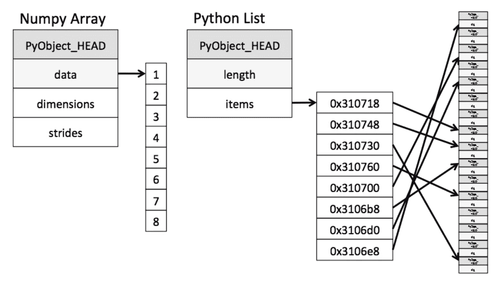

# 在机器学习中使用 Pandas，PyArrow，Scikit learn 时减少运行时内存的方法。

> 原文：<https://medium.com/analytics-vidhya/methods-to-reduce-ram-consumption-while-using-pandas-pyarrow-and-scikit-learn-in-machine-learning-7927a092559a?source=collection_archive---------1----------------------->

照片由 [Xtina Yu](https://unsplash.com/@tongs?utm_source=medium&utm_medium=referral) 在 [Unsplash](https://unsplash.com?utm_source=medium&utm_medium=referral) 上拍摄

## 对使用的记录数量配置任意限制

在使用 PyArrow 将拼花文件转换为数据框时，我们可能会被实际拼花文件的大小所欺骗。因为 300 万行数据可能占用不到 400MB 的实际文件内存。但是，这些数据在转换为数据帧时会占用多达 5 GB 的处理内存。只有当进程完成时，内存才会被释放。

在多处理环境中，这可能会增加处理内存的压力，随着我们不断处理数据，这种压力可能会不断增加，最终导致应用服务器的高内存使用率。因此，最好对获取的记录数量进行限制。

## 尽可能使用类别类型而不是对象类型

与“类别”数据类型相比，“对象”数据类型的特性消耗大量内存并占用 RAM 中的不同片段。类别字段在内部用数字对数据进行编码，并维护一个类似字典的结构来引用实际值。此外，类别特征的数值存储在连续的存储器位置中。从而减少处理和查找时间。

演职员表:[https://jakevdp . github . io/blog/2014/05/09/why-python-is-slow/](https://jakevdp.github.io/blog/2014/05/09/why-python-is-slow/)

但是，在将所有对象列转换为类别时应该小心，因为具有超过 50%唯一值的对象列作为对象类型本身往往比转换为类别类型占用更少的内存。

## 向下转换数字特征:

类型特征占用的内存

> Int 64 > Int 32 > Int 16 > Int 8
> float 64>float 32>float 16
> Int>unsigned Int(仅正值)

因此，应该尽可能为每个字段选择合适的数据类型。
向下转换时应小心，因为如果数据点值超出数据类型的范围，它们可能会被修剪。然而，我们可以采用一些技术，比如找出一个特征的最小值、最大值，然后决定是否向下转换。此外，领域知识可能有助于确定数值字段的取值范围，进而有助于选择数据类型。

## Scikit 的标签编码器非常耗时:

看起来 Scikit-learn 的标签编码器在拟合数据时使用了排序搜索。这可以通过将对象转换为分类变量，然后应用 pandas **cat.codes** 来代替，它使用哈希技术，在编码方面非常快。如前所述，在某些情况下，将变量转换为非对象数据类型会更有效。

***演职员表:***
[https://www.dataquest.io/blog/pandas-big-data/](https://www.dataquest.io/blog/pandas-big-data/)
[https://stack overflow . com/questions/39475187/how-to-speed-labelen coder-up-recoding-a-categorical-variable-into-integers？answertab=votes#tab-top](https://stackoverflow.com/questions/39475187/how-to-speed-labelencoder-up-recoding-a-categorical-variable-into-integers?answertab=votes#tab-top)