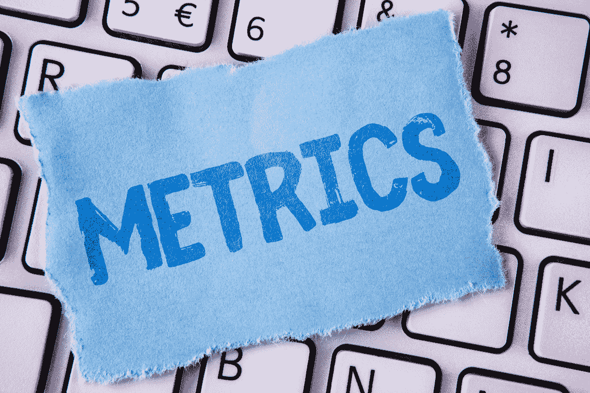

# 多标签分类的度量

> 原文：<https://medium.com/analytics-vidhya/metrics-for-multi-label-classification-49cc5aeba1c3?source=collection_archive---------3----------------------->

度量在机器学习或深度学习领域中起着相当重要的作用。我们从度量选择的问题开始，以了解特定模型的基线得分。在这篇博客中，我们探讨了多标签分类的最佳和最常见的指标，以及它们与通常的指标有何不同。

让我来解释一下什么是多标签分类，以防你需要它。如果…