# 迈耶斯-布里格斯分类模型

> 原文：<https://medium.com/analytics-vidhya/meyers-briggs-classification-models-ddac6b3e87b4?source=collection_archive---------11----------------------->

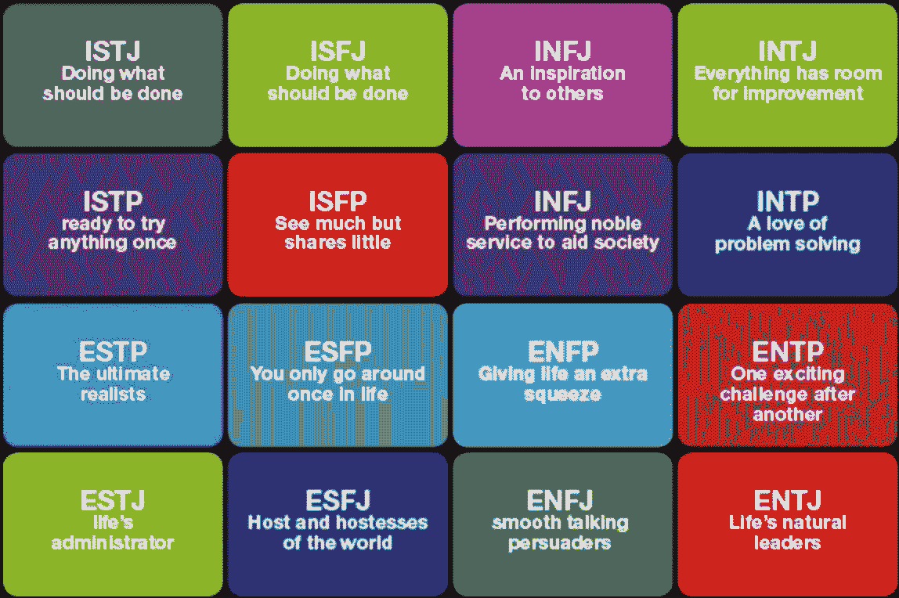

根据迈尔斯-布里格斯理论的十六种人格类型。

在心理学领域，当今最受推崇的人格类型分类方法之一是迈尔斯-布里格斯类型指标(MBTI)。迈尔斯-布里格斯理论是对瑞士著名精神病学家卡尔·荣格最初提出的概念理论的改编。MBTI 由凯瑟琳·库克·布里格斯和她的女儿伊莎贝尔·布里格斯·迈尔斯创建，是一份自省问卷，从心理学角度提供人们如何看待世界和做决定的观点。

使用预先制作的数据集，我决定创建一些非常简单的二进制分类模型，以探索如何潜在地分析书面交流，并用于识别个性类型的各个组成部分。

*请注意，本项目是出于教育目的在教室环境中完成的。在这个领域已经进行了其他广泛的研究，这篇文章中的任何信息都不打算作为自然语言处理或人格类型分类的最终权威来分享。

# 数据概述

这个项目我用的数据是[公开的](https://zenodo.org/record/1323873#.Xm6Tl5NKhsE)。它包括近 180 万条 Reddit 评论，每条评论的作者都有所谓的性格类型。这些评论来自各种子栏目，其中大部分都与人格类型和 MBTI 有关。我的目标是通过 Reddit 上相邻专栏的评论/文字来识别一个专栏中列出的性格类型。

值得注意的是，一种人格类型对另一种人格类型的评论比例并不能反映人类中存在的人格类型的真实比例。对于某些类型，比如 INTPs 和 INTJs，这个数据集之间有成千上万的行。其他的，包括 ESTJs 和 ESFJs，每个只有几千个。这种不平衡将在本文后面再次讨论。

# 探索性数据分析

不出所料，性格类型专栏(**“author _ flair _ text”**)没有放在一个包装整齐、顶部有蝴蝶结的盒子里。一个简单的执行**。value_counts()** 显示该列中数千个唯一条目。大多数人格类型的输入方式不同，但都有类似的循环模式，如下所示:

entp，ENTP，[ENTP]，[entp]
> ISFJ，ISFJ，[isfj]，[ISFJ]

其他包括奇怪的字符，如明星和表情符号，有些甚至传达了他们性格类型的明确不确定性:

>《恩特普或 ENTJ》
>《INFJ/INFP》
>【☆ESFP☆

在从数据帧中删除空值行之后，我的下一步是使用基本的 Pandas 操作将该列合并成 16 个唯一值，16 种个性类型各有一个。考虑到人们试图描述他们的个性类型的独特风格的数量，编写一个函数来排除或删除不适合分析的行将是非常复杂和耗时的。收集我已经知道符合条件的行要有效得多。下面的代码片段揭示了我对所有 16 种类型执行的基本操作，以实现这一点:

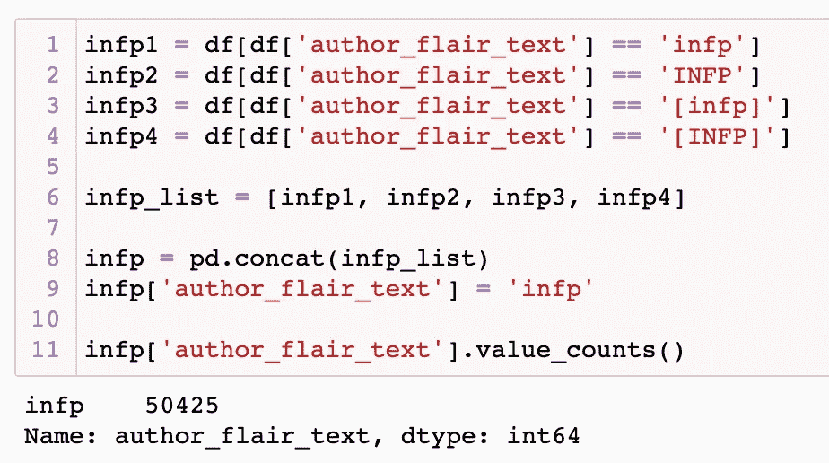

在 infp 的情况下，正如这里看到的，这导致了纯粹来自所谓的 infp 的 50，425 条 Reddit 评论的集合，这些 infp 的人格类型以四种最常见的方式之一输入。

正如我之前提到的，来自某些名人的评论比来自其他人的评论多几十万条。对于这个数据框架中一些不太常见的类型，我有意整合了比仅使用上面显示的代码合并的数据更多的数据。例如，执行以下代码为 ESFPs 收集我的数据:

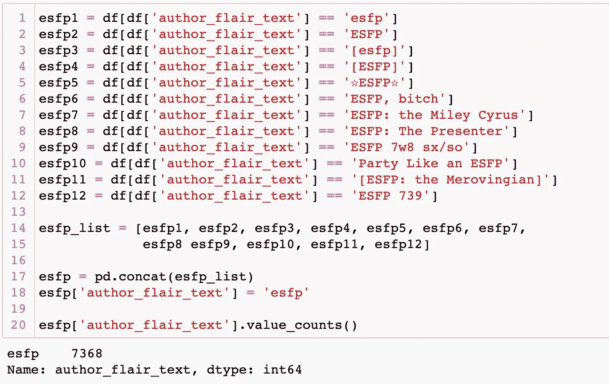

如您所见，即使是输入“ESFP”的 12 种最常见的方法也只提供了 7，368 条评论，这与我从 INTPs 收集的 376，528 条评论相比就相形见绌了。在到达这个检查点时，我有 1，142，841 行所有 16 种性格类型的数据。

让我们切换到包含所有 Reddit 评论本身的第二列(**“body”**)。另一个使给定行对我的模型不可用的特征是文本中出现的任何 URL。删除所有包含 URL 的行将会删除大量数据(例如，“html”出现在剩余的近 50，000 行中)。相反，我编写了一个函数，可以简单地从评论中删除 URL:

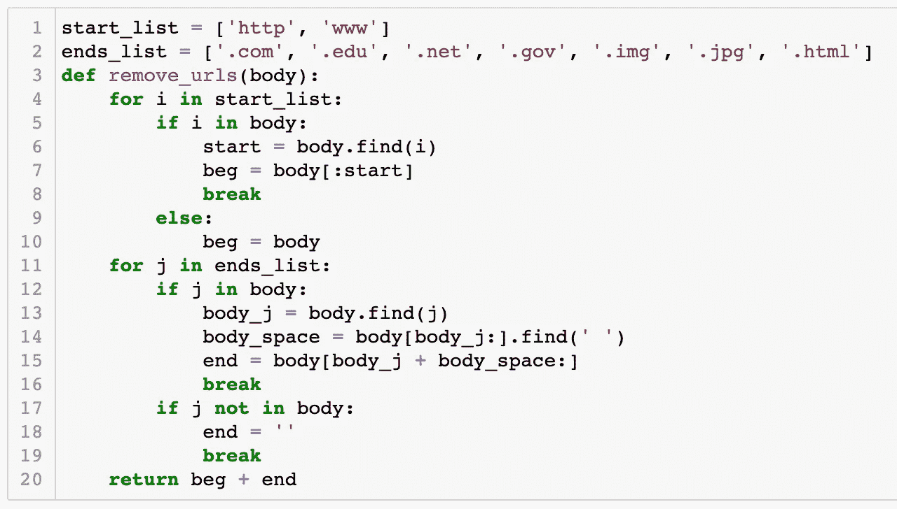

使用**将该功能应用于整个列。map()** 方法删除了绝大多数网址。还有一些带有 URL 的行，其中大多数在每个评论中列出了几十个甚至几百个链接。我决定将它们从数据框架中删除，因为它们对建模没有什么特别的意义。

## 第一个建模阶段:史诗失败

值得注意的是，出于好奇，我在这一点上通过各种分类模型运行了数据，以查看他们将给定的评论归类到 16 个不同类别中的一个类别时有多糟糕。虽然这很大程度上是为了我自己的娱乐，但它确实有一个有益的目的，我将在下面阐述。然而，使用乔恩·奥利弗(Jon Oliver)的“希特勒-汉克斯光谱”(Hitler-Hanks Spectrum)，我不得不遗憾地承认，这个过早建模的表现更接近希特勒，而不是汤姆·汉克斯。我使用了各种模型，但达到的最高准确率约为 38%(这是在数据框架中已经存在的人格类型不平衡的情况下)。然而，建模的第一阶段告诉我的是，我确实必须为梅耶斯-布里格斯性格的每个组成部分运行二元分类模型，而不是期望创建一个足够复杂的模型来将文本分类到 16 个不同的组中的一个(这是我未来将努力的方向)。

## 回到 EDA:

为了为四个人格组成部分(态度、感知、判断和生活方式)中的每一个创建二元分类模型，我首先需要创建四个新列来为每个 Reddit 评论的作者标识该组成部分。

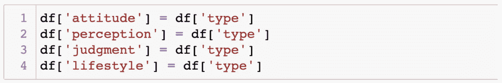

接下来，我写了一个函数，给每个新细胞分配一个字母，代表一个给定的性格特征——外向(E)、内向(I)、感知(S)、直觉(N)、思考(T)、感觉(F)、判断(J)和感知(P)。使用**。我将该函数应用于每个新列。**

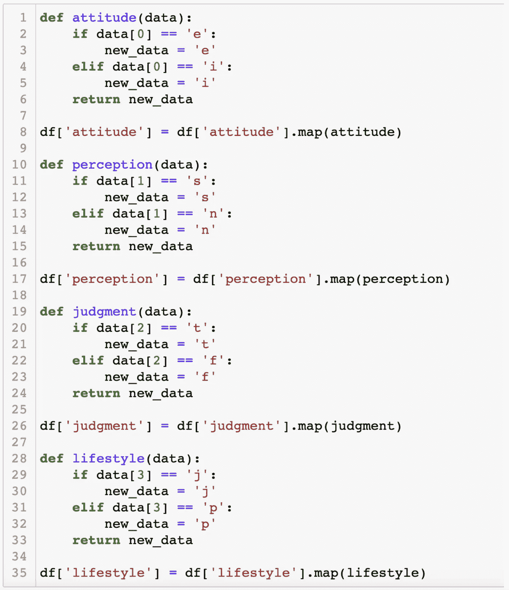

## 自然语言处理(NLP):

使用漂亮的 Soup 和 RegEx 库，我编写了一个函数来捕获每个 Reddit 评论的文本，删除所有非字母字符，将所有字母变成小写，最后从文档中删除停用词。对于每个模型，在将模型与文本相匹配之前，我在 Reddit 评论的每个训练集和测试集中运行了这个函数。

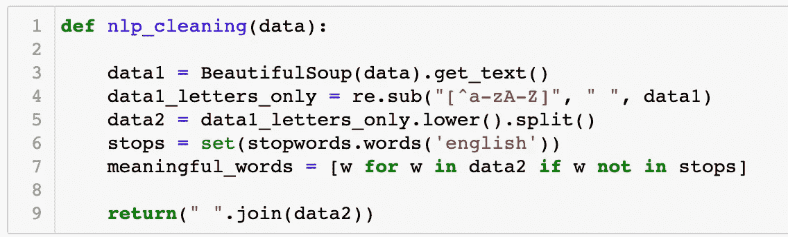

# 建模/评估

对于这个项目，我选择使用逻辑回归、多项式 NB 和随机森林模型。根据我的经验，这些模型在语言处理方面比其他一些分类模型工作得更好。最初，我使用 Gridsearch 通过不同的参数和矢量器来运行这些模型。本文只包含了在每个类别中产生最佳结果的一个模型的描述。

## **态度:**

使用 Tfidf 矢量器设置为 650 个最大特征的逻辑回归，该模型在分类外向和内向方面的准确率为 79.6%。

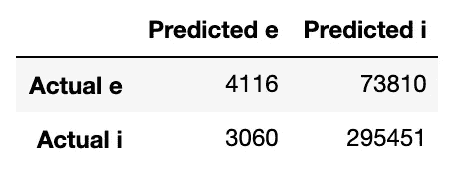

有趣的是，当我包含一些停用词时，比如“我”、“我的”、“我的”、“我自己”、“你”、“你的”和“你自己”，这个模型实际上比我排除它们时得分更低。我曾假设内向和外向的人更可能使用某些代词而不是其他。我的假设很可能是真的，但如果是真的，它也没有反映在这个模型中。

有趣的事实:“爱”和“lol”是这个数据集中外向者比内向者更多使用的热门词汇/术语。

## 感知:

使用具有设置为 259 个最大特征的 Tfidf 矢量器的逻辑回归，该模型在对感知和直觉进行分类时的准确率为 91.6%。然而，这可能并不像你认为的那样是一个把这个模型放在希特勒-汉克斯谱系的汤姆汉克斯一端的理由。看看这个模型的预测:

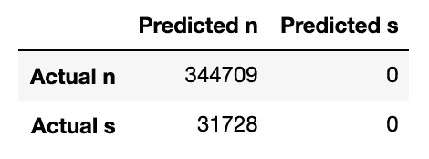

它预测 Reddit 上没有评论是来自感觉类型的，这不应该是一个惊喜。这可能是由于数据的不平衡，考虑到直觉和传感器的比例约为 11:1。真正的壮举将是当数据或多或少对半分时，一个模型准确地预测传感器与直觉。

现在，如果你想知道为什么我没有运行一个具有同等数量的传感器和直觉的模型——我做到了。正如我所料，分数大幅下降。因为直觉比传感器多得多，所以我不得不消除 90%以上的数据，以达到公平竞争。我希望在未来再次尝试这种模式，但这将涉及定位大量新数据(至少来自传感器)。

## 判断/决策

使用 Tfidf 矢量器进行的逻辑回归也为该组件产生了最高分。该模型的矢量器要求 750 个最大特征，当将思想者与感受者分类时，它产生了 78.2%的分数。

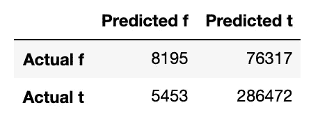

我曾希望看到思考者和感觉者在用词上的明显差异，但这个模型实际上显示了两种类型最常用的一些词有很大的重叠，包括“人”、“思考”、“知道”、“感觉”、“时间”和“好”。它还预测了更高数量的思想家，但这也可能是因为不平衡的数据。思想者和探索者的比例几乎是 4:1。

## 生活方式:

最后一个模型也使用了逻辑回归，但它的最高分是由计数矢量器(500 个最大特征)产生的，而不是 Tfidf 矢量器。即便如此，那个分数也只有 62.7%，是所有四款中最弱的。

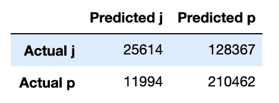

我对这个最终模型感到满意的唯一原因是它似乎证明了我的一个假设是正确的。在这种情况下，判断和感知(不要与上面列出的感知和判断模型混淆)这两种生活方式，是我认为通过书面交流比面对面交谈更难区分的品质。

我认为，部分原因是因为在这种情况下发生的在线对话通常是关于特定的话题或主题(即，一个用户在子编辑上发布帖子，或者另一个用户通过分享特定的内容来回答问题)。然而，在日常生活中，通常很容易区分判断型和感知型，根据他们是喜欢提前计划和有条理，还是喜欢保留选择。(请注意，这在很大程度上是一种概括，并不总是反映判断者和感知者。)对于一个模型来说，纯粹从文字中做出这方面的推断是很难实现的，除非这些文字来自一次专门关于提前计划与自发这一主题的对话。

幸运的是，出于自私的目的，这个模型支持了我的假设，没有揭示任何我可以与计划或自发联系起来的单词模式。不幸的是，出于学术目的，这个模型没有揭示任何我可以与计划或自发联系起来的单词模式。

# 未来发展思路:

展望未来，我想更多地修改这些模型的参数，以尝试产生更有意义的结果。其中一个关键是找到更多的数据，特别是这个数据集所缺乏的人格类型的数据。我很好奇，这些完全相同的模型，单独如何从简单的更多数据中产生不同的结果，更不用说其他模型了。

出于可视化的目的，我认为可以创建一个散点图，比较一种人格类型或另一种人格类型使用单词的频率，相对于文档或语料库中的总单词数。相对于给定说话者/作者的字数，测量单词出现的频率将允许量化的值，该值然后可以被标准化并映射到轴上以与另一个人进行比较。这甚至可以是跨类别的，以确定 SJ、NP 等之间的相关性和趋势。此外，这种跨类别分析可能是建立一个更复杂的模型的第一步，该模型可以充分进行 16 类分类。

另一个想法是使用神经网络来更准确地识别文本主体的内容，然后根据这些讨论主题，而不仅仅是单个单词，对 MBTI 进行更复杂的预测。需要注意的是，来自特定来源的对话，如 subreddit，已经有了针对某个主题或主题的词汇。让这种类型的神经网络模型工作良好的关键是从人们之间定期、自然的对话中收集文本，而不是关于预先确定的主题的对话。

最终，我相信这些模型为未来的研究和分析奠定了良好的基础。无论是数据科学还是对人格和人类行为的心理学研究都不会很快消失。随着这两个领域的进步，在未来几年和几十年里，在这个跨学科领域的持续工作可能会产生非常有意义的结果。