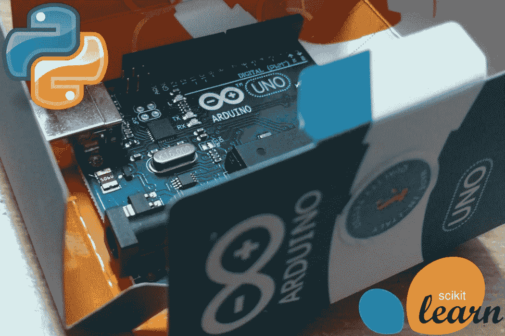
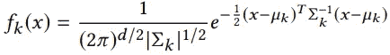
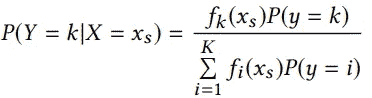
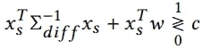
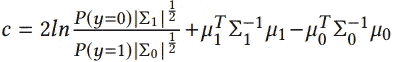
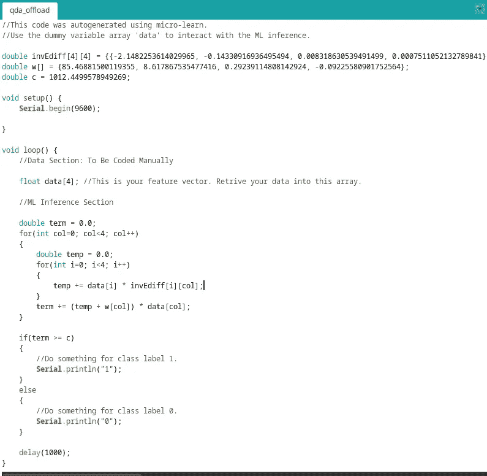
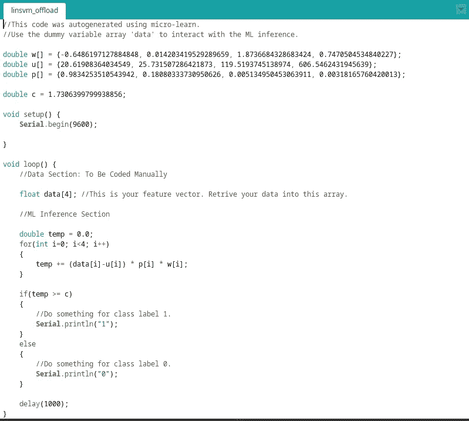

# 微学习:在 Arduino 上开始机器学习

> 原文：<https://medium.com/analytics-vidhya/micro-learn-getting-started-with-machine-learning-on-arduino-52167bc34c1d?source=collection_archive---------10----------------------->

机器学习算法通常在训练阶段需要大量的计算和内存资源，远远超过典型的受限微控制器所能提供的。如今，即使是基于传感器的数据集，大小也在几百兆字节到几千兆字节之间。我们不可能在我们的微型微控制器中装入这些 kB 大小的 EEPROMs，忘记在这些数据集上运行算法吧！话虽如此，但并非所有希望都落空了。训练后，许多传统的机器学习算法归结为简单的参数，需要简单的算术和逻辑运算进行推理。这些可以很容易地在微控制器上实时运行。

在本文中，我们将学习一个名为 [*微学习*](https://github.com/adarsh1001/micro-learn) 的新的基于 Python 的库的用法，该库简化了为 Arduino 和其他微控制器生成推理代码的过程，这些微控制器用于使用 *scikit-learn* 训练的机器学习模型。

# 受限设备的最大似然算法分析

在进入实际内容之前，让我们简单地看一下理论(跳到下一节 Arduino 教程)。因此，如前所述，在微型微控制器上训练机器学习模型是完全不可能的，本质上也没有必要。如今，大多数实用的 ML/DL 应用程序都需要 GPU 盒子来进行训练，但却在常规机器上实时运行推理。我们会做类似的事情。

机器学习算法，如支持向量机(SVM)、线性/二次判别分析(LDA/QDA)、逻辑回归、高斯朴素贝叶斯(GNB)、决策树、线性回归等。在训练阶段需要大量的资源，但是用于推理的算术计算相当简单。让我们来详细看看 QDA。其他算法可以参考我的 [ACM 论文](https://dl.acm.org/doi/abs/10.1145/3341105.3373967)。QDA 是一个二次决策边界分类器，它将数据的类别条件分布 *P(X = x|Y = k)* 假定为多元高斯分布:

对于新的传感数据矢量 *xₛ* ，使用贝叶斯规则进行预测:

在 QDA 的训练阶段，从数据集中学习类均值 *μₖ* ，协方差矩阵*σₖ*和类先验 *P(Y = k)* 。在 *scikit-learn 的 QDA 的*实现中，后训练(拟合)，这些训练好的参数可以分别从 *means_* 、*协方差 _* 和 *priors_* 属性中访问。求解二进制类数据集的上述等式会产生以下推理规则:

这里， *c* 是下面这个看起来很复杂的公式，它简单地归结为一个浮点常数:

*σ*⁻=*σ*₀⁻-*σ*₁⁻是常数 *d* × *d* 浮点矩阵和*w =*2*σ*₁⁻*μ*₁-2*σ*₀⁻*μ*₀是常数 *d* ×1 浮点显然，在训练之后，首先需要通过在上述公式中代入训练的参数来计算这些常数，然后在卸载这些常数的情况下用 C/C++编写推理规则。一项艰巨的任务，对吗？如果我告诉您，有一种方法可以通过对经过训练的 scikit-learn 模型的单个函数调用来生成 Arduino 推理代码，会怎么样？嗯，这就是*微学*库的用武之地！

# 教程:将训练好的 ML 模型卸载到 Arduino

如前所述， *micro-learn* 是一个 Python 库，可以将使用 *scikit-learn* 训练的 ML 模型转换成 Arduino 推理代码。所有的推理算法都针对微控制器进行了优化，并且需要尽可能少的算术计算。除法运算已经转换为乘法运算，因为后者的计算效率要高得多。注意，所有的算法都是精确的，不是近似的。到目前为止，支持六种二进制类 ML 算法:

1.  感知器
2.  线性回归
3.  高斯朴素贝叶斯(GNB)
4.  线性判别分析(LDA)
5.  二次判别分析(QDA)
6.  支持向量机(SVM)(线性核)

让我们用一个实际的物联网数据集来做这个教程。这是一个占用检测数据集，通过在一个小房间内部署一个带有四个传感器的 Arduino 来收集:温度、湿度、光线和 CO₂。关于设置的更多细节可以在这篇[文章](https://www.sciencedirect.com/science/article/abs/pii/S0378778815304357)中找到。现在，数据集由三个文件组成:*数据训练*、*数据测试*和*数据测试 2* 。我们将使用 *datatraining* 文件来训练一个 ML 模型，并将其卸载到 Arduino，以便我们可以实时进行预测。

首先，克隆/下载 [*微学习*](https://github.com/adarsh1001/micro-learn) 库(记下 Python 的依赖关系)并确保*微学习*目录在你的代码 IDE 的路径中。对于除了像 SVM 那样的尺度可变算法之外的所有算法，遵循以下编码过程:

这将导致一个*。ino* 文件，其中相应的推理代码填充了所有训练好的常数。当然，数据部分需要按照代码中注释的指示手动编码。

在占用检测数据集上训练的 QDA 模型的推理代码。

卸载除 SVM 之外的其他 ML 算法的过程是相同的。然而，SVM 是一种尺度可变的算法，需要一个经过训练的*标准缩放器*的实例来进行推理。

在占用检测数据集上训练的线性 SVM 模型的推理代码。

这就对了。很简单，不是吗？此外，由于 Arduino 编程语言是 C/C++的衍生物，您可以直接编辑这个输出*。ino* 模板并将其转换成一个通用的。c 或者。cpp 代码也是。目前，该库仅限于六种算法和二进制分类。对更多算法和多类分类的支持将很快添加！

# 参考

[1]关于受限 ML 及其实际用例的更多信息，你可以参考我的 ACM 论文:[https://dl.acm.org/doi/abs/10.1145/3341105.3373967](https://dl.acm.org/doi/abs/10.1145/3341105.3373967)

[2] Github 回购:[https://github.com/adarsh1001/micro-learn](https://github.com/adarsh1001/micro-learn)